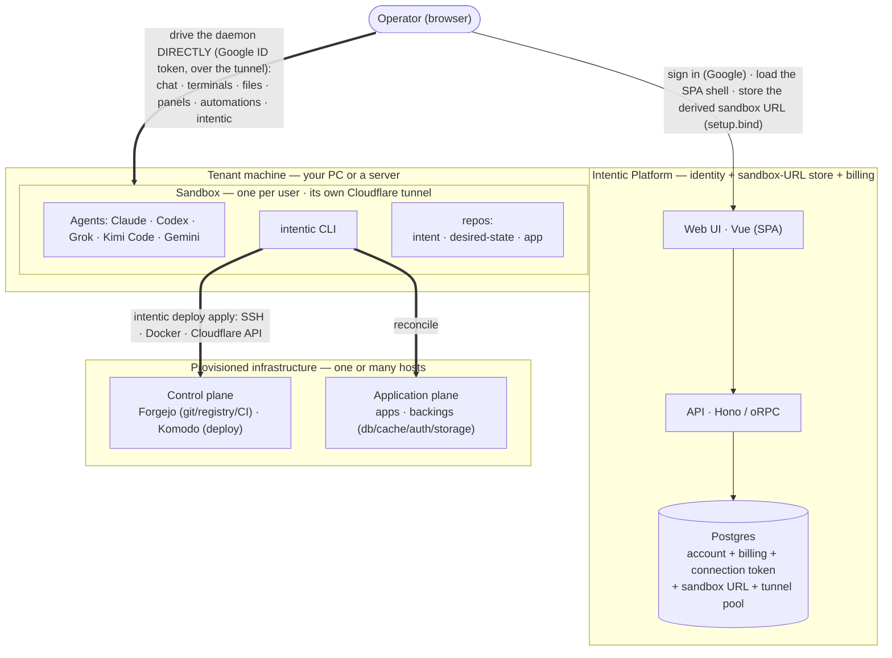
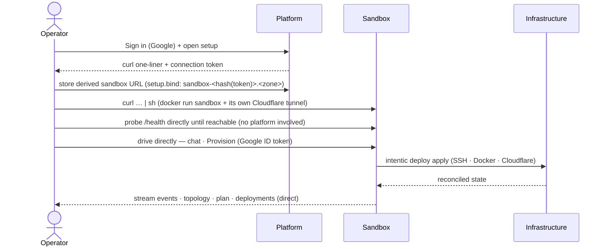

# Architecture

intentic is a **co-piloted specialized-agent workspace**: each agent runs in its own sandbox on hardware
you own, and from a browser you configure its context, supervise its work, and approve the calls that
matter. This document covers the two tiers that *are* the product — a thin **platform** and the per-user
**sandbox** (and the workspace it serves) — plus, in clearly-marked sections, the **bundled deployment
engine**: a standalone infra tool that ships in this monorepo and is one of the many tools an agent can run.
It is not part of the product.

## System topology & lifecycle

At runtime the product is two tiers: a thin **Platform** (identity + sandbox-URL store) and a per-user
**Sandbox** (where the agent runs, reached by the browser directly). A sandbox can *also* stand up real
**infrastructure** on hosts you own — the third tier below — by running the bundled deployment engine, one
of its tools; that path is optional. The engine flow shown later is what runs *inside* one `intentic deploy apply`.



- **Platform (identity + sandbox-URL store + billing)** — Vue SPA + Hono/oRPC API. Persists the
  operator's account and Stripe subscription (Better Auth; free = 1 sandbox, pro = unlimited +
  sharing), one secret-free per-user connection token, the sandbox's public `daemonUrl` (announced
  by the **daemon** on boot), member invites (a discovery mirror — the daemon is the enforcer), and
  a pool of pre-provisioned tunnels (`ReservedSandbox`) so setup pays no Cloudflare round-trips
  inline. It never probes the sandbox, owns no infrastructure, and sits **off the command path**.
- **Sandbox** — one per user, run **unprivileged by default**; container privileges come only from
  `# intentic:runtime` directives in the owner-approved overlay, applied by the allowlisted rebuild executors
  (the `docker` capability's `--privileged` wakes the image-baked, otherwise-dormant isolated Docker Engine so
  `pnpm db:up` / `docker compose` work in the workspace; the HOST's Docker socket is never mounted, so the
  agent's containers can only live inside the sandbox's own engine; its cloudflared runs as a separate sidecar
  container). Runs the coding agents (Claude via the agent
  SDK, Codex, Grok, Kimi Code, Gemini — spawned per turn, not resident) and the `intentic` CLI over the three repos
  (`intent` = `deploy.config.ts`, the IaC; `desired-state` = resolved artifact + status; `app` =
  the application code), and exposes its daemon over its **own Cloudflare tunnel**. SSH keys,
  Cloudflare and agent tokens ride straight into it and never reach the platform.
- **Trust root = browser Google Sign-In** — the browser drives the daemon directly with a Google ID
  token; the daemon verifies it against Google's JWKS and binds its owner **on first use**: the first
  authenticated request must carry the `x-intentic-connect` connect token (and, when setup seeded an
  expected owner, match that account's email), then the owner email persists in
  `/work/.intentic/owner.json` ([auth.ts](_apps/sandbox/src/auth/auth.ts)). Additional collaborators
  are granted via `/work/.intentic/members.json`. The platform never holds or forges the ID token, so
  a platform breach can read the stored URL but **cannot drive any sandbox** — the hub's blast radius
  is bounded to identity + the sandbox URL.

The lifecycle, from first sign-in to a reconciled deployment the operator can watch:



### The sandbox daemon

The daemon ([_apps/sandbox](_apps/sandbox)) is the whole per-user product surface, not just a chat
endpoint. One Node process serves the oRPC contract on `:8787` and a preview proxy on `:5173`;
terminals, panel dev servers, and agent shell commands all run in a shared `tmux` server so they
survive reconnects. Its subsystems:

- **Agent backends** — Claude (agent SDK, spawned per turn), Codex, Grok/opencode, Kimi Code (Moonshot's
  Anthropic-compatible endpoint on the Claude Code harness), and Gemini (Google's models re-served through the
  bundled translator, also on the Claude Code harness)
  ([agent/](_apps/sandbox/src/agent/)), plus an anonymous website **webchat** widget over SSE
  ([webchat/](_apps/sandbox/src/webchat/)). A chat turn executes as a **detached run**
  ([agent/turn-runs.ts](_apps/sandbox/src/agent/turn-runs.ts)): `POST /agent` acks with a run id and the
  frames land in a seq-stamped log, which any number of clients render via `/agent/attach`
  (replay-from-cursor, then live) — so a turn survives reloads and dropped connections, and every window or
  device on the conversation streams it concurrently. Only `/agent/stop` cancels it.
  **Imp mode** ([agent/imp.ts](_apps/sandbox/src/agent/imp.ts), off by default, Claude Code harness only) runs a
  turn as two agents instead of one: an **architect** holding no tools, which reasons and writes what it needs in
  plain words (never as commands — picking tools is not its job), and an **imp** on a cheaper model holding the
  whole tool surface, which reads that message, chooses the tools that serve it, and reports back. The report is
  the architect's next message — delegation inverted, so the strong model spends its context on design rather
  than on deciding to search. One imp per architect round, and the round waits for it; a dispatch that runs no
  tools ends the turn, because the architect asked for nothing and so was answering. An imp never raises a
  permission card (it is a mechanical executor with no user of its own, and the container is the isolation
  boundary); plan mode reaches it as withheld editing tools rather than as a prompt per call, while the approval
  the user does give is the architect's plan.
- **Terminals** — interactive PTYs over WebSocket ([terminal/terminal.ts](_apps/sandbox/src/terminal/terminal.ts)).
- **Panels & previews** — per-repo dev servers behind `preview-<panel>-<id>.<zone>` hostnames
  ([panels/](_apps/sandbox/src/panels/)); plus generic **port forwarding** for anything run in a terminal
  (a procfs scan lists listening ports, an explicit forward maps one onto a fixed slot behind
  `port-<slot>-<id>.<zone>`, and Ctrl+clicking a `localhost:<port>` link in a terminal rides this
  automatically) ([ports/](_apps/sandbox/src/ports/)). Port targets get Host/Origin rewritten to
  `localhost:<port>` at the proxy, so stock dev-server host checks pass unconfigured. Desktop-sync users get the
  stronger guarantee automatically: the sync agent's port-mirror watcher binds those same ports on their own
  machine's localhost (see `@intentic/sync`), the only path where a frontend hard-coded to
  `localhost:<other-port>` works untouched.
- **Automations** — cron schedules, webhooks (`/automations/:id/fire`), and event listeners
  ([automations/](_apps/sandbox/src/automations/)).
- **Push notifications** — the daemon is the sender, because it is the only tier that knows what the agent is
  doing ([push/](_apps/sandbox/src/push/)). It owns a per-sandbox VAPID keypair and one subscription per
  subscribed browser, stored on the **history volume** rather than under `/work/.intentic`: the private key can
  forge notifications to the owner's devices, so it sits outside the agent's reach. Three moments notify — a
  turn settled, a turn parked on the user (plan/question/permission), and an automation held for approval —
  and every one is suppressed while anyone is present and non-idle on the sandbox (`idleEverywhere`, read off
  the same presence roster `/events` maintains), so a turn you watch finish tells you nothing. The service
  worker ([_apps/web/public/sw.js](_apps/web/public/sw.js)) is registered lazily and caches nothing; a
  subscription is per-browser, and lives on the web origin while the sender is the daemon on its tunnel —
  which works because a push endpoint is an absolute URL minted by the browser's own push service.
- **Capabilities** — everything a user adds to the sandbox (connectors, vpn, mcp, plugins, …),
  one unified model with a per-kind handler ([capabilities/](_apps/sandbox/src/capabilities/)) — see
  [Capabilities](#capabilities).
- **VPN** — putting the sandbox on a private network ([vpn/](_apps/sandbox/src/vpn/)) — see [VPN](#vpn).
- **Members** — shared access for invited collaborators, enforced by the daemon
  ([auth.ts](_apps/sandbox/src/auth/auth.ts)).
- **Workspace file service** — search, tree, watch, diff, and chunked multi-GB uploads
  ([workspace/](_apps/sandbox/src/workspace/)); desktop sync is Mutagen over tunnel SSH
  (`ssh-<id>.<zone>`, paired via `@intentic/sync`). Enrollment ([platform/sync.ts](_apps/sandbox/src/platform/sync.ts))
  carries a **mode**: `sync` (bidirectional file sync, SINGLE-HOLDER — two machines two-way-syncing `/work`
  would race) or `mirror` (port mirroring only, UNLIMITED — forwards are per-machine and independent, so every
  collaborator mirrors the ports to their own localhost at once). The **owner** may enroll either; a **member**
  is capped to `mirror` at pairing-mint. Each enrolled machine gets its own key in `authorized_keys` and its own
  `/ports`-scoped sync token, so machines revoke independently (self-revoke on uninstall; owner clears all).
- **History** — git snapshots every 60 s + per agent turn, on a `/history` volume mounted *outside*
  `/work` so an agent `rm -rf` can't reach it ([history/](_apps/sandbox/src/history/)).
- **Environment overlays** — agent-proposed Dockerfile layers, applied only after owner approval
  ([environment/](_apps/sandbox/src/environment/)).
- **Discord** — chat/stream/voice integration, now an image-baked extension: a gateway `process` +
  `listener` in [\_extensions/discord](_extensions/discord).

**One image, two ways to start.** The sandbox `connect.sh` runs on your PC and the one the
`i.want.workspace` provider deploys onto a remote host (over SSH) are the *same image*. Either way the
tunnel is named `sandbox-<id>` where `<id> = sha256(connectToken).slice(0, 12)`
([tunnel-ids.ts](_libs/sandbox-contract/src/tunnel-ids.ts)), and it is provisioned one of two ways:

- **Own Cloudflare** — `connect.sh` runs `intentic tunnel sandbox` against the *user's* zone:
  `sandbox-<id>.<zone>` for the daemon, `ssh-<id>.<zone>` for desktop sync, plus the `*.<zone>`
  wildcard for panel previews. The user's Cloudflare account absorbs all of it.
- **Intentic-provided** — for users with no Cloudflare, the platform provisions the tunnel on
  intentic's own account under a shared zone (`sandbox-<id>.intentic.dev`) and hands the sandbox only
  the narrow per-tunnel connector token. A shared zone can't give each user a wildcard, so the daemon
  asks the platform to mint preview routes (`preview-<panel>` / `port-<slot>` labels, batched per call) —
  panel labels lazily as repos appear, and the whole fixed port-slot pool (`PORT_SLOTS`) eagerly: slot
  routes are created at tunnel provisioning and re-ensured by the boot sweep, so a port forward never
  waits on fresh DNS, and churning dev-server ports cost at most the pool's size in routes per sandbox, ever.

On a server the workspace is just another service on that host's shared tunnel, exposing only the
preview wildcard (the daemon stays host-internal — the server workspace is preview-only; `connect.sh`
is the browser-direct path). The infrastructure it *provisions*, either way, builds Cloudflare tunnels
on its target hosts (see below) — which is how the system fans out to "workers on many machines."

### Cloudflare is the reachability fabric (required)

Cloudflare is not a user-facing convenience — it is the system's **reachability fabric**, and it is
**required**. The operator never needs to open `git.<zone>` / `deploy.<zone>`; the **browser reads the
control plane through the sandbox daemon directly** (over the sandbox's tunnel). How each piece is reached
is asymmetric:

| Reached over | Who / what |
| --- | --- |
| **SSH** (loopback port-forward to `:3000` / `:9120`) | The **engine's entire control path**: every Forgejo API call (repo/ci/users/orgs/teams/hooks) and every Komodo API call (deployments/users/alerters/servers), plus `intentic deploy adopt`'s REST calls and git pushes. The engine never dials a public route it may itself be reconciling — apply and adopt work with the tunnel down, or before DNS exists at all. |
| **Cloudflare tunnel** (public `*.<zone>`) | Everything genuinely cross-host or external: browsers/operators, every worker host's Komodo Periphery dialing Core (`deploy.<zone>`), registry pulls (`git.<zone>`), and hosted-forge CI runners' notify step. |

Why a tunnel, rather than "just use SSH and make Cloudflare optional":

- **Outbound-only, NAT-traversing.** `cloudflared` dials out, so it works behind NAT/firewalls with no
  inbound ports — the same bet the sandbox already makes to expose its daemon.
- **Cross-host coordination needs stable, routable names.** Worker→Core registration and image pulls are
  host-to-host; SSH from the sandbox only reaches *sandbox→service*, so an SSH-only design would still have
  to add an overlay network to serve them.
- **The registry forces a global name anyway.** Image refs (`git.<zone>/owner/app:tag`) must resolve
  identically from every host that pulls — that alone mandates a stable domain.
- **One uniform primitive** (`<name>.<zone>`, TLS'd, reachable from anywhere) keeps the model trivially
  reason-about-able; a second internal/SSH mode would mean two reachability models and a combinatorial matrix.

This is enforced in code, not just convention: the SDK types require `expose: Cloudflare`, and both
`resolveNeeds` ([needs.ts](_libs/need-resolver/src/needs.ts)) and `emit`
([emit.ts](_libs/state-resolver/src/emit/emit.ts)) throw when it is missing — there is no alternative ingress.
The Cloudflare API token is supplied at **connect** time (it rides `connect.sh` into the sandbox) and consumed
at **provision** time by `intentic deploy apply`. It never reaches the platform except for one request-scoped call at
setup — the platform lists the token's zones so the user can pick which one the sandbox tunnel uses (the browser
can't call Cloudflare directly), then drops the token: never persisted, never logged.

> The sections from here through **Packages** document the **bundled deployment engine** — a standalone
> infra tool that ships in this monorepo and is one of the many tools an agent can run. It is **not part of
> the intentic product** (the product is the app plane, covered below).

## The intent-driven flow

```
Intent ──► NeedResolver ──► Needs ──► StateResolver ──► desired state ──► Execute ──► (reads true)
```

1. **Intent** — a declaration authored with the SDK: `i.have.*` (the inventory you bring — read, never
   created or destroyed: `host`, `cloudflare`, `github`, `gitlab`, `backup`, `discord`, `stripe`) and
   `i.want.*` (what intentic owns end-to-end — created, reconciled, pruned, destroyed: `app`, `service`,
   `workspace`, `database`, `cache`, `auth`, `objectStorage`, `user`, `team`), each
   app wired to its host/Cloudflare via `on` / `expose`. Captured as a serializable `IntentSet`.
   ([_libs/sdk/src/stack.ts](_libs/sdk/src/stack.ts))
2. **Need resolver** — derives the abstract capabilities the intent requires: `source-control`,
   `docker-registry`, `infra-control` (control plane), `deployment-target`, `domain` (application plane).
   (`resolveNeeds` in [_libs/need-resolver/src/needs.ts](_libs/need-resolver/src/needs.ts))
3. **State resolver** — assigns each need its catalog option and compiles the emitted nodes into one
   **desired state** (a `DesiredStateGraph`). The catalog maps capabilities to the concrete things that
   satisfy them; one option may cover several (Forgejo provides both source-control and docker-registry).
   `catalogFor(intent)` selects the source control: `i.have.github` ⇒ GitHub (GHCR + Actions),
   `i.have.gitlab` ⇒ GitLab (its registry + CI), otherwise the self-hosted Forgejo default. **Komodo is
   unconditional** — on every stack CI only builds and pushes the image and Komodo rolls it out, so no
   host SSH credential ever reaches a hosted forge and the host stays outbound-only. The intent fully
   determines the result — within the selected catalog there is exactly one option per capability, so
   resolution stays deterministic. (`resolveState` in
   [_libs/state-resolver/src/state.ts](_libs/state-resolver/src/state.ts), over `catalogFor` in
   [catalog.ts](_libs/state-resolver/src/lib/catalog.ts) and the nodes emitted by
   [emit.ts](_libs/state-resolver/src/emit/emit.ts))
4. **Execute** — apply the desired state and re-read it, looping until a plan reads all-noop ("state reads
   true"). (`reconcile` in [_libs/engine/src/reconcile/reconcile-loop.ts](_libs/engine/src/reconcile/reconcile-loop.ts), over
   `apply`/`plan` and the Provider SPI)
5. **Prune** — after convergence, deletion converges too, from two sources: the baseline diff (resources in
   the last-applied artifact the new one no longer declares) and the **collection scan** — each provider's
   `list` enumerates its live stamped resources (`intentic.id` / `intentic.type` labels, stamped DNS-record
   comments) and everything absent from the graph is an orphan, pruned without needing any baseline.
   Deletions require `apply --yes` (pending ones are previewed otherwise), nodes with a `protect: true`
   input (stateful backings by default) are never deleted, and `intentic deploy destroy --yes` is the same prune
   against the empty graph. Drift detection is also stamp-based: every resource carries an `intentic.hash`
   of its serialized inputs, and a mismatch reads as an update regardless of the provider's own diff.
   (`prune`/`pruneOrphans` in [prune.ts](_libs/engine/src/reconcile/prune.ts), `collectOrphans` in
   [orphans.ts](_libs/engine/src/reconcile/orphans.ts), stamps in [stamp.ts](_libs/graph/src/stamp.ts))

A `DesiredStateGraph` is the central data structure: a serializable, dependency-ordered set of resource
nodes with refs, secrets, and readiness gates. ([_libs/graph/src/types.ts](_libs/graph/src/types.ts))

## Output contract (driving the CLI as a service)

The engine separates two seams on `EngineConfig`: `log` carries providers' free-form strings, and
`onEvent` emits structured `EngineEvent`s for lifecycle progress — `node` (apply/plan, start/done with
the action), `readiness`, `iteration`, `prune`, and `orphan`
([types.ts](_libs/engine/src/types.ts)). The CLI selects a renderer from `INTENTIC_OUTPUT`
(`text` | `json` | `ndjson`) in [output.ts](_apps/cli/src/lib/output.ts): `text` is the human default
(unchanged), `json` serializes the command's returned outcome once, and `ndjson` streams each event as
a line then a terminal `result`. The final result is built from the engine's return values
(`PlanOutcome`/`ConvergeResult`/`PruneOutcome` and `collectAccess`), never from events — so a control
plane gets both live progress and a parseable summary, and embedders consume `EngineEvent` directly.

## Control plane vs application plane

Every need carries a `plane` — its role, independent of where it runs ([needs.ts](_libs/need-resolver/src/needs.ts)):

- **Control plane** — the deploy machinery: `source-control` + `docker-registry` (Forgejo by default,
  GitHub/GitLab when declared) and `infra-control` (Komodo, on every stack) — git/CI plus the deploy
  orchestrator. The local `intent` repo
  (`deploy.config.ts`) and `desired-state` repo (the artifact + execution status) drive it: `intentic
  resolve` runs the flow above and writes the artifact, `intentic deploy apply` executes it. A remote, PR-managed
  control plane (a standalone Forgejo watching the intent repo) is a planned later evolution of this same
  flow. ([_apps/cli/src/resolve/resolve.ts](_apps/cli/src/resolve/resolve.ts), [artifact.ts](_apps/cli/src/lib/artifact.ts),
  [app.ts](_apps/cli/src/app.ts))
- **Application plane** — what actually serves an app: its `deployment-target` (the app's runtime on the
  host) and its `domain` (the Cloudflare tunnel + DNS routes). Both are *derived from* `i.want.app` and
  emitted alongside the control-plane stack. ([_libs/state-resolver/src/resolvers/platform.ts](_libs/state-resolver/src/resolvers/platform.ts),
  [_libs/providers/](_libs/providers/src/))

The whole per-host support stack is self-contained: its control-plane Forgejo is just another reconciled
node, so `apply` needs no pre-existing control plane. A future remote control plane would reuse the same
`forgejo` provider — a different node instance, not a different implementation.

## Packages

Dependency direction (one-way):

```
graph ──► resources ──► engine ──► providers
   │           └──────► state-resolver ──► sdk
   ├──► need-resolver ──► state-resolver
   └──► (cli ◄── need-resolver, state-resolver, engine, providers)
```

| Package | Tier | Role |
| --- | --- | --- |
| [`@intentic/graph`](_libs/graph) | lib | Product-agnostic IR: refs, secrets, readiness, `DesiredStateGraph`, and the compiler. |
| [`@intentic/resources`](_libs/resources) | lib | The closed resource vocabulary shared by the state resolver, engine, and providers: `ResourceType`, `ResolvedNode`, and `OUTPUTS`. |
| [`@intentic/need-resolver`](_libs/need-resolver) | lib | The need resolver: intent → needs. Owns the authored intent/input shapes, `resolveNeeds`, and `Capability`/`Need`/`Plane`. |
| [`@intentic/state-resolver`](_libs/state-resolver) | lib | The state resolver: needs → desired state, over the option catalog. `resolveState`, the catalog, `emit`, and the platform/app/route/id derivation. |
| [`@intentic/sdk`](_libs/sdk) | lib | Authoring surface (`i.have.host` / `i.have.cloudflare` + `i.want.app`); `defineIntent` (→ `IntentSet`) and `defineStack` (one graph). |
| [`@intentic/engine`](_libs/engine) | lib | Stateless reconcile engine: `plan`/`apply`, the Provider SPI, and the `reconcile` loop. |
| [`@intentic/providers`](_libs/providers) | lib | Real Provider SPI impls: control plane (Forgejo, GitHub, GitLab, Komodo, repo/CI), network (Cloudflare tunnels + routes), hosts (SSH/Docker, deployment, workspace), backings (Postgres, Valkey, Garage, Authentik), services (SigNoz, Outline, Paperless, OpenProject, Invoice Ninja, Infisical), integrations (Discord, Stripe), ops (restic backup). |
| [`@intentic/sandbox-contract`](_libs/sandbox-contract) | lib | oRPC wire contract for the sandbox daemon — shared by the daemon and its browser client (the platform consumes it from npm). |
| [`@intentic/scaffold`](_libs/scaffold) | lib | Shared workspace scaffold: the intent-repo skeleton + deploy.config managed-region render/parse, used by the CLI's `init` and the sandbox daemon. |
| [`@intentic/cli`](_apps/cli) | **app** | The `bin: intentic` toolbox — three command groups: `tunnel` (`sandbox`/`host` — the sandbox's own Cloudflare tunnels, used by connect.sh), `deploy` (`init`/`resolve`/`plan`/`apply`/`destroy`/`adopt`/`restore`/`secrets`/`deployments`/`logs` — the bundled deployment engine), and `scaffold` (`monorepo`/`add-app`) ([app.ts](_apps/cli/src/app.ts)). |
| [`@intentic/sandbox`](_apps/sandbox) | **app** (image) | The per-project multi-agent dev workspace daemon (see [The sandbox daemon](#the-sandbox-daemon)), reached by the browser directly over its own Cloudflare tunnel. |
| [`@intentic/sync`](_apps/sync) | **app** | Local background agent keeping a directory bidirectionally in sync with a remote sandbox — one HTTP enrollment call, then Mutagen over tunnel SSH. The daemon grants a **mode** at enrollment (file `sync`, or `mirror`-only for collaborators — see the workspace file service above), and the agent adapts: `sync` runs file sync + mirroring, `mirror` skips file sync and only forwards ports. `setup` auto-starts a **port-mirror watcher** (a detached, pidfile-guarded loop) that binds the sandbox's workspace ports onto the desktop's SAME localhost ports via Mutagen TCP forwards, polling the daemon's `/ports` (read with the enrollment-minted, `/ports`-scoped sync token) so newly-started dev servers appear automatically, and **registers it for login autostart** (launchd / Task Scheduler / XDG autostart) so it resumes after a reboot. Revocation is symmetric: after consecutive definitive token rejections (the owner clicked Disable, or the sandbox lost the enrollment) the watcher **tears itself down** — forwards, pidfile, and the autostart entry — instead of polling a dead enrollment forever. Remote dev servers then behave exactly like local ones — localhost URLs, cookies, and CORS included — with no command to run, ever, and **every collaborator can mirror the same sandbox at once**. |

The libs + the CLI publish to npm; **`sandbox` ships as a Docker image** to the GitLab Container
Registry (`registry.gitlab.com/radarsu/intentic/sandbox`) — published by
[_tools/scripts/publish-images.sh](_tools/scripts/publish-images.sh) (which also publishes the `dind-host` test-host
image): `latest` + commit SHA on push to main, `<version>` + the moving `stable` tag on release.
[`images.ts`](_libs/state-resolver/src/lib/images.ts) records it at `:stable` — the deliberate unpinned
exception among the otherwise digest-pinned deployed images (never `:latest`), so released sandboxes
track releases without a graph change. The registry package is public so tenant hosts pull it
unauthenticated; both `connect.sh` (your PC) and the `workspace` provider (a server) run this image
directly.

## The app plane — the product

The **app plane** is the intentic product: the co-piloted agent workspace a user actually looks at, a
VSCode-shaped file editor. (The intent→reconcile **deployment engine** documented in the preceding sections
is a *bundled tool* the sandbox can run — one tool among many — not part of this product.) The app plane's
dependency edges into `@intentic/*` all go through `sandbox-contract` (and one type-only reach into
`@intentic/resources` from `api-contract`); the engine core never depends back on the app.

| Package | Role |
| --- | --- |
| [`@intentic-app/web`](_apps/web) | The Vue 3 SPA shell — the editor UI (rail · workspace tree + file viewers + Monaco · chat). Signs in against the platform, then drives the sandbox daemon **directly** over its tunnel. The **extension host** lives here. |
| [`@intentic-app/api`](_apps/api) | The thin platform: Better Auth sign-in + the `setup.*` handshake + Stripe. Off the command path (see topology above). |
| [`@intentic/sandbox`](_apps/sandbox) | The per-user daemon (documented under [The sandbox daemon](#the-sandbox-daemon)) — also the app plane's whole backend: workspace files, chat, terminals, panels, search, settings, and the daemon-side half of the extension system. |
| [`@intentic/sandbox-contract`](_libs/sandbox-contract) | **The keystone wire contract** — the oRPC route + schema surface shared by the daemon, the web client, and every UI extension (~15 dependents). It is deliberately *the* first-party data contract: because everything that consumes it is in-repo and compiled together, a wire change is caught by the compiler and fixed atomically, so there is no separate "stable API" shim to maintain. |
| [`@intentic-app/api-contract`](_libs/api-contract) | The platform (web↔api) oRPC contract. |
| [`@intentic-app/ui`](_libs/ui) | The app design system (PrimeVue + Tailwind primitives). |
| [`@intentic-app/capability-catalog`](_libs/capability-catalog) | Capability/connector catalog data rendered by the web. |

### Extension system

The app is a **lean core + an extension system**, the same bet VSCode makes. An extension is a package
with an `intentic-extension.json` manifest at its root ([manifest.ts](_libs/extension-api/src/manifest.ts));
identity is derived, never declared (`extensionIdOf = ${publisher}.${name}`). The manifest is the
**approval + gating surface**: the install dialog shows exactly the declared contribution points, and the
host refuses any runtime registration the approved manifest never declared. Contribution points cover both
UI (`views`, `viewers`, `commands`, `settings`) and daemon/agent surface (`processes`, `agent`,
`environment`, `connectors`, `listener`, `bin`). A UI extension ships a prebuilt ESM `entry` bundle and an
`activate(api, context)` function; there is no ambient global — the host `IntenticApi` arrives as the
`activate` argument, and everything registered is a `Disposable` pushed onto `context.subscriptions` so
deactivation unwinds cleanly ([api.ts](_libs/extension-api/src/api.ts)).

Two boundaries are load-bearing and easy to confuse — the distinction is the most important architectural
line in the app:

- **`_apps/web/src/extension-host/`** — the real host. It loads git-installed third-party bundles
  (`GET /extensions` → engines check → authenticated bundle fetch → `import()` → `activate`) and the
  compiled-in first-party extensions ([extension-host/builtins.ts](_apps/web/src/extension-host/builtins.ts)),
  **both through the same manifest-gated `createExtensionApi`** ([apiImpl.ts](_apps/web/src/extension-host/apiImpl.ts)).
  A builtin extension can touch only the public `IntenticApi`, never app internals — that is the dogfooding
  boundary that keeps the first-party extensions honest.
- **`_apps/web/src/core-views/coreViews.ts`** — three *core* view contributions (`infrastructure`,
  `live-status`, `directory-ui`) that are extension-*shaped* but stay in the app because each is genuinely
  coupled to platform/onboarding or the file-open iframe bridge. They register through the same runtime
  registry but consume privileged internals **by design**, and the file documents exactly why each one
  can't be a clean extension.

The **data plane** an extension talks to is `sandbox-contract` over an authenticated transport
(`api.sandbox.request/json` — auth injected host-side, tokens never seen by the bundle). An extension's
reach into daemon routes is **declared in its manifest and gated by the host**, so coupling is explicit and
reviewable rather than ambient. The narrow `facts.ts` surface
([facts.ts](_libs/extension-api/src/facts.ts)) is only the stable **detection** vocabulary a view's
`detect()` reads to decide when to activate — not the data plane. The SDK is published as two npm packages:
[`@intentic/extension-api`](_libs/extension-api) (types + manifest schema) and
[`@intentic/extension-ui`](_libs/extension-ui) (a host-provided slice of the app design system, resolved at
runtime via an import map so every extension shares the shell's one Vue/PrimeVue instance).

What an extension **bundles** is exactly its declared contributions: a prebuilt ESM `entry` (UI) with
`views` / `viewers` / `commands` / `settings`; `connectors` — a cli capability as pure data (catalog card +
config fields + env templates + a SKILL.md cheatsheet + an optional client-image fragment), rendered by the
web as a *derived* capability card (see [Capabilities](#capabilities)); `processes` (daemon-run,
tmux-managed background processes); `agent` (a directory that is a Claude Code plugin —
skills/agents/hooks/.mcp.json, handed to the Agent SDK's plugin loader each turn); `environment` (a
RUN/ENV-only Dockerfile fragment baked into the sandbox image overlay); `bin` (executables prepended to the
agent's PATH); `listener` (a realtime event provider its gateway process implements); and
`permissions.sandbox`, the daemon-route allowlist gating its data plane.

First-party extensions live in `_extensions/` and reach the product by one of **three load paths**:

- **Compiled into the web bundle** — the UI extensions (`agent-activity`, `apps`, `automations`, `logs`,
  `preview`, `viewers`), statically imported and activated at shell boot
  ([extension-host/builtins.ts](_apps/web/src/extension-host/builtins.ts)). They ship no `entry` over the
  wire; the bundle IS the SPA.
- **Baked into the sandbox image** — the daemon-side ones (`connectors`, `discord`) ship at
  `/opt/extensions` (Dockerfile bake, `EXTENSIONS_DIR`), enumerated by `installedExtensions()`
  ([installed-extensions.ts](_apps/sandbox/src/extensions/installed-extensions.ts)) alongside git-installed
  ones and served by `GET /extensions` as `builtin: true` — present in every sandbox, not removable, no
  capability entry.
- **Git-installed** — the `extension` capability: an owner-only, full-sha-pinned clone into
  `.intentic/extensions/<id>`, validated before swap. `rtk` is the in-repo example (an
  environment-fragment-only extension that stays opt-in — a baked dir has no capability entry, and
  fragments compose per entry, so baking it would be inert).

Note the current split is a **UI veneer**: an extension is mostly where its
Vue lives, while its backend (activity, automations, logs, panels…) still sits in the daemon core — moving
those behind a daemon-side extension runtime is a deliberately deferred, marketplace-phase step, not a
gap to close now.

### Capabilities

Everything a user adds to a sandbox is a **capability**: one `{ id, kind, config }` entry in a single
discriminated union (`CapabilitySchema` in [schemas.ts](_libs/sandbox-contract/src/schemas.ts)) over the
kinds — `devops`, `monorepo`, `mcp`, `service`, `integration`, `cli`, `plugin`, `extension`, `ssh`, `vpn`,
`browser`, `agent`. There is deliberately **no top-level taxonomy** of "skills vs connectors vs
environments vs secrets": those are overlapping *ingredients*, not disjoint categories (a connector is a
skill + a secret + env injection + maybe an image fragment; an extension is a repo + skills + processes +
views + a fragment), so the model unifies the noun and differentiates behaviour per kind — the same bet
VSCode makes with "everything is an extension", disclosed per item instead of classified up front. The
machinery is uniform:

- **One manifest** — `/work/.intentic/capabilities.json` is the source of truth for what's active
  ([capabilities-store.ts](_apps/sandbox/src/capabilities/capabilities-store.ts)); secrets live in it and
  are denylisted from agent reads, and list responses echo them only as `hasToken`/`hasSecret` booleans.
- **One lifecycle** — `add` (streams its apply progress live), `remove`, `status`, `setSecret`
  ([capabilities.contract.ts](_libs/sandbox-contract/src/contracts/capabilities.contract.ts), orchestrated
  by [capabilities.routes.ts](_apps/sandbox/src/capabilities/capabilities.routes.ts): precondition check →
  streamed `apply` → manifest upsert → environment recompose).
- **One total registry** — `Record<CapabilityKind, CapabilityHandler>` where a handler is
  `{ requires?, fragment?, apply, status, remove? }`
  ([registry.ts](_apps/sandbox/src/capabilities/registry.ts),
  [capability.ts](_apps/sandbox/src/capabilities/capability.ts)) — a new kind is a compile error
  until it is handled everywhere, including the effects deriver and the secret/echo switches.

**Cards are derived, not duplicated.** The web's `/capabilities` grid
([Capabilities.vue](_apps/web/src/pages/Capabilities.vue)) merges the static core cards
(`CAPABILITY_CATALOG`) with cli cards **derived** from the installed extensions' `contributes.connectors`
(`connectorCard()`, both in [capability-catalog](_libs/capability-catalog/src/index.ts)): a cli card exists **iff** its capability
is actually addable, third-party connectors surface automatically, and the connector manifest is the single
source of a card's name/logo/fields/credential guide — nothing to drift.

**Effects — what adding actually does, as data.** Kinds differ wildly in consequence (an extension runs
code with your session; a vpn bakes an image fragment with runtime directives; a cli connector just writes a
skill and stores a secret), so the consequences are a first-class taxonomy: the `CapabilityEffect` union, derived by
`capabilityEffects()` ([effects.ts](_libs/sandbox-contract/src/effects.ts)) from kind + live config +
connector/extension contributions — the same data the handlers consume, so there is no per-card effects
list to maintain — and rendered as the "This will add to your sandbox" panel
([CapabilityEffects.vue](_apps/web/src/components/CapabilityEffects.vue)) before the add, as compact strips
on connected instances, and as grid badges for the consequential ones (image / runtime / trusted-code).

| Effect | Mechanics |
| --- | --- |
| `skill` | Writes `.claude/skills/<name>/SKILL.md`, auto-loaded by the agent next turn — per-instance for `cli`/`browser` (the instance id is the skill name), shared for `ssh`/`vpn`. |
| `secret` | `agent-env`: injected into the agent's environment each turn, never written to disk (`cli`). `disk`: a `0600` file or a denylisted manifest field (ssh key/password, WireGuard conf, git token). |
| `clone` | Git checkout into `.intentic/plugins/<id>` or `.intentic/extensions/<id>` (staged → pinned detached checkout → swap; tokens ride `GIT_CONFIG_*`, never the URL). |
| `image` | A Dockerfile fragment composed into the environment overlay — needs a one-time owner-run rebuild. |
| `runtime` | Privileged directives riding a core fragment — the ONLY source of container privileges (the base run is unprivileged): `vpn` → `NET_ADMIN` + `/dev/net/tun`, `docker` → `--privileged`. |
| `process` | Long-lived tmux-managed background processes (an extension's declared `processes`), restored on boot. |
| `mcp` | The manifest entry itself becomes an `mcp__<id>__` server the agent connects to next turn. |
| `scaffold` | Repos created in the workspace: `devops` → the intent + desired-state repos; `monorepo` → an empty pnpm+turbo repo named after the instance. |
| `deploy` | A managed `deploy.config.ts` entry; `service` also runs the shared infra-apply job now, `integration` applies on the next provision. |
| `trusted-code` | Extension code runs inside the app with the owner's session — owner-only, full-sha-pinned install; the trust decision of the system. |
| `profile` | A persisted logged-in Chromium profile under `.intentic/browser/<platform>`, established through the guided-login WebSocket (`/system/browser-login`) — the credential is a browser session, not a token. |

**Environment fragments have two trust tiers.** Core handler fragments (`vpn`/`browser`) are
code-authored and may carry privileged `# intentic:runtime` directives; extension/connector checkout
fragments are restricted to RUN/ENV instructions — the whole "what can an extension bake into the image"
security surface is `invalidExtensionFragment`
([fragment-sources.ts](_apps/sandbox/src/environment/fragment-sources.ts)). `composeEnvironment` folds
every active entry's fragments (a cli entry resolves its connector's fragment through the registry; an
extension entry its `contributes.environment`) into the overlay Dockerfile (`FROM` the base image), and an
owner-run rebuild applies it — until then the capability reads `pending` and the UI routes to the
Environment card.

Per-kind mechanics ([handlers/](_apps/sandbox/src/capabilities/handlers/)):

| Kind | On add |
| --- | --- |
| `devops` | Scaffolds the intent + desired-state repos (each its own operator panel) — the foundation `service`/`integration` require. Not removable. |
| `monorepo` | Scaffolds an empty pnpm+turbo repo named after the instance; apps are added from its operator panel. |
| `mcp` | Pure registration — no side effect beyond the manifest entry; `status` probes the URL. |
| `service` | Upserts an `i.want.service` entry into `deploy.config.ts`'s managed region and runs the infra-apply job, relaying its events. |
| `integration` | Upserts an `i.have.<provider>` backend entry; the secret (e.g. `STRIPE_API_KEY`) is read from sandbox env at provision time. |
| `cli` | Connector-driven (data from `contributes.connectors`): templates the connector's SKILL.md into `.claude/skills/<id>`, injects the credential into the agent's env each turn, optionally bakes a client-image fragment (psql, mysql, whisper). |
| `plugin` | Clones a Claude Code plugin repo into `.intentic/plugins/<id>`; the Agent SDK's loader reads its skills/agents/hooks/`.mcp.json` each turn. A marketplace repo (`.claude-plugin/marketplace.json`) can pre-fill the form. |
| `extension` | Owner-only, sha-pinned clone into `.intentic/extensions/<id>`, validated before swap (manifest parses, prebuilt entry exists, fragment RUN/ENV-only); starts declared `autoStart` processes. |
| `ssh` | Writes a per-machine Host block + `0600` key/password under `~/.ssh/intentic-hosts` + the shared ssh skill; the instance id is the alias the agent uses (`ssh <id>`). |
| `vpn` | Stores ONE connection, discriminated by `provider` — `wireguard` (pasted `.conf`, `wg-quick`), `fortinet` (FortiGate SSL-VPN via `openconnect --protocol=fortinet`), `ipsec` (IKEv1/IKEv2 PSK + XAuth via strongSwan) — plus the shared vpn skill. Connecting is NOT part of the config: see [VPN](#vpn) below. |
| `docker` | The engine is baked into the base image, dormant; the fragment is a lone `--privileged` runtime directive (a cache-hit rebuild, not an install). Once privileged, runs `dockerd` in a persistent tmux session, restored on boot — so `pnpm db:up` works like a local dev machine. Not removable. |
| `browser` | Per-instance platform skill + the Chromium fragment; connecting is a guided live login (screencast over WebSocket) that persists the profile the agent's `@playwright/mcp` drives. |

### VPN

A VPN is the one capability whose *stored* form and *live* form come apart, so it is modelled as two surfaces
rather than one. **Adding** a VPN is an ordinary capability (`vpn`): credentials plus `autoConnect`, in the
manifest, per the table above. **Connecting** one is a runtime operation on the `/vpn` routes
([vpn.contract.ts](_libs/sandbox-contract/src/contracts/vpn.contract.ts),
[vpn/](_apps/sandbox/src/vpn/)) — because a single stored connection is dialled and dropped many times, its
result is far richer than a `CapabilityStatus` (assigned address, routed CIDRs, pushed DNS, uptime), and a
2FA-gated dial needs a per-attempt code that must never be persisted.

The design rule that makes this safe is that **a link's state is always read back from the OS** — `wg show`,
openconnect's pidfile plus `ip -j addr/route`, `ipsec statusall` — and never remembered by the daemon. So a
tunnel the agent dropped, one the operator dropped, and one whose gateway died all read identically, and a
daemon restart observes the truth instead of a stale guess.

Three protocols, one driver each, total over the provider union
([vpn-drivers.ts](_apps/sandbox/src/vpn/vpn-drivers.ts)) so a new arm on the contract is a compile error until
it is implemented:

| Provider | Client | Notes |
| --- | --- | --- |
| `wireguard` | `wg-quick` | The pasted `.conf` IS the connection; the dial is synchronous, so there is no client process to supervise. |
| `fortinet` | `openconnect --protocol=fortinet` | FortiGate SSL-VPN — what FortiClient's `<sslvpn>` connections speak. **openconnect, not openfortivpn**: it routes over tun instead of spawning `pppd`, so it needs exactly the `/dev/net/tun` + `NET_ADMIN` grant this capability already carries and no `/dev/ppp` (which the rebuild executors' runtime allowlist deliberately does not include). The password reaches it on **stdin**, never argv, so it is absent from `ps` and from disk. |
| `ipsec` | strongSwan | IKEv1/IKEv2 with a PSK and optional XAuth — FortiClient's `<ipsecvpn>` connections, aggressive mode included. Each connection is its own pair of files under `/etc/ipsec.d/intentic`, which `/etc/ipsec.conf` and `/etc/ipsec.secrets` `include`, so one tunnel is written and torn down without regenerating the others. |

All three ride **one** environment fragment rather than one per protocol: adding a second kind of VPN later must
not cost a second container rebuild, and the runtime directives must appear exactly once in the composed
overlay (rebuild.sh appends each directive token it reads without deduplicating, so a doubled `--device` would
fail the run).

**The agent drives the same routes the browser does.** `/usr/local/bin/vpn`
([bin/vpn](_apps/sandbox/bin/vpn)) is a thin client over `/vpn`, taught by the shared `vpn` skill, so a tunnel
the agent dials appears in the operator's UI with nothing synchronising the two — there is one implementation
of what connecting means. It authenticates with a per-boot token from `/run/intentic/agent.token`
([agent-token.ts](_apps/sandbox/src/auth/agent-token.ts)) that `app.ts` admits **only** to `/vpn`: the agent
may dial and drop the tunnels the owner configured, and can never read the credentials behind them.

A user holding an exported FortiClient configuration imports it rather than re-keying endpoints
([forticlient-config.ts](_apps/sandbox/src/vpn/forticlient-config.ts)). Credentials in that file are wrapped in
FortiClient's machine-bound `EncX` encryption and are **not** recoverable, so every encrypted value is dropped
and reported as a field the user must supply — importing an unusable value would be worse than asking.

### Dependency islands: iq & lsp

Two recent subsystems are **agent-facing subprocess CLIs baked into the sandbox image** — the agent invokes
them by spawning a process, never by import:

- **iq** ([`@intentic/iq`](_apps/iq) + [`@intentic/iq-engine`](_libs/iq-engine) +
  [`@intentic/iq-recall`](_libs/iq-recall) + [`@intentic/iq-bench`](_tools/iq-bench)) — an agent-native
  workspace-search engine: a local index (SQLite) fused across lexical (ripgrep), structural (ast-grep),
  semantic (local embed + rerank), and git signals, rendered to a token-budgeted ranked answer. It replaces
  an agent's grep/find chains with one call. The **CLI** stays a subprocess (the agent's Bash calls), but the
  **engine library** is also linked into the daemon: `/workspace/search` runs a resident
  `createResidentEngine` instance in-process (index DB held open, sweep cached, revalidation driven by the
  workspace watcher), sharing the on-disk index with the CLI. Search is a **core editor feature**; iq is
  merely the interchangeable engine behind that route.
- **lsp** ([`@intentic/lsp`](_apps/lsp)) — despite the name, **not** a language-server host: a small
  agent-facing TypeScript CLI (`lsp rename`, `lsp diag`) over the TS language service, advertised to the
  agent through a gated skill file. TypeScript/JavaScript only.

## Scaling model & limits

Who pays for scale is a design decision, not an accident:

- **Compute is user-owned.** Every sandbox runs on the user's PC (`connect.sh`) or the user's server
  (the `workspace` provider). There is no intentic-operated fleet, scheduler, or capacity manager —
  agent turns, dev servers, and builds cost intentic nothing. (Corollary: `connect.sh` sets no
  `--memory`/`--cpus` caps; a runaway sandbox is the user's machine's problem.)
- **The platform is off the hot path.** The browser drives the daemon directly; the daemon announces
  its URL on boot (not a heartbeat — platform traffic is proportional to boot events, not sandbox
  count × a tick); the SPA is static files. Steady-state platform traffic per active user is roughly
  a `sandbox.list` every 30 s of navigation plus a plan check. The API is stateless with DB-backed
  sessions, so it scales horizontally; background jobs (retention sweep, tunnel pool top-up) take a
  Postgres advisory lock so replicas don't duplicate the work.
- **The one ceiling intentic owns is the shared Cloudflare account** behind intentic-provided
  tunnels: each such sandbox is 1 named tunnel + 2 DNS records (`sandbox-<id>`, `ssh-<id>`) + the
  port-forward slot pool's records (`PORT_SLOTS.length`, provisioned eagerly so forwards are instant),
  plus one record + ingress rule per panel preview — and preview routes have no per-panel teardown; they
  live until the sandbox is deleted or reaped (the reaper removes every CNAME pointing at a reaped
  tunnel, slots included). Cloudflare accounts cap out around 1000 named tunnels, plus
  per-zone DNS-record and API-rate limits shared by pool top-up, setup provisioning, preview minting,
  and the reaper. Mitigations in place: a daily reaper deletes tunnels idle > 7 days, the
  pre-provisioned pool absorbs signup latency, and provisioning is sequenced to stay under rate
  limits. Beyond ~1k concurrently-active intentic-path sandboxes the account must shard (or users
  bring their own Cloudflare, which shifts the entire cost to them).
- **Postgres stays small.** Workspace state (chat history, files, inventory, secrets) lives in the
  sandbox, never the platform — per-user platform data is a handful of rows. Hot-path columns are
  indexed and the connection pool is bounded per replica (`DATABASE_POOL_MAX`), so replicas × pool
  stays under `max_connections` by configuration, not luck.

## The intent contract

A local `deploy.config.ts` (see [_tools/examples/deploy.config.ts](_tools/examples/deploy.config.ts)) must
`export const intent = defineIntent(...)`; `resolve` derives the desired state from it
([resolve.ts](_apps/cli/src/resolve/resolve.ts)). `defineStack(...)` is the one-shot,
single-graph form used when a single deterministic graph is wanted directly.

## Conventions (so the layout is predictable)

- **One concept per file**, named for the concept (`reconcile-loop.ts`, `resolve.ts`,
  `forgejo-api.ts`). Tests are **co-located** next to their source.
- **Test naming:** `*.test.ts` = unit; `*.engine.test.ts` = integration driven through the real engine;
  `*.e2e.test.ts` = gated real run (`INTENTIC_E2E=1` for the Cloudflare-backed nightly,
  `INTENTIC_E2E_HERMETIC=1` for the secret-free MR sidecar; both self-skip in `pnpm test`).
- **Tiers:** `_libs/` = libraries, `_apps/` = runnable products, `_tools/` = shared config + repo-wide
  maintainer scripts (`_tools/scripts/`). The pnpm-workspace glob is `_*/*`. App-specific scripts live in
  that app's `scripts/` dir (e.g. `_apps/sandbox/scripts/`); the user-facing connect/sync/cleanup scripts
  are tracked site assets in `_apps/site/public/scripts/`, served at intentic.dev vanity URLs by
  [worker.ts](_apps/site/worker.ts).
- **Imports:** import from the true source (no re-exports/aliases). The `@intentic/src` package export
  condition resolves workspace imports straight to `src/`, so agents can edit across packages without
  building.
- The compiled shape of the example/fixture is pinned by
  [_libs/sdk/src/deploy.config.test.ts](_libs/sdk/src/deploy.config.test.ts) against
  [_libs/sdk/src/__fixtures__/deploy.graph.ts](_libs/sdk/src/__fixtures__/deploy.graph.ts).

See [CLAUDE.md](CLAUDE.md) for the code-style rules every change must follow.

## Local end-to-end testing

`createProviders()` ([_libs/providers/src/providers.ts](_libs/providers/src/providers.ts)) assembles the
full `ResourceType → Provider` map — the single seam between a compiled graph and execution. Passing
fakes drives the whole suite in-memory ([suite.engine.test.ts](_libs/providers/src/suite.engine.test.ts));
passing nothing uses the real SSH/Cloudflare/Forgejo/Komodo implementations.

[cli.e2e.test.ts](_apps/cli/src/cli.e2e.test.ts) is a **manual, real** run that drives the actual CLI
exactly as an operator would. It boots a Docker-in-Docker "host"
([_tools/dind-host/Dockerfile](_tools/dind-host/Dockerfile)) via `testcontainers`, scaffolds with `init`, authors a
`deploy.config.ts` pointed at the host's mapped SSH port (with a per-run generated key), fills
`desired-state/.env`, then runs `resolve` + `apply`. Phase 1 stands up the platform (Forgejo + its Actions
runner + Komodo + the workspace sandbox) and exposes `git.<zone>`/`deploy.<zone>` through a **real
Cloudflare tunnel**; phase 2 pushes a
tiny Dockerfile and authors an environment so `apply` wires CI/CD — the Forgejo Actions workflow builds +
pushes the image and Komodo rolls it out live at `app.<zone>`. It asserts the platform containers are up,
the public URLs respond, and the app serves its body, then purges the Cloudflare DNS + tunnel it created.

It is gated behind `INTENTIC_E2E` and **excluded from `pnpm test` / CI** (it needs a privileged Docker
daemon and live Cloudflare credentials). Run it from the repo root with `pnpm e2e` — turbo builds the libs
(`^build`) and the CLI's e2e script sets `INTENTIC_E2E=1`; you supply only a Cloudflare token (and,
optionally, the zone to deploy under). The host SSH key is generated per run, and the Forgejo/Komodo admin
passwords are intentic-generated:

```sh
CLOUDFLARE_API_TOKEN=...        # Account → Tunnel → Edit; Zone → DNS → Edit; Zone → Zone → Read
CLOUDFLARE_ZONE=example.com \   # a zone you own — DNS records + a tunnel are created and then deleted
pnpm e2e
```

> Networking: providers run nested containers with `--network host`, so the engine reaches services at
> the host's internal IP and port. This works from a Linux/WSL2 host (routable bridge IPs); on Docker
> Desktop (macOS/Windows) run the harness as a sibling container on the same network.

### The hermetic tier (no secrets, runs on every MR)

[hermetic.e2e.test.ts](_apps/cli/src/hermetic.e2e.test.ts) covers the deployment path that actually
breaks in the field — the **derived** Forgejo + runner + Komodo control plane coming up on a real Docker
host — with zero external dependencies. Two existing seams make it hermetic: an authored `zone` in
`i.have.cloudflare` resolves the artifact fully offline (the dummy token is never sent anywhere), and
`apply --target host-git,host-git-runner,host-deploy` reconciles a slice whose inputs reference nothing
but the host (pinned by a contract test in [_libs/sdk/src/index.test.ts](_libs/sdk/src/index.test.ts)).
The suite boots the same DinD host, then asserts: offline resolve derives the platform nodes; the targeted
apply converges with the real engine-level SSH readiness gate; a second apply is all-noop; `adopt
--baseUrl http://<host>:<mapped-3000>` pushes the intent + desired-state repos into the real Forgejo and
sets the Actions secrets, idempotently; and a reproduced readiness failure (the service healthy on
localhost but its `internalUrl` firewalled — the field failure class) prints the SSH diagnostic sweep
(`readinessDiagnostics` in [_libs/providers/src/core/ssh-diagnostics.ts](_libs/providers/src/core/ssh-diagnostics.ts):
docker state, the node's logs, listeners, addresses, one verbose probe) before the
`ReadinessTimeoutError` propagates. The same sweep runs on any real `intentic deploy apply` readiness timeout.

Run it locally with `pnpm e2e:hermetic` (privileged local Docker, Linux/WSL2). In GitLab CI it runs on
every merge request as a **non-blocking** sidecar (`e2e:hermetic` job, `allow_failure: true`), pulling
the published `dind-host:latest` image (falling back to building [_tools/dind-host](_tools/dind-host)) and uploading
the CLI run logs as artifacts on failure. In the field `adopt` needs no flag at all — its default
transport is an SSH port-forward to Forgejo on the host (public DNS never enters the path); `--baseUrl`
remains an explicit transport override for reaching Forgejo over an already-mapped address like this test's.

## Demo

`pnpm demo:up` / `demo:down` / `demo:clear` ([_apps/cli/src/demo.ts](_apps/cli/src/demo.ts)) drive the
real CLI (`init`/`resolve`/`apply`) against a Docker-in-Docker "host", standing up Forgejo + Komodo behind
a Cloudflare tunnel so the result can be browsed. It is a **maintainer tool**, not a zero-setup demo: it
provisions against a real Cloudflare zone (`CLOUDFLARE_ZONE`, default `intentic.dev`) using
`CLOUDFLARE_API_TOKEN`, and shares the tunnel name `intentic-host` with the e2e harness (don't run both at
once).

- **`demo:up`** boots the privileged host (SSH on `DEMO_SSH_PORT`, default 2222), scaffolds with
  `init --link`, runs resolve + apply, seeds a test app, and leaves everything running — printing the
  public URLs (`git.<zone>` / `deploy.<zone>` / `app.<zone>`), the local URLs, and the generated admin
  logins. State is persisted in `.demo/state.json` so teardown can always find what it created.
- **`demo:down`** stops the host container but leaves the Cloudflare tunnel + DNS in place, so the next
  `demo:up` reconnects in seconds.
- **`demo:clear`** also purges the tunnel + DNS records the demo created.
