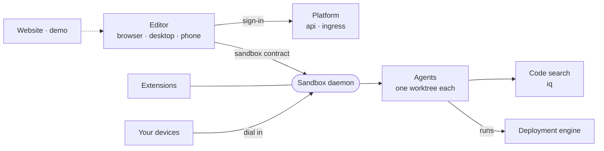

# Architecture

The index into [`docs/architecture/`](docs/architecture), where each page explains one subject of how intentic is put together.

- [repo.md](docs/architecture/repo.md): the whole repository in pictures, from the parts listed in [repo.json](docs/architecture/repo.json).
- [topology.md](docs/architecture/topology.md): the processes and machines, which way each connection opens, and who can reach what.
- [sandbox.md](docs/architecture/sandbox.md): the daemon inside a sandbox, from agents and worktrees to landing, checks and state directories.
- [platform.md](docs/architecture/platform.md): the hosted account service, its registry and the hosted machines it runs.
- [app-plane.md](docs/architecture/app-plane.md): what counts as the product, and how one editor release drives daemons of any age.
- [extensions.md](docs/architecture/extensions.md): how extensions are packaged, loaded and kept to what they declare.
- [capabilities.md](docs/architecture/capabilities.md): connectors, accounts and machines, the catalog they come from, and where their credentials live.
- [deploy-engine.md](docs/architecture/deploy-engine.md): the bundled engine that turns an intent file into running infrastructure.
- [packages.md](docs/architecture/packages.md): the `_area/package` layout, package naming, the `@intentic/src` export condition, build and typecheck.
- [conventions.md](docs/architecture/conventions.md): the rules the repository's checks and linter enforce.
- [testing.md](docs/architecture/testing.md): test tiers, the `suites` runner, and where each tier runs.
- [languages.md](docs/architecture/languages.md): the editor's UI languages, message catalogs and the checks that keep them complete.

Package-level detail lives in each package's own README. [docs/README.md](docs/README.md) says which document belongs where.
