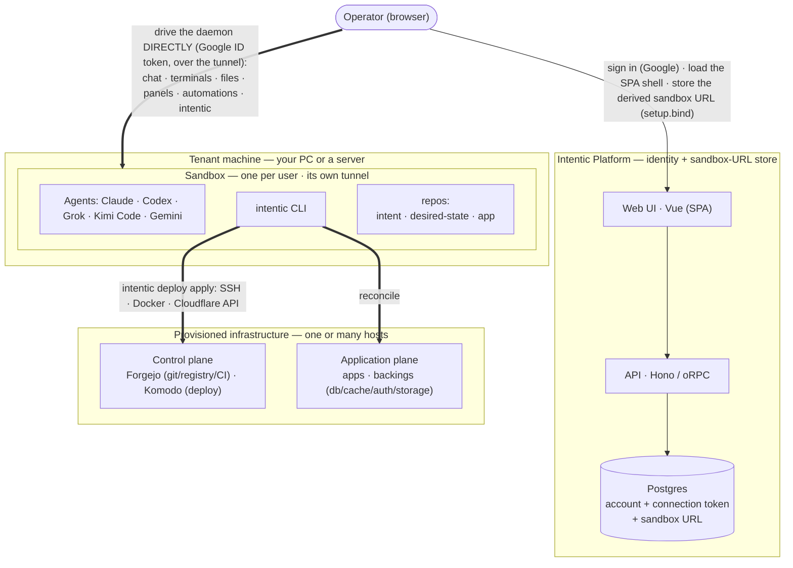
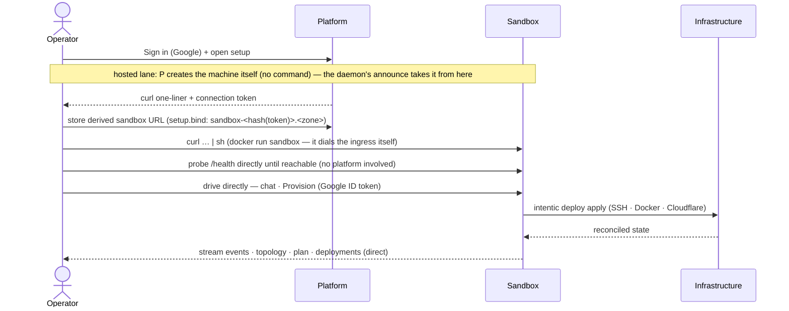

# Architecture

intentic is a **co-piloted specialized-agent workspace**: each agent runs in its own sandbox on hardware
you own, and from a browser you configure its context, supervise its work, and approve the calls that
matter. This document covers the two tiers that *are* the product: a thin **platform** and the per-user
**sandbox** (and the workspace it serves): plus, in clearly-marked sections, the **bundled deployment
engine**: a standalone infra tool that ships in this monorepo and is one of the many tools an agent can run.
It is not part of the product.

## System topology & lifecycle

At runtime the product is two tiers: a thin **Platform** (identity + sandbox-URL store) and a per-user
**Sandbox** (where the agent runs, reached by the browser directly). A sandbox can *also* stand up real
**infrastructure** on hosts you own (the third tier below) by running the bundled deployment engine, one
of its tools; that path is optional. The engine flow shown later is what runs *inside* one `intentic deploy apply`.



- **Platform (identity + sandbox-URL store)**: Vue SPA + Hono/oRPC API. Persists the
  operator's account (Better Auth), one secret-free per-user connection token, the sandbox's public `daemonUrl` (announced
  by the **daemon** on boot), member invites (a discovery mirror: the daemon is the enforcer), and
  a pool of pre-provisioned tunnels (`ReservedSandbox`) so setup pays no Cloudflare round-trips
  inline. It never probes the sandbox, owns no infrastructure, and sits **off the command path: with
  one exception, the free trial**. The trial ([_platform/api/src/trial/](_platform/api/src/trial/)) lets
  someone chat before connecting any AI account, on intentic's own free-tier keys, metered per
  signed-in account per day; those turns therefore pass *through* the platform, which no other turn in
  this product does. It is off unless the operator configures keys, every surface that offers it says so
  in the same words (`TRIAL_NOTICE`), and connecting any account moves the user onto the direct path
  permanently. Nothing else changes: the trial holds no ability to drive a sandbox, so the blast radius
  below is unchanged. The **push relay** ([_platform/api/src/push-relay/](_platform/api/src/push-relay/))
  is a narrower pass-through of the same kind, for notifications rather than turns: browsers get web push
  straight from the daemon, but Apple only accepts pushes from the app's vendor, so the iOS shell's
  notifications (a title and a body, never content: the daemon's payloads are pointers back into the
  workspace) route daemon → relay → APNs. Off unless the operator configures the Apple key; it too can
  drive nothing.
- **Sandbox**: one per user, run **unprivileged by default**; container privileges come only from
  `# intentic:runtime` directives in the owner-approved overlay, applied by the allowlisted rebuild executors
  (the `docker` capability's `--privileged` wakes the image-baked, otherwise-dormant isolated Docker Engine so
  `pnpm db:up` / `docker compose` work in the workspace, and its optional GPU switch adds `--gpus=all` plus the
  container toolkit that nested engine needs. A directive on the run contract's OPTIONAL list: the ones whose
  absence leaves a working sandbox: is probed on the host first and dropped rather than failing the launch; its
  engine settings (registry mirror, address pool) are a different family again, living in `daemon.json` and
  costing a dockerd restart instead of a rebuild. The HOST's Docker socket is
  never mounted, so the agent's containers can only live inside the sandbox's own engine; the tunnel that makes
  it reachable is a connection the daemon itself dials, not a sidecar). Runs the coding agents (Claude via the agent
  SDK, Codex app-server, Grok, Kimi Code, Gemini: spawned per turn, not resident) and the `intentic` CLI over the three repos
  (`intent` = `deploy.config.ts`, the IaC; `desired-state` = resolved artifact + status; `app` =
  the application code), and exposes its daemon through the platform's own edge, **`@intentic/ingress`**
  ([_platform/ingress](_platform/ingress)). A box on the user's own machine dials ONE outbound WebSocket to
  it, presenting a platform-signed Ed25519 **reachability grant** that says which sandbox it is, and from then
  on serves its daemon and previews under that sandbox's hostnames. A hosted box (below) dials nothing: it is
  a Fly app already on the internet, and the edge answers a request for its hostname with a Fly replay
  (`fly-replay: app=<its app>`) that Fly's proxy carries straight to the machine, caching the route per
  hostname so the edge is off the path of everything that follows. Nothing else is provisioned in either case,
  because every public name a sandbox answers to already ends in its own 12-hex id: the ingress decides who
  may serve a request by parsing the `Host` header, and a hosted sandbox's app is named after the same id, so
  there are no accounts, no name claims and no namespace to reconcile
  ([ingress-contract.ts](_sandbox/sandbox-contract/src/ingress-contract.ts) is what the three parties agree
  on). A reconnecting box DISPLACES its own previous tunnel, which is why recreating a container heals itself
  instead of fighting over names its dead predecessor still held. The platform can mint and revoke that
  reachability — revoking is deleting the sandbox row — but cannot impersonate the daemon's own auth: the
  credential that binds an owner is born inside the box. TLS terminates at Fly's proxy, under ONE wildcard
  certificate for `*.sbx.intentic.dev`, so the ingress and the hosted machine's front door both handle
  plaintext requests: the proxy is a trusted hop, and what makes that acceptable is that the daemon verifies
  every credential it accepts inside the box instead of trusting a header. Cloudflare is DNS only now, and
  every record it still holds is a wildcard or a transient:
  the wildcard aimed at the ingress's anycast addresses, `*.local.<zone>` for the loopback shortcut, and one
  ACME TXT per loopback certificate being issued. Nothing per-sandbox is left, which is the point — the
  loopback name was the last thing minting a record each, and enough of them filled the zone's quota and
  stopped issuance for everyone. SSH keys, Cloudflare and agent tokens ride straight into it and never reach
  the platform.
- **Trust root = browser Google Sign-In**: the browser proves its identity to the daemon with a
  Google ID token, verified against Google's JWKS, and the daemon binds its owner **on first use**:
  the first authenticated request must carry the `x-intentic-connect` connect token (and, when setup
  seeded an expected owner, match that account's email), then the owner email persists in
  `/work/.intentic/identity/owner.json` ([auth.ts](_sandbox/sandbox/src/auth/auth.ts)). Because a Google ID token
  lives ~an hour and renewing it needs Google UI, it is only the **sign-in** credential: the browser
  exchanges it at `system.session` for a **daemon-minted session** (HMAC-signed with a secret that
  never leaves the sandbox, [session.ts](_sandbox/sandbox/src/auth/session.ts)) and presents that on
  every call, renewing it silently: Google reappears only for a first visit, an account switch, or a
  long-idle return. First-bind always takes a fresh Google proof, never a session, with one lane's exception
  below: on a HOSTED machine the daemon also takes the platform's **owner ticket**
  ([owner-ticket.ts](_sandbox/sandbox-contract/src/owner-ticket.ts)), a minutes-long Ed25519 claim signed
  with the reachability key and verified offline against the public half the provisioner put in the machine's
  env, naming this sandbox's id and the owner `OWNER_EMAIL` already names, so the platform sign-in is the only
  one a hosted user makes. It adds no power the hosted exception below does not already grant. Additional
  collaborators are granted via `/work/.intentic/identity/members.json`, and owner/membership are re-checked
  per request, so revoking a member kills their live sessions too. The platform never holds or forges
  either credential, so a platform breach can read the stored URL but **cannot drive any sandbox**:
  a breach's blast radius is bounded to identity + the sandbox URL.

  **The HOSTED lane is the stated exception to that boundary**, and since onboarding stopped asking it is
  what every browser arrival gets: the setup page starts one on arrival rather than opening on a picker
  (`setupArrival.ts`), and the desktop app is the surface that installs locally instead. Such a user gets a
  sandbox whose machine the platform creates on
  intentic's own provider account (Fly, one microVM + one persistent volume per sandbox, each app on its
  own private network: [_platform/api/src/sandbox/hosted/](_platform/api/src/sandbox/hosted/)) and
  deliberately keeps the way back into: wake on the next visit, stop, destroy on delete. The command
  path is unchanged: the browser still drives the daemon directly — browser, Fly's proxy, machine, with no
  tunnel and no intentic process carrying bytes, since the edge only names the app to replay to — and the
  platform still never proxies a request or holds a daemon credential: but existence and power are now
  the platform's, and an operator (or a breach) holding the provider credential could reach inside a
  hosted machine the way any cloud provider can reach inside a rented VM. Every other lane keeps the
  full boundary; a self-hosted platform has the lane off unless it configures its own provider token
  (`hosted` in [config.ts](_platform/api/src/config.ts): the third documented exception to the
  platform's secret-free model). The machine also puts itself to sleep when nobody is connected and
  nothing is running (the daemon's idle-stop, [idle-stop.ts](_sandbox/sandbox/src/system/idle-stop.ts))
  and the platform wakes it on the next visit: which is what makes a free hosted starter economically
  honest, at the stated cost that scheduled automations run only while the box is awake. The platform is
  also this lane's rebuild executor: an owner-approved environment overlay is built on a builder machine
  the platform creates inside the sandbox's own app and applied as a config replacement
  ([hosted-build.ts](_platform/api/src/sandbox/hosted/hosted-build.ts)), with the builder's minutes metered
  to the owner like awake minutes and platform-wide ceilings behind every per-owner limit.

The lifecycle, from first sign-in to a reconciled deployment the operator can watch:



### The sandbox daemon

The daemon ([_sandbox/sandbox](_sandbox/sandbox)) is the whole per-user product surface, not just a chat
endpoint. One Node process serves the oRPC contract on `:8787` and a preview proxy on `:5173`;
terminals, panel dev servers, and agent shell commands all run in a shared `tmux` server so they
survive reconnects. Its subsystems:

- **Agent backends**: Claude (agent SDK, spawned per turn), Codex, Grok/opencode, Kimi Code, Gemini, and
  Cursor. Kimi
  and Google's models are re-served from subscription OAuth through the bundled translator on the Claude Code
  harness
  ([agent/](_sandbox/sandbox/src/agent/)), plus an anonymous website **webchat** widget over SSE. Native Codex
  points app-server at that same subscription-backed translator; generated image items are copied into
  `.intentic/records/artifacts/imagegen/` and stream as paths, never transcript-embedded base64. The five runtimes
  behind that seam (the Claude Code loop, Codex app-server, OpenCode, ACP, Pi's RPC mode under the
  reserved `pi` capability id: [pi/](_sandbox/sandbox/src/pi/), and Cursor's own runtime run in-process
  through `@cursor/sdk`: [cursor/](_sandbox/sandbox/src/cursor/)) do not do the same things, so
  what each one *can* do is **declared**, not inferred: `capabilitiesOf(provider, harness)`
  ([sandbox-contract/agent-catalog.ts](_sandbox/sandbox-contract/src/agent-catalog.ts)) is one row per runtime:
  steering, permissions, questions, MCP, effort, isolation, commands, terminals, recovery: and both sides of
  the wire read it. The daemon gates its seams on it and strips the controls a runtime would silently drop
  ([agent/turn-plan.ts](_sandbox/sandbox/src/agent/turn-plan.ts)); the composer offers only the modes and knobs
  something applies, and names the rest as what this provider can't do. A capability is listed only if
  something reads it, and `agent-catalog.test.ts` walks PROVIDERS × HARNESSES so a new provider cannot arrive
  without a row
  ([webchat/](_sandbox/sandbox/src/webchat/)). A chat turn executes as a **detached run**
  ([agent/turn-runs.ts](_sandbox/sandbox/src/agent/turn-runs.ts)): `POST /agent` acks with a run id, the
  daemon folds the provider's frames into the conversation's rows as they arrive (one fold, the contract's
  [transcript-fold.ts](_sandbox/sandbox-contract/src/transcript-fold.ts), shared with the demo), and any number
  of clients render them via `/agent/attach`: the head carries the run's rows whole, then every change lands as
  a patch and every fact about the turn (session, worktree, usage, error) as itself. The browser applies patches
  and folds nothing, so a turn survives reloads and dropped connections, and every window or device on the
  conversation streams it concurrently. Only `/agent/stop` cancels it. A turn also survives **the
  daemon**: every in-flight turn and automation fire is written to a **turn journal** on the history volume
  ([agent/turn-journal.ts](_sandbox/sandbox/src/agent/turn-journal.ts)) and cleared when it settles, so whatever
  is still there at boot is exactly what the process died under: and `resumeInterruptedTurns`
  ([agent/turn-resume.ts](_sandbox/sandbox/src/agent/turn-resume.ts)) re-runs it on the session holding its
  partial work. That matters because intentic's own flows cause the deaths: every update, environment approval
  and `dev-sandbox.sh` swap recreates the container, so approving the Dockerfile change an agent asked for used
  to cost the run that asked for it. Off by default (`autoResumeOnRestart`) because a re-run spends the owner's
  allowance unwatched; once turned on it fires once per turn, and only for turns under six hours old: a turn
  that OOM-kills the daemon must not resurrect it on every boot. Not resuming is still recorded, and records
  the WORK and not just the fact: the boot pass reads the dead turn back out of the provider's session store and
  appends it to the conversation's transcript before consuming the journal entry that names it, so an hour of
  tool calls that never settled is still there to read. The fleet card reads `interrupted` and an automation's
  row shows an `interrupted` run.
  A run's rows stay in memory only until it settles: the durable copy is the daemon's own **transcript record**,
  one file per conversation on the history volume
  ([sessions/transcript-record.ts](_sandbox/sandbox/src/sessions/transcript-record.ts)), appended the settled
  run's rows, the same rows every window drew. The provider's session store is only the recovery source above,
  which is why a provider that keeps no readable store still opens.
- **Terminals**: interactive PTYs over WebSocket ([terminal/terminal.ts](_sandbox/sandbox/src/terminal/terminal.ts)).
- **Panels & previews**: per-repo dev servers behind `preview-<panel>-<id>.<zone>` hostnames
  ([panels/](_sandbox/sandbox/src/panels/)); plus generic **port forwarding** for anything run in a terminal
  (a procfs scan lists listening ports, an explicit forward maps one onto a fixed slot behind
  `port-<slot>-<id>.<zone>`, and Ctrl+clicking a `localhost:<port>` link in a terminal rides this
  automatically) ([ports/](_sandbox/sandbox/src/ports/)). Port targets get Host/Origin rewritten to
  `localhost:<port>` at the proxy, so stock dev-server host checks pass unconfigured. Desktop-sync users get the
  stronger guarantee automatically: the sync agent's port-mirror watcher binds those same ports on their own
  machine's localhost (see `@intentic/machine`), the only path where a frontend hard-coded to
  `localhost:<other-port>` works untouched.
- **Automations**: cron schedules, webhooks (`/automations/:id/fire`), and event listeners
  ([automations/](_sandbox/sandbox/src/automations/)). Any of them can be fired by hand with **Run now**
  (`POST /automations/:id/run`), down the same path the real trigger takes: a schedule stays a headless
  main-tree wake, and its guard still runs, because a test-fire that proved something else ran would prove
  nothing about the 3 a.m. one. Only the approval gate is skipped (the click is the approval), and a *disabled*
  automation fires too: trying a prompt before switching it on is the main reason to press it. Every run records
  the session it ran in, so the row's run history opens the transcript: the answer to "it failed overnight and
  I can't see why".
- **Front Desk**: a chat bubble a customer embeds on their own website, talking to a `webchat` listener
  automation ([webchat/](_sandbox/sandbox/src/webchat/), widget in
  [\_sandbox/webchat-widget](_sandbox/webchat-widget)). It is the inbound-HTTP mirror of the gateway-process pattern:
  no extension holds a connection, because the connection is a `<script>` tag on someone else's page. Four
  routes are exempt from the bearer middleware: `widget.js`, and per-automation `config` / `challenge` /
  `message`: and that set, written as **one predicate** in [app.ts](_sandbox/sandbox/src/app.ts), is the whole of
  what an anonymous internet user can reach on a daemon. The visitor holds no credential in any mode: even
  with Google sign-in on, the ID token is verified daemon-side against the *site's own* client id (intentic's
  cannot list every customer domain) and becomes a claim in the prompt, never a grant. Admission is the
  trigger's `allowedOrigins` plus a per-conversation rate limit and an optional bot check: Cloudflare
  Turnstile, or a built-in proof of work for sites with no Cloudflare account, spent once per visitor thread.
  Each thread maps to ONE sandbox conversation, resumed by session id
  ([webchat-sessions.ts](_sandbox/sandbox/src/webchat/webchat-sessions.ts)), so a five-message support chat is one
  fleet card the owner can watch live and take over: not five worktrees with amnesia. And because an
  automation turn runs `bypassPermissions` by default, a Front Desk's real boundary is `Automation.allowedTools`,
  carried into the SDK's own allowlist: prompt wording is advice, an empty toolbox is not. The config fetch
  doubles as the **install probe** ([webchat-installs.ts](_sandbox/sandbox/src/webchat/webchat-installs.ts)):
  every widget load records its origin and whether it was admitted, which is the only thing that can tell a
  working Front Desk nobody has written to from a snippet that was never pasted: and turns the commonest
  mistake of all (`example.com` listed, `www.example.com` not) into a named origin with an Allow button.
- **CI pipelines**: the workspace repos' GitHub Actions / GitLab pipelines, as both an automation source and a
  UI surface ([ci/](_sandbox/sandbox/src/ci/)). A repo participates when its remote's hostname matches a connected
  github/gitlab capability (`projects.ts`: self-hosted GitLab included, via the capability's instance url). A
  reconciler keeps a webhook on every mapped repo pointing at the public receiver `/ci/webhook/:host`,
  authenticated by a per-sandbox secret in `.intentic/secrets/ci.json` (GitHub signs the body, GitLab echoes the
  token); a refusal (token scope, role) degrades that repo to a warning carrying the manual hook recipe, the
  ssh-key-registration posture. Completed pipelines dispatch the core listener provider **`ci`**: the webchat
  precedent: no gateway extension, the daemon's own receiver is the source, with event types
  `pipeline_failed` / `pipeline_succeeded` / `pipeline_fixed` (a success ending a recorded failure streak on
  that repo+branch, remembered across restarts in `ci.json`), so a listener automation narrows by repo
  (`channelId`) and result. The same deliveries freshen the runs cache behind `GET /ci/runs`, which the
  **Pipelines** rail view ([\_extensions/pipelines](_extensions/pipelines)) polls: backfilled over the
  vendors' REST APIs when stale, so the view has history even where webhooks never registered. Row actions
  proxy rerun/cancel to the vendor, and **Fix with agent** (`POST /ci/fix`) opens an isolated conversation
  seeded with the failed jobs' log tails: a fleet card like any other agent.
- **Push notifications**: the daemon is the sender, because it is the only tier that knows what the agent is
  doing ([push/](_sandbox/sandbox/src/push/)). It owns a per-sandbox VAPID keypair and one subscription per
  subscribed browser, stored on the **history volume** rather than under `/work/.intentic`: the private key can
  forge notifications to the owner's devices, so it sits outside the agent's reach. Three moments notify: a
  turn settled, a turn parked on the user (plan/question/permission), and an automation held for approval:
  and every one is suppressed while anyone is present and non-idle on the sandbox (`idleEverywhere`, read off
  the same presence roster `/events` maintains), so a turn you watch finish tells you nothing. The service
  worker ([_editor/web/public/sw.js](_editor/web/public/sw.js)) is registered lazily and caches nothing; a
  subscription is per-browser, and lives on the web origin while the sender is the daemon on its tunnel:
  which works because a push endpoint is an absolute URL minted by the browser's own push service.
- **Capabilities**: everything a user adds to the sandbox (connectors, vpn, mcp, plugins, …),
  one unified model with a per-kind handler ([capabilities/](_sandbox/sandbox/src/capabilities/)): see
  [Capabilities](#capabilities).
- **VPN** (putting the sandbox on a private network ([vpn/](_sandbox/sandbox/src/vpn/))) see [VPN](#vpn).
- **Geo exits** (making chosen traffic LEAVE from another country, without touching the sandbox's own
  connection ([exit/](_sandbox/sandbox/src/exit/))) see [Geo exits](#geo-exits).
- **Members**: shared access for invited collaborators, enforced by the daemon
  ([auth.ts](_sandbox/sandbox/src/auth/auth.ts)).
- **Workspace file service**: search, tree, watch, diff, and chunked multi-GB uploads
  ([workspace/](_sandbox/sandbox/src/workspace/)); desktop sync is Mutagen over tunnel SSH
  (`ssh-<id>.<zone>`, paired via `@intentic/machine`). Enrollment ([platform/sync.ts](_sandbox/sandbox/src/platform/sync.ts))
  carries a **mode**: `sync` (bidirectional file sync, SINGLE-HOLDER, two machines two-way-syncing `/work`
  would race) or `mirror` (port mirroring only, UNLIMITED: forwards are per-machine and independent, so every
  collaborator mirrors the ports to their own localhost at once). The **owner** may enroll either; a **member**
  is capped to `mirror` at pairing-mint. Each enrolled machine gets its own key in `authorized_keys` and its own
  `/ports`-scoped sync token, so machines revoke independently (self-revoke on uninstall; owner clears all).
- **History**: git snapshots every 60 s + per agent turn, on a `/history` volume mounted *outside*
  `/work` so an agent `rm -rf` can't reach it ([history/](_sandbox/sandbox/src/history/)). The same volume holds
  the managed ssh dir (`/history/ssh-hosts`, symlinked to `~/.ssh/intentic-hosts` at boot by
  [`linkSshHosts`](_sandbox/sandbox/src/capabilities/ssh-hosts.ts)): container recreates, every rebuild, update
  and `dev-sandbox.sh` swap: wipe `/root`, so a git-provider identity or an `ssh` capability's key kept there
  died on each one while the manifest still read "connected". What genuinely can't be persisted (`~/.gitconfig`,
  `~/.git-credentials`) is re-derived from the manifest at boot by
  [`restoreConnectorGitAccess`](_sandbox/sandbox/src/capabilities/cli/git-access.ts), the git counterpart to
  `reconnectVpns`. Every one of these HOME-level convergences: the ssh dir, the `~/.claude` session stores,
  `authorized_keys`, the git credentials: runs only for the daemon holding the container claim
  ([`claimContainer`](_sandbox/sandbox/src/platform/container-owner.ts)), and so does everything else there is
  only one of per container: the process sweep, the tmux session sweep, the translator, the platform announce,
  the scheduler, the approvals executor and the CI hooks. A container can hold more than one daemon: this
  repository IS the daemon, so a run of it from source is an ordinary thing for an agent to do: and the second
  one otherwise repoints HOME at its own empty roots (taking the live sandbox's git access, transcripts and
  desktop enrollment down without an error anywhere). A guest daemon serves its own routes and owns nothing that
  was here before it. What a guest cannot reach at all is the live daemon's PROCESSES: the leftover sweep
  ([`leftovers.ts`](_sandbox/sandbox/src/platform/leftovers.ts)) enumerates its own process group rather than
  filtering every process in the container by a label, so another daemon's work is not something it can decide
  wrongly about: it is not in the set. The label that survives says only WHOSE turn a process belongs to, read
  after group membership has already answered whose daemon it is.
- **Environment overlays**: agent-proposed Dockerfile layers, applied only after owner approval, by `ic` on
  a docker host or by the platform's builder on a hosted machine
  ([environment/](_sandbox/sandbox/src/environment/)).
- **Discord**, chat/stream/voice integration, now an image-baked extension: a gateway `process` +
  `listener` in [\_extensions/discord](_extensions/discord).

**One image, two ways to start.** The sandbox `connect.sh` runs on your PC and the one the
`i.want.workspace` provider deploys onto a remote host (over SSH) are the *same image*. `connect.sh` itself is
a bootstrap shim: it gets Docker on, fetches the `ic` host-side CLI ([_sandbox/ic](_sandbox/ic)) and hands the
flow to `ic sandbox connect`: so is the desktop app ([_editor/desktop-app](_editor/desktop-app)) not a third
way: it *spawns that same `connect.sh`*, which is what makes its onboarding identical to the pasted one rather
than a second implementation to keep in step. Every lane on a machine the user owns then reaches the box the
same way, and there is only one way: the daemon dials ONE outbound WebSocket to the ingress and presents the
platform-signed grant naming `<id> = sha256(connectToken).slice(0, 12)`
([tunnel-ids.ts](_sandbox/sandbox-contract/src/tunnel-ids.ts)); the edge reads the `Host` header of each
request and sends it down that sandbox's tunnel. The hosted lane is the one box that is dialled instead of
dialling: the same image, booted as a Fly machine (`SANDBOX_VM`), declares its preview proxy as a Fly service
([sandbox-run/fly.ts](_sandbox/sandbox-run/src/fly.ts)) and the edge replays requests for its hostnames to
the app named after the same `<id>`.

Publishing anything is therefore free of provisioning, because every name a sandbox serves already carries its
id: `sandbox-<id>` for the daemon, `preview-<panel>-<id>` for a panel, `port-<slot>-<id>` for a forwarded port,
`public-<slot>-<id>` for the outbox ([hostnames.ts](_sandbox/sandbox-contract/src/hostnames.ts)). A new panel or
a dev server on a fresh port is reachable the moment it exists: no record to mint, no name to claim, no pool to
keep warm, nothing to reap when it goes. Desktop sync rides the same surface rather than a name of its own,
Mutagen's SSH tunnelled over the daemon's HTTPS (`/system/sync/ssh`), and when the agent and the sandbox are on
one machine every dial the machine agent makes, the computer half's socket included, resolves to the loopback
address first and never crosses the edge at all ([daemon-base.ts](_computers/machine/src/daemon-base.ts)).

Two lanes stay off the shared edge entirely. **A sandbox published under its owner's own domain** is reached
through whatever that owner already runs; the platform stores its URL and nothing else, which is the whole of
the attach lane. And **on a server** the workspace is just another service on that host's shared tunnel,
exposing only the preview wildcard (the daemon stays host-internal: the server workspace is preview-only;
`connect.sh` is the browser-direct path). The infrastructure a sandbox *provisions*, meanwhile, builds
Cloudflare tunnels on its target hosts (see below): which is how the system fans out to "workers on many
machines."

### Cloudflare: DNS for the sandbox, required for everything it deploys

Two different jobs wear the same vendor's name, and keeping them apart is the point of this section.

**Reaching a sandbox no longer involves Cloudflare at all** beyond the DNS it answers with. The zone holds one
wildcard record aimed at the ingress, one `*.local.<zone>` record answering `127.0.0.1` for the loopback
shortcut, and a transient TXT per loopback certificate being issued over DNS-01
([cloudflare.ts](_platform/api/src/sandbox/cloudflare.ts)). No tunnel is created per sandbox, no record is
minted per name, and the platform is off the naming path completely.

**For the infrastructure a sandbox provisions, Cloudflare carries the traffic and is required.** Every app,
service and workspace the engine deploys is exposed through a Cloudflare tunnel on its host, and nothing else
is offered. The operator never needs to open `git.<zone>` / `deploy.<zone>`; the **browser reads the control
plane through the sandbox daemon directly**. How each piece is reached is asymmetric:

| Reached over | Who / what |
| --- | --- |
| **SSH** (loopback port-forward to `:3000` / `:9120`) | The **engine's entire control path**: every Forgejo API call (repo/ci/users/orgs/teams/hooks) and every Komodo API call (deployments/users/alerters/servers), plus `intentic deploy adopt`'s REST calls and git pushes. The engine never dials a public route it may itself be reconciling, apply and adopt work with the tunnel down, or before DNS exists at all. |
| **Cloudflare tunnel** (public `*.<zone>`) | Everything genuinely cross-host or external: browsers/operators, every worker host's Komodo Periphery dialing Core (`deploy.<zone>`), registry pulls (`git.<zone>`), and hosted-forge CI runners' notify step. |

Why a tunnel, rather than "just use SSH and make Cloudflare optional":

- **Outbound-only, NAT-traversing.** `cloudflared` dials out, so it works behind NAT/firewalls with no
  inbound ports: the same bet the sandbox already makes to expose its daemon.
- **Cross-host coordination needs stable, routable names.** Worker→Core registration and image pulls are
  host-to-host; SSH from the sandbox only reaches *sandbox→service*, so an SSH-only design would still have
  to add an overlay network to serve them.
- **The registry forces a global name anyway.** Image refs (`git.<zone>/owner/app:tag`) must resolve
  identically from every host that pulls: that alone mandates a stable domain.
- **One uniform primitive** (`<name>.<zone>`, TLS'd, reachable from anywhere) keeps the model trivially
  reason-about-able; a second internal/SSH mode would mean two reachability models and a combinatorial matrix.

This is enforced in code, not just convention: the SDK types require `expose: Cloudflare`, and both
`resolveNeeds` ([needs.ts](_deploy/need-resolver/src/needs.ts)) and `emit`
([emit.ts](_deploy/state-resolver/src/emit/emit.ts)) throw when it is missing: there is no second way to expose
a deployment.
The Cloudflare API token is supplied at **connect** time (it rides `connect.sh` into the sandbox) and consumed
at **provision** time by `intentic deploy apply`. It never reaches the platform except for one request-scoped
call: the platform lists the token's zones so the user can pick which one their DEPLOYMENTS live under, because
the browser can't call Cloudflare directly, then drops the token: never persisted, never logged. That call has
nothing to do with reaching the sandbox any more, which is the ingress's job and needs no token from anyone.

> The sections from here through **Packages** document the **bundled deployment engine**: a standalone
> infra tool that ships in this monorepo and is one of the many tools an agent can run. It is **not part of
> the intentic product** (the product is the app plane, covered below).

## The intent-driven flow

```
Intent ──► NeedResolver ──► Needs ──► StateResolver ──► desired state ──► Execute ──► (reads true)
```

1. **Intent** (a declaration authored with the SDK: `i.have.*` (the inventory you bring) read, never
   created or destroyed: `host`, `cloudflare`, `github`, `gitlab`, `backup`, `discord`, `stripe`) and
   `i.want.*` (what intentic owns end-to-end, created, reconciled, pruned, destroyed: `app`, `service`,
   `workspace`, `database`, `cache`, `auth`, `objectStorage`, `user`, `team`), each
   app wired to its host/Cloudflare via `on` / `expose`. Captured as a serializable `IntentSet`.
   ([_deploy/sdk/src/stack.ts](_deploy/sdk/src/stack.ts))
2. **Need resolver**, derives the abstract capabilities the intent requires: `source-control`,
   `docker-registry`, `infra-control` (control plane), `deployment-target`, `domain` (application plane).
   (`resolveNeeds` in [_deploy/need-resolver/src/needs.ts](_deploy/need-resolver/src/needs.ts))
3. **State resolver**: assigns each need its catalog option and compiles the emitted nodes into one
   **desired state** (a `DesiredStateGraph`). The catalog maps capabilities to the concrete things that
   satisfy them; one option may cover several (Forgejo provides both source-control and docker-registry).
   `catalogFor(intent)` selects the source control: `i.have.github` ⇒ GitHub (GHCR + Actions),
   `i.have.gitlab` ⇒ GitLab (its registry + CI), otherwise the self-hosted Forgejo default. **Komodo is
   unconditional**: on every stack CI only builds and pushes the image and Komodo rolls it out, so no
   host SSH credential ever reaches a hosted forge and the host stays outbound-only. The intent fully
   determines the result: within the selected catalog there is exactly one option per capability, so
   resolution stays deterministic. (`resolveState` in
   [_deploy/state-resolver/src/state.ts](_deploy/state-resolver/src/state.ts), over `catalogFor` in
   [catalog.ts](_deploy/state-resolver/src/lib/catalog.ts) and the nodes emitted by
   [emit.ts](_deploy/state-resolver/src/emit/emit.ts))
4. **Execute**: apply the desired state and re-read it, looping until a plan reads all-noop ("state reads
   true"). (`reconcile` in [_deploy/engine/src/reconcile/reconcile-loop.ts](_deploy/engine/src/reconcile/reconcile-loop.ts), over
   `apply`/`plan` and the Provider SPI)
5. **Prune**, after convergence, deletion converges too, from two sources: the baseline diff (resources in
   the last-applied artifact the new one no longer declares) and the **collection scan**: each provider's
   `list` enumerates its live stamped resources (`intentic.id` / `intentic.type` labels, stamped DNS-record
   comments) and everything absent from the graph is an orphan, pruned without needing any baseline.
   Deletions require `apply --yes` (pending ones are previewed otherwise), nodes with a `protect: true`
   input (stateful backings by default) are never deleted, and `intentic deploy destroy --yes` is the same prune
   against the empty graph. Drift detection is also stamp-based: every resource carries an `intentic.hash`
   of its serialized inputs, and a mismatch reads as an update regardless of the provider's own diff.
   (`prune`/`pruneOrphans` in [prune.ts](_deploy/engine/src/reconcile/prune.ts), `collectOrphans` in
   [orphans.ts](_deploy/engine/src/reconcile/orphans.ts), stamps in [stamp.ts](_deploy/graph/src/stamp.ts))

A `DesiredStateGraph` is the central data structure: a serializable, dependency-ordered set of resource
nodes with refs, secrets, and readiness gates. ([_deploy/graph/src/types.ts](_deploy/graph/src/types.ts))

## Output contract (driving the CLI as a service)

The engine separates two seams on `EngineConfig`: `log` carries providers' free-form strings, and
`onEvent` emits structured `EngineEvent`s for lifecycle progress: `node` (apply/plan, start/done with
the action), `readiness`, `iteration`, `prune`, and `orphan`
([types.ts](_deploy/engine/src/types.ts)). The CLI selects a renderer from `INTENTIC_OUTPUT`
(`text` | `json` | `ndjson`) in [output.ts](_deploy/cli/src/lib/output.ts): `text` is the human default
(unchanged), `json` serializes the command's returned outcome once, and `ndjson` streams each event as
a line then a terminal `result`. The final result is built from the engine's return values
(`PlanOutcome`/`ConvergeResult`/`PruneOutcome` and `collectAccess`), never from events: so a control
plane gets both live progress and a parseable summary, and embedders consume `EngineEvent` directly.

## Control plane vs application plane

Every need carries a `plane`: its role, independent of where it runs ([needs.ts](_deploy/need-resolver/src/needs.ts)):

- **Control plane**, the deploy machinery: `source-control` + `docker-registry` (Forgejo by default,
  GitHub/GitLab when declared) and `infra-control` (Komodo, on every stack): git/CI plus the deploy
  orchestrator. The local `intent` repo
  (`deploy.config.ts`) and `desired-state` repo (the artifact + execution status) drive it: `intentic
  resolve` runs the flow above and writes the artifact, `intentic deploy apply` executes it. A remote, PR-managed
  control plane (a standalone Forgejo watching the intent repo) is a planned later evolution of this same
  flow. ([_deploy/cli/src/resolve/resolve.ts](_deploy/cli/src/resolve/resolve.ts), [artifact.ts](_deploy/cli/src/lib/artifact.ts),
  [app.ts](_deploy/cli/src/app.ts))
- **Application plane**, what actually serves an app: its `deployment-target` (the app's runtime on the
  host) and its `domain` (the Cloudflare tunnel + DNS routes). Both are *derived from* `i.want.app` and
  emitted alongside the control-plane stack. ([_deploy/state-resolver/src/resolvers/platform.ts](_deploy/state-resolver/src/resolvers/platform.ts),
  [_deploy/providers/](_deploy/providers/src/))

The whole per-host support stack is self-contained: its control-plane Forgejo is just another reconciled
node, so `apply` needs no pre-existing control plane. A future remote control plane would reuse the same
`forgejo` provider: a different node instance, not a different implementation.

## Packages

Dependency direction (one-way):

```
graph ──► resources ──► engine ──► providers
   │           └──────► state-resolver ──► sdk
   ├──► need-resolver ──► state-resolver
   └──► (cli ◄── need-resolver, state-resolver, engine, providers)
```

| Package | Tier | Role |
| --- | --- | --- |
| [`@intentic/graph`](_deploy/graph) | lib | Product-agnostic IR: refs, secrets, readiness, `DesiredStateGraph`, and the compiler. |
| [`@intentic/resources`](_deploy/resources) | lib | The closed resource vocabulary shared by the state resolver, engine, and providers: `ResourceType`, `ResolvedNode`, and `OUTPUTS`. |
| [`@intentic/need-resolver`](_deploy/need-resolver) | lib | The need resolver: intent → needs. Owns the authored intent/input shapes, `resolveNeeds`, and `Capability`/`Need`/`Plane`. |
| [`@intentic/state-resolver`](_deploy/state-resolver) | lib | The state resolver: needs → desired state, over the option catalog. `resolveState`, the catalog, `emit`, and the platform/app/route/id derivation. |
| [`@intentic/sdk`](_deploy/sdk) | lib | Authoring surface (`i.have.host` / `i.have.cloudflare` + `i.want.app`); `defineIntent` (→ `IntentSet`) and `defineStack` (one graph). |
| [`@intentic/engine`](_deploy/engine) | lib | Stateless reconcile engine: `plan`/`apply`, the Provider SPI, and the `reconcile` loop. |
| [`@intentic/providers`](_deploy/providers) | lib | Real Provider SPI impls: control plane (Forgejo, GitHub, GitLab, Komodo, repo/CI), network (Cloudflare tunnels + routes), hosts (SSH/Docker, deployment, workspace), backings (Postgres, Valkey, Garage, Authentik), services (SigNoz, Outline, Paperless, OpenProject, Invoice Ninja, Infisical), integrations (Discord, Stripe), ops (restic backup). |
| [`@intentic/sandbox-contract`](_sandbox/sandbox-contract) | lib | oRPC wire contract for the sandbox daemon: shared by the daemon and its browser client (the platform consumes it from npm). |
| [`@intentic/scaffold`](_sandbox/scaffold) | lib | Shared workspace scaffold: the intent-repo skeleton + deploy.config managed-region render/parse, used by the CLI's `init` and the sandbox daemon. |
| [`@intentic/cli`](_deploy/cli) | **app** | The `bin: intentic` toolbox (three command groups: `tunnel` (`sandbox`/`host`) Cloudflare tunnels on the USER's own zone: a self-hosted sandbox behind their domain, and the SSH way in to a machine they connect as a deploy target), `deploy` (`init`/`resolve`/`plan`/`apply`/`destroy`/`adopt`/`restore`/`secrets`/`deployments`/`logs`, the bundled deployment engine), and `scaffold` (`monorepo`/`add-app`) ([app.ts](_deploy/cli/src/app.ts)). |
| [`ic`](_sandbox/ic) | **app** (Rust binary) | The host-side CLI: the flows that must run on the machine that runs a sandbox, because the sandbox holds no host Docker socket and cannot recreate itself, `ic sandbox connect/update/rebuild/rollback/dev/list/remove`, `ic machine enroll/remove`. The served scripts (connect, rebuild/update, connect-host) are bootstrap shims that fetch this binary from the GitHub release and hand over; the container's run shape stays owned by `@intentic/sandbox-run` and spoken by the image, ic executes the image's answer, never states its own. Static musl/MSVC binaries, one per platform a one-liner can land on. |
| [`@intentic/sandbox`](_sandbox/sandbox) | **app** (image) | The per-project multi-agent dev workspace daemon (see [The sandbox daemon](#the-sandbox-daemon)), reached by the browser directly over the tunnel the box dials itself. |
| [`@intentic/machine`](_computers/machine) | **app** | THE one agent on a user's own machine (`intentic-machine`), both machine-side capabilities in one binary, one resident loop, one logon entry, one state home (`~/.intentic/machine`). The COMPUTER half is the machine side of the `host` capability (the sandbox half is [hosts/](_sandbox/sandbox/src/hosts)): the machine cannot be dialled (NAT, proxy, closed lid), so it dials the sandbox — one outbound WebSocket per linked sandbox, authenticated by an enrollment token carried in its first FRAME (never a URL, which would put a durable key to somebody's laptop into edge logs), after which the socket is **oRPC**: the machine SERVES `hostContract` and the daemon holds the client. Exactly one procedure is deliberately untyped, `mcp`, which carries MCP JSON-RPC **verbatim** in both directions, so the tool surface (`run_command`, `read_file`, `write_file`, `list_dir`, `trash_file`, `screenshot`, `describe` — no delete tool, trash is recoverable) lives in THIS binary and a machine can learn a tool without a daemon release. **Scopes are enforced here**, never in the sandbox: the daemon pushes the owner's switches down on every connect and every edit, a call outside them comes back as a readable refusal naming the switch, and every call is appended to an audit log that survives `uninstall` because it is the user's record. The SYNC half keeps a directory bidirectionally in sync with the sandbox's /work — one HTTP enrollment call, then Mutagen over the SSH transport this same loop serves on loopback (tunnel.ts) — and mirrors every workspace port onto this machine's localhost via Mutagen TCP forwards, polling each daemon's `/ports` so newly-started dev servers appear automatically. Enrollment grants a **mode** per pairing (file `sync`, or `mirror`-only for collaborators), each `setup` retires the previous pairing's sessions before writing, and revocation is symmetric: after consecutive definitive token rejections the loop drops that pairing rather than polling a dead enrollment forever. It also registers **Mutagen's daemon** at login (on Windows through the launcher stub, because Mutagen's own `daemon register` writes a console command into the Run key that flashes a terminal at every boot). ONE resident loop serves both halves (`intentic-machine run`): the sync half re-reads its pairing list every tick, the computer half's links are fixed at startup (every setup/uninstall restarts the loop), the process exits — and takes the login entry with it — only when BOTH halves are empty, and on a signal it exits 128+signal so `Restart=on-failure` supervisors restart what they did not stop. `status --json` answers for both halves in one envelope (links without tokens, the sync MachineReport, and a one-line `summary` the desktop app's tray row displays verbatim). The state home, autostart mechanisms, self-relaunch and detached-loop spawn are [`@intentic/local-agent`](_computers/local-agent)'s. |
| [`@intentic/desktop`](_computers/desktop) | lib | Drive a desktop from Node (capture the screen, move the pointer, click, type, press chords, scroll, drag) on Windows and Linux with **no native modules** (the consumer ships as one compiled binary, so node-gyp is not an option). Windows goes through PowerShell into `user32.dll`: `SetCursorPos`/`mouse_event` for the pointer, `keybd_event` for chords, and `SendKeys` for text ONLY, it is the one that handles arbitrary unicode and the one that cannot press the Windows key, so the split is not arbitrary. Linux is two backends behind one interface: X11 synthesises input freely via `xdotool`, Wayland refuses to, so the pointer needs `ydotool` (`/dev/uinput`) and text/keys prefer `wtype` (no privileges), a missing tool raises an error carrying its exact install line. Knows NOTHING about agents, scopes or sandboxes: it takes coordinates and makes a computer do something, and whether that is allowed is asked before these methods are called (`@intentic/machine`'s tools/computer.ts). That separation is what makes the policy testable at all, since a real click can only be verified by a human watching a screen. It also operates APPLICATIONS rather than only pixels, list the open windows (app, title, bounds, focus), focus one, launch an app or URL, read and write the clipboard, which is what makes GUI work reliable rather than blind: typing lands in the FOCUSED window, so an agent that cannot enumerate or focus is guessing every time. Windows enumerates through `Get-Process` plus a P/Invoke for the rectangle and the foreground handle; X11 through `wmctrl`/`xdotool`; Wayland only on wlroots compositors via `swaymsg -t get_tree`, because a compositor refusing to let one client enumerate another's windows is the same protection that stops it synthesising input, everything else gets a sentence saying so instead of an empty list that reads as "nothing is open". Two details it owns: coordinates are SCREENSHOT pixels and `frame()` reports the virtual desktop's origin (negative on a monitor left of the primary), so multi-monitor stops being a source of silent misclicks; and one key vocabulary (X11 keysyms plus the aliases people type, `enter`, `esc`, `win`, `cmd`) is rendered three ways, so no caller is platform-aware. |
| [`@intentic/browser`](_computers/browser) | lib | Drive a Chromium browser over CDP, open pages, read them as STRUCTURED TEXT, click and type by element reference. No dependencies: the protocol is JSON and `fetch`/`WebSocket` are globals, which matters because this ships inside a compiled binary where a native-addon library proved unloadable (see @intentic/desktop). The point is references instead of coordinates: a snapshot returns every visible element with its role, accessible name and current value, and actions name an element rather than a position, so the same instruction survives scrolling, resizing, re-rendering and a different screen, none of which a pixel click survives. Refs are short-lived by design (they index an array parked on the page, replaced by the next snapshot), so a ref taken before a navigation fails loudly instead of clicking whatever now occupies that slot. It drives a SEPARATE browser instance with its own profile under `~/.intentic/host/browser`, never the user's own: a browser only speaks CDP if it was started with a debugging port, and restarting theirs to add one would close every tab they had open, so their session is never automated, and the agent's logins are ones the user performed deliberately in a window they could watch. |
| [`@intentic/local-agent`](_computers/local-agent) | lib | The plumbing every intentic CLI that lives on a USER'S OWN COMPUTER needs, and none of what any of them does: the `~/.intentic/<name>` state home and the 0700/0600 floor everything written into it gets; how a CLI re-invokes itself; login autostart per OS; and the detached background loop found again by pidfile. Its consumers (`@intentic/machine` — whose two halves were the standalone `@intentic/host` and `@intentic/sync` — and `@intentic/acp-bridge`) were written months apart, and each copy of this was made from the last one, which is a shape with a known ending: the second copy is a snapshot of the first on the day it was taken, and every fix after that lands in one of them. It already had. Sync wrote its token file **world-readable** because its config module was copied from host's before that floor existed; host has no macOS autostart because it was copied from a sync that did not have one yet, and wrote an XDG entry macOS never reads; and the Windows console rule, the compiled-binary `argv` rule and "report what the tool actually said" were each written out at length in two files, in prose, cross-referencing the other agent by name, including in this table. The autostart mechanisms are all the user's OWN (per-user Windows Run key, launchd LaunchAgent, XDG entry): no elevation, no password prompt, no machine-wide change. Every mechanism runs the FOREGROUND loop, and on Windows it does so through [`intentic-launch.exe`](_computers/win-launcher), a ~200 KB GUI-subsystem stub installed beside the agent: Explorer starts a Run entry in the interactive session, where the loader hands any console-subsystem program a console — a Windows Terminal window on Windows 11 — so the entry that named the agent's own detached command put a black window on the desktop at every single boot. Only a GUI-subsystem parent maps nothing (`-WindowStyle Hidden` hides a console that is not the visible window, and a Task Scheduler logon task shows one like anything else, both measured), and the child it starts with `CREATE_NO_WINDOW` has a console with no window that every console child of ITS own inherits. An install with no stub beside it falls back to the detached command and says that a window will flash. macOS is opt-in per agent, so one that has not been exercised there says so instead of writing a file nothing reads. Knows nothing about sandboxes, tunnels, enrollment or MCP. |

The libs + the CLI publish to npm; **`sandbox` ships as a Docker image** to GHCR
(`ghcr.io/intentic/sandbox`): published by
[_tools/scripts/image/publish-images.sh](_tools/scripts/image/publish-images.sh) (which also publishes the `dind-host` test-host
image): `latest` + commit SHA on push to main, `<version>` + the moving `stable` tag on release.
[`images.ts`](_deploy/state-resolver/src/lib/images.ts) records it at `:stable`: the deliberate unpinned
exception among the otherwise digest-pinned deployed images (never `:latest`), so released sandboxes
track releases without a graph change. The registry package is public so tenant hosts pull it
unauthenticated; both `connect.sh` (your PC) and the `workspace` provider (a server) run this image
directly.

## The app plane: the product

The **app plane** is the intentic product: the co-piloted agent workspace a user actually looks at, a
VSCode-shaped file editor. (The intent→reconcile **deployment engine** documented in the preceding sections
is a *bundled tool* the sandbox can run (one tool among many) not part of this product.) The app plane's
dependency edges into `@intentic/*` all go through `sandbox-contract` (and one type-only reach into
`@intentic/resources` from `api-contract`); the engine core never depends back on the app.

| Package | Role |
| --- | --- |
| [`@intentic-app/web`](_editor/web) | The Vue 3 SPA shell: the editor UI (rail · workspace tree + file viewers + Monaco · chat). Signs in against the platform, then drives the sandbox daemon **directly** over its tunnel. The **extension host** lives here. |
| [`@intentic-app/api`](_platform/api) | The thin platform: Better Auth sign-in + the `setup.*` handshake. Off the command path (see topology above). |
| [`@intentic/desktop-app`](_editor/desktop-app) | The Windows/Linux desktop app (Tauri 2). Its workspace window IS the hosted SPA, with no IPC: the only channel in is an intercepted `intentic://` link. The native half runs the SHIPPED scripts (`connect.sh`, `recreate.sh`, `cleanup.sh` and their PowerShell twins) rather than reimplementing them, so the desktop and terminal paths are the same file; and because the daemon holds no host Docker socket, this app is the only thing that can turn "paste this command on the machine that runs your sandbox" into a button. Sign-in happens in the user's real browser and returns over the deep link (Google refuses embedded webviews). See [_editor/desktop-app/README.md](_editor/desktop-app/README.md). |
| [`@intentic/sandbox`](_sandbox/sandbox) | The per-user daemon (documented under [The sandbox daemon](#the-sandbox-daemon)), also the app plane's whole backend: workspace files, chat, terminals, panels, search, settings, and the daemon-side half of the extension system. |
| [`@intentic/sandbox-contract`](_sandbox/sandbox-contract) | **The keystone wire contract**, the oRPC route + schema surface shared by the daemon, the web client, and every UI extension (~15 dependents). It is deliberately *the* first-party data contract: because everything that consumes it is in-repo and compiled together, a wire change is caught by the compiler and fixed atomically, so there is no separate "stable API" shim to maintain. |
| [`@intentic-app/api-contract`](_platform/api-contract) | The platform (web↔api) oRPC contract. |
| [`@intentic/ui`](_editor/ui) | The app design system (PrimeVue + Tailwind primitives). |
| [`@intentic-app/capability-catalog`](_platform/capability-catalog) | Capability/connector catalog data: rendered by the web, and read by the daemon to validate an agent's in-chat ask to connect a capability. |

### Extension system

The app is a **lean core + an extension system**, the same bet VSCode makes. An extension is a package
with an `intentic-extension.json` manifest at its root ([manifest.ts](_sandbox/extension-manifest/src/manifest.ts),
one file per contribution point under [points/](_sandbox/extension-manifest/src/points));
identity is derived, never declared (`extensionIdOf = ${publisher}.${name}`). The manifest is the
**approval + gating surface**: the install dialog shows exactly the declared contribution points, and the
host refuses any runtime registration the approved manifest never declared. Contribution points cover both
UI (`views`, `viewers`, `commands`, `settings`) and daemon/agent surface (`processes`, `agent`,
`environment`, `connectors`, `listener`, `bin`). A UI extension ships a prebuilt ESM `entry` bundle and an
`activate(api, context)` function; there is no ambient global: the host `IntenticApi` arrives as the
`activate` argument, and everything registered is a `Disposable` pushed onto `context.subscriptions` so
deactivation unwinds cleanly ([api.ts](_sandbox/extension-api/src/api.ts)).

Two boundaries are load-bearing and easy to confuse: the distinction is the most important architectural
line in the app:

- **`_editor/web/src/extension-host/`**: the real host. It loads git-installed third-party bundles
  (`GET /extensions` → engines check → authenticated bundle fetch → `import()` → `activate`) and the
  compiled-in first-party extensions ([extension-host/builtins.ts](_editor/web/src/extension-host/builtins.ts)),
  **both through the same manifest-gated `createExtensionApi`** ([apiImpl.ts](_editor/web/src/extension-host/apiImpl.ts)).
  A builtin extension can touch only the public `IntenticApi`, never app internals: that is the dogfooding
  boundary that keeps the first-party extensions honest.
- **`_editor/web/src/core-views/coreViews.ts`**: three *core* view contributions (`infrastructure`,
  `live-status`, `directory-ui`) that are extension-*shaped* but stay in the app because each is genuinely
  coupled to platform/onboarding or the file-open iframe bridge. They register through the same runtime
  registry but consume privileged internals **by design**, and the file documents exactly why each one
  can't be a clean extension.

The **data plane** an extension talks to is `sandbox-contract` over an authenticated transport
(`api.sandbox.request/json`: auth injected host-side, tokens never seen by the bundle). An extension's
reach into daemon routes is **declared in its manifest and gated by the host**, so coupling is explicit and
reviewable rather than ambient. The narrow `facts.ts` surface
([facts.ts](_sandbox/extension-api/src/facts.ts)) is only the stable **detection** vocabulary a view's
`detect()` reads to decide when to activate: not the data plane. The SDK is published as two npm packages:
[`@intentic/extension-api`](_sandbox/extension-api) (types + manifest schema) and
[`@intentic/extension-ui`](_editor/extension-ui) (a host-provided slice of the app design system, resolved at
runtime via an import map so every extension shares the shell's one Vue/PrimeVue instance).

What an extension **bundles** is exactly its declared contributions: a prebuilt ESM `entry` (UI) with
`views` / `viewers` / `commands` / `settings`; `capabilities`: a capability CARD as pure data (catalog card +
config fields, plus per-kind payload: a cli connector's env templates + SKILL.md + optional client-image
fragment, a browser platform's login URL + SKILL.md, a host OS pack's SKILL.md), rendered by the web as a
*derived* capability card and resolved by the daemon's generic handler for that kind: never a handler of its
own (see [Capabilities](#capabilities)); `processes` (daemon-run,
tmux-managed background processes); `agent` (a directory that is a Claude Code plugin:
skills/agents/hooks/.mcp.json, handed to the Agent SDK's plugin loader each turn); `environment` (a
RUN/ENV-only Dockerfile fragment baked into the sandbox image overlay); `bin` (executables prepended to the
agent's PATH); `listener` (a realtime event provider its gateway process implements); and
`permissions.sandbox`, the daemon-route allowlist gating its data plane.

First-party extensions live in `_extensions/` and reach the product by one of **four load paths**: but by
**one list**: every extension, whatever its path, is enumerated by `installedExtensions()`
([installed-extensions.ts](_sandbox/sandbox/src/extensions/installed-extensions.ts)) and served by
`GET /extensions`, which is what the Sandbox hub's Extensions tab renders and what the on/off switch acts on.

- **Compiled into the web bundle**: the UI extensions (`acceptance`, `activity`, `automations`, `logs`,
  `pipelines`, `preview`, `repo-apps`, `viewers`), statically imported and keyed by manifest id
  ([extension-host/builtins.ts](_editor/web/src/extension-host/builtins.ts)). They ship no `entry` over the
  wire (the bundle IS the SPA) but their manifest is baked into the image beside the daemon-side ones, so
  the daemon lists them and the loader's only question per extension is where its code comes from. The two
  ways image and bundle can disagree are surfaced as states, not silence: `missing` (manifest, no module) and
  `unlisted` (module, no manifest: activated anyway, so the rail survives an older image).
- **Baked into the sandbox image**: the daemon-side ones ship their whole checkout at `/opt/extensions`
  (Dockerfile bake, `EXTENSIONS_DIR`) and are served as `source: "builtin"`, present in every sandbox, not
  removable, no capability entry. Four are pure data and exist to hold the `/capabilities` grid's derived
  cards (`connectors`, `social`, `computers`, `acp-agents`); three ship a gateway process as well (`discord`,
  `slack`, `imap`). This is how those cards exist out of the box, and why switching one of those packs off
  removes exactly its cards.
- **Git-installed**, the `extension` capability: an owner-only, full-sha-pinned clone into
  `.intentic/local/extensions/<id>`, validated before swap. Third-party extensions arrive this way; of the
  first-party ones only `rtk` does, because its environment fragment composes per capability entry.
- **Workspace**, a directory per extension under `.intentic/config/workspace-extensions/`, consumed in place: no
  clone, no capability entry, no install moment. The path for extensions authored *inside* the sandbox,
  typically by an agent with its own file tools: `.intentic/config` is tracked, so one written from an
  isolated worktree rides the agent's branch and reaches the daemon when the turn lands, reviewable in the
  agent's diff like any code, and an edit to its UI entry is simply a new bundle identity (the bundle route
  ETags the bytes rather than a commit). A workspace id can never shadow a baked
  or installed one, and a directory that fails to enumerate: no manifest, a manifest that doesn't parse, a
  taken id, is *reported* on `GET /extensions` (`invalid`) and rendered by the tab: with no install step to
  reject it, the list is the author's feedback channel.

Any of them can be **switched off**: `POST /extensions/{id}/enabled`, recorded in
`.intentic/config/extension-enablement.json` by `publisher.name`. A disabled extension stays listed (that is what
keeps its switch reachable) and drops out of `enabledExtensions()`, which every consumer that wires something
up iterates, so it contributes no agent plugin dir, PATH entry, listener provider, connector card, env var or
autoStart process; the web loader retires its activation in place. `agent` and `bin` are composed per turn and
`environment` only at image rebuild, so those three apply later: the tab states which per extension.

**Extensions are loaded per sandbox, not per page load.** Which extensions exist, which the owner left on and
everything each has read are one sandbox's answers, so switching the active sandbox retires every activation,
empties the extensions' own module state and loads again against the new box's list
([useExtensionHost.ts](_editor/web/src/extension-host/useExtensionHost.ts)). That module state is the third
tier of client state and the one with no natural owner: a rail badge has to be filled from state that outlives
its view being unmounted, so every extension that badges keeps a module-level ref and a timer: and until this
existed, none of them let go of it. The primitive is `sandboxRef`
([scope.ts](_sandbox/extension-api/src/scope.ts)), the host empties it, and `sandboxScope.guard.test.ts`
refuses any other way of keeping module state in an extension's browser-side source: a population it finds by
walking each extension's UI entry through its own imports, rather than by a filter over what a file happens to
name. Above that primitive sit the two shapes every badging surface needed and each had written out itself
([background.ts](_sandbox/extension-api/src/background.ts)): `sandboxPoll`, which fills a badge while its view is
unmounted, and `sandboxLedger`, the workspace file recording what the owner has already seen. What a tile SAYS is
deliberately not shared: the count, the tone and the wording are the judgement each surface exists to make. That
poll is driven by the FILE WRITE wherever the answer lives in one: `contributes.files` already named the paths a
view derives from, and the push it produces was spent entirely on evicting query keys, which reaches only a query
something observes and therefore never a badge. The frame is announced as well as consumed
([fileEvents.ts](_editor/web/src/extension-host/fileEvents.ts), `api.workspace.onDidChangeFiles`, scoped to the
subscriber's own declaration), so a tile moves with the file instead of at the next tick, and the interval is left
as the backstop for a dropped frame, or as the only feed for a source no watcher can see (a CI provider, a Komodo
server). The shell's own singletons are re-scoped from one place beside it
([sandboxScope.ts](_editor/web/src/composables/sandbox/sandboxScope.ts)); cached reads need neither, since
every key carries the active sandbox id.

**The backend half.** An extension is no longer only where its Vue lives: a manifest `server` entry names a
prebuilt, self-contained node ESM bundle exporting `activateServer(api, context)`
([server.ts](_sandbox/extension-api/src/server.ts)), and the daemon runs every enabled one inside a single
**backend host**: a separate supervised node process
([backend-supervisor.ts](_sandbox/sandbox/src/extensions/backend/backend-supervisor.ts),
[backend-host.ts](_sandbox/sandbox/src/extensions/backend/backend-host.ts)). A separate process because loaded
code cannot be unloaded: the off switch, an install at a new sha and a live-edited workspace extension all
require the process holding the old code to die, and that process must never be the daemon: so every
lifecycle moment is a debounced host **restart** (a couple of seconds of readable 503s), converged from the
toggle route, the capability install/remove, and the workspace watcher noticing an extension source change.
One shared process, not one per extension: install is owner-only and sha-pinned (full trust), so isolation
between extensions would buy robustness nobody is billed for; a throwing activation is contained to its row
exactly as in the web loader, and the row rides `GET /extensions` (`backend` on the summary).

Each backend owns a **route namespace**: the daemon proxies `/x/<id>/*` to the host, through its ordinary
auth and role floors, minus the caller's credentials: and the host dispatches with the prefix stripped, so
an extension's handler sees the same paths its own contract declares. Both halves of an extension import that
contract from the extension's own package (ext-knowledge's [contract.ts](_extensions/knowledge/src/contract.ts)),
which keeps the compiled-together guarantee at the right grain while the CORE contract shrinks by every
feature that moves out. An extension's UI calls its own namespace with **no `permissions.sandbox` entry**
(its backend is its own code from the same approved checkout); any other namespace conforms like a core
route. The backend's reach back into the daemon is `permissions.daemon`: same glob grammar, enforced by a
minted per-extension token (the `x-intentic-extension` grant in [grants.ts](_sandbox/sandbox/src/auth/grants.ts)),
deliberately NOT the all-routes panel token. Workspace files it touches directly with `node:fs` under
`api.workspaceRoot`: full trust means no file service in between.

The extracted features are **deployments** and **knowledge**: each one's routes, translation layer and
schemas live entirely in its `_extensions/` package (UI halves compiled into the web bundle as before;
backends baked as `dist/server.js`), and the daemon core carries neither feature at all. Deployments also
exercises the two kernel calls a real feature backend needs: `GET /capabilities/{id}/connection`, a
capability's stored config, secrets included, refused to every signed-in caller so only a declared extension
grant can read it: and `POST /agent` for its one-click fix turns.

**But not everything moves out, and the direction is decided by one question: does anything else plug into it?**

A **feature** is a surface over its own data that nobody else extends: deployments, knowledge, acceptance,
documentation. Its routes, schemas and translation belong in its package and the daemon is better
off not knowing it exists. Those migrate out one by one, each migration deleting its core routes.

A **substrate** is something other extensions fire into or contribute to: the automations trigger bus, the
batch run engine, the standing-check registry, CI as an event source. Those stay in the core and publish a
contribution point instead, for two reasons. An extension can be switched off, and a trigger bus that stops
when someone hides a screen is not a bus. And a substrate that lives inside one extension leaves every other
extension either editing that extension or reinventing it, which is not hypothetical: while the automations
vocabulary lived in the automations *view*, that view carried a hand-written table of CI, Komodo, Sentry,
Stripe, email and the whole chore book, and the daemon carried a second copy of the same list to validate
against. It is now one catalogue the daemon serves ([automations/catalog.ts](_sandbox/sandbox/src/automations/catalog.ts)),
merging its own sources with each pack's `contributes.listener` and `contributes.automationTemplates`.

So the end state is a kernel PLUS its substrates: files/git/watcher, terminals and processes, the agent
runtime, capabilities and their privileged handlers, auth, the extension system itself: and the cross-cutting
buses every extension is allowed to contribute to.

### Capabilities

Everything a user adds to a sandbox is a **capability**: one `{ id, kind, config }` entry in a single
discriminated union (`CapabilitySchema` in [schemas/capabilities.ts](_sandbox/sandbox-contract/src/schemas/capabilities.ts)) over the
kinds: `devops`, `monorepo`, `mcp`, `service`, `integration`, `cli`, `plugin`, `extension`, `ssh`, `vpn`,
`exit`, `docker`, `browser`, `host`, `agent`, `endpoint`. There is deliberately **no top-level taxonomy** of "skills vs connectors vs
environments vs secrets": those are overlapping *ingredients*, not disjoint categories (a connector is a
skill + a secret + env injection + maybe an image fragment; an extension is a repo + skills + processes +
views + a fragment), so the model unifies the noun and differentiates behaviour per kind: the same bet
VSCode makes with "everything is an extension", disclosed per item instead of classified up front. The
machinery is uniform:

- **One manifest, and the credentials are not in it**:
  `/work/.intentic/config/capabilities.json` is the source of truth for what's active
  ([capabilities-store.ts](_sandbox/sandbox/src/capabilities/capabilities-store.ts)), but every secret FIELD is
  stored under the provider-credential root off `/work`
  ([secret-vault.ts](_sandbox/sandbox/src/capabilities/secret-vault.ts)) and the manifest carries a marker in
  its place. The manifest was denylisted from the daemon's file ROUTES, which was never a bound on the agent:
  it holds a shell and the file is deliberately readable and editable, so the credentials in it were one
  ordinary `Read` away from a model's context, the TOTP seed and the browser password included. Reads through
  the store rehydrate, so every consumer still receives a whole `Capability`; list responses echo secrets only
  as `hasToken`/`hasSecret` booleans, and which fields those are is derived from `echo` rather than declared
  twice ([secret-fields.ts](_sandbox/sandbox/src/capabilities/secret-fields.ts)). This is exposure removed, not
  a wall: daemon and agent are both root in one container, so the split closes the leak that does not require
  going looking, and the sandbox boundary remains the one that does. Deriving the credential keys as the
  COMPLEMENT of `echo` carries one obligation that is easy to miss and silent when missed: entries are validated
  on read BEFORE the vault is consulted, so a field left out of `echo` is vaulted and the schema must still
  accept the marker in its place: otherwise the entry fails validation and is skipped, and the capability
  vanishes rather than losing a label. `secret-fields.test.ts` pins that round-trip per kind.
- **One lifecycle**: `add` (streams its apply progress live), `remove`, `status`, `setSecret`
  ([capabilities.contract.ts](_sandbox/sandbox-contract/src/contracts/capabilities.contract.ts), orchestrated
  by [capabilities.routes.ts](_sandbox/sandbox/src/capabilities/capabilities.routes.ts): precondition check →
  streamed `apply` → manifest upsert → environment recompose).
- **One total registry**: `Record<CapabilityKind, CapabilityHandler>` where a handler is
  `{ requires?, fragment?, apply, status, remove? }`
  ([registry.ts](_sandbox/sandbox/src/capabilities/registry.ts),
  [capability.ts](_sandbox/sandbox/src/capabilities/capability.ts)): a new kind is a compile error
  until it is handled everywhere, including the effects deriver and the secret/echo switches.

**The catalog is extensible; the handlers are core.** This is the line the whole `/capabilities` grid is
drawn on, and it is the honest version of the VSCode bet for this system. VSCode's core owns the privileged
primitives and extensions *compose* them; here the handlers **are** the privileged primitives: `docker`
bakes `--privileged`, `vpn` and `exit` bake `NET_ADMIN`, `host` pushes the enforcement boundary onto somebody's
personal laptop, `extension` installs extensions. A manifest that could contribute one of those is a
manifest that grants itself privilege, so **no handler is contributable, ever**. What an extension supplies
instead is a **card**: the data that varies between two cards served by the *same* handler.

Four kinds are card-driven, and the restriction is the `CapabilityContributionSchema` discriminated union
([capabilities.ts](_sandbox/extension-manifest/src/points/capabilities.ts)) rather than prose: a manifest naming any other kind
fails to parse:

| Contributable kind | What the card carries | Who ships the first-party ones |
| --- | --- | --- |
| `cli` | fields + env templates + a SKILL.md + an optional client-image fragment | `connectors`, `discord`, `slack`, `imap` |
| `browser` | a login URL + a home URL + a SKILL.md (one Chromium serves every platform, that stays core). Both URLs are OPTIONAL: a site card pins them, and the generic `website` card ("Browser session") pins neither and declares the fields that supply them, which is what lets a user connect a site nobody shipped a card for. A skill template may quote the card's own fields (`${homeUrl}`), never a `secret` one. | `social`, `connectors` |
| `host` | an OS skill pack (enrollment, socket and scope enforcement stay core) | `computers` |
| `agent` | field defaults only: a preset over one config shape | `acp-agents` |

Everything else keeps a static card in `CAPABILITY_CATALOG`
([capability-catalog](_platform/capability-catalog/src/index.ts)), and every one of those is one-to-one with a
handler it cannot be separated from. `integration` is the instructive case: its card *looks* like pure data,
but it becomes an `i.have.<provider>` entry that only the desired-state resolver's closed
`InventoryProviderSchema` vocabulary understands: so the vocabulary belongs to the deploy engine, not to a
manifest, and Stripe stays static.

The web's grid ([Capabilities.vue](_editor/web/src/pages/Capabilities.vue)) merges the static cards with cards
**derived** from the **enabled** extensions' `contributes.capabilities` (`contributionCard()`). Enabled, not
merely installed: a switched-off extension stays listed so its switch stays reachable, but the daemon wires
none of its contributions up, so a card from one would advertise an add that fails. So a derived card exists
**iff** its capability is actually addable, third-party cards surface automatically, and the manifest is the
single source of a card's name/logo/fields/credential guide: nothing to drift.

Two things the core injects into a derived card rather than letting the manifest declare them, both because
a card that could restate them is a card that could get them wrong: the kind's **discriminator**
(`contributionDiscriminator()`: the `provider`/`platform` key pinned to the card's own id, which is what
traces a stored capability back to the card that made it), and the connected-computer **scope switches**
(the grant does not vary by OS, so two platform packs cannot drift on it and neither can a third-party one).
Contributed SKILL.md files get two substitutions on apply (`renderSkill()` in
[contributions.ts](_sandbox/sandbox/src/capabilities/contributions.ts)): `${id}` → the instance name, so a
host pack's examples read `mcp__my-laptop__run_command`; and `${tools}` → the kind's core tool-surface note,
which is core precisely because the same note duplicated across N packs is a note that drifts.

**Effects: what adding actually does, as data.** Kinds differ wildly in consequence (an extension runs
code with your session; a vpn bakes an image fragment with runtime directives; a cli connector just writes a
skill and stores a secret), so the consequences are a first-class taxonomy: the `CapabilityEffect` union, derived by
`capabilityEffects()` ([effects.ts](_platform/capability-catalog/src/effects.ts)) from kind + live config +
connector/extension contributions: the same data the handlers consume, so there is no per-card effects
list to maintain. It lives in the CATALOG, beside the cards that declare the same kinds, rather than in the wire
contract: nothing on the wire carries an effect, only the browser computes them, so a kind's user-facing story
(its card, its fields, what adding it does) is one package to open. A `Record<CapabilityKind, …>` table rather
than a switch, so a new kind is one entry with the same exhaustiveness the compiler enforced before. Rendered as
the "This will add to your sandbox" panel
([CapabilityEffects.vue](_editor/web/src/components/CapabilityEffects.vue)) before the add, as compact strips
on connected instances, and as grid badges for the consequential ones (image / runtime / trusted-code).

| Effect | Mechanics |
| --- | --- |
| `skill` | Writes `.agents/skills/<name>/SKILL.md`: the vendor-neutral loaded folder every runtime reads (Claude Code through per-skill symlinks under `.claude/skills/`, loader-less runtimes through an opening prompt catalogue), per-instance for `cli`/`browser` (the instance id is the skill name), shared for `ssh`/`vpn`/`exit` (whose skill is `geo`, after its command). |
| `secret` | `agent-env`: injected into the agent's environment each turn, never written to disk (`cli`). `disk`: a `0600` file, or a field in the off-workspace secret vault the manifest points at with a marker (ssh key/password, WireGuard conf, git token). |
| `clone` | Git checkout into `.intentic/records/plugins/<id>` or `.intentic/local/extensions/<id>` (staged → pinned detached checkout → swap; tokens ride `GIT_CONFIG_*`, never the URL). |
| `image` | A Dockerfile fragment composed into the environment overlay: needs a one-time owner-run rebuild. |
| `runtime` | Privileged directives riding a core fragment, the ONLY source of container privileges (the base run is unprivileged): `vpn` → `NET_ADMIN` + `/dev/net/tun`, `docker` → `--privileged`. A handler may return SEVERAL fragments, and the tun grant is one shared string ([net-privileges.ts](_sandbox/sandbox/src/capabilities/handlers/net-privileges.ts)) contributed byte-identically by `vpn` and `exit`: fragments dedupe by exact content, so two near-identical privileged blocks would survive the set and hand `docker run` the same `--device` twice. It also lets a kind ask only in the configurations that need it, a tor-only `exit` contributes no directive at all. |
| `process` | Long-lived tmux-managed background processes (an extension's declared `processes`), restored on boot. |
| `mcp` | The manifest entry itself becomes an `mcp__<id>__` server the agent connects to next turn. |
| `scaffold` | Repos created in the workspace: `devops` → the intent + desired-state repos; `monorepo` → an empty pnpm+turbo repo named after the instance. |
| `deploy` | A managed `deploy.config.ts` entry; `service` also runs the shared infra-apply job now, `integration` applies on the next provision. |
| `trusted-code` | Extension code runs inside the app with the owner's session: owner-only, full-sha-pinned install; the trust decision of the system. |
| `profile` | A persisted logged-in Chromium profile under `.intentic/local/browser/<id>`, keyed by the CAPABILITY, so one site can be connected several times over (a work Reddit and a personal one) and each account signs in, and is disconnected, on its own. Established through the guided-login WebSocket (`/system/browser-login`), the credential is a browser session, not a token. Beside it, `<id>.passkeys.json` holds any WebAuthn credential enrolled in that browser: a CDP virtual authenticator is armed on every page of a logged-in browser, so the sandbox owns a software security key for that account and answers its 2FA ceremonies itself ([passkeys.ts](_sandbox/sandbox/src/browser/passkeys.ts)). Both die with the connection. |

**Environment fragments have two trust tiers.** Core handler fragments (`vpn`/`exit`/`browser`) are
code-authored and may carry privileged `# intentic:runtime` directives; extension/connector checkout
fragments are restricted to RUN/ENV instructions: the whole "what can an extension bake into the image"
security surface is `invalidExtensionFragment`
([overlay-lint.ts](_sandbox/sandbox-contract/src/overlay-lint.ts) in the contract, where `lintOverlay` and
`hasOfficialBase` read a whole composed overlay by the same grammar for every executor, the platform's
hosted rebuild included; applied by
[fragment-sources.ts](_sandbox/sandbox/src/environment/fragment-sources.ts)). `composeEnvironment` folds
every active entry's fragments (a cli entry resolves its connector's fragment through the registry; an
extension entry its `contributes.environment`) into the overlay Dockerfile (`FROM` the base image), and an
owner-run rebuild applies it: until then the capability reads `pending` and the UI routes to the
Environment card.

The AGENT's half of that surface is the custom section, and it proposes into `.intentic/config/environment.d/`:
one `<tool>.Dockerfile` per thing it needs: rather than writing the proposal directly. Worktree-isolated
agents run in parallel, so a single shared proposal file would lose one of two concurrent drafts; naming each
draft for its tool also makes two agents needing ffmpeg converge on one entry. `readEnvironment` folds the
drafts plus the already-approved custom section into the one proposal the owner reviews (approval *replaces*
the custom section, so carrying it forward is what stops an approve from silently uninstalling everything
before it), and approve/reject clear the drafts. A `PreToolUse` hook
([agent-installs.ts](_sandbox/sandbox/src/agent/agent-installs.ts)) is what starts the flow: an image-scoped
`apt-get install`/`pip install`/`npm -g` is met with a one-per-turn note that the install dies with the
container and a draft is how it survives. It steers rather than blocks: project-scoped installs and venvs
are ordinary and are left alone.

Per-kind mechanics ([handlers/](_sandbox/sandbox/src/capabilities/handlers/)):

| Kind | On add |
| --- | --- |
| `devops` | Scaffolds the intent + desired-state repos (each its own operator panel): the foundation `service`/`integration` require. Not removable. |
| `monorepo` | Scaffolds an empty pnpm+turbo repo named after the instance; apps are added from its operator panel. |
| `mcp` | Pure registration: no side effect beyond the manifest entry; `status` probes the URL. |
| `service` | Upserts an `i.want.service` entry into `deploy.config.ts`'s managed region and runs the infra-apply job, relaying its events. |
| `integration` | Upserts an `i.have.<provider>` backend entry; the secret (e.g. `STRIPE_API_KEY`) is read from sandbox env at provision time. |
| `cli` | Card-driven (data from `contributes.capabilities`): templates the connector's SKILL.md into `.agents/skills/<id>`, injects the credential into the agent's env each turn, optionally bakes a client-image fragment (psql, mysql, whisper). github/gitlab additionally run the core git-access hook (keypair registered to the account + an https credential, restored on every boot); `status` reports `pending` when that credential is missing, so the card can't read active while `git pull` fails. |
| `plugin` | Clones a Claude Code plugin repo into `.intentic/records/plugins/<id>`; the Agent SDK's loader reads its skills/agents/hooks/`.mcp.json` each turn. A marketplace repo (`.claude-plugin/marketplace.json`) can pre-fill the form. |
| `extension` | Owner-only, sha-pinned clone into `.intentic/local/extensions/<id>`, validated before swap (manifest parses, prebuilt entry exists, fragment RUN/ENV-only); starts declared `autoStart` processes. |
| `ssh` | Writes a per-machine Host block + `0600` key/password under `~/.ssh/intentic-hosts` (the /history-backed dir above) + the shared ssh skill; the instance id is the alias the agent uses (`ssh <id>`). |
| `vpn` | Stores ONE connection, discriminated by `provider`, `wireguard` (pasted `.conf`, `wg-quick`), `fortinet` (FortiGate SSL-VPN via `openconnect --protocol=fortinet`), `ipsec` (IKEv1/IKEv2 PSK + XAuth via strongSwan), plus the shared vpn skill. Connecting is NOT part of the config: see [VPN](#vpn) below. |
| `exit` | Stores ONE POOL to come out of, discriminated by `provider`, `tor` (free, no account, ~28 usable countries, and no container privilege at all), `vpngate` (free, no account, the University of Tsukuba's volunteer relays, mostly Japan/Korea), `wireguard` (one or more pasted `.conf` files, so Proton VPN's free tier or Mullvad become a pool), plus the shared `geo` skill. Starting, switching country and rotating are NOT part of the config: see [Geo exits](#geo-exits) below. |
| `docker` | The engine is baked into the base image, dormant; the fragment is a lone `--privileged` runtime directive (a cache-hit rebuild, not an install). Once privileged, runs `dockerd` in a persistent tmux session, restored on boot: so `pnpm db:up` works like a local dev machine. Not removable. |
| `browser` | ONE ACCOUNT on a site, not one site: per-instance platform skill (rendered from the contributed pack), and profile/login/passkey/tool-prefix all keyed by the instance id, so `reddit-work` and `reddit-personal` are two real accounts the agent drives separately in the same turn. Connecting is a guided live login that persists the profile the agent's `@playwright/mcp` drives, headed on a virtual X display with the stealth patch. That window, and the view onto the agent's own browser, are the SAME PICTURE: H.264 grabbed off the display with ffmpeg and driven back through XTEST (`browser/videocast.ts`, `browser/xinput.ts`), which is a change from the CDP screencast that came before it and a change of kind rather than degree. A screencast photographs one page's compositor surface, so it carries no cursor, no open `<select>`, no autofill drop-down, no file picker and no browser chrome — all of which are on the DISPLAY. Capturing the display puts every one of them in the picture, and driving the same display makes every one of them clickable, which deleted the drop-down-menu reimplementation and the HTML address bar that existed only because the picture was the page alone. It is also about a hundredth of the bytes: three seconds of a settled page is ~23 kB where one JPEG frame of it was 150-250 kB. One display per profile owner, because a pointer belongs to the X server rather than to a window and two browsers sharing one would share a cursor (`browser/display.ts`). The STEALTH PATCH presents ONE STABLE DEVICE PER PROFILE OWNER — GPU, core count, memory, clock — derived from a per-sandbox secret seed (`browser/fingerprint.ts`), so an owner's profiles are not linkable to each other by their hardware and no two sandboxes share a signature. The clock is the one part drawn per SANDBOX rather than per owner, because it has to agree with the address traffic leaves by and every profile shares one — unless it doesn't: a profile bound to a geo exit takes that exit's country instead, which is the same rule rather than an exception to it (see [Geo exits](#geo-exits)). Stable rather than randomised on purpose: these profiles hold live logins, and a device that shifts underneath a cookie is what session-binding checks exist to catch. The site cards (Reddit, X, YouTube, npmjs.com) are PRESETS over one generic card: `website` ("Browser session") asks for the page to open, an optional separate sign-in page and a one-line purpose, so any site is connectable without shipping an extension, and a preset is that card with the addresses pinned and a cheatsheet attached. This capability buys *identity*, not the browser itself: Chromium is baked into the base image and every turn already gets a credential-free `mcp__web__browser_*` server (`--isolated`, no profile on disk, headed on a display of its own and carrying the same stealth patch, falling back to headless only where the pack has never been installed — which is also the one case the view still shows CDP frames, because a headless browser has no window to grab), because reading a page is ordinary coding work and a WAF turns the headless shell away whether or not anyone is signed in. |
| `host` | A computer of the user's OWN, one capability per machine. Writes the contributed OS skill pack, then pushes the scope switches to the machine if it is up: an edit is a decision about what may happen on somebody's computer *now*, so it travels immediately rather than at the next reconnect. The machine connects itself out-of-band (the card's one-liner enrolls over `/system/hosts/enroll` and dials back); enforcement is on the machine, never here. |
| `agent` | An ACP agent as a chat provider. `apply`/`status` are a spawn + initialize probe, so a command that doesn't actually speak ACP is caught (with its stderr) before the first chat turn depends on it; the warm turn-serving connection lives in the acp pool. |
| `endpoint` | A model API the user pointed us at. `apply` and `status` are the SAME probe and neither is fatal: adding an endpoint whose server isn't up yet is the ordinary case, so the entry is stored either way and the card carries the truth ("3 models" vs "no models", the usual way an Ollama install disappoints its owner). |

### Personas

A `browser` capability is ONE ACCOUNT; a **persona** is the card that says which of those accounts are the
same someone (`.intentic/config/personas.json`: part of the config slice under `.intentic` that is committed, because
it holds no secret). A turn names one via `actsAs`, and `turnPersona()`
([personas.ts](_sandbox/sandbox/src/personas/personas.ts)) resolves it in one place: an attended turn naming
none keeps every account, an **unattended** one naming none gets NONE, a named card gets exactly its accounts,
and a named card that does not exist gets none: fail-closed, because falling back to "all" would turn a typo
into the one mistake that cannot be undone. The narrowing filters the MANIFEST before the browser servers are
built, so a disallowed account has no MCP server, no Chromium and no opened profile. The card also carries what a
session wearing it may DO (`powers`: the shelves, and the connectors, computers and MCP connections it may reach
by id) and where it works, and nothing an owner has to compose: a card holds no prose and no publish-or-draft
switch, because the approvals queue is what actually holds a post back. Two surfaces name one: an automation's form, answered
once when the job is written, and the chat composer's persona pill, which starts at *anyone* and is per
conversation rather than remembered: resolved per TURN, so a chat can change who it is mid-conversation. Full
model, diagrams and the honest limits: [docs/accounts-and-personas.md](docs/accounts-and-personas.md).

### VPN

A VPN is the one capability whose *stored* form and *live* form come apart, so it is modelled as two surfaces
rather than one. **Adding** a VPN is an ordinary capability (`vpn`): credentials plus `autoConnect`, in the
manifest, per the table above. **Connecting** one is a runtime operation on the `/vpn` routes
([vpn.contract.ts](_sandbox/sandbox-contract/src/contracts/vpn.contract.ts),
[vpn/](_sandbox/sandbox/src/vpn/)): because a single stored connection is dialled and dropped many times, its
result is far richer than a `CapabilityStatus` (assigned address, routed CIDRs, pushed DNS, uptime), and a
2FA-gated dial needs a per-attempt code that must never be persisted.

The design rule that makes this safe is that **a link's state is always read back from the OS**: `wg show`,
openconnect's pidfile plus `ip -j addr/route`, `ipsec statusall`: and never remembered by the daemon. So a
tunnel the agent dropped, one the operator dropped, and one whose gateway died all read identically, and a
daemon restart observes the truth instead of a stale guess.

Three protocols, one driver each, total over the provider union
([vpn-drivers.ts](_sandbox/sandbox/src/vpn/vpn-drivers.ts)) so a new arm on the contract is a compile error until
it is implemented:

| Provider | Client | Notes |
| --- | --- | --- |
| `wireguard` | `wg-quick` | The pasted `.conf` IS the connection; the dial is synchronous, so there is no client process to supervise. |
| `fortinet` | `openconnect --protocol=fortinet` | FortiGate SSL-VPN, what FortiClient's `<sslvpn>` connections speak. **openconnect, not openfortivpn**: it routes over tun instead of spawning `pppd`, so it needs exactly the `/dev/net/tun` + `NET_ADMIN` grant this capability already carries and no `/dev/ppp` (which the rebuild executors' runtime allowlist deliberately does not include). The password reaches it on **stdin**, never argv, so it is absent from `ps` and from disk. |
| `ipsec` | strongSwan | IKEv1/IKEv2 with a PSK and optional XAuth, FortiClient's `<ipsecvpn>` connections, aggressive mode included. Each connection is its own pair of files under `/etc/ipsec.d/intentic`, which `/etc/ipsec.conf` and `/etc/ipsec.secrets` `include`, so one tunnel is written and torn down without regenerating the others. `routedNetworks` is the traffic selector this client offers (strongSwan's `rightsubnet`), and it is a **config field rather than a fixed `0.0.0.0/0`** because a gateway does not have to narrow what it is offered: a FortiGate accepts the catch-all and then drops what it has no route for, which takes the sandbox's own outbound connections (the agent's included) down with it. It still defaults to `0.0.0.0/0`, since narrowing it for everyone would cut existing tunnels off from networks they reach today. |

All three ride **one** environment fragment rather than one per protocol: adding a second kind of VPN later must
not cost a second container rebuild. The runtime directives are a SECOND fragment, shared verbatim with the
`exit` kind ([net-privileges.ts](_sandbox/sandbox/src/capabilities/handlers/net-privileges.ts)), because they
must appear exactly once in the composed overlay: fragments dedupe by exact content, and rebuild.sh appends
each directive token it reads without deduplicating, so a doubled `--device` would fail the run.

**The agent drives the same routes the browser does.** `/usr/local/bin/vpn`
([bin/vpn](_sandbox/sandbox/bin/vpn)) is a thin client over `/vpn`, taught by the shared `vpn` skill, so a tunnel
the agent dials appears in the operator's UI with nothing synchronising the two: there is one implementation
of what connecting means. It authenticates with a per-boot token from `/run/intentic/agent.token`
([agent-token.ts](_sandbox/sandbox/src/auth/agent-token.ts)) that `app.ts` admits **only** to `/vpn`: the agent
may dial and drop the tunnels the owner configured, and can never read the credentials behind them.

A user holding an exported FortiClient configuration imports it rather than re-keying endpoints
([forticlient-config.ts](_sandbox/sandbox/src/vpn/forticlient-config.ts)). Credentials in that file are wrapped in
FortiClient's machine-bound `EncX` encryption and are **not** recoverable, so every encrypted value is dropped
and reported as a field the user must supply: importing an unusable value would be worse than asking.

### Geo exits

A **geo exit** is somewhere chosen traffic can *leave* from, so a page fetches as if read in Berlin or Osaka.
It is its own capability kind rather than a fourth `vpn` provider, and the distinction is what makes it safe:

| | `vpn` | `exit` |
| --- | --- | --- |
| Purpose | reach a private network | appear somewhere else |
| Shape | one stored gateway | a pool with a catalog |
| Runtime verbs | connect / disconnect | start, use `<country>`, rotate, stop |
| Routing | pushes routes into the main table | routes **nothing** into the main table |
| Success test | "the tunnel is up" | "my egress address is now in DE" |

**It never touches the default route, and everything else follows from that.** An exit is a full tunnel by
construction, so a default route in table `main` would swallow the daemon's own uplink, the model endpoint and
the tunnel that makes this sandbox reachable, and the symptom is the agent going silent mid-turn with no
mention of a VPN (`IpsecVpnConfigSchema.routedNetworks` documents the same trap on the `vpn` kind, where it is
at least the user's explicit choice; here it would be the happy path). So each exit puts its default route in
a **private routing table** and installs exactly one `ip rule` into it: traffic whose *source* is the tunnel's
own address ([exit-routing.ts](_sandbox/sandbox/src/exit/exit-routing.ts)). Nothing acquires that source
address by accident: a socket has to ask for it with `localAddress`, which the exit's own SOCKS proxy does
([exit-socks.ts](_sandbox/sandbox/src/exit/exit-socks.ts)) and nothing else in the container does. A live exit
is therefore completely inert until something opts in, which is also what keeps a volunteer relay from ever
carrying the agent's own working traffic. Source-address matching rather than uid ranges or firewall marks
because it needs only `CAP_NET_ADMIN`, which the `vpn` fragment already grants; a netns would want
`CAP_SYS_ADMIN` and put the capability in a higher privilege bracket for nothing.

**A switch is only true once it has been observed.** The drivers know how to bring a tunnel up; the links
layer ([exit-links.ts](_sandbox/sandbox/src/exit/exit-links.ts)) insists it came up *where it was asked to*, by
fetching an `ExitObservation` — the egress address and its country — **through the exit's own proxy** before
reporting success. A start or a `use` that cannot prove its country takes the exit back **down** rather than
leaving something running that a browser would happily use while believing it was elsewhere. Hostnames resolve
through the exit too ([exit-dns.ts](_sandbox/sandbox/src/exit/exit-dns.ts), DNS over TCP from the tunnel's
source address, because Node's resolver cannot be told one): a lookup over the plain uplink does not leak the
address, it leaks the *location*, and geo-aware CDNs and search engines route on the resolver's.

Three providers, one driver each, total over the provider union
([exit-drivers.ts](_sandbox/sandbox/src/exit/exit-drivers.ts)):

| Provider | Free | Countries | Client | Notes |
| --- | --- | --- | --- | --- |
| `tor` | yes, no account | ~52, **28 usable** | `tor` | The free default, and the only one that needs **no container privilege at all**: tor publishes its own SOCKS port, so there is no tun device, no routing table and no `ip rule` in this driver. Country is a torrc line and a new address is a control-port `NEWNYM`, both applied to a running process in under a second. `StrictNodes 1` always accompanies `ExitNodes`, or tor treats the country as a preference and leaves from elsewhere when it is congested, which is the one outcome this feature must never produce silently. |
| `vpngate` | yes, no account | 10, **87% JP/KR** | `openvpn` | The University of Tsukuba's volunteer pool. Its public CSV *is* the catalog, so a user picks a country and never sees a hostname. Worth having beside tor precisely because it covers the half of the map tor covers worst. `route-nopull` is the load-bearing directive: without it OpenVPN installs the server's pushed default route into table `main`. |
| `wireguard` | bring your own | as many as pasted | `wg-quick` | One or more `.conf` files pasted together become one pool, which is what turns Proton VPN's free tier or a Mullvad account into a country switcher. Country is auto-labelled from what providers already write (`# NL-FREE#1`, `de-ber-wg-001.…`), narrowly, because a mislabel is worse than no label. `DNS =` is **stripped** (wg-quick applies it by rewriting `/etc/resolv.conf` for the whole container) and `Table = off` injected. |

**The exit belongs to the browser PROFILE, not to the account.** `profileOwner`
([session-store.ts](_sandbox/sandbox/src/browser/session-store.ts)) already decides what an account's browser
*is*: an identity-born account shares its identity's Chromium profile, cookies and passkeys included. Where
that browser appears to be is such a fact, so an account inside an identity takes the identity's exit and its
own field is ignored ([browser-exit.ts](_sandbox/sandbox/src/browser/browser-exit.ts)). Letting an account
override its identity would let one signed-in Google session appear from two countries at once, and sites do
not flag "datacenter address" anywhere near as hard as they flag a session that teleports. A bound profile also
gets the **timezone, locale and `navigator.languages`** of the country it comes out of: a German address under
a New York clock is a sharper signal than never having moved. Those three are not set here, they are handed to
[fingerprint.ts](_sandbox/sandbox/src/browser/fingerprint.ts) as that profile's `place`, because that module
already owns the rule that the clock follows the EGRESS and a bound profile is simply one whose egress is not
the sandbox's; everything else about its device (GPU, cores, memory) still comes from the seed, so it is the
same machine sitting somewhere else. The country codes become a zone and a language through ICU rather than a
table ([exit-countries.ts](_sandbox/sandbox/src/exit/exit-countries.ts)). `Accept-Language` is spelled out from
that list rather than left to Playwright, which derives the header from the locale alone and would send one tag
under a three-tag `navigator.languages` — a header contradicting a page property about the same fact is the
kind of internal inconsistency detectors weight above any unusual value. An exit that cannot be brought up
**refuses the browser** rather than opening it from the sandbox's own address.

**A bound profile's exit is started on a budget, and only on the turn path.** Resolving the binding runs before
*every* turn, for every bound owner, whether or not the turn goes near a browser, so an unbounded start put a
cold tor bootstrap's two minutes in front of a turn that only wanted to edit a file. Turn setup now resolves
every owner concurrently and waits a few seconds each
([browser-tools.ts](_sandbox/sandbox/src/browser/browser-tools.ts)); the owner's own login window, where a
person is watching a spinner, still waits as long as it takes. Neither half of the guarantee is traded away: a
start that outruns the budget carries on in the background under `startExitOnce`, which shares one attempt per
exit so the next turn joins it rather than dialling a second time against the same interface and proxy port,
and the owner is simply **absent from this turn** — never a browser opened without the proxy.

**The agent drives the same routes the operator does.** `/usr/local/bin/geo`
([bin/geo](_sandbox/sandbox/bin/geo)) is a thin client over `/exit`, taught by the shared `geo` skill, on the
same per-boot token as `vpn`. It is called `geo` rather than `exit` because **`exit` is a shell builtin**: a
binary of that name is unreachable from any command line (`exit list` closes the shell instead of running it),
which is a failure that would only have surfaced the first time an agent tried. The capability, the routes and
the manifest entry keep the word, where nothing shadows it. The skill states the three things an agent
otherwise gets wrong: nothing is
proxied unless pointed at the proxy, a large share of the web blocks tor exits (that is the destination's
choice, not a broken exit), and these are datacenter addresses that a site which checks will see.

Two runtime invariants ([exit/invariant.ts](_sandbox/sandbox/src/exit/invariant.ts)), both for promises that
are established once and then never re-checked on the normal path: no exit interface ever appears in table
`main`, and an exit that reads `up` still comes out where it was verified.

### Dependency islands: iq & lsp

Two recent subsystems are **agent-facing subprocess CLIs baked into the sandbox image**: the agent invokes
them by spawning a process, never by import:

- **iq** ([`@intentic/iq`](_search/iq) + [`@intentic/iq-engine`](_search/iq-engine) +
  [`@intentic/iq-recall`](_search/iq-recall) + [`@intentic/iq-bench`](_search/iq-bench)): an agent-native
  workspace-search engine: a local index (SQLite) fused across lexical (ripgrep), structural (ast-grep),
  semantic (local embed + rerank), and git signals, rendered to a token-budgeted ranked answer. It replaces
  an agent's grep/find chains with one call. The **CLI** stays a subprocess (the agent's Bash calls), but the
  **engine library** is also linked into the daemon: `/workspace/search` runs a resident
  `createResidentEngine` instance in-process (index DB held open, sweep cached, revalidation driven by the
  workspace watcher), sharing the on-disk index with the CLI. Search is a **core editor feature**; iq is
  merely the interchangeable engine behind that route.
- **lsp** ([`@intentic/lsp`](_search/lsp)): an agent-facing TypeScript CLI (`lsp rename`, `lsp diag`) over the
  **native TypeScript compiler** (`@typescript/native-preview`, the Go port), advertised to the agent through
  a gated skill file. TypeScript/JavaScript only. Unlike iq there is no resident half at all: every question:
  the agent's `lsp diag`/`lsp rename` and the daemon's post-edit hook
  ([agent-diagnostics.ts](_sandbox/sandbox/src/agent/agent-diagnostics.ts), which imports
  `@intentic/lsp/client`): is a fresh compiler run that parses the file's tsconfig project, answers, and
  exits. The native compiler checks a package-sized project cold in 0.1–2s, at or below what the previous
  resident JS-compiler daemon answered in *warm* through its socket, so per-edit checking stays affordable
  with zero resident memory: where the daemon it replaces held ~1 GB of warm program per view of the tree
  (one per concurrent agent worktree) for a 15-minute idle window. The client single-flights concurrent asks
  per project and pools a burst of edits into one trailing rerun, so six edits in a second cost two runs, not
  six. Rename holds one short `tsgo --lsp` conversation for the server-computed project-wide edit, then tears
  the process down. WHERE a check runs still follows the agent's view of the tree: an anchored turn's
  dependencies exist ONLY inside its namespace, so the hook enters the compiler in there (through an `nsenter`
  wrapper it supplies) and asks about the agent's own paths, rather than translating the path and checking a
  tree with nothing installed in it. A project whose tsconfig chain or type foundations cannot be loaded from
  where the checker runs is answered with an explicit per-file refusal (and `lsp diag` exits 2) instead of
  phantom errors on healthy code: including the native-era case where @types sit in a parent node_modules the
  native compiler does not auto-include; the hook relays that as one "diagnostics unavailable" notice per turn
  rather than injecting errors.

## Scaling model & limits

Who pays for scale is a design decision, not an accident:

- **Compute is user-owned past the starter.** Every sandbox but one shape runs on the user's PC
  (`connect.sh`) or the user's server (the `workspace` provider): no scheduler, no capacity manager, and
  agent turns, dev servers and builds cost intentic nothing. The exception is the **hosted starter**, the
  machine a browser arrival is given (Fly, one microVM per sandbox), which intentic does pay for: it is
  bounded by an hour allowance per account and by the idle-stop that puts it to sleep the moment nobody is
  connected, and it is the rung a user leaves the moment they want power rather than convenience. (Corollary: intentic sets no `--cpus` cap;
  a sandbox that saturates the CPU is the user's machine's problem. Memory is the one exception, and it
  is a narrow one: the local shape carries a `--memory`/`--memory-swap` cap, because user-owned compute
  still means a runaway build must not be able to take the user's desktop down with it, and a cgroup is
  the only thing that can stop it in time. It is a **share** of the machine, not a number — 35% held
  between 4 and 24 GiB, so two sandboxes fit on any host big enough for two (`localSandboxMemory`,
  `_sandbox/sandbox-run/src/index.ts`). The measurement rides for free: `intentic sandbox run-command`
  answers from inside an uncapped probe container the flow was already starting, where `/proc/meminfo`
  reports the docker engine's own total. Hosted shapes opt out via `init: false` and own their sizing.)
- **The platform is off the hot path.** The browser drives the daemon directly; the daemon announces
  its URL on boot (not a heartbeat: platform traffic is proportional to boot events, not sandbox
  count × a tick); the SPA is static files. Steady-state platform traffic per active user is roughly
  a `sandbox.list` every 30 s of navigation plus a plan check. The API is stateless with DB-backed
  sessions, so it scales horizontally; background jobs (retention sweep, the zone's DNS sweep, hosted-pool
  top-up) take a Postgres advisory lock so replicas don't duplicate the work.
- **The one ceiling intentic owns is the edge** user-run sandboxes are reached through: `@intentic/ingress`
  ([_platform/ingress](_platform/ingress)), N stateless machines on Fly behind anycast addresses. Intentic
  operates no host in that path any more, so the limit is no longer one home server's uplink and its overlay
  router's connection table. It is metered vendor bandwidth (~$0.02/GB out of North America and Europe) that
  grows by adding machines, which makes the scaling question a bill and a region's capacity rather than a
  saturated link nobody else can relieve. And a sandbox's registration is a live connection rather than a row,
  so tunnels re-establish themselves against whichever machine answers next. A tunnel lands on the machine
  nearest the sandbox and a browser on the machine nearest itself, so the machines tell each other what they
  hold and hand a request across the private network to the one that has it — a hop the owner at home never
  takes, since anycast puts their laptop and their browser on the same machine
  ([_platform/ingress/src/cluster.ts](_platform/ingress/src/cluster.ts)). Hosted sandboxes do not count
  against that ceiling at all: their bytes go from Fly's proxy to their own machine, and the edge is asked
  once per hostname per cache TTL for a routing decision. Their bill is the machine's own egress.
  A sandbox still costs ZERO DNS records: one wildcard record and one wildcard
  certificate (issued and renewed over DNS-01, $1/mo) serve every hostname. That is what replaced a shared
  Cloudflare account where each sandbox held ~10 records against a per-zone cap, and a full zone answered
  every new setup with error 81045. Nothing accumulates to sweep, either: reachability is a signature the
  platform mints, so there is no account anywhere to reconcile on a nightly pass. Two things keep bytes off
  the meter — a sandbox on the same machine as its desktop agent syncs over loopback instead of through the
  edge, and users who publish their own sandbox under their own domain don't touch it at all.
- **Postgres stays small.** Workspace state (chat history, files, inventory, secrets) lives in the
  sandbox, never the platform: per-user platform data is a handful of rows. Hot-path columns are
  indexed and the connection pool is bounded per replica (`DATABASE_POOL_MAX`), so replicas × pool
  stays under `max_connections` by configuration, not luck.

## The intent contract

A local `deploy.config.ts` (see [_tools/examples/deploy.config.ts](_tools/examples/deploy.config.ts)) must
`export const intent = defineIntent(...)`; `resolve` derives the desired state from it
([resolve.ts](_deploy/cli/src/resolve/resolve.ts)). `defineStack(...)` is the one-shot,
single-graph form used when a single deterministic graph is wanted directly.

## Conventions (so the layout is predictable)

- **One concept per file**, named for the concept (`reconcile-loop.ts`, `resolve.ts`,
  `forgejo-api.ts`). Tests are **co-located** next to their source.
- **Test naming:** `*.test.ts` = unit; `*.engine.test.ts` = integration driven through the real engine;
  `*.e2e.test.ts` = gated real run against live services. A gated suite does not hand-roll its gate: it
  declares the switch and the credentials it needs with `e2eTier` ([_tools/testing/src/e2e.ts](_tools/testing/src/e2e.ts))
  and stands down, saying which variable it wanted, when the environment is short of one. See
  [What each tier needs](#what-each-tier-needs).
- **Groups:** every `_`-prefixed root directory is a package group, and the group is the DOMAIN, not the
  kind: `_editor/` (the screen you look at), `_sandbox/` (the per-project box + its wire contracts),
  `_computers/` (runs on the user's own machine), `_search/` (code search), `_deploy/` (the bundled deploy
  tool: not product surface), `_platform/` (the hosted account plane), `_site/` (the public website),
  `_extensions/` (loadable units only), `_tools/` (plumbing + repo-wide maintainer scripts,
  `_tools/scripts/`). A package's directory name is its unscoped npm name; whether it is an app or a lib is
  its package.json's business. pnpm-workspace.yaml globs the groups explicitly. App-specific scripts live in
  that app's `scripts/` dir (e.g. `_sandbox/sandbox/scripts/`); the user-facing connect/sync/cleanup scripts
  are tracked site assets in `_site/site/public/scripts/`, served at intentic.dev vanity URLs by
  [worker.ts](_site/site/worker.ts).
- **Imports:** import from the true source (no re-exports/aliases). The `@intentic/src` package export
  condition resolves workspace imports straight to `src/`, so agents can edit across packages without
  building.
- The compiled shape of the example/fixture is pinned by
  [_deploy/sdk/src/deploy.config.test.ts](_deploy/sdk/src/deploy.config.test.ts) against
  [_deploy/sdk/src/__fixtures__/deploy.graph.ts](_deploy/sdk/src/__fixtures__/deploy.graph.ts).

See [AGENTS.md](AGENTS.md) for the code-style rules every change must follow.

## Local end-to-end testing

`createProviders()` ([_deploy/providers/src/providers.ts](_deploy/providers/src/providers.ts)) assembles the
full `ResourceType → Provider` map: the single seam between a compiled graph and execution. Passing
fakes drives the whole suite in-memory ([suite.engine.test.ts](_deploy/providers/src/suite.engine.test.ts));
passing nothing uses the real SSH/Cloudflare/Forgejo/Komodo implementations.

[cli.e2e.test.ts](_deploy/cli/src/cli.e2e.test.ts) is a **manual, real** run that drives the actual CLI
exactly as an operator would. It boots a Docker-in-Docker "host"
([_tools/dind-host/Dockerfile](_tools/dind-host/Dockerfile)) via `testcontainers`, scaffolds with `init`, authors a
`deploy.config.ts` pointed at the host's mapped SSH port (with a per-run generated key), fills
`desired-state/.env`, then runs `resolve` + `apply`. Phase 1 stands up the platform (Forgejo + its Actions
runner + Komodo + the workspace sandbox) and exposes `git.<zone>`/`deploy.<zone>` through a **real
Cloudflare tunnel**; phase 2 pushes a
tiny Dockerfile and authors an environment so `apply` wires CI/CD: the Forgejo Actions workflow builds +
pushes the image and Komodo rolls it out live at `app.<zone>`. It asserts the platform containers are up,
the public URLs respond, and the app serves its body, then purges the Cloudflare DNS + tunnel it created.

It is gated behind `INTENTIC_E2E` **and `CLOUDFLARE_API_TOKEN`**: both, so the suite stands down rather than
fails wherever its live credentials are absent, which is what lets the nightly CI job (`nightly.yml`'s `e2e`) run
`pnpm e2e` unconditionally and get whatever the pipeline's variables unlock. It is excluded from `pnpm test`
either way. Run it from the repo root with `pnpm e2e`: turbo builds the libs (`^build`) and each package's
e2e script sets the switch. That command asks **every** gated tier to run, and the ones you hold no
credentials for stand down; you supply only a Cloudflare token here (and, optionally, the zone to deploy
under). The host SSH key is generated per run, and the Forgejo/Komodo admin passwords are intentic-generated:

```sh
CLOUDFLARE_API_TOKEN=...        # Account → Tunnel → Edit; Zone → DNS → Edit; Zone → Zone → Read
CLOUDFLARE_ZONE=example.com \   # a zone you own — DNS records + a tunnel are created and then deleted
pnpm e2e
```

> Networking: providers run nested containers with `--network host`, so the engine reaches services at
> the host's internal IP and port. This works from a Linux/WSL2 host (routable bridge IPs); on Docker
> Desktop (macOS/Windows) run the harness as a sibling container on the same network.

### The hermetic tier (no secrets, runs on every MR)

[hermetic.e2e.test.ts](_deploy/cli/src/hermetic.e2e.test.ts) covers the deployment path that actually
breaks in the field: the **derived** Forgejo + runner + Komodo control plane coming up on a real Docker
host, with zero external dependencies. Two existing seams make it hermetic: an authored `zone` in
`i.have.cloudflare` resolves the artifact fully offline (the dummy token is never sent anywhere), and
`apply --target host-git,host-git-runner,host-deploy` reconciles a slice whose inputs reference nothing
but the host (pinned by a contract test in [_deploy/sdk/src/index.test.ts](_deploy/sdk/src/index.test.ts)).
The suite boots the same DinD host, then asserts: offline resolve derives the platform nodes; the targeted
apply converges with the real engine-level SSH readiness gate; a second apply is all-noop; `adopt
--baseUrl http://<host>:<mapped-3000>` pushes the intent + desired-state repos into the real Forgejo and
sets the Actions secrets, idempotently; and a reproduced readiness failure (the service healthy on
localhost but its `internalUrl` firewalled: the field failure class) prints the SSH diagnostic sweep
(`readinessDiagnostics` in [_deploy/providers/src/core/ssh-diagnostics.ts](_deploy/providers/src/core/ssh-diagnostics.ts):
docker state, the node's logs, listeners, addresses, one verbose probe) before the
`ReadinessTimeoutError` propagates. The same sweep runs on any real `intentic deploy apply` readiness timeout.

Run it locally with `pnpm e2e:hermetic` (privileged local Docker, Linux/WSL2). In CI it runs on
every pull request as a **non-blocking** sidecar (`e2e-hermetic` job, `continue-on-error: true`), pulling
the published `dind-host:latest` image (falling back to building [_tools/dind-host](_tools/dind-host)) and uploading
the CLI run logs as artifacts on failure. In the field `adopt` needs no flag at all: its default
transport is an SSH port-forward to Forgejo on the host (public DNS never enters the path); `--baseUrl`
remains an explicit transport override for reaching Forgejo over an already-mapped address like this test's.

### What each tier needs

`pnpm e2e` asks every gated tier to run at once, which only works because a tier that cannot reach its
service stands down instead of failing. Each declares its own requirement with `e2eTier`
([_tools/testing/src/e2e.ts](_tools/testing/src/e2e.ts)): the opt-in switch it reads, and the credentials it
is useless without:

| Tier | Suite | Needs beyond a Docker daemon |
| --- | --- | --- |
| sandbox-daemon | [sandbox.e2e.test.ts](_sandbox/sandbox/src/sandbox.e2e.test.ts) | nothing |
| cloudflare | [cli.e2e.test.ts](_deploy/cli/src/cli.e2e.test.ts) | `CLOUDFLARE_API_TOKEN` (+ `CLOUDFLARE_ZONE` to pick the zone) |
| discord | [discord.e2e.test.ts](_sandbox/sandbox/src/discord.e2e.test.ts) | `DISCORD_E2E_BOT_TOKEN` + `_SENDER_TOKEN` + `_CHANNEL_ID`; `ANTHROPIC_API_KEY` or `CLAUDE_CODE_OAUTH_TOKEN` unlocks the real-agent-turn spec |

A tier that is asked to run and finds a credential missing puts the variable's name in its own suite title,
which is what vitest prints beside the `↓`: so the nightly's log states which tiers ran without anything
logging it. Widening the nightly is adding a protected CI variable, not editing a job. The credentials a
tier declares and the `passThroughEnv` list on turbo's `e2e` task are the same statement written twice: a
variable absent from `turbo.json` never reaches the suite, however CI is configured.

Two tiers deliberately sit outside that command, each under its own turbo task, and neither declares
credentials because neither needs any:

- **hermetic** ([hermetic.e2e.test.ts](_deploy/cli/src/hermetic.e2e.test.ts), `pnpm e2e:hermetic`): needing no
  secrets at all is exactly what earns it a run on every merge request rather than nightly, so it reads its
  own switch and must not wake with the gated ones.
- **browser** ([_tools/e2e](_tools/e2e), `pnpm e2e:browser`): a dev-machine tier. Its whole stack answers on
  `localhost`, and every CI job here drives a docker-in-docker *service* that publishes ports on its own
  namespace, so sharing the `e2e` name only ever swept it into a nightly it could not pass.

## Demo

`pnpm demo:up` / `demo:down` / `demo:clear` ([_deploy/cli/src/demo.ts](_deploy/cli/src/demo.ts)) drive the
real CLI (`init`/`resolve`/`apply`) against a Docker-in-Docker "host", standing up Forgejo + Komodo behind
a Cloudflare tunnel so the result can be browsed. It is a **maintainer tool**, not a zero-setup demo: it
provisions against a real Cloudflare zone (`CLOUDFLARE_ZONE`, default `intentic.dev`) using
`CLOUDFLARE_API_TOKEN`, and shares the tunnel name `intentic-host` with the e2e harness (don't run both at
once).

- **`demo:up`** boots the privileged host (SSH on `DEMO_SSH_PORT`, default 2222), scaffolds with
  `init --link`, runs resolve + apply, seeds a test app, and leaves everything running: printing the
  public URLs (`git.<zone>` / `deploy.<zone>` / `app.<zone>`), the local URLs, and the generated admin
  logins. State is persisted in `.demo/state.json` so teardown can always find what it created.
- **`demo:down`** stops the host container but leaves the Cloudflare tunnel + DNS in place, so the next
  `demo:up` reconnects in seconds.
- **`demo:clear`** also purges the tunnel + DNS records the demo created.
