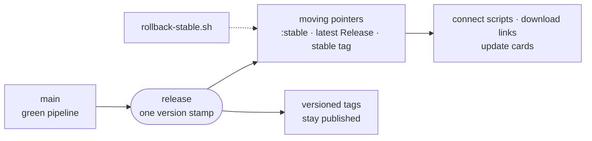

# Compatibility

Which versions of intentic's pieces must match each other, and what every release promises the installs already running.

## One release, one version

- `set-versions.sh` stamps the release version on every first-party package before anything builds; git keeps `0.0.0`. Every artifact of a release, from npm packages and binaries to installers and images, comes from one commit with one stamp, and `release-prepare.sh` refuses one stamped otherwise.
- Node and pnpm are pinned in `package.json` (`engines`, `packageManager`), and the `ci-base` image bakes the same pins.

## A green pipeline is the ship

There is one release lane. A release that passes the whole pipeline becomes what everyone gets in the same run: `release-images.sh` moves the sandbox's `stable` and `core-stable` tags and dind-host's `stable`, then `ship-stable.sh` moves the git `stable` tag and marks the GitHub Release as latest. Connect scripts, the deploy engine's image references, download links and every sandbox's update check follow those pointers as unpinned tags, never digests, so nothing else changes when a release ships.

Un-shipping is `rollback-stable.sh <version>`, which moves the same pointers back, the latest flag first. The bad release stays published under its version, so anything pinned to it keeps running.

## Across versions

Sandboxes update when their owner accepts the update card, so the hosted editor talks to daemons of several versions at once.

- The wire contract is [`@intentic/sandbox-contract`](_shared/sandbox-contract). Its `contract.lock.json` records every exported schema. Additions pass. A change that removes or narrows one is declared with a `type!:` subject or a `Breaking-Note:` trailer. The push reports a shrink with no such declaration in its range, without refusing it, and the package's lock test fails in CI on any commit whose lock no longer matches the schemas.
- A `Breaking-Note:` becomes the release's `## Breaking changes` section, and the update card turns into a warning that names what stops working before anyone takes the update.
- The daemon lists its routes and their shape fingerprints on the `/events` hello frame. The editor hides a feature an older daemon lacks instead of calling a route that is not there.
- A sandbox's front dials exactly one tunnel door on the edge (`INGRESS_TUNNEL_PATH` in the contract), with no fallback, and the edge lists the doors it serves on `/health` (`doors`). The edge goes first: no release, per-push `latest` or rollback moves a sandbox tag until the live edge lists the door that image's front dials ([`require-edge-door.sh`](_tools/scripts/image/require-edge-door.sh)). Fronts since the multiplexed tunnel dial `/tunnel/v2`, which an edge older than it answers with 404, while an edge still serves `/tunnel/v1` to older fronts. A self-hosted deployment rolls its own edge before its sandboxes update, and names that edge with `EDGE_HEALTH_URL` when it publishes images.
- Extensions declare `engines.intentic`, a semver range matched against `extensionApiVersion` in [`_shared/extension-api/src/version.ts`](_shared/extension-api/src/version.ts): a minor bump for an addition, a major one for a break.

## Stored data

Every file a sandbox keeps and reads back (everything under `.intentic/`, the daemon's files on `/history`, `conversations.db`) reads correctly after any update from any release since its horizon, however many releases the update skips. So do a `sandbox.toml` and an export bundle from those releases.

- Each stored document is declared once, beside its store (`defineDocument`, [`documents.ts`](_sandbox/sandbox/src/store/evolution/documents.ts)), with the conversions its shape has had. They run over the raw file on every read, before the schema, so old bytes that arrive by any door (an update, a bundle, a `git revert`, a history restore, a runner on another version) read as today's shape.
- Conversions are not written back at boot: a store's next save persists the converted shape. On the first boot after an update, the daemon moves documents that changed address and runs structural steps (a regroup, a database schema, an import) before any store opens ([`state-convergence.ts`](_sandbox/sandbox/src/store/evolution/state-convergence.ts)). A journal keeps every file's pre-image until that version has booted all the way. A version with other conversions finding the journal still open puts the pre-images back (an episode names its build's conversion digest), and `ic` rolls back an update whose journal never commits.
- `ic` runs the new image's plan over read-only mounts of the volumes before it swaps anything ([`state-plan.ts`](_sandbox/sandbox/src/state-plan.ts)). A conversion that would fail refuses the update, and a staged update's plan is on its card before anyone accepts it. The plan and the boot step read the same list of documents and steps, [`state-registry.ts`](_sandbox/sandbox/src/bootstrap/state-registry.ts), generated from the source; its test fails when a definition is missing from it.
- A hosted sandbox (a Fly machine the platform runs) is held to the same rule by the platform api, since there is no `ic` beside it ([`state-gate.ts`](_platform/api/src/sandbox/hosted/gate/state-gate.ts)). A Fly volume attaches to one machine, so the plan runs on that machine: its config is swapped for a probe (the new image and the same volume, with a sleep in place of the daemon), the planner runs through Fly's exec, and the machine stops again. A conversion that would fail puts the machine back on the version it had and tells the owner why. A new version that does not start is also put back, and the older build's boot restores any pre-images the new one had journaled. Every image change goes through this: a restart, a rebuild, and the wake that heals a stale tunnel. A resize, a move to another machine and a restore from the trash keep the digest the machine runs, so they convert nothing. A change that keeps the digest skips the probe. When there is no plan to be had (an image older than the planner, a probe that would not start, an unreadable answer), the change goes ahead as it did before the gate, the way `ic` treats a missing plan, and the rollback on a failed start is still there. Two cases it does not cover yet. A rebuild applied to a stopped machine boots on the next wake's plain start, which has no rollback. And the platform does not yet wait on `/health`'s journal the way `ic` does, so a new version that starts and then never commits its journal is not rolled back.
- A downgrade is a build older than the newest release that ran the workspace (`.intentic/local/newest-run.json`), decided by version alone, so an update that retires a document or a conversion is still an update.
- A write keeps what this version does not know: keys a newer version added, entries it cannot read. That holds for a single file, a directory of entry files, a list read one entry at a time (an entry whose conversion fails is kept as written, not the whole file), a conversation's record in `conversations.db`, and the conversion journal itself. After a newer version has run, a file this one cannot read is never set aside or written over, and what a version cannot read is reported rather than read as nothing.
- [`state-shapes.json`](_sandbox/sandbox/src/store/generated/state-shapes.json) freezes every shape each document has shipped in, by the release that first wrote it, seeded from every release's contract lock. The check after each land records a document's new shape as `unreleased`, a later one before the next release replaces it, and it is stamped with the release once a release tag holds it. Before every typecheck the daemon derives from it the checks that each released shape, after the document's conversions, fits what today's schema accepts and loses no key it held at any depth without a `drop` or a `rename` (a key a structural step moves elsewhere is declared on the document, `movedByStep`), and that no retired name is reused. A failure names the document and the property or the vanished key's path.
- What those checks cannot see is on the author: a key read a new way under the same name and type, a field a released shape recorded as `any` (a type JSON Schema could not spell, or one the contract lock of an old release recorded so), a refinement (a length, a pattern), and a stored file with no `defineDocument`.

The rules for a change to stored data:

- **It ships with its conversion.** A field that only grows (optional, or defaulted) needs none; the typecheck says when one is missing, within what it can see (above).
- **A change of meaning is a rename.** A key is never read a new way under the same name; `timeoutSec` becomes `timeoutMs`.
- **A retired name stays retired.** A dropped or renamed key is never reused, which the typecheck enforces from the history.
- **History is append-only.** A shipped conversion is never edited or removed. A deliberate support horizon (`horizon`) is the only way an old shape stops being converted, and its reader says what to do instead.

## Agent engines

[`engines.json`](engines.json) names the `blessed` version of each agent program. Sandboxes on the `blessed` channel read it from `main` every hour, so a new blessing reaches them without a release. `_tools/checks/engines-blessed.mjs` requires each blessed version to be one this repository's suite pins and runs, and `engines.yml` moves those pins daily through an auto-merging pull request. An owner can put an engine on `latest` or pin a version instead.

## What every update keeps

- The owner's files in `/work` and `/history` survive an update, a rollback and a failed update; `verify-update-survival.sh` drills all three nightly.
- An update that cannot come up healthy puts the previous sandbox back, and the files its conversions had changed with it.
- Only the surfaces above carry a promise. Workspace packages, including the published `@intentic/*` ones, change their APIs without shims.
