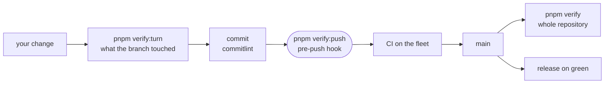

# Contributing

How to set up, build and test the intentic monorepo, and which gates a change passes between your editor and a release.

## Set up

1. Install Node and pnpm at the versions `package.json` pins (`engines`, `packageManager`). The Rust crates (`_sandbox/ic`, `_sandbox/front`, `_devices/win-launcher`, the desktop app's `src-tauri`) need cargo. The database, the sandbox image and the e2e tiers need Docker.
2. `pnpm install`. Its `prepare` script points git at `.githooks/`, which holds the commit-msg and pre-push hooks.
3. `pnpm build`, `pnpm test`, `pnpm typecheck` and `pnpm lint` cover the workspace; `pnpm --filter @intentic/<name> test` covers one package.
4. `pnpm dev` starts Postgres, the api, the web editor and the site. `pnpm build:sandbox` builds the sandbox image locally.

## The gates

| Command | What it measures | When it runs |
| --- | --- | --- |
| `pnpm verify:turn` | checks, lint, the assertion ratchet, typecheck and tests over what the branch changed since main | before you commit |
| `pnpm verify:push` | checks, the ratchet, manifest and lockfile lockstep, lint, rustfmt; replays a recorded typecheck, build and test verdict, or runs them with `--suite` | the pre-push hook |
| `pnpm verify` | the whole repository, the way CI's verify groups do | after a change lands on main |

`git push --no-verify` skips the hook when you mean to push a tree that does not pass. CI builds only branches in this repository: a pull request from a fork runs nothing until a maintainer reads it and pushes its branch here ([the fork boundary](docs/ops/ci-runner.md)).

## Commits

- Conventional Commits, checked by [`commitlint.config.ts`](commitlint.config.ts): `feat`, `fix`, `chore`, `docs`, `refactor`, `perf`, `test`, `build`, `ci`, `style` or `revert`. The subject may open with a code identifier but not in Title Case.
- A `Release-Note:` trailer is one line a user would notice; it becomes a bullet under the release's "What's new".
- A `!` after the type with a `Breaking-Note:` trailer declares a break. The push refuses a narrowed wire contract without one ([COMPATIBILITY.md](COMPATIBILITY.md)).
- A weakened test needs a `test!:` subject or a `Test-Note:` trailer saying why, or the push refuses it.
- The code rules (no legacy shims, one source of truth, what a comment may say) are in [AGENTS.md](AGENTS.md).

## Documentation

- A package's `README.md` changes in the same commit as the code that made it wrong.
- How the system fits together goes in `docs/architecture/`, runbooks for the machinery around the code in `docs/ops/`; [docs/README.md](docs/README.md) says where each kind of page belongs.
- User-facing documentation is the site's, under `_site/site/src/pages/docs/`.

Report a vulnerability privately, as [SECURITY.md](SECURITY.md) describes, never in an issue. Contributions are under the [MIT licence](LICENSE).
