<div align="center">


### Workstation for your agents. A window for you.

Each agent gets its own sandbox and git worktree on hardware **you** own — and keeps running when you look away.<br>
Run ten in parallel, reopen from any device, read every diff before it lands. Free.

<p>
  <a href="https://github.com/intentic/intentic/actions/workflows/ci.yml"></a>
  <a href="https://github.com/intentic/intentic/releases/latest"></a>
  <a href="https://www.npmjs.com/org/intentic"></a>
  <a href="LICENSE"></a>
  <br>
  <a href="https://scorecard.dev/viewer/?uri=github.com/intentic/intentic"></a>
  <a href="https://github.com/intentic/intentic/actions/workflows/codeql.yml"></a>
  <a href="SECURITY.md#verifying-a-download"></a>
  <br>
  
  
  
  <a href="CONTRIBUTING.md"></a>
</p>

**[Website](https://intentic.dev)** &nbsp;·&nbsp; **[Live demo](https://intentic.dev/demo/)** &nbsp;·&nbsp; **[Docs](https://intentic.dev/docs)** &nbsp;·&nbsp; **[Extensions](https://intentic.dev/extensions)** &nbsp;·&nbsp; **[Architecture](ARCHITECTURE.md)** &nbsp;·&nbsp; **[Contributing](CONTRIBUTING.md)**

<br>

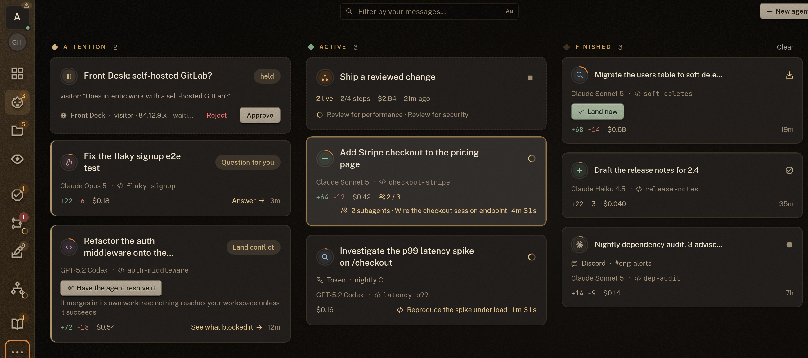

</div>

<br>

## What this is

intentic is a **persistent workstation for your agents** — it runs on hardware you own, and every browser is
a window onto it. What lives there are **specialized agents** — autonomous employees, each with a sandbox of
its own: dev-tools really installed, wired to the systems it operates, context curated for one job. The runs
live on your machine, not in a tab: close the laptop and they keep going; reopen from any browser — or your
phone — onto the same fleet. Works with **Claude Code, Codex, Grok, Kimi Code and Gemini**, on your own
subscription.

## Quick start

Nothing to install locally — you need a machine that stays on and a browser.

1. **Sign in with Google** at **[app.intentic.dev](https://app.intentic.dev)** and name a sandbox.
2. **Paste the one command it gives you** on the machine that should host it (laptop, workstation, VPS).
   It starts the sandbox daemon and an outbound-only Cloudflare tunnel — no ports to open, no inbound firewall rule.
3. **The workspace opens** the moment the daemon reports in. Specialize the agent, give it work, review what it does.

```sh
# what step 2 looks like — the exact line, with your sandbox's pairing details, comes from the app
curl -fsSL https://intentic.dev/sync | sh
```

> Prefer to look before you sign in? The **[live demo](https://intentic.dev/demo/)** is the real workspace
> running against fixtures, in your browser.

## Co-piloted, not fire-and-forget

An autonomous agent still needs a human in the loop. AI has to have its context configured, its work
supervised, and its riskier calls approved — so every agent in intentic is **co-piloted**. That is what the
workspace is *for*: the IDE surfaces (file tree, Monaco editor, diff review, terminals) and the observability
surfaces (a fleet board of every run, plan mode by default, per-edit permission modes, a changes-review panel,
full transcripts) exist so you can configure an agent, watch it work, drive it when you want, and approve what
lands. Autonomy with the wheel in your hands.

## What you get

### Walk away — the runs don't stop

The agents live on your machine, not in the tab. Terminals survive disconnects, turns finish without you,
and any browser — or your phone — reopens onto the same fleet, sorted by who needs you.

|  |  |
| :---: | :---: |
| 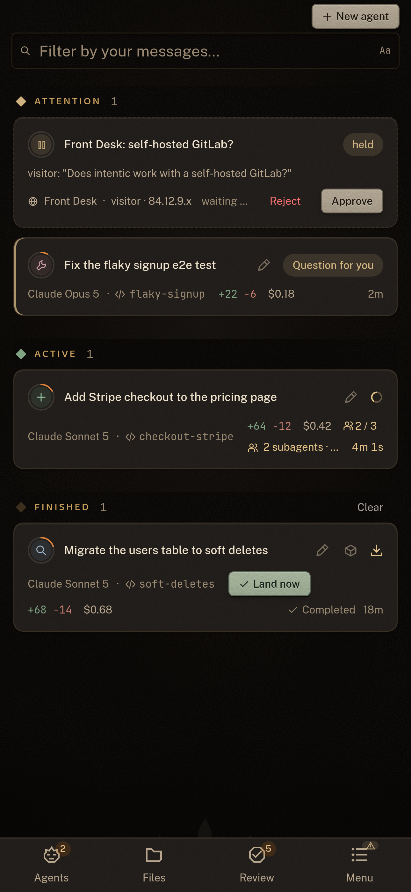 | 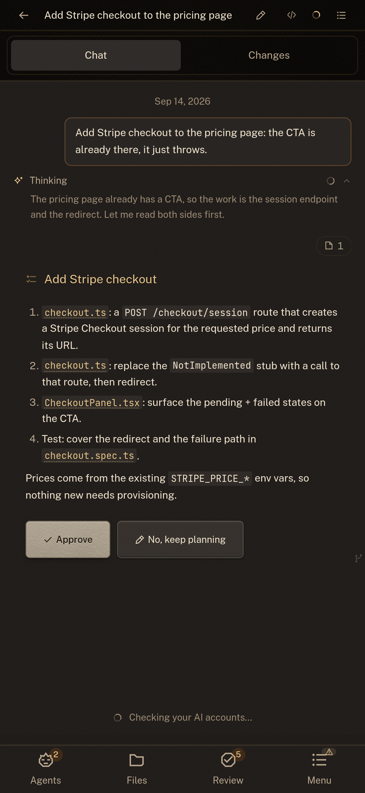 |
| **The whole fleet, on a phone** | **Drive a run from anywhere** |

### A real workspace, not a chat box

A file tree, a Monaco editor, terminals that survive reconnects, live preview panels, and workspace search.

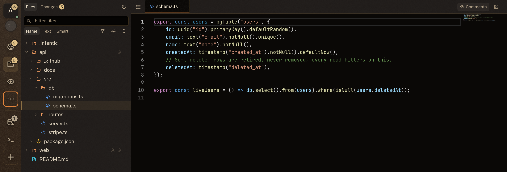

### Plan-and-review by default

Agents propose before they act. Every change is a diff you land or discard, per file and per hunk — and
environment changes need your explicit approval before anything rebuilds.

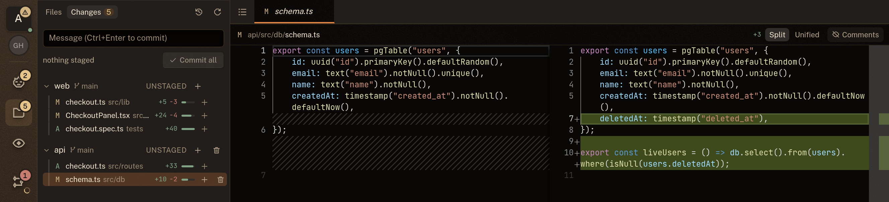

### Specialize the environment, not just the prompt

The sandbox image is an overlay you can read and edit — the agent proposes toolchain changes as a Dockerfile
diff, you approve or reject, and a rebuild applies the result.

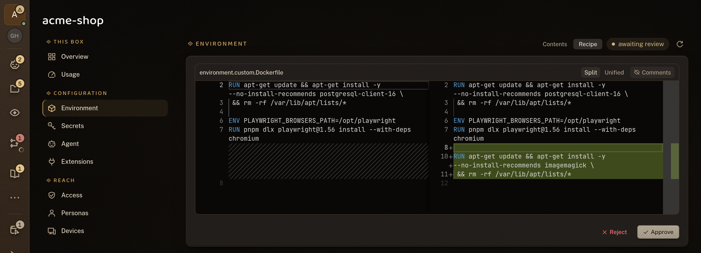

### Capabilities

Wire an agent into GitHub, databases, Sentry, Stripe, SSH hosts, Discord, MCP servers and Claude plugins — a
click each. Credentials are stored **inside the sandbox** and injected per turn, never written to disk in the
workspace and never shown in the file tree.

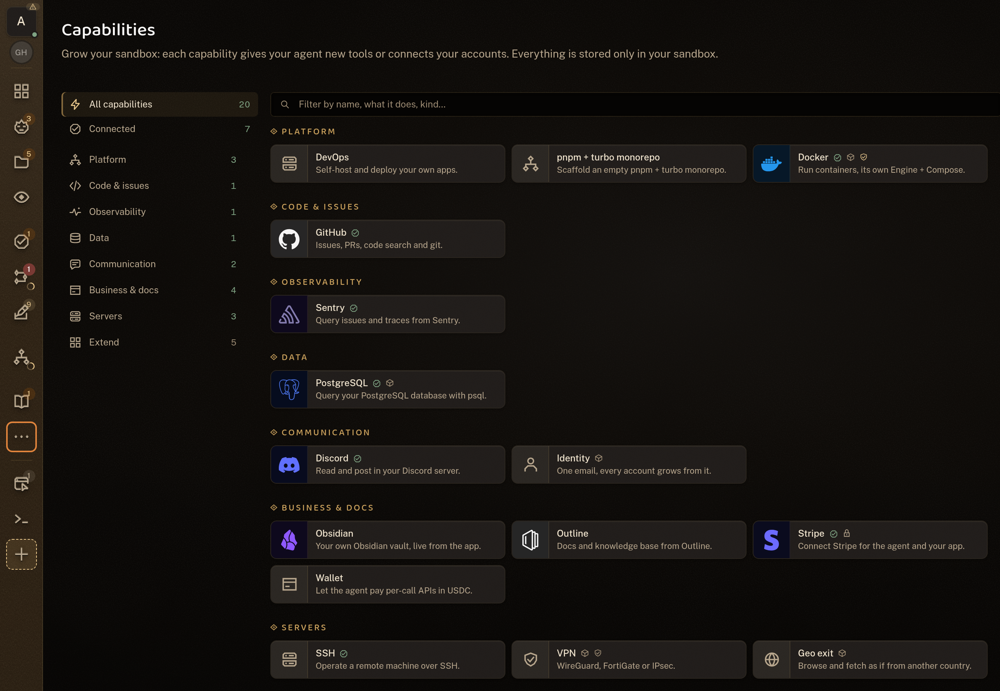

### And the rest

- **A fleet of specialized agents** — each in its own sandbox on a machine you own, reached from your browser
  over a private Cloudflare tunnel. One agent per role, and as many as you care to run.
- **Automations** — wake an agent on a schedule, a webhook, or a live event (a push, an alert, a payment, an
  email), each run leaving a transcript.
- **Ownership by construction** — code and credentials never leave your machine. The platform stores your
  identity, the sandbox's URL and the secrets that pair the two, and sits off the command path.
- **Your subscriptions, your hardware, free** — each agent runs on your own Claude, ChatGPT or SuperGrok plan.
  intentic charges nothing and never meters your model usage.

<details>
<summary><b>More screenshots</b> — plan mode, spend, automations</summary>
<br>

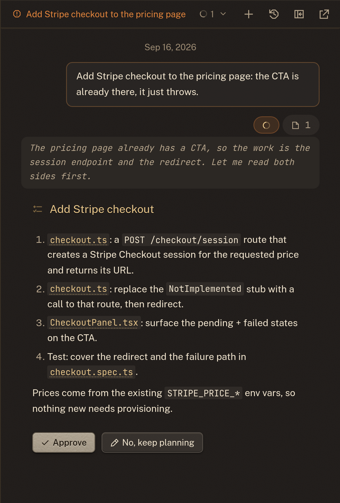

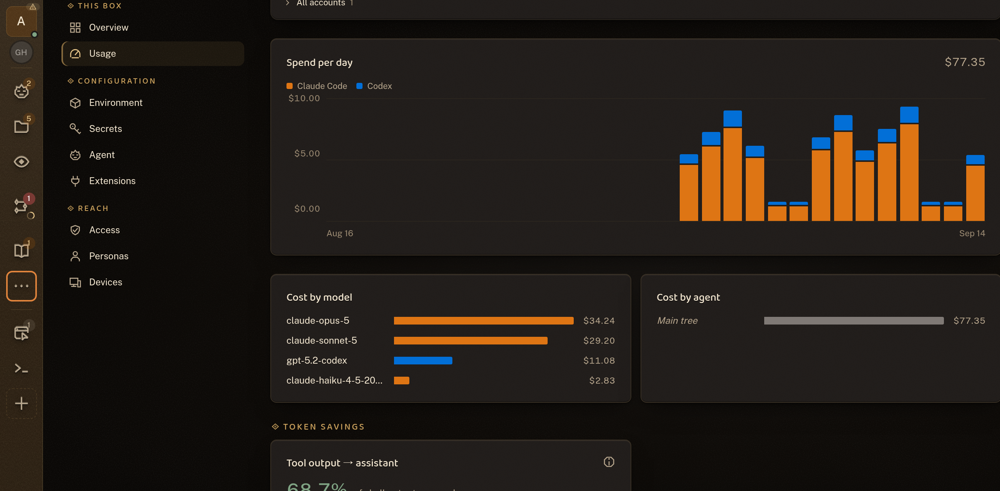

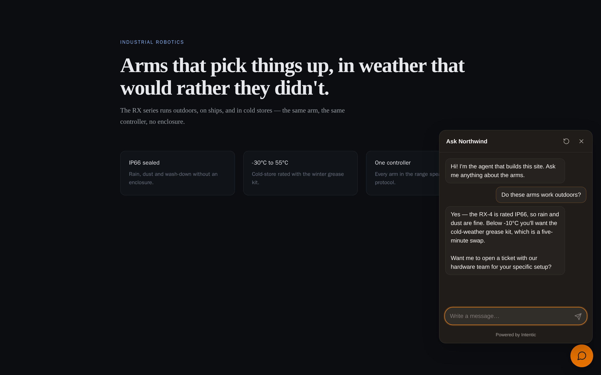

</details>

## How it fits together

Two tiers at runtime. The platform knows **who you are** and **where your sandbox is** — and nothing else. Every
command, file and keystroke goes from your browser straight to your own machine.

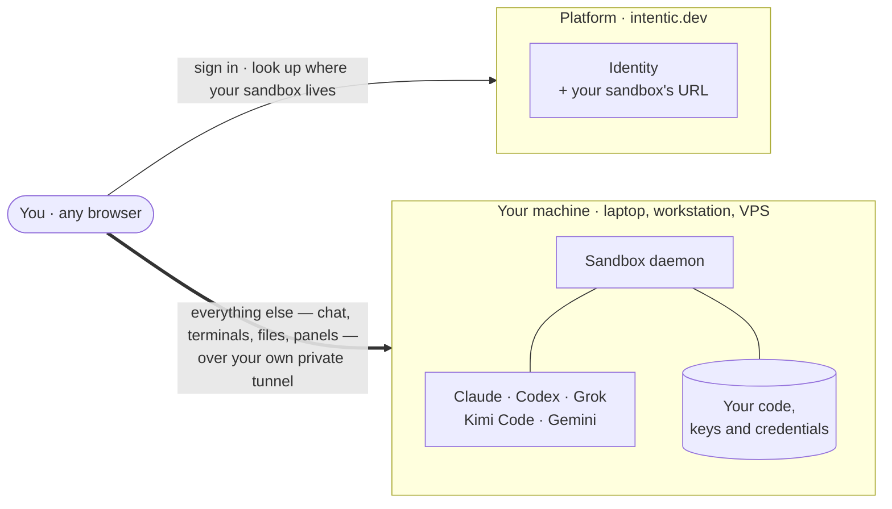

A platform breach can read the stored URL, but **cannot drive any sandbox**: the browser proves itself to the
daemon directly, with a credential the platform never holds and cannot forge.

The product is three parts, all in this monorepo — a thin **platform** (identity + the sandbox's URL), the
per-user **sandbox** daemon (where the agent and your code actually live), and the browser **workspace**.
[ARCHITECTURE.md](ARCHITECTURE.md) covers the split, the ownership and trust model, the extension system, the
agent-facing tooling (iq/lsp) and the bundled deployment engine.

For the shorter, picture-led version — the components, the vocabulary, and what to read first — read
**[docs/architecture/repo.md](docs/architecture/repo.md)**, or open the **Documentation** tile in the app. It
renders that map and every package's README as one browsable set, draws each package's size and neighbours from
the live package graph, and flags any page whose code has moved on since it was written.

## Develop locally

> Requires **Node 24** and **pnpm 11**.

A single `.env` at the repo root drives the platform (only the api reads it; web/site bake their dev config
into `src`). Copy the template and fill in Google credentials — everything else degrades with a startup warning:

```sh
pnpm install
cp .env.example .env      # set GOOGLE_CLIENT_ID / GOOGLE_CLIENT_SECRET (each var is documented in .env.example)
pnpm db:up                # Postgres on :5440 (docker-compose.yml) + prisma migrate
pnpm dev                  # turbo: api on https://localhost:6480, web on https://localhost:47145
```

Dev serves over HTTPS via the committed `@intentic-app/localhost-https` cert (Google FedCM One Tap refuses
`http://localhost`).

**Sandbox daemon (optional).** To run the daemon outside its container, add its creds to the same root `.env` —
see the `# Sandbox daemon` section of `.env.example` (`ANTHROPIC_API_KEY`, `CLOUDFLARE_API_TOKEN`, … all
optional) — then `pnpm --filter @intentic/sandbox dev`.

## Working in this repo (for agents)

- **Read [AGENTS.md](AGENTS.md) first** — it holds the hard editing rules (no legacy/compat shims, no
  re-exports or aliases, let errors propagate, prefer `undefined`, early returns).
- **Edit `src/` directly.** Workspace packages expose an `@intentic/src` export condition, so cross-package
  imports resolve to source — no build step is needed between editing a lib and running a dependent test.
- **Tests are co-located:** `*.test.ts` (unit), `*.integration.test.ts` (temp trees, subprocesses, real git — a
  60s budget instead of the 5s hang detector), and gated `*.e2e.test.ts` (real infra, opt-in). Run `pnpm test`
  (Turbo) or per-package `vitest`.
- **`pnpm verify` is the gate — run it before you finish, including from an agent worktree.** It is
  `pnpm typecheck` and then `pnpm test`, across every package in the workspace. Both emit every dependency's
  dist with `tsgo -b` first (`_tools/scripts/prepass.mjs`), so neither needs `pnpm build`, which cannot run
  under worktree isolation. It is also what CI decides main's health on, so a green run here is a green run
  there.
- **Tests are type-checked too, by `pnpm typecheck`, not by `pnpm build`.** A package that emits to `dist`
  excludes `*.test.ts` from its build config and re-includes it in `tsconfig.test.json`; a package that only
  type-checks uses one config for both. Adding a package with tests and no `typecheck` script fails the same
  script's coverage guard. The testing conventions this protects are in [AGENTS.md](AGENTS.md).
- **Each package is documented by its own README** — responsibilities, key files, gotchas. Start there when
  working inside one, and update it in the same commit as a change that dates it. That rule is the whole of how
  these stay true; [AGENTS.md](AGENTS.md#documentation) has the details, including the two parts of the page a
  tool parses.

## Bundled deployment engine (a tool, not the product)

This monorepo also contains a standalone **deployment engine** — a declarative, reconciling infrastructure tool
driven by the `intentic deploy` command group (`init` · `resolve` · `plan` · `apply` · `destroy` · `adopt` ·
`restore` · …). It turns `i.have` / `i.want` intent into real self-hosted infrastructure on hosts you own.

It is **not part of the intentic product.** It is one of the many tools a specialized agent can reach for — no
more a "feature" than `psql` or `docker` — and it lives in this repo only for convenience. Its walkthrough,
capabilities and known limits are documented separately in **[docs/deploy-engine.md](docs/deploy-engine.md)**.

## Releases

**One repository — [github.com/intentic/intentic](https://github.com/intentic/intentic) — and nothing is
exported anywhere else.** A release is a tag on the commit CI already built, and two things hang off it:

- **[GitHub Releases](https://github.com/intentic/intentic/releases)** — `_tools/scripts/publish-github.sh`,
  semantic-release's `publishCmd`, runs once the `v<version>` tag is on the remote and attaches the desktop
  installers and machine-agent binaries. That Release is the anonymous download channel behind
  `curl https://intentic.dev/sync | sh`.
- **[npm `@intentic/*`](https://www.npmjs.com/org/intentic)** — `.github/workflows/npm-publish.yml`, triggered
  by that tag, builds the closure and publishes all 23 packages **with provenance** over npm's OIDC trusted
  publishing. There is no npm token in this repo's CI at all.

## Contributing

Issues and pull requests are welcome — start with **[CONTRIBUTING.md](CONTRIBUTING.md)** for the workflow and
**[AGENTS.md](AGENTS.md)** for the editing rules the codebase actually enforces. Found a security problem?
**[SECURITY.md](SECURITY.md)** tells you how to report it privately.

## License

[MIT](LICENSE) — sandbox, CLI, workspace and platform alike, so you can verify every claim on this page.

<div align="center">
<br>
<sub>Built by <a href="https://github.com/radarsu">Artur Kurowski</a> · <a href="https://intentic.dev">intentic.dev</a></sub>
</div>
