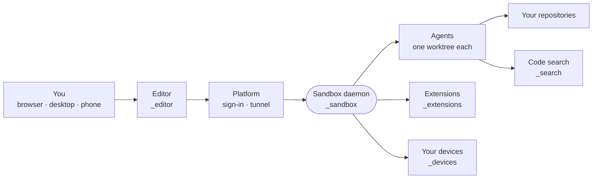

# intentic

An open-source workspace for coding agents, running on your own machine.

  
  
  

**[Live demo](https://intentic.dev/demo/)** · **[Create a workspace](https://app.intentic.dev)** · **[Download](https://intentic.dev/download)** · [Docs](https://intentic.dev/docs) · [Discord](https://discord.gg/3veuzYp32T)

<a href="https://intentic.dev/demo/">
  <picture>
    <source media="(prefers-color-scheme: dark)" srcset="_site/site/src/assets/product/fleet-board.png">
    
  </picture>
</a>

## What it does

- **Parallel agents.** Every task runs in its own git worktree and branch, so agents never step on each other.
- **Review before it lands.** Chat, files, terminals and diffs sit in one workspace. Work stays on its branch until you land it.
- **Keeps running.** The sandbox lives on a machine you control. Close the browser and reopen from any device, phone included.
- **Your subscriptions.** Bring Claude Code, Codex, Cursor, Gemini, Grok, Kimi or any ACP agent. intentic is free and MIT-licensed.
- **Extensible.** Connectors, MCP servers, automations and extensions give agents the tools a task needs.

## How it fits together

## Get started

1. **[Sign in](https://app.intentic.dev)** and create a workspace, or try the **[demo](https://intentic.dev/demo/)** first.
2. **Connect a machine.** Run the setup command the app shows on the laptop, desktop or server that will host your sandbox. The tunnel is outbound, so no ports need opening.
3. **Connect an AI account** and give an agent a task.

The [quickstart](https://intentic.dev/docs/quickstart/) covers servers and the desktop app.

## Repository

| Area | What lives there |
| --- | --- |
| [_editor](_editor) | The web app you look at, plus desktop and mobile shells and the UI kit |
| [_sandbox](_sandbox) | The daemon that owns a project's box, and the CLIs agents use inside it |
| [_platform](_platform) | The hosted plane: sign-in, sandbox registry, tunnels, database |
| [_extensions](_extensions) | Bundled extensions: agents, connectors, automations, viewers |
| [_shared](_shared) | Contracts and SDKs more than one part is written against |
| [_search](_search) | `iq` and `lsp`: how agents find code |
| [_devices](_devices) | What runs on your own machines: device agent, browser extension |
| [_deploy](_deploy) | The deployment tool: intent to running servers |
| [_site](_site) | intentic.dev and the interactive demo |
| [_tools](_tools) | Shared config, checks, test harnesses, maintainer scripts |

Start with [ARCHITECTURE.md](ARCHITECTURE.md) for how the parts connect, and [CONTRIBUTING.md](CONTRIBUTING.md) to build and test.

## License

[MIT](LICENSE). Security reports: [SECURITY.md](SECURITY.md).
