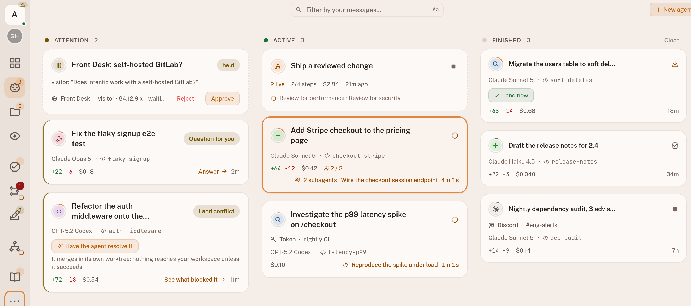
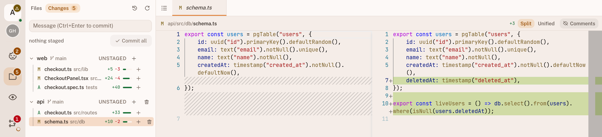
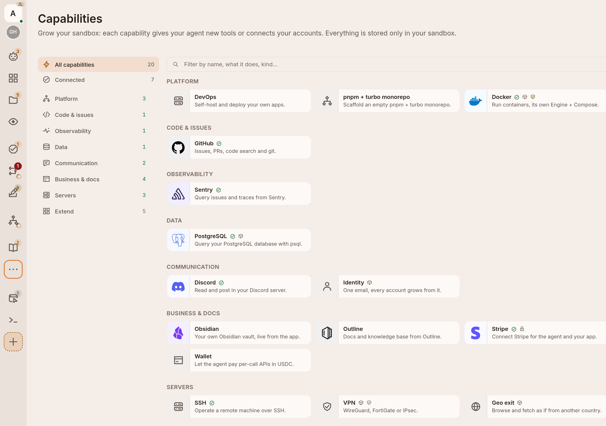
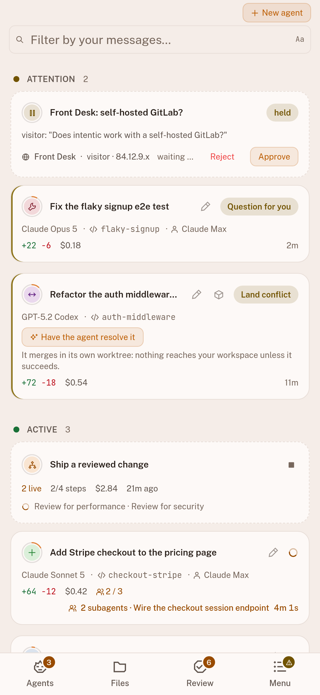
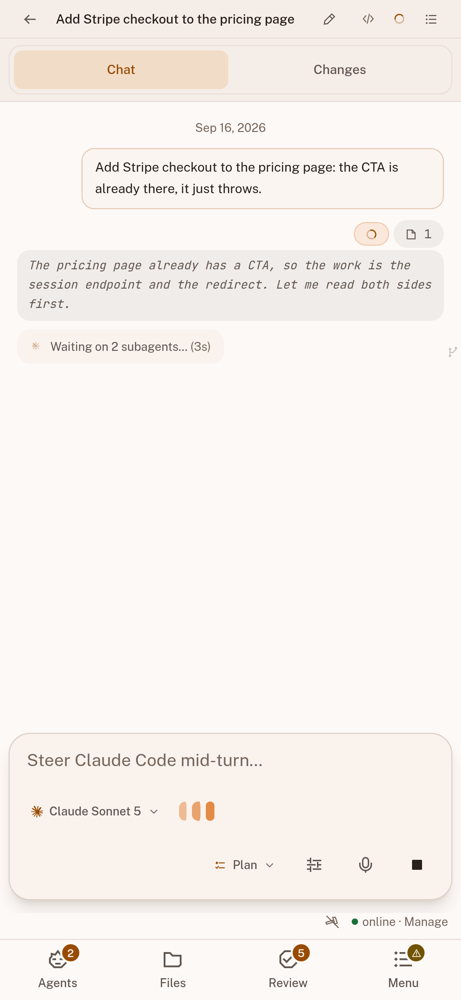
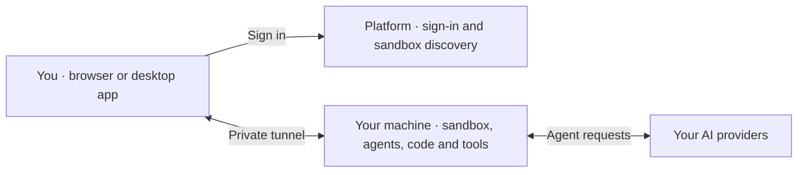

<div align="center">

<a href="https://intentic.dev"></a>

# intentic

An open-source workspace for coding agents, running on your own machine.

### You delegate. Agents work. You approve.

Run agents in parallel, each in its own git worktree.<br>
Close the browser. Come back from any device. Review the work before it lands.

<p>
  <a href="https://github.com/intentic/intentic/actions/workflows/ci.yml"></a>
  <a href="https://github.com/intentic/intentic/releases/latest"></a>
  <a href="LICENSE"></a>
</p>

**[Try the live demo](https://intentic.dev/demo/)** · **[Create your workspace](https://app.intentic.dev)** · **[Download the app](https://intentic.dev/download)**

[Website](https://intentic.dev) · [Docs](https://intentic.dev/docs) · [Extensions](https://intentic.dev/extensions) · [Discord](https://discord.gg/3veuzYp32T)

<br>

<a href="https://intentic.dev/demo/">
  <picture>
    <source media="(prefers-color-scheme: dark)" srcset="_site/site/src/assets/product/fleet-board.png">
    
  </picture>
</a>

<sub>The agent board · Real app, demo data · Click to explore</sub>

</div>

## Your agents, one workspace

intentic brings agent conversations, code, terminals and diff review into one place. The agents run in a
persistent sandbox on a machine you control. Each run gets its own branch and worktree, so parallel tasks
stay separate until you review and land them.

Use your own **Claude Code, Codex, Cursor, Grok, Kimi Code or Gemini** accounts. intentic is **free and
MIT-licensed**; your AI subscriptions and host machine are yours to provide.

| What you need | What intentic gives you |
| :--- | :--- |
| Run several tasks at once | A board that puts questions and approvals first, with progress and spend per run. |
| Check what an agent changed | A file tree, editor, terminals and diffs, with controls to land or discard work. |
| Keep work running | Persistent sessions you can reopen from another browser or your phone while the host stays on. |
| Give agents the right tools | Sandbox environments, integrations, MCP servers and extensions. |
| Hand off recurring work | Automations triggered by schedules, webhooks and events, with a transcript for each run. |

## Get started

**[Explore the demo](https://intentic.dev/demo/)** to try the workspace without signing in.
To run your own:

1. **[Sign in with Google](https://app.intentic.dev)** and create a workspace.
2. **Connect your machine.** Follow the app's setup command on the desktop, laptop or server that will host
   your sandbox. The outbound tunnel needs no inbound ports opened.
3. **Connect an AI account and give an agent a task.** Follow its progress, answer questions and review the diff.

Prefer a desktop app? **[Download intentic](https://intentic.dev/download)** to walk through setup.
For a server, see the **[setup guide](https://intentic.dev/docs/quickstart/)**.

> Agents keep working when you close the browser. The machine hosting the sandbox must stay awake and connected.

## Review the work where it happens

Read the plan, follow the conversation and inspect the changed files in the same workspace. Finished work
stays on its branch until you choose to land it. Permission controls let you decide when an agent must ask.

<picture>
  <source media="(prefers-color-scheme: dark)" srcset="_site/site/src/assets/product/workspace-changes.png">
  
</picture>

<details>
<summary><b>More of the workspace: integrations and mobile</b></summary>

### Connect the systems your agents work with

Connect GitHub, databases, observability tools, communication services or your own MCP server.
Manage the agent's tools and environment from the sandbox settings.

<picture>
  <source media="(prefers-color-scheme: dark)" srcset="_site/site/src/assets/product/capabilities.png">
  
</picture>

### Pick up from your phone

Reopen the same fleet and conversation from another device.

<p align="center">
  <picture>
    <source media="(prefers-color-scheme: dark)" srcset="_site/site/src/assets/product/mobile-fleet.png">
    
  </picture>
  <picture>
    <source media="(prefers-color-scheme: dark)" srcset="_site/site/src/assets/product/mobile-chat.png">
    
  </picture>
</p>

</details>

## Where your code runs

The sandbox hosts your repositories, tools and agent sessions. The platform handles sign-in and locates
your sandbox; your browser connects to the sandbox for the actual work. Agents send context to the AI
providers you connect. The optional free trial uses intentic's keys and routes trial messages through intentic.



Read the **[architecture](ARCHITECTURE.md)** for the runtime and trust boundaries, or the
**[repository map](docs/architecture/repo.md)** to find your way through the code.

## Develop locally

> Requires **Node 24** and **pnpm 12**: `engines` names `24.21.0` and `12.4.1`, the pair CI runs. Another
> Node 24 patch is fine; a pnpm below 12.3.0 is not, and `packageManager` makes corepack fetch the right one.
>
> **On Windows, put `openssl` on PATH first.** `pnpm install` mints this machine's development certificate
> with it and fails without it. Git for Windows already ships one in `C:\Program Files\Git\usr\bin`: add that
> directory to PATH, or run the install from Git Bash. macOS and every Linux dev image here have it already.

A single `.env` at the repo root drives the platform (only the api reads it; web/site bake their dev config
into `src`). Copy the template and fill in Google credentials: everything else degrades with a startup warning:

```sh
pnpm install
pnpm cert:trust           # once per machine — approves this machine's dev root, so the browser shows a lock
cp .env.example .env      # set GOOGLE_CLIENT_ID / GOOGLE_CLIENT_SECRET (each var is documented in .env.example)
pnpm db:up                # Postgres on :5440 (docker-compose.yml) + prisma migrate
pnpm dev                  # turbo: api on https://localhost:6480, web on https://localhost:47145
```

Dev serves over HTTPS via `@intentic/localhost-https` (Google FedCM One Tap refuses `http://localhost`).
`pnpm install` mints a root and a certificate into your own data directory, outside every checkout;
`pnpm cert:trust` is what puts that root in your trust store, and you run it once per machine rather than once
per clone. Skip it and everything still works behind a browser warning. Run both on the machine whose browser
you use: inside a container they produce a perfectly good pair that your desktop browser never sees. See
[_tools/localhost-https](_tools/localhost-https/README.md).

**Sandbox daemon (optional).** To run the daemon outside its container, add its creds to the same root `.env`:
see the `# Sandbox daemon` section of `.env.example` (`ANTHROPIC_API_KEY`, `CLOUDFLARE_API_TOKEN`, … all
optional): then `pnpm --filter @intentic/sandbox dev`.

## Build with us

- **Contribute:** [CONTRIBUTING.md](CONTRIBUTING.md) covers the workflow; [AGENTS.md](AGENTS.md) holds the editing rules.
- **Report a bug:** [open an issue](https://github.com/intentic/intentic/issues). Report vulnerabilities privately through [SECURITY.md](SECURITY.md).
- **Build an extension:** start with the [extension guide](https://intentic.dev/developers/) and [example package](_tools/extension-example/README.md).
- **Explore the tools:** the repo also includes [workspace search](_search/README.md) and a [standalone deployment engine](docs/design/deploy-engine.md).

## Releases and license

Get desktop installers and machine-agent binaries from **[GitHub Releases](https://github.com/intentic/intentic/releases)**.
Published packages live under **[npm @intentic](https://www.npmjs.com/org/intentic)**.
See **[download verification](SECURITY.md#verifying-a-download)** for release attestations.

The sandbox, CLI, workspace and platform are all **[MIT-licensed](LICENSE)**.

<div align="center">
<br>
<sub>Built by <a href="https://github.com/radarsu">Artur Kurowski</a> · <a href="https://intentic.dev">intentic.dev</a></sub>
</div>
