<div align="center">

<a href="https://intentic.dev"></a>

<h1>intentic</h1>

<p><b>An open-source workspace for coding agents, running on your own machine.</b><br>
Run Claude Code, Codex, Cursor and Gemini side by side, each on its own git worktree.<br>
They keep working when you close the browser. Nothing lands until you read the diff.</p>

<p><i>More work. Less AI waste. Same subscriptions.</i></p>

<p>
  <a href="https://github.com/intentic/intentic/releases/latest"></a>
  <a href="LICENSE"></a>
  <a href="#get-started"></a>
  <a href="https://discord.gg/3veuzYp32T"></a>
</p>

<h3><a href="https://intentic.dev/demo/">Try the live demo</a> · <a href="https://intentic.dev/download">Download</a> · <a href="https://app.intentic.dev">Create a workspace</a></h3>

<a href="https://intentic.dev/demo/">
  <picture>
    <source media="(prefers-color-scheme: dark)" srcset="docs/marketing/readme/hero-dark.jpg">
    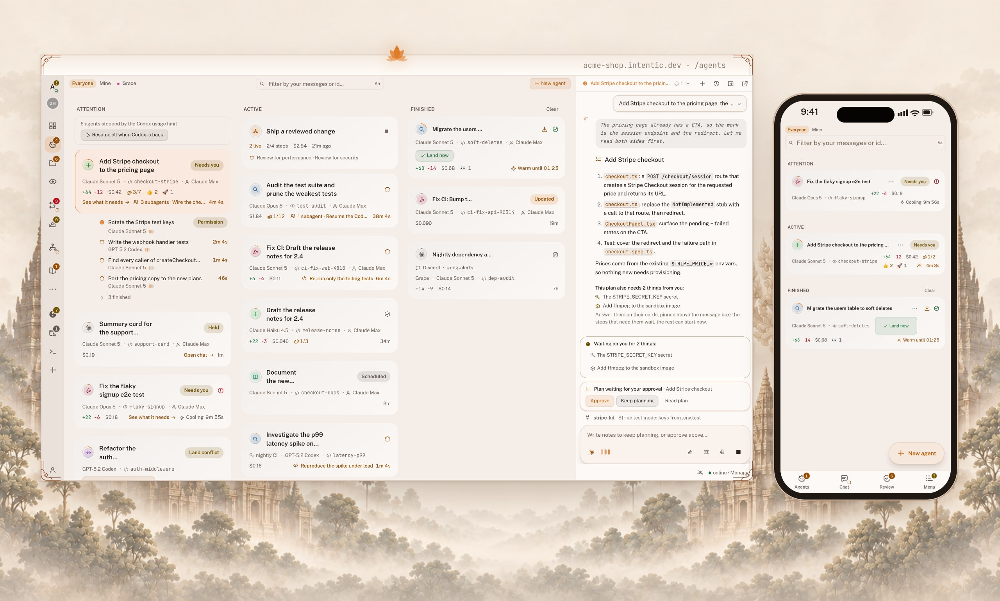
  </picture>
</a>

<sub><a href="https://intentic.dev/docs">Docs</a> · <a href="https://intentic.dev/features/run/">Features</a> · <a href="https://intentic.dev/compare/">Compare</a> · <a href="https://intentic.dev/changelog/">Changelog</a> · <a href="https://discord.gg/3veuzYp32T">Discord</a></sub>

</div>

## How it works

You hand out tasks, agents plan and work in parallel, and you review the result. All of it runs in a sandbox on a machine you control.

<picture>
  <source media="(prefers-color-scheme: dark)" srcset="docs/marketing/readme/flow-dark.png">
  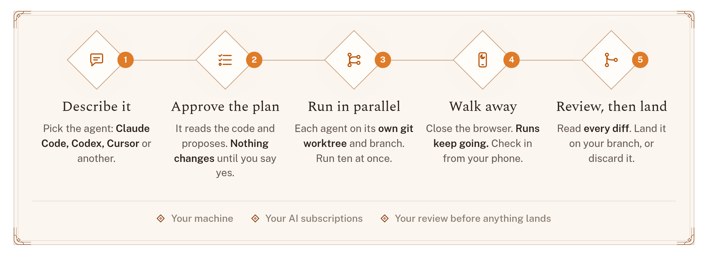
</picture>

## Get started

1. **[Sign in](https://app.intentic.dev)** with Google. No card, no forms.
2. **Paste one command** on the laptop, desktop or server that will host your sandbox. The setup page shows it with your code filled in, and the command offers to install Docker if it is missing.

   ```sh
   curl -fsSL https://intentic.dev/connect | sh -s -- <SETUP_CODE>
   ```

   On Windows, use PowerShell or the [desktop app](https://intentic.dev/download) for Windows and Linux. The tunnel dials out, so no ports need opening.
3. **Connect an AI account** and give an agent its first task.

To try it before installing anything, open the **[live demo](https://intentic.dev/demo/)**: the real app on a recorded workspace. The [quickstart](https://intentic.dev/docs/quickstart/) covers the desktop app, Docker Compose and scripted installs.

## Features

### Run a fleet of coding agents in parallel

One board shows every agent, sorted by who needs you. Each card shows the model, the branch, the diff size and the cost. Every agent works on its own git worktree, so ten agents never edit the same checkout.

<picture>
  <source media="(prefers-color-scheme: dark)" srcset="docs/marketing/readme/board-dark.png">
  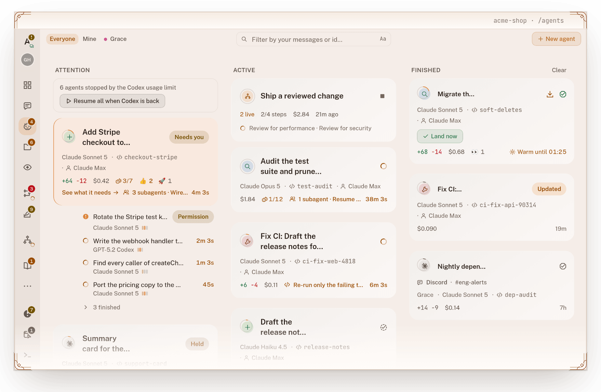
</picture>

### Approve the plan before any code changes

Agents read the code, write a plan and wait. Approve it, or reply to keep planning. Permission modes range from plan-only to fully automatic, per turn.

<picture>
  <source media="(prefers-color-scheme: dark)" srcset="docs/marketing/readme/plan-dark.png">
  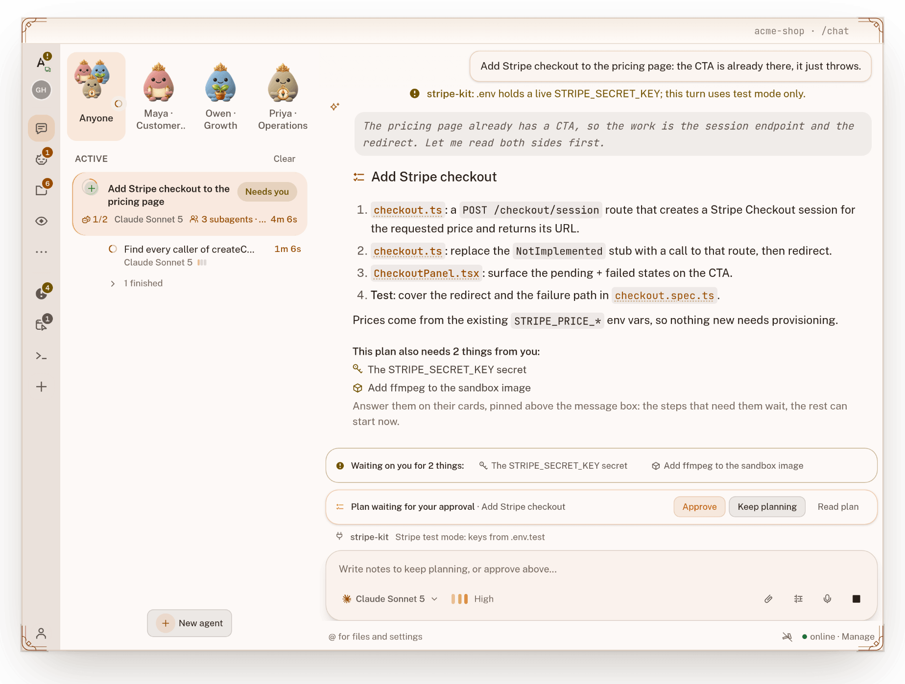
</picture>

### Read every diff before it lands

Finished work waits on its branch with the agent's own report. Read it file by file, then land it or discard it.

<picture>
  <source media="(prefers-color-scheme: dark)" srcset="docs/marketing/readme/review-dark.png">
  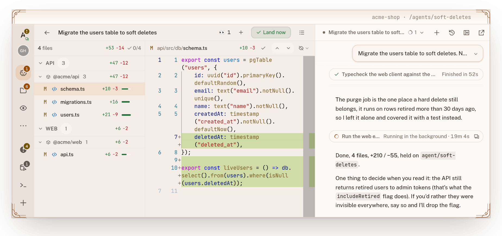
</picture>

### Close the browser. The agents keep going.

The sandbox is a daemon on your machine, not a browser tab. Terminals stay open and turns finish without you. Any browser reopens the same board, phone included.

<picture>
  <source media="(prefers-color-scheme: dark)" srcset="docs/marketing/readme/phones-dark.png">
  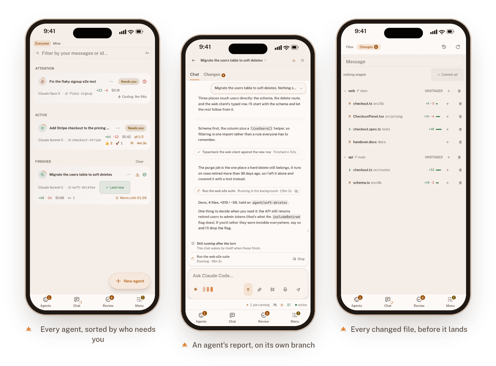
</picture>

### Bring the AI plans you already pay for

Agents run on your own Claude, ChatGPT, Cursor, Google, Grok, Kimi or Z.ai account, or on a local model. intentic never meters tokens or adds a markup. Connect several accounts and see every plan's limits in one place.

<picture>
  <source media="(prefers-color-scheme: dark)" srcset="docs/marketing/readme/providers-dark.png">
  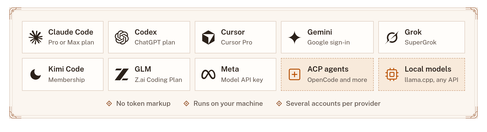
</picture>

<picture>
  <source media="(prefers-color-scheme: dark)" srcset="docs/marketing/readme/usage-dark.png">
  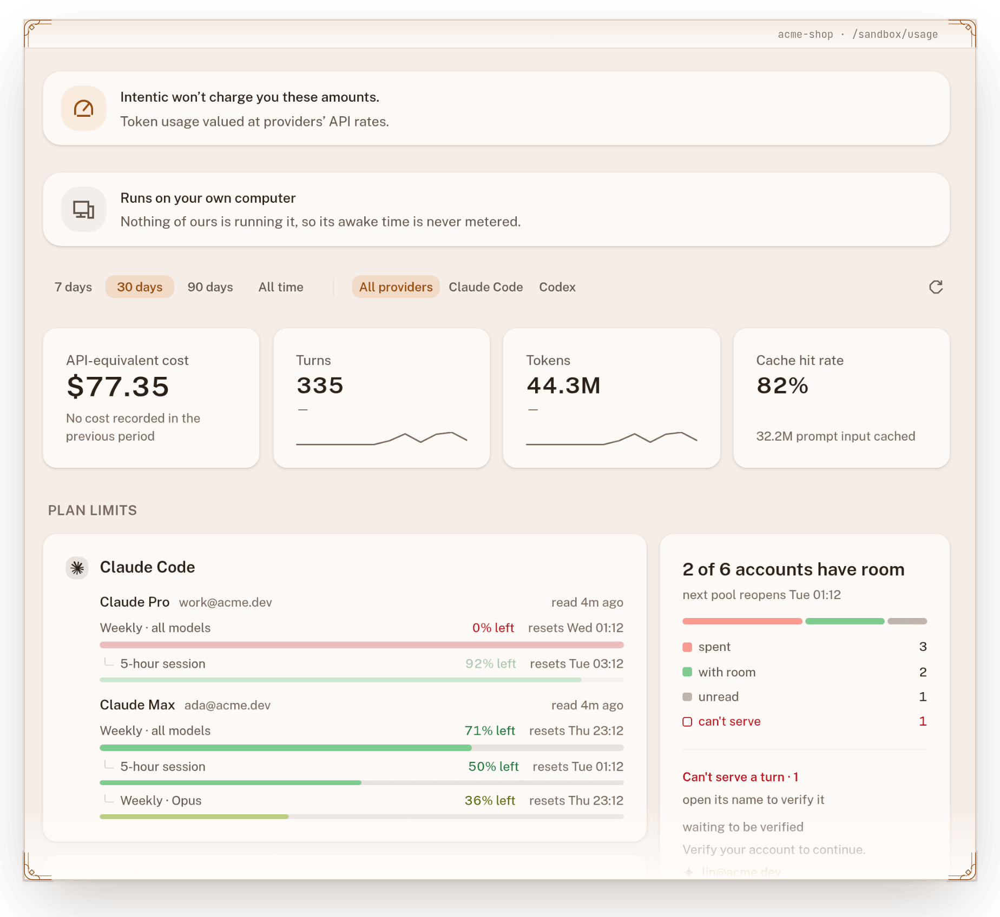
</picture>

### Wire agents into your stack

Connect GitHub, PostgreSQL, Sentry, Stripe, Discord, SSH, a VPN or any MCP server. Each card shows what a connection adds before you save it. Credentials stay inside your sandbox.

<picture>
  <source media="(prefers-color-scheme: dark)" srcset="docs/marketing/readme/capabilities-dark.png">
  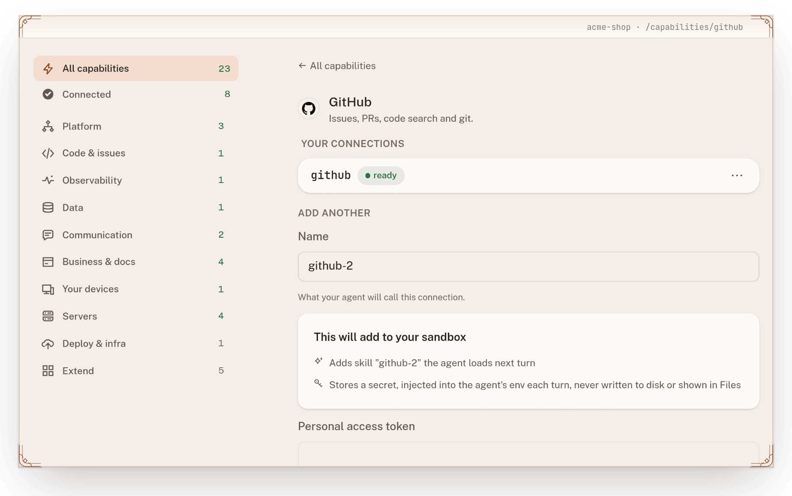
</picture>

### Start agents on events

Wake an agent on a schedule, a push, a failed pipeline, a Sentry alert, a payment, an email or a Discord message. An optional check command decides whether each run starts. Every run shows up on your board.

<picture>
  <source media="(prefers-color-scheme: dark)" srcset="docs/marketing/readme/automations-dark.png">
  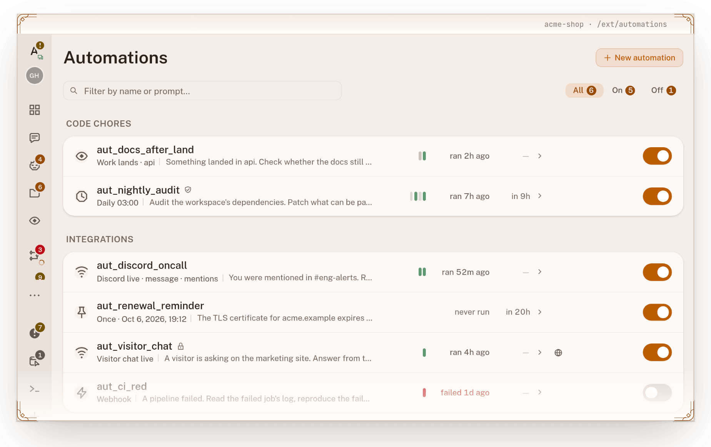
</picture>

## Where it runs

<picture>
  <source media="(prefers-color-scheme: dark)" srcset="docs/marketing/readme/architecture-dark.png">
  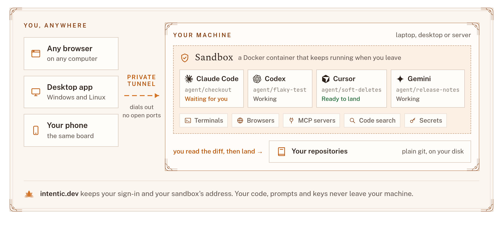
</picture>

- The sandbox is a Docker container on your laptop, desktop or server. Put it on an always-on machine and work continues while your laptop sleeps.
- The platform stores your sign-in and your sandbox's address. It never receives your files, prompts or credentials.
- The sandbox, CLI, workspace and platform are all MIT-licensed, in this repository. Read what runs on your hardware before you run it.

## How it compares

| If you use | Examples | intentic is |
| --- | --- | --- |
| Coding agents and CLIs | Claude Code, Codex, OpenCode, Gemini CLI, Kimi Code | where you run them: one worktree each, a shared workspace, review before landing |
| AI code editors | Cursor, GitHub Copilot, Zed, JetBrains AI | a companion: keep your editor for inline work |
| Multi-agent workspaces | Conductor, Superset, T3 Code, Synara, Nimbalyst | the closest alternative: MIT, any browser or phone, any Docker host |
| Cloud coding agents | Devin, Jules, Codex cloud, Claude Code on the web | the self-hosted option: your always-on machine, your accounts |
| Self-hosted assistants | OpenClaw, Hermes Agent | focused on repositories, branches and review |

Each [comparison page](https://intentic.dev/compare/) includes the case for picking the other product.

## FAQ

<details>
<summary><b>Is it free?</b></summary>

Yes. Every sandbox, capability, automation and shared workspace is free, with no tiers or card. You pay your AI provider directly. An optional [hosted sandbox](https://intentic.dev/pricing/) exists for people who would rather not run a machine.
</details>

<details>
<summary><b>Which agents and models can I use?</b></summary>

Claude Code (Opus, Sonnet, Haiku), Codex, Cursor, Gemini, Grok, Kimi Code, GLM and Meta's models, picked per conversation. Any ACP agent, such as OpenCode, connects as a capability, and local models run through llama.cpp or any OpenAI-compatible endpoint.
</details>

<details>
<summary><b>Where does my code live?</b></summary>

On your machine, as plain git. Your browser reaches the sandbox over a private tunnel. The platform never receives your files, and secret files such as `.env` never pass through the connection.
</details>

<details>
<summary><b>What do I need to run a sandbox?</b></summary>

A computer with Docker and a Google account. No public IP, open ports or Cloudflare account. If Docker is missing, the installer offers to install it.
</details>

<details>
<summary><b>Can an agent break my stuff?</b></summary>

It can make mistakes, so it proposes a plan first and works on its own branch. You read every diff before it lands, environment changes need your approval, and permissions are adjustable per turn.
</details>

<details>
<summary><b>Is it production-ready?</b></summary>

It is a working product, and it is new. Start with low-risk work and review the results. The [changelog](https://intentic.dev/changelog/) lists every release.
</details>

## Community and contributing

Questions go to [Discord](https://discord.gg/3veuzYp32T), bugs to [Issues](https://github.com/intentic/intentic/issues). A star helps other developers find the project.

[CONTRIBUTING.md](CONTRIBUTING.md) covers setup, builds and checks, and [ARCHITECTURE.md](ARCHITECTURE.md) explains how the parts connect. Coding agents working in this repository start at [AGENTS.md](AGENTS.md).

| Area | What lives there |
| --- | --- |
| [_editor](_editor) | The web app you look at, plus desktop and mobile shells and the UI kit |
| [_sandbox](_sandbox) | The daemon that owns a project's sandbox, and the CLIs agents use inside it |
| [_platform](_platform) | The hosted plane: sign-in, sandbox registry, tunnels, database |
| [_extensions](_extensions) | Bundled extensions: agents, connectors, automations, viewers |
| [_shared](_shared) | Contracts and SDKs more than one part is written against |
| [_search](_search) | `iq` and `lsp`: how agents find code |
| [_devices](_devices) | What runs on your own machines: device agent, browser extension |
| [_deploy](_deploy) | The deployment tool: intent to running servers |
| [_site](_site) | intentic.dev and the interactive demo |
| [_tools](_tools) | Shared config, checks, test harnesses, maintainer scripts |

The pictures in this README are drawn from the demo build by [`_site/site/scripts/readme`](_site/site/scripts/readme). Run `pnpm -C _site/site readme` to redraw them.

## License

[MIT](LICENSE). Report security issues as described in [SECURITY.md](SECURITY.md).
