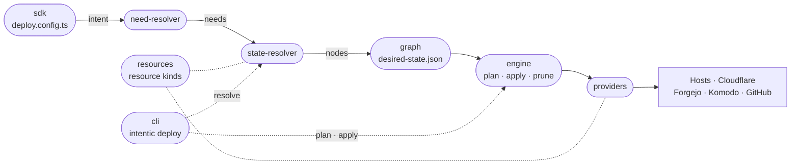

# The deploy tool

The bundled deploy tool that turns a typed description of the servers you have and the apps you want into a desired-state graph, then reconciles real infrastructure until it matches.

| Package | Role |
| --- | --- |
| [cli](cli) | The `intentic` command that drives resolve, plan, apply and adopt. |
| [sdk](sdk) | `defineIntent`, the typed `i.have` / `i.want` builder a config uses. |
| [need-resolver](need-resolver) | Intent data shapes and the capabilities an intent requires. |
| [state-resolver](state-resolver) | Fills each need from a catalog and emits the desired-state nodes. |
| [graph](graph) | The serializable desired-state graph: refs, secrets, compile, ordering. |
| [resources](resources) | The closed list of resource kinds and the outputs each produces. |
| [engine](engine) | Stateless plan, apply, prune and reconcile loop over a provider map. |
| [providers](providers) | One provider per resource kind, over SSH and vendor HTTP APIs. |

The `intentic` binary ships inside the sandbox image, where the daemon's Infra check and apply shell out to it, and in the Forgejo Actions pipelines `intentic deploy adopt` installs. A complete intent file is [`_tools/examples/deploy.config.ts`](../_tools/examples/deploy.config.ts).
