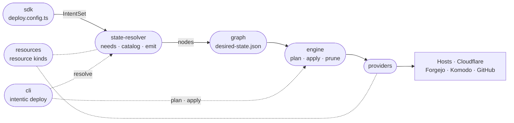

# The deploy tool

The bundled deploy tool that turns a typed description of the servers you have and the apps you want into a desired-state graph, then reconciles real infrastructure until it matches.

```mermaid
flowchart LR
    sdk(["sdk<br/>deploy.config.ts"]) -- "IntentSet" --> state(["state-resolver<br/>needs · catalog · emit"])
    state -- "nodes" --> dsg(["graph<br/>desired-state.json"])
    dsg --> engine(["engine<br/>plan · apply · prune"])
    engine --> providers(["providers"])
    providers --> infra["Hosts · Cloudflare<br/>Forgejo · Komodo · GitHub"]
    resources(["resources<br/>resource kinds"]) -.- state
    resources -.- providers
    cli(["cli<br/>intentic deploy"]) -. "resolve" .-> state
    cli -. "plan · apply" .-> engine
```

| Package | Role |
| --- | --- |
| [cli](cli) | The `intentic` command that drives resolve, plan, apply and adopt. |
| [sdk](sdk) | `defineIntent`, the typed `i.have` / `i.want` builder a config uses. |
| [state-resolver](state-resolver) | The intent's data shapes, the capabilities it needs, and the desired-state nodes that fill them. |
| [graph](graph) | The serializable desired-state graph: refs, secrets, compile, ordering. |
| [resources](resources) | The closed list of resource kinds and the outputs each produces. |
| [engine](engine) | Stateless plan, apply, prune and reconcile loop over a provider map. |
| [providers](providers) | One provider per resource kind, over SSH and vendor HTTP APIs. |
| [examples](examples) | Complete intent files, type-checked by the build so they stay valid against the SDK. |

Until 2026-10-06 the intent shapes and `resolveNeeds` were their own published package, `@intentic/need-resolver`.
They are now the `intent/` folder of `state-resolver`, and every name the old package exported (`IntentSet`, the
`*Intent` and `*Input` types, `Need`, `Capability`, `Plane`, `resolveNeeds`, `needKey`, `controlPlaneHostId`) is exported
from `@intentic/state-resolver` under the same name. `@intentic/need-resolver` is no longer published.

Every resource the tool deploys is stamped with its node id and, since 2026-10-05, the intent that owns it, so intents that share a host or a Cloudflare zone never prune each other's resources. See [the deployment engine](../docs/architecture/deploy-engine.md) for ownership and the prune baseline.

The `intentic` binary ships inside the sandbox image, where the daemon's Infra check and apply shell out to it, and in the Forgejo Actions pipelines `intentic deploy adopt` installs. A complete intent file is [`examples/deploy.config.ts`](examples/deploy.config.ts).
