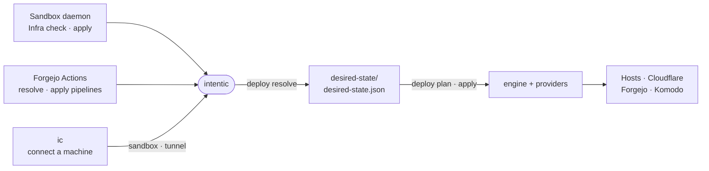

# cli

`@intentic/cli`, the `intentic` command that resolves a `deploy.config.ts` into a desired-state artifact and reconciles real infrastructure against it.



- Four route groups in `src/app.ts`: `deploy` (the tool itself), `sandbox` (prints the canonical `docker run` for a sandbox), `tunnel host` (a host's own Cloudflare SSH tunnel) and `scaffold` (a pnpm + turbo monorepo and its apps).
- A workspace has separate git repos: `intent/` holds `deploy.config.ts`, `desired-state/` holds the resolved `desired-state.json`, `.env` and generated secrets. `deploy init` scaffolds them; every other command reads these default paths from cwd.
- `deploy resolve` reaches the network only to discover the Cloudflare zone from the API token. `plan` and `apply` never re-resolve; they work from the baked artifact.
- `deploy apply` takes a lock on every host, generates missing secrets, applies authored renames, runs the reconcile loop, then prunes what the previous artifact declared and this one does not. Deletions wait for `--yes`.
- `deploy adopt` pushes both repos to the provisioned Forgejo and installs pipelines, so later pushes resolve and apply in CI with this CLI's own version.

## Key files

- [src/app.ts](src/app.ts) — the command tree and the one-line error format.
- [src/resolve/resolve.ts](src/resolve/resolve.ts) — imports the config in place and discovers the Cloudflare zone.
- [src/apply/apply.command.ts](src/apply/apply.command.ts) — lock, secrets, moves, reconcile loop, prune.
- [src/lib/artifact.ts](src/lib/artifact.ts) — default paths, artifact read/write and `.env` loading.
- [src/pipelines/adopt-pipelines.ts](src/pipelines/adopt-pipelines.ts) — the CI workflows and repo secrets `adopt` installs.

## Commands

```sh
pnpm --filter @intentic/cli test
pnpm --filter @intentic/cli e2e:hermetic   # full flow against a Docker-in-Docker host, no external services
```
