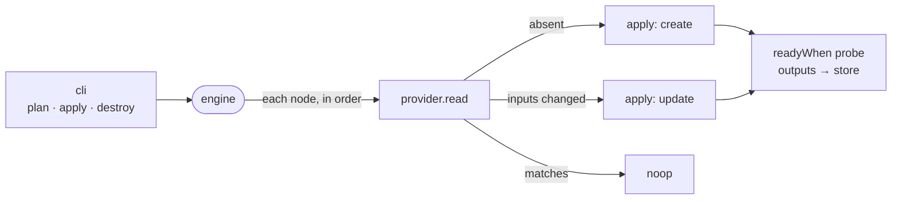

# engine

The stateless reconcile engine that plans, applies and prunes a desired-state graph by asking each resource's provider what exists in live infrastructure.



- There is no state file. A provider finds its resource by the `intentic.id` stamp; a stamped `intentic.hash` that differs from the node's inputs forces an update before the provider's own `diff` is consulted.
- `apply` walks the graph in dependency order, one node at a time, and stores each node's outputs so later `$ref` inputs resolve. `plan` does the same reads without mutating. `reconcile` alternates the two until a plan reads all noop, bounded by `maxIterations`.
- `prune` deletes what the previous artifact declared and the current one lacks, in reverse order with the old inputs. `collectOrphans` and `pruneOrphans` catch stamped resources no graph mentions. `applyMoves` re-stamps renamed resources first so they are not recreated.
- The engine constructs no providers. Callers pass a `Providers` map from [providers](../providers), or `createFakeProviders` for an in-memory world in tests.
- Progress leaves as structured `EngineEvent`s; the CLI renders them and the daemon tails them.

## Key files

- [src/provider.ts](src/provider.ts) — the `Provider` contract: `read`, `diff`, `apply`, and optional `list`, `delete`, `restamp`.
- [src/reconcile/apply.ts](src/reconcile/apply.ts) — one converge pass over the graph.
- [src/reconcile/reconcile-loop.ts](src/reconcile/reconcile-loop.ts) — apply then plan until nothing is left to do.
- [src/reconcile/reconcile.ts](src/reconcile/reconcile.ts) — provider lookup and the stamped-hash drift check.
- [src/reconcile/prune.ts](src/reconcile/prune.ts) — removal of dropped nodes and orphans.
- [src/providers/fake.ts](src/providers/fake.ts) — in-memory providers that prove a second apply is a noop.

## Commands

```sh
pnpm --filter @intentic/engine test
```
