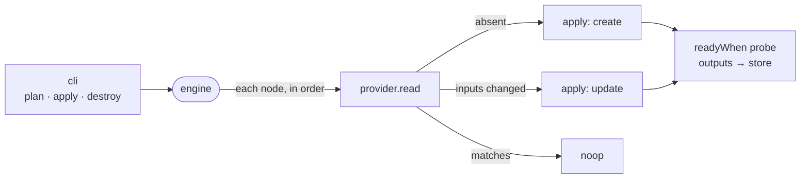

# engine

The stateless reconcile engine that plans, applies and prunes a desired-state graph by asking each resource's provider what exists in live infrastructure.


```mermaid
flowchart LR
    cli["cli<br/>plan · apply · destroy"] --> engine(["engine"])
    engine -- "each node, in order" --> read["provider.read"]
    read -- "absent" --> create["apply: create"]
    read -- "inputs changed" --> update["apply: update"]
    read -- "matches" --> noop["noop"]
    create --> ready["readyWhen probe<br/>outputs → store"]
    update --> ready
```

- There is no state file. A provider finds its resource by the `intentic.id` stamp; a stamped `intentic.hash` that differs from the node's inputs forces an update before the provider's own `diff` is consulted.
- `apply` walks the graph in dependency order, one node at a time, and stores each node's outputs so later `$ref` inputs resolve. `plan` does the same reads without mutating. `reconcile` alternates the two until a plan reads all noop, bounded by `maxIterations`.
- `prune` deletes what the previous artifact declared and the current one lacks, in reverse order with the old inputs. `collectOrphans` and `pruneOrphans` catch stamped resources no graph mentions. `applyMoves` re-stamps renamed resources first so they are not recreated.
- Ownership (2026-10-05). `EngineConfig.owner` is stamped on everything. The scan splits what it finds by owner: only this intent's own orphans are ever pruned, resources with no owner stamp are reported as unowned and left alone, and another intent's are only counted. A provider that reads its owner stamp back gets an unowned resource of the graph adopted (an update that re-stamps it) and one stamped by another intent refused with an error.
- Deleting needs less than creating (2026-10-05): a removed node's secret that is no longer set resolves to a placeholder instead of failing the prune, and only if its delete then fails is the node skipped as `missing-secret`, for the caller to keep pending. `EngineConfig.signal` stops apply and prune before their next change, which is how the CLI halts a run whose lock was lost.
- The engine constructs no providers. Callers pass a `Providers` map from [providers](../providers), or `createFakeProviders` for an in-memory world in tests.
- Progress leaves as structured `EngineEvent`s; the CLI renders them and the daemon tails them.

## Key files

- [src/provider.ts](src/provider.ts) — the `Provider` contract: `read`, `diff`, `apply`, and optional `list`, `delete`, `restamp`.
- [src/reconcile/apply.ts](src/reconcile/apply.ts) — one converge pass over the graph.
- [src/reconcile/reconcile-loop.ts](src/reconcile/reconcile-loop.ts) — apply then plan until nothing is left to do.
- [src/reconcile/reconcile.ts](src/reconcile/reconcile.ts) — provider lookup, and the owner and stamped-hash drift checks.
- [src/reconcile/prune.ts](src/reconcile/prune.ts) — removal of dropped nodes and orphans.
- [src/reconcile/orphans.ts](src/reconcile/orphans.ts) — the stamped scan and its split by owner.
- [src/providers/fake.ts](src/providers/fake.ts) — in-memory providers that prove a second apply is a noop.

## Commands

```sh
pnpm --filter @intentic/engine test
```
