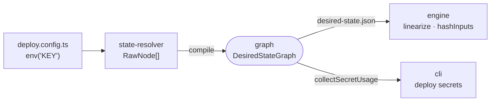

# graph

The desired-state representation the deploy tool passes between stages: refs, secrets and readiness checks compiled into one serializable, dependency-ordered graph.



- A resource node is `{ id, type, inputs, dependsOn, readyWhen }`. Inside inputs, a dependency's output is `{ $ref: "id.output" }` and a secret is `{ $secret: { source, key } }`, so the artifact is plain JSON with no values filled in.
- `compile` derives `dependsOn` from every ref a node carries and throws on a ref to an unknown id. `linearize` orders nodes topologically with declaration order as the tiebreak, so apply order is deterministic.
- Secrets come from `env("KEY")`, which the user supplies, or `generated("KEY")`, which intentic creates and stores. Configs import `env` from this package directly.
- `stamp.ts` is the ownership contract: providers label live resources with `intentic.id` and a hash of their inputs, which lets the engine find and diff them without a state file.
- A node's `type` is an opaque string here; [resources](../resources) owns the list of kinds.

## Key files

- [src/types.ts](src/types.ts) — `Ref`, `SecretRef`, `RawNode`, `ResourceNode`, `DesiredStateGraph`, `Move`.
- [src/compile.ts](src/compile.ts) — raw nodes to the serialized graph with derived dependencies.
- [src/index.ts](src/index.ts) — `env`, `generated`, `httpOk`, `linearize`, `subgraph`.
- [src/stamp.ts](src/stamp.ts) — the `intentic.id` and `intentic.hash` stamp format.
- [src/secrets.ts](src/secrets.ts) — every secret the graph requires and which nodes need it.

## Commands

```sh
pnpm --filter @intentic/graph test
```
