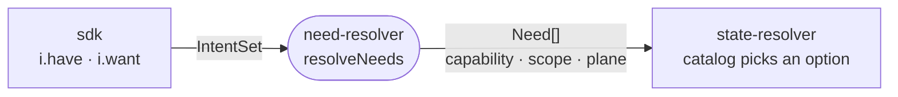

# need-resolver

Defines the intent data the SDK records and derives from it the abstract capabilities the deployment needs, before any concrete tool is chosen.



- A `Need` is one capability at one scope: `source-control`, `docker-registry` and `infra-control` on the control-plane host, `deployment-target` on every host that runs something, and `domain` on the Cloudflare account.
- Many apps collapse into one set of needs. The control-plane host is the first declared host with apps (`controlPlaneHostId`).
- It validates the intent as a whole: apps without Cloudflare, targets on undeclared hosts and workspace tools naming undeclared services all throw here.
- The intent stays plain data. Handles become resource-id strings, so an `IntentSet` serializes and carries no SDK types.

## Key files

- [src/intent.ts](src/intent.ts) — `IntentSet` and one intent type per declaration kind.
- [src/inputs.ts](src/inputs.ts) — the author-supplied input shapes (`HostInput`, `EnvironmentInput`, `UpdatePolicy`).
- [src/needs.ts](src/needs.ts) — `resolveNeeds`, `Capability`, `Plane` and the control-plane host rule.
- [src/needs.test.ts](src/needs.test.ts) — which intents produce which needs, by example.

## Commands

```sh
pnpm --filter @intentic/need-resolver test
```
