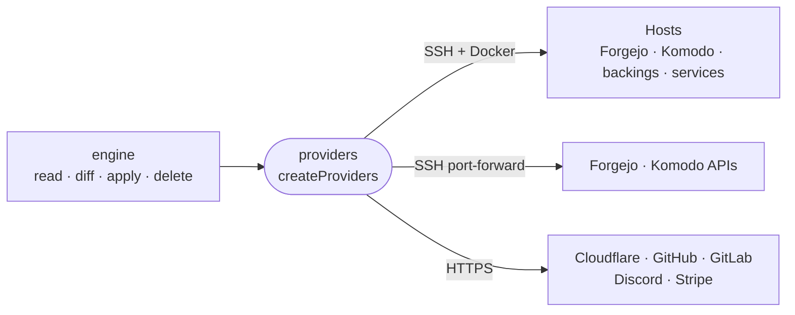

# providers

The deploy tool's providers: one implementation of the engine's `Provider` contract per resource kind, reaching hosts over SSH and vendors over their HTTP APIs.



- `createProviders` assembles the full kind-to-provider map over injectable dependencies: the SSH executor and each vendor API client. Tests pass fakes and drive the whole suite in memory.
- Every container intentic starts on a host carries `intentic.id` and `intentic.type` labels, so `list` finds orphans with one `docker ps` per host.
- Forgejo and Komodo APIs are reached through a loopback port-forward over SSH, because the Cloudflare tunnel behind their public routes may be the very thing an apply is changing.
- A NAT'd host is reached through its own Cloudflare tunnel (`via: "cloudflared"`). Host keys are trusted on first use and pinned.
- Stateful services on a host with the `guarded` update policy snapshot their volumes with restic before an image bump and roll back if the new image fails its health check.

## Key files

- [src/providers.ts](src/providers.ts) — `createProviders`, the map the engine reconciles against.
- [src/core/ssh.ts](src/core/ssh.ts) — the SSH executor, cloudflared forwarding and host-key pinning.
- [src/core/over-ssh.ts](src/core/over-ssh.ts) — why and how control-plane APIs go over SSH.
- [src/core/backing-provider.ts](src/core/backing-provider.ts) — the shared shape of Postgres, Valkey, Garage and Authentik.
- [src/komodo/deployment.ts](src/komodo/deployment.ts) — one Komodo deployment per app environment.
- [src/suite.engine.test.ts](src/suite.engine.test.ts) — the whole provider stack reconciling an app over fakes, then again as a noop.

## Commands

```sh
pnpm --filter @intentic/providers test
```
