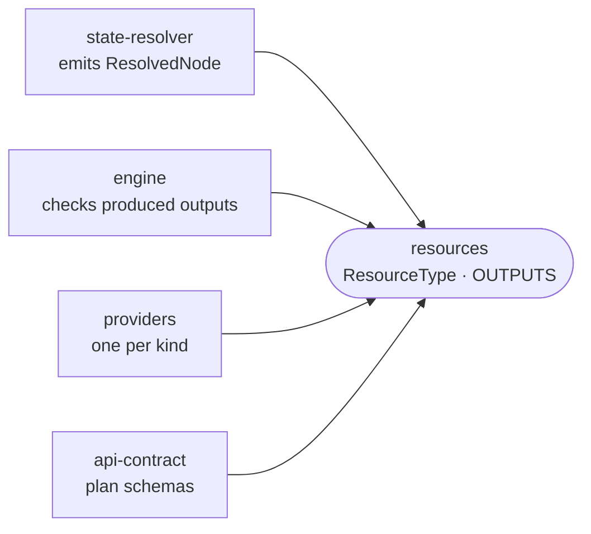

# resources

The closed vocabulary of resource kinds the deploy tool emits and reconciles, with the outputs each kind produces.

- `ResourceType` lists every kind, from `host` and `cloudflare` through `deployment`, `forgejo-team` and `garage-bucket`. `ResolvedNode` narrows a graph node's `type` to it, so a resolver emitting an unknown kind fails to compile.
- `OUTPUTS` is the runtime table of which outputs each kind produces. The engine rejects a provider that returns an undeclared output, and `plan` seeds pending values from it. An entry ending in `:` allows a prefix, for per-app keys like `appWebhook:<app>`.
- The SDK's handle properties mirror `OUTPUTS`; a test in [sdk](../sdk) fails when the two disagree.
- Types and one table only: no logic, no tests of its own.

## Key files

- [src/resource-types.ts](src/resource-types.ts) — `ResourceType` and `ResolvedNode`.
- [src/outputs.ts](src/outputs.ts) — `OUTPUTS`, keyed exhaustively over `ResourceType`.
- [src/index.ts](src/index.ts) — the package's two exports.
