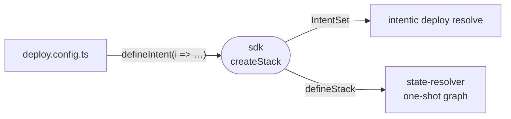

# sdk

The authoring surface of a `deploy.config.ts`: a typed builder that records what infrastructure you have and what you want as a serializable intent.



- `i.have.*` declares inventory intentic reads but never creates or destroys: hosts over SSH, a Cloudflare account, GitHub or GitLab, a backup target, Discord, Stripe.
- `i.want.*` declares what intentic owns end to end: apps with environments, catalog services, backing databases, caches, auth and object storage, users, teams and per-host agent workspaces.
- Each call returns a typed handle whose properties are inert refs (`host.internalIp`, `app.environments.production.url`). Passing a handle to another declaration is how wiring happens; nothing is derived here.
- `defineIntent` is what a config exports. `defineStack` also runs the resolvers, which tests and fixtures use to get a graph without the CLI.

## Key files

- [src/index.ts](src/index.ts) — `defineIntent` and `defineStack`.
- [src/handles.ts](src/handles.ts) — the `Have`, `Want` and handle interfaces an author sees.
- [src/stack.ts](src/stack.ts) — `createStack`, the recorder that turns calls into an `IntentSet`.
- [src/__fixtures__/deploy.config.ts](src/__fixtures__/deploy.config.ts) — a small config, compiled and asserted against `deploy.graph.ts`.
- [src/outputs.test.ts](src/outputs.test.ts) — handle output refs must match the `OUTPUTS` table in `resources`.

## Commands

```sh
pnpm --filter @intentic/sdk test
```
