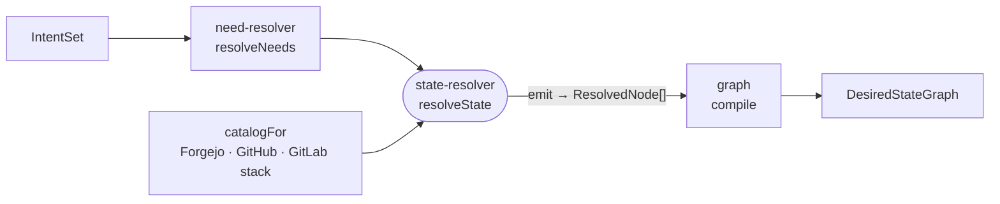

# state-resolver

Turns an intent into the desired-state graph: it derives the needs, fills each from a catalog of concrete tools, and emits every resource node the deployment requires.



- The catalog follows the intent: `i.have.github` selects the GitHub stack, `i.have.gitlab` the GitLab stack, otherwise self-hosted Forgejo. In all three, Komodo deploys and a Cloudflare tunnel exposes the apps.
- Each need must map to exactly one catalog option. Zero or several options throw; the resolver makes no choices.
- `src/resolvers` holds one resolver per concern: the control plane, apps, routes, backings with per-app bindings, catalog services, agent workspaces, users and teams, and scheduled backups.
- Every derived id and platform domain comes from `src/lib/ids.ts`. The SDK imports the same functions, so a handle's ids match the graph's.
- It is pure. The Cloudflare `zone` arrives as an argument; the CLI discovers it before calling.

## Key files

- [src/state.ts](src/state.ts) — `resolveState`: needs, catalog assignment, emit, compile.
- [src/emit/emit.ts](src/emit/emit.ts) — builds the nodes for one assignment, host by host.
- [src/lib/catalog.ts](src/lib/catalog.ts) — the three stacks and which capabilities each option provides.
- [src/lib/ids.ts](src/lib/ids.ts) — every derived resource id and platform domain.
- [src/resolvers/app.ts](src/resolvers/app.ts) — what one app becomes: repo, CI per environment, deployment, route.

## Commands

```sh
pnpm --filter @intentic/state-resolver test
```
