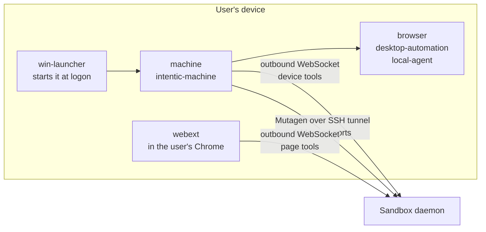

# Your devices

The parts of intentic that run on a user's own computer and browser, letting a sandbox's agent work there within the switches the owner set.

| Package | Role |
| --- | --- |
| [machine](machine) | The device agent: sandbox tools, folder sync and port mirroring. |
| [webext](webext) | Chrome extension letting the agent work in the user's signed-in browser. |
| [browser](browser) | Drives a separate Chromium profile over CDP for the machine. |
| [desktop-automation](desktop-automation) | Screen capture, pointer, keyboard and windows on Windows and Linux. |
| [local-agent](local-agent) | State directory, login autostart and pidfiles for on-device CLIs. |
| [win-launcher](win-launcher) | Starts an agent on Windows without a console window. |
