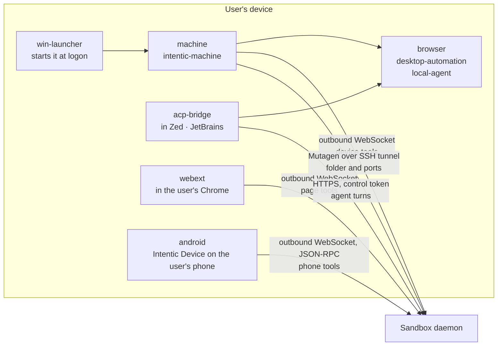

# Your devices

The parts of intentic that run on a user's own computer, browser and phone, letting a sandbox's agent work there within the switches the owner set.

```mermaid
flowchart LR
    subgraph device["User's device"]
        launch["win-launcher<br/>starts it at logon"] --> machine["machine<br/>intentic-machine"]
        machine --> libs["browser<br/>desktop-automation<br/>local-agent"]
        acp["acp-bridge<br/>in Zed · JetBrains"] --> libs
        webext["webext<br/>in the user's Chrome"]
        android["android<br/>Intentic Device on the user's phone"]
    end
    machine -->|"outbound WebSocket<br/>device tools"| daemon["Sandbox daemon"]
    machine -->|"Mutagen over SSH tunnel<br/>folder and ports"| daemon
    webext -->|"outbound WebSocket<br/>page tools"| daemon
    acp -->|"HTTPS, control token<br/>agent turns"| daemon
    android -->|"outbound WebSocket, JSON-RPC<br/>phone tools"| daemon
```

| Package | Role |
| --- | --- |
| [machine](machine) | The device agent: sandbox tools, folder sync and port mirroring. |
| [acp-bridge](acp-bridge) | `intentic-acp`: drive sandbox agents from Zed, JetBrains or any ACP editor. |
| [webext](webext) | Chrome extension letting the agent work in the user's signed-in browser. |
| [android](android) | Intentic Device: the Android app letting the agent work on the user's phone. A Gradle project, outside the pnpm workspace. |
| [browser](browser) | Drives a separate Chromium profile over CDP for the machine. |
| [desktop-automation](desktop-automation) | Screen capture, pointer, keyboard and windows on Windows and Linux. |
| [local-agent](local-agent) | State directory, login autostart and pidfiles for on-device CLIs. |
| [local-files](local-files) | `intentic-files`: serves the folders the desktop app opens to the editor's file views. |
| [win-launcher](win-launcher) | Starts an agent on Windows without a console window. |
