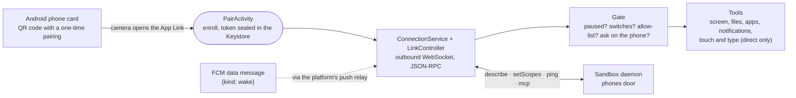

# android

Intentic Device (`dev.intentic.device`), the Android app that connects a person's own phone to their sandbox, so the agent can work on it within the switches they set on the card and on the phone.



- **Pairing.** The card's QR code is the App Link `https://intentic.dev/phone/pair#ixp1_…`. The app also answers
  `intentic-device://pair#ixp1_…`, which the intentic.dev fallback page hands off to before the App Link is verified, and
  a pasted code. It shows which sandbox it will join and waits for the person to confirm. Only then does it redeem the
  one-time pairing at `/system/phones/enroll`. The durable token is sealed with an AES-GCM key held in the Android
  Keystore (`SecretBox`, `KeystoreKey`). One pairing at a time.
- **The wire** is the contract's phone door (`_shared/sandbox-contract/src/protocol/phone-protocol.ts`): a hello frame,
  then JSON-RPC 2.0 with the sandbox asking and the app answering `describe`, `setScopes`, `ping` and `mcp`. The unit
  tests read `_shared/sandbox-contract/golden/phone-wire.json`, the same examples the daemon's link is tested against.
  `describe`, MCP `initialize`, `ping` and `tools/list` are answered whatever is paused or switched off, since the
  sandbox lists the tools before it sends the switches.
- **Connection modes.** In "On demand", the default, the app connects when it is opened or when the sandbox wakes it
  through an FCM data message. It closes again after five minutes with no tool call. In "Stay connected" it keeps the
  link up and comes back after a reboot. Backoff and close codes follow the shared peer rules (`peer-dial.ts`): 1008
  forgets the pairing for good. FCM is optional. Without the four `intentic.fcm.*` Gradle properties the build never
  starts Firebase and reports no wake token, so the phone answers only while open or staying connected.
- **The person sees and can stop it.** While connected, a foreground service (type `specialUse`) shows "Your agent is
  connected" with a Pause button. A Quick Settings tile pauses and resumes too. While paused, every tool call is refused
  with "The person paused the agent on this phone."
- **Enforcement happens here** (`policy/Gate.kt`). Calls are refused while paused, and before the first `setScopes`
  every switch counts as off. A switch the app does not know reads as off.
  - Each tool's switch is checked as it was last received; the last grant is persisted, so a restart enforces it.
  - Reading or acting on the screen needs the foreground app on the phone's own allow-list (read or act, optionally
    marked sensitive).
  - This app, the home screen, Settings and Android's permission screens are never actable.
  - `ask_access` only records a request and posts Allow/Deny on the phone; it never grants anything.
- **Ask on the phone first** (`confirm` on the card), in the direct flavor's touch tools:
  - `always` asks before every act;
  - `sensitive` asks before typing into a password field, and before tapping something that reads like paying,
    buying, sending money, deleting, removing or transferring;
  - `never` trusts the owner to watch.

  With `destructive` off, the agent cannot act in an app marked sensitive. An unanswered question is a no after
  60 seconds. Locking the screen and the power menu are not offered at all.
- **Two flavors.** `direct`, downloaded from intentic.dev, carries the accessibility service behind `ui_elements`,
  `ui_act` and `device` (touch and type), and its own updater. `play` carries neither: Google Play forbids an AI agent
  acting through the accessibility service, so there it reads the screen through MediaProjection (the person approves
  sharing once per session) and offers no touch tools. Facts report the flavor as `build`.
- **Activity log.** Every tool call is appended to a JSONL log in app storage (text arguments cut to 40 characters),
  and the app shows the last 100.
- **Updater** (direct only, `update/`). On launch and once a day it reads
  `releases/latest/download/intentic-device.json` (`{version, url, sha256}`) from the GitHub releases. A newer build is
  downloaded and checked against its digest, then handed to PackageInstaller for the person to confirm.
  `.github/workflows/device-android.yml` writes that manifest when release.yml publishes.
- **Android 13 and later** keep an app installed from outside a store from turning on its accessibility service or
  notification access. The person must first allow it under App info ▸ ⋮ ▸ Allow restricted settings; the app's
  "Access on this phone" rows say so and open the right screens.
- **App Links** verify only once intentic.dev serves `/.well-known/assetlinks.json` for this package
  ([assetlinks.template.json](assetlinks.template.json), with the release key's SHA-256 in place of the placeholder).
  Until then the link opens the intentic.dev page, which hands the code to the app's own scheme.
- **Outside the pnpm workspace.** It is a Gradle project with no node toolchain; there is no Gradle wrapper jar in the
  repository. [scripts/gradle.sh](scripts/gradle.sh) downloads the pinned Gradle (9.6.0) once and checks its digest.
  AGP 9.4.1 (it compiles Kotlin itself), compileSdk 37, minSdk 26, targetSdk 36, JDK 17.

## Key files

- [app/src/main/kotlin/dev/intentic/device/link/LinkController.kt](app/src/main/kotlin/dev/intentic/device/link/LinkController.kt) — dialling, hello, heartbeat watchdog, backoff, linger and close codes.
- [app/src/main/kotlin/dev/intentic/device/protocol/](app/src/main/kotlin/dev/intentic/device/protocol/) — JSON-RPC, the MCP server, enrollment, facts.
- [app/src/main/kotlin/dev/intentic/device/policy/Gate.kt](app/src/main/kotlin/dev/intentic/device/policy/Gate.kt) — the one place a tool call is allowed or refused.
- [app/src/main/kotlin/dev/intentic/device/tools/](app/src/main/kotlin/dev/intentic/device/tools/) — the tools both flavors share, and their registry.
- [app/src/direct/kotlin/dev/intentic/device/touch/](app/src/direct/kotlin/dev/intentic/device/touch/) — the accessibility service, `ui_elements`, `ui_act`, `device`, the confirm rules.
- [app/src/main/AndroidManifest.xml](app/src/main/AndroidManifest.xml) — the pairing intent filters, services, the pause tile.

## Commands

```sh
bash _devices/android/scripts/gradle.sh :app:testDirectDebugUnitTest :app:testPlayDebugUnitTest
bash _devices/android/scripts/gradle.sh :app:assembleDirectDebug :app:assemblePlayDebug
bash _devices/android/scripts/gradle.sh :app:assembleDirectRelease   # unsigned unless the release job's signing properties are passed
```
