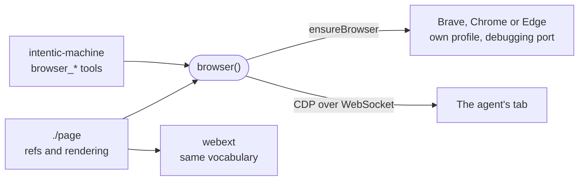

# browser

Drives a Chromium-family browser from Node over the DevTools protocol: opens pages, lists what can be clicked as numbered refs, and clicks and types by ref.

- Runs on the user's device inside [`intentic-machine`](../machine). It never touches the user's own profile:
  `ensureBrowser` reuses whatever answers on `DEFAULT_PORT`, otherwise it starts the OS default Chromium-family
  browser with `--remote-debugging-port` and a profile of its own under `~/.intentic/browser/<browser>`. Edge
  ranks below any Chromium browser someone installed by choice (`pickBrowser`).
- A snapshot (`SNAPSHOT_SCRIPT`) lists visible interactive elements as refs `e0`, `e1`, … A ref lives until the next
  snapshot, and a stale one fails with a message instead of clicking whatever sits there now.
- Clicks and fills run as DOM calls inside the page and fire `input` and `change`, so they survive scrolling and
  reach a framework's state. Key presses go through `Input.dispatchKeyEvent`, since pages ignore synthetic keyboard events.
- The `./page` entry point has no DOM or Node imports, so the [browser extension](../webext) renders pages with
  the same `renderPage`.

## Key files

- [src/index.ts](src/index.ts) — `browser()`: one CDP session per object, and every page action.
- [src/launch.ts](src/launch.ts) — which binary to start, its flags and its profile directory.
- [src/snapshot.ts](src/snapshot.ts) — the in-page script that numbers the elements.
- [src/page.ts](src/page.ts) — `PageState`, `renderPage` and ref parsing, shared with the extension.
- [src/cdp.ts](src/cdp.ts) — the DevTools protocol subset: find tabs, attach, send.
