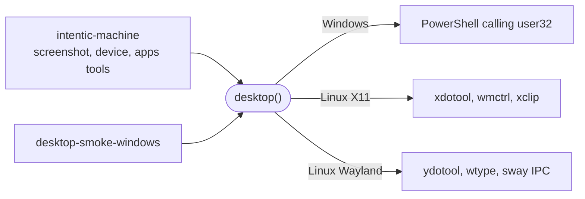

# desktop-automation

Moves a real desktop from Node on Windows and Linux: captures the screen, moves the pointer, clicks, types, scrolls, lists and focuses windows, and uses the clipboard.

- Runs on the user's device inside [`intentic-machine`](../machine). It knows nothing about agents or permissions;
  the machine's device tools decide what is allowed before calling `desktop()`.
- No native modules, so it works from a single-file compiled binary: every action runs an existing program
  (`run.ts`), and a missing one fails with a `DesktopError` that says what to install.
- Coordinates are screenshot pixels. On Windows each action adds the virtual desktop's origin, which is not `(0,0)`
  on every multi-monitor setup.
- Windows and Linux only: on any other OS every input method throws. On Wayland, window listing works only under sway.
- `notice()` (Windows only) shows a banner that never takes focus or appears in a capture, and reports a global
  hotkey press; the machine uses it to pause input. `windowsSession()` says whether the sign-in screen is up, since
  keys typed then reach nothing.

## Key files

- [src/index.ts](src/index.ts) — `desktop()`: picks the backend for the current platform.
- [src/types.ts](src/types.ts) — the `Desktop` interface and the coordinate model.
- [src/keys.ts](src/keys.ts) — the one key-chord vocabulary each backend translates.
- [src/input-windows.ts](src/input-windows.ts) — pointer and keyboard through user32 from PowerShell.
- [src/input-linux.ts](src/input-linux.ts) — xdotool on X11, ydotool and wtype on Wayland.
- [src/notice-windows.ts](src/notice-windows.ts) — the on-screen notice and its hotkey.
