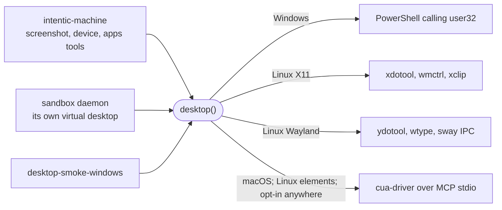

# desktop-automation

Moves a real desktop from Node on Windows and Linux: captures the screen, moves the pointer, clicks, types, scrolls, lists and focuses windows, reads a window's controls, and uses the clipboard.

```mermaid
flowchart LR
    machine["intentic-machine<br/>screenshot, device, apps tools"] --> desktop(["desktop()"])
    sandbox["sandbox daemon<br/>its own virtual desktop"] --> desktop
    smoke["desktop-smoke-windows"] --> desktop
    desktop -->|"Windows"| ps["PowerShell calling user32"]
    desktop -->|"Linux X11"| x11["xdotool, wmctrl, xclip"]
    desktop -->|"Linux Wayland"| wl["ydotool, wtype, sway IPC"]
    desktop -->|"macOS; Linux elements; opt-in anywhere"| cua["cua-driver over MCP stdio"]
```

- Runs on the user's device inside [`intentic-machine`](../machine). It knows nothing about agents or permissions;
  the machine's device tools decide what is allowed before calling `desktop()`.
- No native modules, so it works from a single-file compiled binary: every action runs an existing program
  (`run.ts`), and a missing one fails with a `DesktopError` that says what to install.
- Coordinates are pixels of the whole virtual desktop, its top-left at `(0,0)`: points, window bounds, display bounds
  and element bounds alike. On Windows each action adds the virtual desktop's origin, which is not `(0,0)` on every
  multi-monitor setup.
- A screenshot an agent sees is a frame (`frames.ts`): captured at the screen's own resolution, cut to a region if
  asked, shrunk to fit what a model reads whole (1456 px on the long edge, 1.15 megapixels), and given an id. A point
  read off it is mapped back by `toDesktop`; `FrameLog` refuses one read off a frame that is no longer the newest, and
  recognises a capture identical to the newest. Past those limits a model API shrinks the image itself and every
  coordinate read off it lands short. The PNG decoding, cropping, area-average shrinking and encoding are pure
  TypeScript over `node:zlib` (`png.ts`), about 0.2 s for a 5760×2160 desktop.
- Every Windows script declares itself per-monitor DPI-aware (v2) first (`windows-dpi.ts`). Without it, a 4K monitor at
  150% reads as 2560×1440 and only its top-left part is ever captured. Only per-monitor v2, no older fallback: the
  system-wide `SetProcessDPIAware` reads a mixed-DPI desk wrong in a new way, and Defender rejected the script that
  carried both beside a screen copy (2026-10-05, on a 4K-at-150% monitor beside a 1920×1200 one).
- `elements()` reads a window's controls through UI Automation (`elements-windows.ts`, Windows only): one cache request
  over the whole subtree, from a C# helper PowerShell compiles, under a second for a VS Code window of 1330 controls.
  Chromium and Electron windows build their tree only once asked, so a bare first read is read again. An element is
  found again by its runtime id; `elementAct` invokes, sets, toggles, expands, collapses, selects or focuses it through
  its pattern, without the pointer, on a thread given 4 s, since an Invoke that opens a modal dialog does not return.
- `desktop({ env })` runs every program with that environment, so one process can drive a display of its own (the
  sandbox's agent desktop) without writing `DISPLAY` into its own `process.env`.
- [cua-driver](https://github.com/trycua/cua), where the owner installed it (`cua.ts`), is driven over its own MCP
  server on stdio, never loaded into this process: it is the whole backend on macOS, where this package has no input of
  its own (without it every input method there throws, naming how to install it); on Linux it reads a window's controls
  through AT-SPI, which nothing here speaks without a native module; and `INTENTIC_DESKTOP_DRIVER=cua` puts every
  platform on it, for its background delivery. It is found at `INTENTIC_CUA_DRIVER`, on PATH, or where its installers
  put it. Measured against cua-driver 0.33.4 on Linux/X11 (2026-10-05); macOS is untested.
- On Wayland, window listing works only under sway.
- Linux window bounds come from `xwininfo -root -tree` where it is installed: wmctrl counts a window's frame offset
  twice under a reparenting window manager (openbox put a window 18 px too low), which cut off the top of a window's
  screenshot.
- `notice()` (Windows only) shows a banner that never takes focus or appears in a capture, and reports a global
  hotkey press; the machine uses it to pause input. `windowsSession()` says whether the sign-in screen is up, since
  keys typed then reach nothing.

## Key files

- [src/index.ts](src/index.ts) — `desktop()`: picks the backend for the current platform.
- [src/types.ts](src/types.ts) — the `Desktop` interface and the coordinate model.
- [src/input-windows.ts](src/input-windows.ts) — pointer and keyboard through user32 from PowerShell.
- [src/frames.ts](src/frames.ts) — screenshots as frames: fitting, ids, and mapping points back to the desktop.
- [src/elements-windows.ts](src/elements-windows.ts) — a window's controls through UI Automation.
- [src/notice-windows.ts](src/notice-windows.ts) — the on-screen notice and its hotkey.
