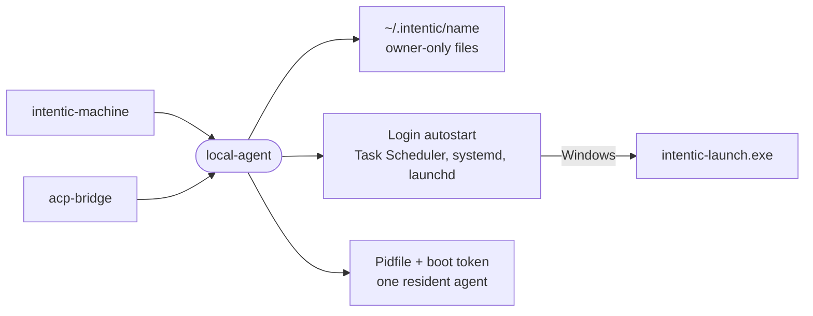

# local-agent

The shared plumbing for intentic CLIs that run on a user's own computer: a private state directory, login autostart, re-launching itself, and one background agent found again by pidfile.

- Used by [`intentic-machine`](../machine) and [`acp-bridge`](../../_sandbox/acp-bridge); it always runs on the
  user's device, never in a sandbox.
- `agentHome` puts state under `~/.intentic/<name>`, and `writeSecretFile` writes owner-only files, since they hold
  sandbox credentials.
- `autostart` registers the agent at login under something that restarts it, with no elevation: a per-user logon
  task through [`intentic-launch.exe`](../win-launcher) on Windows (a `HKCU\…\Run` value when the stub is absent), a
  systemd user unit on Linux (an XDG autostart entry without a user manager), a LaunchAgent on macOS.
- A pidfile stores a boot token beside the pid, so a pid reused after a reboot never reads as a running agent, and
  `claimPidFile` settles two starters racing for one file.
- `cliLauncher` rebuilds the argv that re-invokes the current CLI, both as `node dist/cli.js` and as a bun-compiled binary.
- `createUi` renders a setup command's checklist: `rich` in a terminal, `plain` markers for a pipe, `nested` inside a
  parent's checklist.

## Key files

- [src/index.ts](src/index.ts) — everything the package exports.
- [src/autostart.ts](src/autostart.ts) — the login entry per OS, including the Windows task XML.
- [src/detached.ts](src/detached.ts) — pidfiles, `spawnDetached`, the launcher-stub spawn and log rotation.
- [src/home.ts](src/home.ts) — the state directory and owner-only secret files, written atomically through `@intentic/base/fs`.
- [src/launcher.ts](src/launcher.ts) — the argv to re-launch this CLI and the stub command line.
- [src/ui.ts](src/ui.ts) — the checklist renderer and its output modes.
