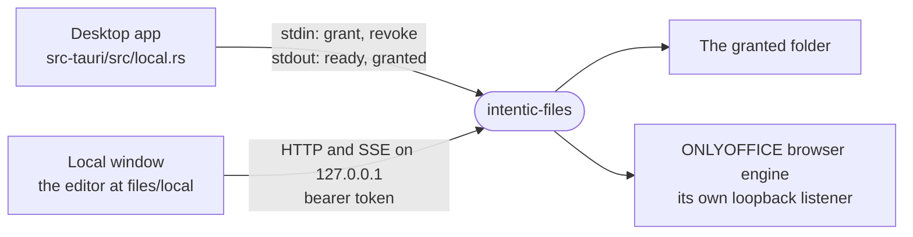

# local-files

`intentic-files`, the desktop app's sidecar: it serves the folders and documents the app opens from the user's own disk to the editor's file views, over loopback, one grant per window.



- **Only the app grants.** A folder is served once the app writes a `grant` line on this process's stdin, naming a
  random token and a path the user chose. A page only ever presents its token, so nothing a page sends can widen
  what it reads. The process exits when its stdin closes, so it never outlives the app.
- **Three gates before any route.** A loopback port is reachable by every page the user has open, so the Host header
  must name this port (a DNS-rebound page names its own host), a page's Origin must be one of the app's own, and
  the bearer must be a granted token (`server.ts`).
- **Paths resolve twice.** Lexically first (no `..`, no drive, no backslash), then on disk: the real path of whatever
  exists must still be inside the granted folder, so a link cannot lead out (`paths.ts`). A folder grant reads and
  writes inside its folder. A single-document grant reads the document's folder, for the pictures and links beside
  it and the folder the window can show, and writes only the document.
- **No write follows a link.** A write lands on a path with no link left in it: the file's real path, or its nearest
  existing folder's real path with the missing names below it. A link that points at nothing, as the file or on the
  way to it, is refused. A save or a drop's first part streams into a new name beside the file and replaces it by
  rename. A later part is opened with `O_NOFOLLOW` where the platform has it, after an lstat that must find a file.
  The 256 MiB cap counts the bytes that arrive, so a body with no `Content-Length` is held to it too (413). A refused
  first part leaves the file as it was (`files.ts`, `raw.ts`).
- **The editor's own contract.** Answers are the sandbox contract's, through `@intentic/contract-serve`, so the
  editor's file views read a folder exactly as they read `/work`. The file semantics are the daemon's: 4 MiB text
  windows cut on line and character boundaries, an ETag on raw bytes, and saves that name the text they replace by
  hash and are refused (409) when the file moved under them. Every other route the editor's chrome reads (agents,
  git changes, personas) answers its empty truth rather than a 404. The `/events` hello lists exactly the routes a
  window is served, with `surface: "folder"`, so the editor offers nothing else: no new folder, rename, delete, move,
  terminal or ZIP.
- **Office documents** open in the ONLYOFFICE browser engine from `@intentic/ext-onlyoffice/local-office`, which
  downloads its editor bundle once into the app's cache and edits in the page, with no Docker.
- **Watching.** Changes batch every 250 ms into `workspaceChanged` events. Windows and macOS watch a whole folder
  natively; Linux watches one folder at a time, so only the folders the explorer would open are watched, up to
  4,000.

## Key files

- [src/cli.ts](src/cli.ts) — the process: listens, reads grants on stdin, exits with the app.
- [src/server.ts](src/server.ts) — the host, origin and token gates, and each grant's handler table.
- [src/procedures.ts](src/procedures.ts) — the contract's procedures a folder window reads, and the empty answers.
- [src/raw.ts](src/raw.ts) — raw bytes, the one write path, and the office extension's namespace.
- [src/paths.ts](src/paths.ts) — where a path may resolve: lexically, then by its real path.
- [src/watch.ts](src/watch.ts) — what moved on disk, batched, per platform.

## Commands

```sh
pnpm --filter @intentic/local-files test
pnpm --filter @intentic/local-files build          # dist/cli.js, bundled by bun
bash _tools/scripts/desktop/stage-local-files.sh   # the compiled binary the desktop app bundles
```
