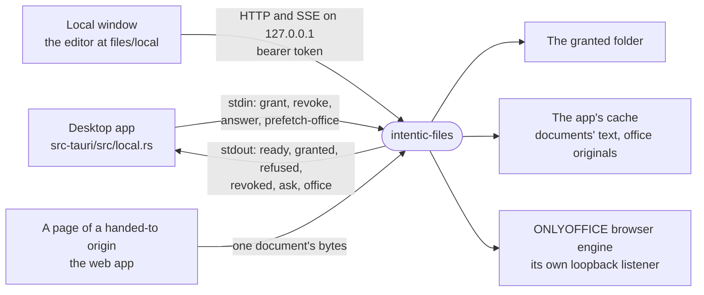

# local-files

`intentic-files`, the desktop app's sidecar: it serves the folders and documents the app opens from the user's own disk to the editor's file views, over loopback, one grant per window.



- **Office documents are the ONLYOFFICE extension's.** The browser engine that edits them, its bundle download and the
  originals it keeps, is `@intentic/ext-onlyoffice/local-office`, the one entry that extension exports for a host
  outside a sandbox; this package imports nothing else of it (`CONSUMERS` in `_tools/checks/lib/extension-deps.mjs`).
- **Only the app grants.** A folder is served once the app writes a `grant` line on this process's stdin, naming a
  random token and a path the user chose. A page only ever presents its token, so nothing a page sends can widen
  what it reads. The process exits when its stdin closes, so it never outlives the app: it gives its office editor
  at most 3 seconds to close, then exits anyway. _(2026-10-05) That close waited for every open connection, which an
  editor page left open could hold, and kept this process and its binary past the app's exit, where an installer could
  not replace it._
- **Three gates before any route.** A loopback port is reachable by every page the user has open, so the Host header
  must name this port (a DNS-rebound page names its own host), a page's Origin must be one of the app's own, and
  the bearer must be a granted token (`server.ts`).
- **A grant has limits when the app gives it some.** `readOnly` refuses every write. `expiresInMs` ends the grant:
  its token then opens nothing, answering 401 to the app's own pages and to a request with no page behind it. `origins`
  makes a handoff grant: one document handed to pages of those exact origins (the web app at its own address). It
  answers only them, never the app's own pages, and only `GET` and `HEAD /workspace/raw` for its document; everything
  else is 403. A preflight carries no bearer, so an origin a live handoff grant lists gets its preflight answered,
  private-network ask included; once no live grant lists it, its pages are refused at the origin gate like any other
  site's. A folder is never handed over.
- **A grant ends once, however it ends.** A revoke, an end noticed by a request or by its timer, and a grant of the
  same token again (how the app re-points a window it reuses) all let go of what the old grant held: its handlers
  and its office editor, which are keyed by the grant rather than its token. An old grant's end never takes a
  replacement with it.
- **Paths resolve twice.** Lexically first (no `..`, no drive, no backslash, and on Windows no name Windows cannot
  hold: `<>:"|?*`, which would reach an alternate data stream, a trailing dot or space, or a device name such as `CON`),
  then on disk: the real path of whatever
  exists must still be inside the granted folder, so a link cannot lead out (`paths.ts`). A folder grant reads and
  writes inside its folder. A single-document grant reads the document's folder, for the pictures and links beside
  it and the folder the window can show, and writes only the document.
- **No write follows a link.** A write lands on a path with no link left in it: the file's real path, or its nearest
  existing folder's real path with the missing names below it. A link at the name is followed only to a real place
  inside the folder, and a link that points at nothing, as the file or on the way to it, is refused ("“name” is a
  link to something that isn't there."). A save or a drop's first part streams into a new name beside the file and
  replaces it by rename. A later part, and the time a drop sets, reach the file only after an lstat that finds a
  file, and a later part is opened with `O_NOFOLLOW` where the platform has it. The 10 GiB cap (the daemon's own)
  counts the bytes that arrive, so a body with no `Content-Length` is held to it too (413). A refused first part
  leaves the file as it was (`files.ts`, `raw.ts`). _(2026-10-09) The cap was 256 MiB, which refused every film in a
  dropped folder._
- **Text that is not UTF-8** reads with `lossy: true` on its window, and a text save over it is refused (422) rather
  than writing the replacement characters back.
- **The editor's own contract.** Answers are the sandbox contract's, through `@intentic/contract-serve`, so the
  editor's file views read a folder exactly as they read `/work`. The file semantics are the daemon's: 4 MiB text
  windows cut on line and character boundaries, an ETag on raw bytes, and saves that name the text they replace by
  hash and are refused (409) when the file moved under them. Every other route the editor's chrome reads (agents,
  git changes, personas) answers its empty truth rather than a 404. The `/events` hello lists exactly the routes a
  window is served, with `surface: "folder"`, so the editor offers nothing else: no terminal or ZIP. A document's own
  window and a read-only one leave out the verbs they would only refuse.
- **New folder, rename, move, copy and delete** (`tree-verbs.ts`) keep the daemon's rules: a new folder is `mkdir -p`,
  nothing lands on a name that is taken (409), a copy keeps links as links, and a link is moved or deleted as itself.
  The folder itself, `.git` and `.intentic` are refused, as is all of it from a document's own window. **A delete is
  never permanent**: the app is asked to move the entry to the system's Recycle Bin or Trash, and when it cannot, it
  says why and nothing is removed here (503). When it has not answered within two minutes (an app from before the
  trash never will), the window is told the move may still happen, which the folder then shows as any change.
- **Search** (`search.ts`) reads the folder as it is now, with no index: `find` matches lines by pattern, word and
  case, `files` ranks paths as quick-open does, and every other mode runs as `find`. It walks as the explorer does
  (ignored folders and `.gitignore` left out unless asked), skips binaries and files over 2 MiB, and stops at 20,000
  files, 2,000 lines or 3 seconds, saying so; the clock is read before every line, so no long file holds it past its
  budget. A pattern that repeats a group which itself repeats (`(a+)+`) could backtrack for minutes on one line and
  hold every window of the app meanwhile, so it is refused (400) with a word to search for the text as typed.
  `resolve` answers a written path when it is there, else the one file whose path ends that way, and nothing when
  two could, or when the walk stopped before seeing the whole folder.
- **A document's text** for the quick look (`derived.ts`) is rendered by fileq's own readers in memory and kept in
  the app's cache (`--derived-cache`, `derived` beside `--cache` by default), keyed by the file's real path, size,
  time and the reader's version. Nothing is ever written into the folder. Reading it never renders it; asking to does,
  bounded by fileq's size cap and two minutes. A reader cannot be stopped once it starts, so two run at a time with
  a few more waiting their turn, and a rendering that outlasts its answer is still kept, and said on every window's
  event stream (`derivedChanged`) when it lands. The routes that wait on long work (a rendering, a trash ask, a
  copy) are exempt from the connection's idle bound (`unhurried` in `server.ts`).
- **Office documents** open in the ONLYOFFICE browser engine from `@intentic/ext-onlyoffice/local-office`, which
  downloads its editor bundle once into the app's cache and edits in the page, with no Docker. The viewer opens a
  document to read first (`openAs: "view"`), keeps the original of a document before its first save, and can put it
  back ([onlyoffice](../../_extensions/onlyoffice/README.md)).
- **Watching.** Changes batch every 250 ms into `workspaceChanged` events, with what moves inside installed packages,
  build output and `.git` left out, and this side's own scratch files too. A batch of more than 200 paths is sent as
  "everything moved". Windows and macOS watch a whole folder natively; Linux watches one folder at a time, so only
  the folders the explorer would open are watched, up to 4,000.

## The control channel

One JSON object per line (`control.ts`). The app writes:

| `op` | Fields | What it does |
| --- | --- | --- |
| `grant` | `token`, `id`, `path`, `kind` (`folder` or `file`); optional `readOnly`, `origins`, `expiresInMs` | Serves `path` to requests bearing `token`, answered `granted` or `refused`. |
| `revoke` | `token` | Stops serving it and closes its office editor, answered `revoked`. |
| `answer` | `id`, `ok`, and `error` when `ok` is false | Ends the `ask` with that id: done, or why not. |
| `prefetch-office` | | Downloads the office editor now, answered `office` when the download ends. |

This process writes:

| `event` | Fields | When |
| --- | --- | --- |
| `ready` | `port`, `version` | It listens. |
| `granted` | `token`, `root`, `name`, `file` for a document | A grant is served. |
| `refused` | `token`, `error` | A grant's path cannot be served. |
| `revoked` | `token` | A grant was revoked, or ended at its `expiresInMs`, noticed by its timer or a request. |
| `ask` | `id`, `verb` (`trash`), `path` (absolute, no link in it) | It needs the app to move an entry to the system's trash. |
| `office` | `state` (`ready` or `failed`), `error` when failed | A `prefetch-office` download ended. |

## Key files

- [src/cli.ts](src/cli.ts) — the process: listens, acts on the control channel, exits with the app.
- [src/control.ts](src/control.ts) — every line the app and this process say to each other.
- [src/server.ts](src/server.ts) — the host, origin and token gates, handoff grants, and each grant's handler table.
- [src/procedures.ts](src/procedures.ts) — the contract's procedures a folder window reads, and the empty answers.
- [src/paths.ts](src/paths.ts) — where a path may resolve: lexically, then by its real path.
- [src/tree-verbs.ts](src/tree-verbs.ts) — new folder, move, copy, and the delete that goes to the system's trash.

## Commands

```sh
pnpm --filter @intentic/local-files test
pnpm --filter @intentic/local-files build          # dist/cli.js, bundled by bun
bash _tools/scripts/desktop/stage-local-files.sh   # the compiled binary the desktop app bundles
```
