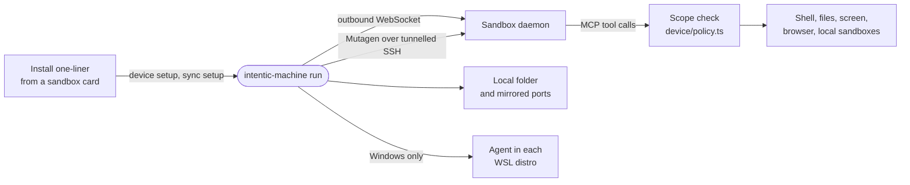

# machine

`intentic-machine`, the one agent on a user's own computer: it lets a paired sandbox work on the device under scopes enforced locally, and mirrors a sandbox's folder and ports onto it.



- One resident process per environment (`resident.ts`) serves both halves and re-reads its state every tick. A login
  entry from [local-agent](../local-agent) restarts it; inside a WSL distro the Windows side does.
- **device** (`src/device/`): `device setup` redeems a one-time pairing token, then the agent keeps a WebSocket
  dialled out to the sandbox and answers MCP tools on it: `run_command`, files, windows and clipboard, `browser_*`
  through [browser](../browser), `screenshot` and `device` through [desktop-automation](../desktop-automation), and
  the intentic sandboxes on this machine through the `ic` CLI.
- The sandbox tools are thin callers of `ic` ([`tools/sandboxes.ts`](src/device/tools/sandboxes.ts)): the listing is
  `ic sandbox list --json` passed through, and start, stop, restart, the swaps, `set-shape` and `forget-shape` are
  ic's own verbs, argv spelled by the contract (`icShapeArgs`, `icPowerArgs`). Nothing here reads docker's view of a
  container or the shape saved for its next restart; ic answers both. Before its first `ic` call the agent makes
  sure the installed `ic` is at least as new as itself, fetching its own release's into `~/.intentic/ic/bin` when it
  is not ([`tools/ic-binary.ts`](src/device/tools/ic-binary.ts)), since a new verb here arrives with a new verb there.
- **sync** (`src/sync/`): `sync setup` enrolls an SSH key and runs Mutagen against the sandbox's sshd, reached
  through a loopback port tunnelled over a WebSocket. It keeps a folder two-way synced, forwards every workspace
  port to the same localhost port, and fast-forwards local git clones from the sandbox.
- **Which computer this is** ([`machine-id.ts`](src/machine-id.ts)): a `machineId` minted once at install and kept
  in `~/.intentic/machine/machine-id`, sent in the connect-time facts, the sync report and the sync enrollment. The
  Windows side hands its own to the agent it starts in each distro, so every OS install of one PC answers with one id;
  a sandbox joins enrollments, sync enrollments and device rows on it, never on a hostname.
- The features a device advertises (`set-shape`, `reshape-later`) are read off the `ic` under it, from that `ic`'s own
  help, rather than listed beside the code; the device RPC inputs are strict, so an op or field this agent does not
  know is refused rather than dropped.
- Every path under the user's home goes through `homeDir()` from [local-agent](../local-agent), which follows a `HOME`
  set after startup; a test holds the sources to it.
- Scopes are enforced here and nowhere else: the sandbox only asks, and a refusal names the switch that is off.
  Files stay inside the configured roots, writes need their own switch, and every call is appended to
  `~/.intentic/machine/audit.jsonl`. While an agent drives input on Windows, a notice shows on screen and
  `PAUSE_HOTKEY` pauses every link.
- Every connection dials out; the only listeners are on loopback.
- On Windows the Windows side is the root of the PC (`src/environments/`): it holds one `wsl.exe` session per
  distro with an agent, and `upgrade` brings every environment to the same release. The root also updates itself
  on a timer and pre-downloads sandbox updates with `ic sandbox prepare --auto`.
- The install shims only put a first binary down and run `setup`; `install.ts` decides the rest. `status --json`
  is what the desktop app's tray reads.

## Key files

- [src/commands.ts](src/commands.ts) — the CLI: `device`, `sync`, `run`, `status`, `upgrade`, `uninstall`.
- [src/resident.ts](src/resident.ts) — the resident process that holds links, pairings and WSL distros.
- [src/device/mcp.ts](src/device/mcp.ts) — every tool a sandbox can call on this device.
- [src/device/policy.ts](src/device/policy.ts) — scope checks and the file-root boundary.
- [src/sync/tunnel.ts](src/sync/tunnel.ts) — the loopback SSH port that fronts the sandbox's sshd.
- [src/environments/machine.ts](src/environments/machine.ts) — the Windows root and its WSL children.

## Commands

```sh
pnpm --filter @intentic/machine test
pnpm turbo run build --filter=./_devices/machine
node _devices/machine/dist/cli.js status
```
