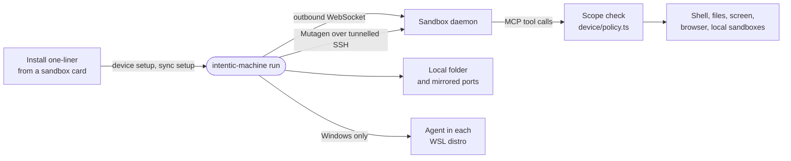

# machine

`intentic-machine`, the one agent on a user's own computer: it lets a paired sandbox work on the device under scopes enforced locally, and mirrors a sandbox's folder and ports onto it.


```mermaid
flowchart LR
    shim["Install one-liner<br/>from a sandbox card"] -->|"device setup, sync setup"| machine(["intentic-machine run"])
    machine -->|"outbound WebSocket"| daemon["Sandbox daemon"]
    daemon -->|"MCP tool calls"| policy["Scope check<br/>device/policy.ts"]
    policy --> local["Shell, files, screen,<br/>browser, local sandboxes"]
    machine -->|"Mutagen over tunnelled SSH"| daemon
    machine --> folder["Local folder<br/>and mirrored ports"]
    machine -->|"Windows only"| distros["Agent in each<br/>WSL distro"]
```

- One resident process per environment (`resident.ts`) serves both halves and re-reads its state every tick. A login
  entry from [local-agent](../local-agent) restarts it; inside a WSL distro the Windows side does.
- **device** (`src/device/`): `device setup` redeems a one-time pairing token, then the agent keeps a WebSocket
  dialled out to the sandbox and answers MCP tools on it: `run_command`, files, windows and clipboard, `browser_*`
  through [browser](../browser), `screenshot` and `device` through [desktop-automation](../desktop-automation), and
  the intentic sandboxes on this machine through the `ic` CLI.
- The sandbox tools are thin callers of `ic` ([`tools/sandboxes.ts`](src/device/tools/sandboxes.ts)): the listing is
  `ic sandbox list --json` passed through, and start, stop, restart, the swaps, `set-shape`, `forget-shape` and the
  logs are ic's own verbs, argv spelled by the contract (`icShapeArgs`, `icPowerArgs`). `diagnose_sandbox` is
  `ic sandbox doctor <slug> --json`, read-only and gated like the logs (`shell` or `sandboxes`), so an agent in another
  sandbox can find out why one on this device is unreachable; it skips the listing, which cannot answer while Docker is
  down, and refuses a slug ic would read as a flag. The shape reaches ic as the
  contract's own object (`--set memoryGib=12`), so no flag of ic's is spelled here; the old `reshape` op is carried
  out through the same verb. A rollback's `to` becomes `ic sandbox rollback <slug> --to <version>`. A sandbox an
  interrupted swap left parked is listed under its own slug and found like any other, so start, rollback and update
  reach it; a listing field a newer ic writes in a way this agent cannot read costs that field, not the whole
  listing. Nothing here runs docker or reads the shape saved for a sandbox's next restart; ic
  answers both. Before its first `ic` call the agent makes
  sure the installed `ic` is at least as new as itself, fetching its own release's into `~/.intentic/ic/bin` when it
  is not ([`tools/ic-binary.ts`](src/device/tools/ic-binary.ts)), since a new verb here arrives with a new verb there.
  A fetch that fails is logged with its reason and reported in the device's facts (`icOutOfDate`, beside `features`),
  so a stale `ic` explains why logs and saving a shape are missing; the next sandbox action tries again.
- **sync** (`src/sync/`): `sync setup` enrolls an SSH key and runs Mutagen against the sandbox's sshd, reached
  through a loopback port tunnelled over a WebSocket. It keeps a folder two-way synced (a project copy-first, below),
  forwards every workspace port to the same localhost port, and fast-forwards local git clones from the sandbox.
- A **project pairing** (`sync setup --remote-dir /work/<name> --project`, what the desktop app asks for when it
  makes a sandbox for a folder the owner picked) syncs that folder with `/work/<name>` rather than `/work`, and nothing
  of the sandbox's is written into it: no state backup session, no git bridge, and an ignore list that keeps a
  project's own `.intentic/` and `refs/` ([`sync/config.ts`](src/sync/config.ts) holds a remote dir to those two
  shapes, and refuses `sync.json` whole otherwise). `setup` refuses a folder that is, holds or sits inside another
  sandbox's, and a set-up-again that would change where a paired sandbox's folder syncs. It is **copy-first** unless
  its owner opted into two-way: see [Copy-first projects](#copy-first-projects).
- Only the resident agent creates Mutagen sessions: `setup` records the pairing and waits for the session to
  appear, since two creators racing left one name holding two identical sessions. The agent keeps one session per
  name, terminating any extras, and recreates a session whose rules drifted (its ignores, its folders, its sync mode,
  its symlink mode). A two-way session replaced by another waits until no conflicts are left and has its derived
  residue swept first; every other replacement happens as soon as the sandbox answers (`settlesFirst` in
  [`sync/mutagen.ts`](src/sync/mutagen.ts) says why for each).
- `setup` replaces what this agent's `known_hosts` holds for the pairing's alias (hashed entries included): with the
  host key the enrollment carries when it carries one (a sandbox reads its sshd's public key off its history volume and
  answers with it, `SyncEnrollmentAnswerSchema` in the contract), else with nothing, so `accept-new` records the key
  the sandbox presents now, as it does for an older sandbox. Outside an enrollment a changed key is still refused. A sandbox whose ports poll has failed for ten
  minutes has its forwards taken off localhost, and they come back with its first answer. `sync uninstall` stops and
  unregisters Mutagen's daemon only when it is this agent's own copy, never a Mutagen the user installed.
- Symbolic links travel only where the device can create them ([`sync/symlinks.ts`](src/sync/symlinks.ts)). A
  Windows PC without Developer Mode refuses every link, and Mutagen would try again on every cycle, so its sessions
  use `--symlink-mode ignore`. Turning Developer Mode on brings them back at the agent's next start.
- **Which computer this is** ([`machine-id.ts`](src/machine-id.ts)): a `machineId` minted once at install and kept
  in `~/.intentic/machine/machine-id`, sent in the connect-time facts, the sync report and the sync enrollment. The
  Windows side hands its own to the agent it starts in each distro, so every OS install of one PC answers with one id;
  a sandbox joins enrollments, sync enrollments and device rows on it, never on a hostname.
- The features a device advertises (`set-shape`, `reshape-later`, `rollback-to`) are read off the `ic` under it, from
  that `ic`'s own help (`ic sandbox shape --set` for the first two, `ic sandbox rollback --to` for the third), rather
  than listed beside the code. The device RPC inputs are strict, so an op or field this agent does not know is refused
  rather than dropped, and a `to` on anything but a rollback is refused. The one exception is the grant a sandbox
  pushes ([`device/grant.ts`](src/device/grant.ts)): a switch this agent does not know is left off and logged once per
  link, since refusing the grant dropped the link and the sandbox redialled it forever. A known switch with a value it
  has no meaning for is still refused. `reshape-later` and the old `reshape` op stay only for pages and daemons from
  before `set-shape` (v1.312.0 and older), and go in v1.314.0.
- Every path under the user's home goes through `homeDir()` from [local-agent](../local-agent), which follows a `HOME`
  set after startup; a test holds the sources to it.
- Scopes are enforced here and nowhere else: the sandbox only asks, and a refusal names the switch that is off.
  Files stay inside the configured roots, writes need their own switch, and every call is appended to
  `~/.intentic/machine/audit.jsonl`. While an agent drives input on Windows, a notice shows on screen and
  `PAUSE_HOTKEY` pauses every link. The one door behind no switch is this agent's own Update and Restart
  (`runAgentFlow`, [`device/tools/agent.ts`](src/device/tools/agent.ts)): no agent tool reaches it, and the sandbox
  admits only a maintainer to it, so the owner's maintenance does not wait on the agents' "Run commands" (2026-09-29;
  it rode that switch before, and an owner had to widen what agents may do to update the agent).
- Every connection dials out; the only listeners are on loopback. One of them is short-lived: while a sandbox's
  sign-in is open, [`device/loopback-catch.ts`](src/device/loopback-catch.ts) listens on the
  `http://localhost:<port>/…` address the provider redirects to, the one a CLI running here would have held, and
  streams each landing back (`catchLoopback`, advertised as the `loopback-catch` feature). It checks nothing: the state
  and the PKCE verifier stay in the sandbox, which alone can tell the sign-in from anything else that hits the port. A
  taken port answers `busy`, and the sandbox leaves the paste to the person.
- On Windows the Windows side is the root of the PC (`src/environments/`): it holds one `wsl.exe` session per
  distro with an agent, and `upgrade` brings every environment to the same release. The root also updates itself
  on a timer and pre-downloads sandbox updates with `ic sandbox prepare --auto`.
- The install shims only put a first binary down and run `setup`; `install.ts` decides the rest. `status --json`
  is what the desktop app's tray reads.

### Copy-first projects

A project's folder flows **one way**, this device to the sandbox, so nothing an agent does in `/work/<name>` (an
`rm -rf` included) reaches the owner's files. What an agent changed comes back only when the owner asks, through
`sync bring-back`, which keeps a restore point first. Two-way stays one switch away.

- **Direction** is the pairing's `direction` in `sync.json`: `"to-sandbox"` (Mutagen's `one-way-safe`, this device as
  alpha) or `"both"` (`two-way-safe`, as every workspace pairing). Absent, as on every project paired before it existed,
  means `"to-sandbox"`, and so does a value this build has no word for; it means nothing on a workspace pairing
  ([`sync/config.ts`](src/sync/config.ts) `projectDirection`). An older agent keeps the field through every write but a
  `setup` (which resets it, with the pairing's other switches), and keeps the copy-first session it finds, since it never
  compared sync modes. `sync direction` rewrites the field; the watcher sees the new mode on its next tick and recreates
  the session (`sessionMatchesSpec` compares the live session's `mode`).
- **Replacements** into copy-first happen at once, conflicts or not, with no flush and no residue sweep: a last flush
  of a two-way session would carry the sandbox's latest changes into the folder, and the new session never writes here.
  Out of copy-first too: a one-way session's conflicts are the agent's kept edits, which differ whoever holds them. This
  is how every existing project becomes copy-first on its first start of this build.

**What one-way-safe does**, measured with Mutagen 0.18.1 over ssh against an sshd whose `/work` was a scratch folder,
driving this agent's own session code and CLI (alpha is this device, beta the sandbox):

| The sandbox (an agent)… | Mutagen one-way-safe |
|---|---|
| edits a file this folder has | keeps the sandbox's version and reports it as a conflict; this folder is untouched |
| creates a file | keeps it in the sandbox, no conflict; nothing reaches this folder |
| deletes a file or a folder | puts it back from this folder on the next cycle |
| runs `rm -rf /work/<name>/*`, or removes `/work/<name>` | refills the sandbox's copy from this folder; this folder is untouched |

| This device… | Mutagen one-way-safe |
|---|---|
| edits, creates or deletes a file | carries it to the sandbox, except over a file the sandbox changed, which is kept |
| deletes a file the sandbox changed | the sandbox keeps its version, and the conflict clears |

A fresh session over two copies that already differ (what any replacement starts from) deletes nothing on either side.
One-way-safe copies what only this folder has into the sandbox and keeps every sandbox file that differs, as a conflict.
Two-way-safe also copies what only the sandbox has into this folder, and reports what differs on both as a conflict.
`mutagen sync list --template '{{json .}}'` prints the mode as a top-level `mode`, absent on a session created without
`--sync-mode`, which Mutagen runs two-way-safe.

**The commands**, all under `intentic-machine sync`, name the project by `--dir <its folder>` (links resolved, case
folded where the platform folds it). With `--json` each prints exactly one JSON object on stdout, and on failure
`{ "ok": false, "error": "<sentence>" }` with exit code 1. The desktop app parses these, so fields are only ever added.

| Command | Success output |
|---|---|
| `sync changes` | `{ "ok": true, "pairing": "<id>", "direction": "to-sandbox"\|"both", "changes": [{ "path", "kind": "added"\|"modified"\|"deleted", "size"?, "conflict"?: true }], "truncated"?: true }` |
| `sync bring-back [--path <p>]... [--paths-file <file>]` | `{ "ok": true, "point": "<id>", "applied": [{ "path", "kind" }], "skipped": [{ "path", "reason" }] }` |
| `sync restore-points` | `{ "ok": true, "points": [{ "id", "createdAt", "entries": n }] }` |
| `sync restore --point <id>` | `{ "ok": true, "restored": n, "skipped": [{ "path", "reason" }] }` |
| `sync direction <to-sandbox\|both>` | `{ "ok": true, "direction": "…" }` |

- **`sync changes`** lists what the sandbox did, relative paths with `/`, sorted, the first 5,000 (`truncated` when
  there were more): `added` exists only in the sandbox's copy, `modified` on both with different content (`size` is the
  sandbox copy's), `deleted` was removed there. The sandbox is listed by ONE command over the pairing's ssh alias, a
  node program that walks `/work/<name>` and prints path, size and sha256 NUL-separated, so any name survives. This
  device is walked the same way, reading a file only where its size matches the sandbox's, through a hash cache keyed
  by path, size and times in `~/.intentic/machine/hashes/<pairing>.json`. Both walks prune by the pairing's ignore list
  read as Mutagen reads it: a name, `*` within it, at any depth (or at the root with a leading `/`), taking a matched
  folder's contents along; any other spelling is refused rather than approximated. Mutagen's `.mutagen-temporary-*`
  scratch files are left out too, and so are links and anything else that is not a regular file, on either side.
- **Whose change it is, and never over a newer edit.** The same cache file records each path's content when both
  copies were last seen equal. A difference the sandbox did not move away from (an edit made here, still on its way) is
  not listed at all. A file only this device holds is offered as `deleted` only when that record shows the sandbox had
  exactly this copy. A `modified` file is written over here only when this device's copy is still what the two last
  agreed on, which only a session that was running and whose flush just finished a whole cycle can show. Mutagen's own
  record says so for the files it reports in conflict (ten at most, each with SHA-1 digests of what the two last agreed
  on and of this device's copy, the latter checked against the file here now); the listing record says so for the rest.
  Anything else is listed with `conflict: true` and skipped by bring-back with its reason, even when named by `--path`:
  both copies moved (a record gone stale while the sync was paused, say, with the owner's own older version in the
  sandbox), no record of the two ever agreeing on it, or a session that was paused, absent, or whose flush did not
  finish. Since one-way-safe puts an agent's deletions back, `deleted` shows up mainly while the session is paused, and
  a rename in the sandbox comes back as an addition (the old name is put back there). The record is written only by
  whoever holds the folder's lock, so a listing beside a running bring-back never undoes what that one recorded.
- **`sync bring-back`** runs with the session paused (after a flush) if it was running, and leaves one somebody paused
  as it is. It lists both sides and fetches the `added` and `modified` files in ONE ssh stream into a private staging
  folder, each checked against the listing's sha256 (a file that changed since is skipped with the reason). Then it
  writes the restore point, and only then touches the folder: each file renamed into place from a copy beside it, only
  where the folder still holds what the point kept of it. `deleted` files are removed with the folders they leave
  empty. `--path` takes a file or a folder, repeatable; `--paths-file` names a UTF-8 file holding a JSON array of such
  paths (a Windows command line holds 32,767 characters, fewer than a long selection), taken together with any
  `--path`. An unreadable file, one that is not such an array, or an empty one (which would otherwise mean every change)
  is refused before anything is listed. A new file gets the sandbox copy's executable bit. Nothing is written through a
  link: every folder on the way is checked.
- **Why the session pushes nothing stale back.** Paused, it runs no cycle between the listing, the fetch and the writes,
  and on resume it rescans both sides. What was written here is byte for byte the sandbox's, so both sides moved from
  their last agreement to the same content: Mutagen records that and transfers nothing. A sandbox file that changed
  again meanwhile is a sandbox modification one-way-safe keeps, as a conflict. The e2e run checked all of it: no
  conflicts after resume, the sandbox still holding the agent's content, and a later edit here carried over as usual.
- **Restore points** live in `~/.intentic/machine/restore/<pairing>/<id>/`, the id being the creation time in ISO 8601
  basic format (`20260928T213000.123Z`, a folder name on every system). Each holds `manifest.json`, which is
  `{ id, createdAt, dir, entries: [{ path, kind, backedUp, applied, backup?, mode? }] }` (`applied` is the sha256
  bring-back left, null for a deletion), and `files/<path>`, a copy of every file bring-back overwrote or deleted. Only
  what was actually written stays in the manifest. All of it is on the disk before the first write here: each copy is
  flushed as it is made, the manifest by a durable write, then every folder of the point up to `restore/<pairing>`, so a
  crash right after a bring-back never finds the folder rewritten and the copies empty. Files put in the folder are
  flushed before the rename that places them.
- **Retention**, after each bring-back and under its lock: a pairing keeps its newest 20 points that hold files, plus
  every such point younger than 30 days. A point that holds nothing (a bring-back that wrote nothing, or one cut off
  before its manifest) never counts toward the 20, is never listed, and goes at the next bring-back. Until then it is
  the `point` that bring-back answered with, so that answer always names a real point, as the desktop app expects.
- **`sync restore --point <id>`** puts each backed-up file back and removes each file bring-back added, where the
  folder still holds exactly what bring-back left (by sha256). Anything else is skipped and reported, one already put
  back included. Copy-first then carries the restored files to the sandbox, as it does any edit here, so the agent's
  versions they replace are gone from there too.
- One bring-back or restore runs per folder at a time (`restore/<pairing>/.operation.pid`, a pid of this boot, checked
  alive). A pause an operation made and never lifted (the process killed in between) is recorded in
  `restore/<pairing>/.paused`, and the next command about that folder resumes the session.

### Upgrades that can be undone

- **A swap is never cut short by this agent.** `ic` runs in a process group of its own on POSIX, keeps its pipes, and
  is never killed when the link or request that asked for it goes away. The one run it ever stops is the keeper's
  `sandbox fix` past its deadline (below), which is not a swap. Every restart of the agent (the auto-upgrade
  tick, `upgrade`, `run`, the browser's Update and Restart) waits while any channel record in this environment's ic
  home (`INTENTIC_HOME`, else `~/.intentic`) says `swap_phase=cutover` with `swap_at` in the last 30 minutes, or while
  this process runs a flow that moves a container ([`device/sandbox-rounds/swap-records.ts`](src/device/sandbox-rounds/swap-records.ts)); the tick
  looks again in five minutes, a command waits and says so.
- **The probation watch** ([`device/sandbox-rounds/probation-watch.ts`](src/device/sandbox-rounds/probation-watch.ts)) runs
  `ic sandbox watch <slug> --json` every minute for each sandbox whose record names a `swap_phase`, and
  `ic sandbox watch --json` over every sandbox half a minute after start (a reboot mid-swap) and every ten minutes.
  ic finishes or undoes an interrupted cutover and rolls a failing new version back; the agent logs what it did.
  The per-record watch runs in every environment, since only the environment that swapped holds the record; the sweep
  over every sandbox runs on the root only, as the daily jobs below do, because a WSL distro shares the Windows
  side's Docker engine.
- **Daily**, on the root: `ic sandbox backup <slug> --auto --json` for each running sandbox, one at a time, twenty to
  forty minutes after start and then every day, then one `ic sandbox tidy --json`, whose volumes nobody claims are
  named and never deleted. Both back off from a slug that keeps failing, as auto-prepare does, and each has its switch
  beside the update ones (`intentic-machine updates --backups off`, `--tidy off`).
- **File sync holds still while its sandbox is swapped here** ([`sync/swap-pause.ts`](src/sync/swap-pause.ts)). A
  pairing's local slug is the first label of its sandbox's public hostname (what ic names a sandbox with one) or the
  id in it (what ic names one from its connect token), so the mapping is exact. Its sessions are paused through the
  cutover and the first quarter hour of probation, and past that while the sandbox does not answer, then resumed; a
  pause somebody made is left alone. Only this environment's records count: a distro syncing a sandbox the Windows side
  swaps is not paused.
- **A self-update is kept undoable** ([`agent-trial.ts`](src/agent-trial.ts)). The replaced binary stays as
  `<bin>.previous` until the new agent has run for ten minutes and written its "healthy since" marker. Three starts of a
  release within ten minutes, none ended by a stop, restart or upgrade, put `.previous` back (at that start, or at the
  next upgrade pass) and record the release as `skippedAgent` in `machine.json`: neither the auto-upgrade nor an
  `upgrade` moves this environment onto it again until a newer one is published (`upgrade --force` does). A restart
  that throws during an upgrade puts the old binary back too.
- **What the agent leaves behind.** Under a systemd user unit the default `KillMode` ended the unit's whole cgroup on
  every `systemctl stop` and every agent exit, `ic` mid-swap included: the unit now says `KillMode=process`, and a
  unit an older build wrote is rewritten at the agent's next start, since a repair now replaces an entry that starts
  this same agent with other settings. What outlives the agent on purpose is `ic` (bounded by its own swap), Mutagen's
  daemon and the browser it opened; what must not, the agent ends itself: every `run_command` group still running
  when it stops, and on Linux the groups a crashed agent left, which the next agent ends at its start
  ([`tools/command-ledger.ts`](src/device/tools/command-ledger.ts)). The login entries of the two agents this one
  replaced on 2026-08-29 (`intentic-host`, the sync mirror) are removed once, at start.
- `intentic-machine sandbox <verb> [slug]` passes `list`, `start`, `stop`, `restart`, `update`, `rollback [--to]`,
  `versions`, `logs`, `doctor`, `watch`, `backup`, `backups` and `fix [--code] [--auto] [--yes] [--accept] [--json]
  [--source]` straight to ic, in this terminal, with ic's exit code: a sandbox can be looked at and repaired from here
  when no browser reaches it, and `fix` asks here for the yes the keeper never gives.

### The keeper

When a sandbox on this machine stops answering (Docker Desktop not started after a reboot, a stopped container, a
daemon whose registration gave up, a full disk), the agent heals what is safe to heal by itself and reports the rest
([`device/sandbox-rounds/keeper.ts`](src/device/sandbox-rounds/keeper.ts)). ic does every fix; the keeper keeps the
clock.

- **When.** `ic sandbox fix --auto --json --source agent` over every sandbox half a minute after the agent starts (the
  logon case: Docker Desktop is off by default after a reboot) and every five minutes, and `ic sandbox fix <slug> …` as
  soon as the agent's link to a sandbox that runs on this machine has failed for a minute. A link's sandbox runs here
  when this environment's ic has a record of it or listed it (by its hostname's first label or the id in it, as sync's
  swap pause maps them), or when the agent has reached it over loopback.
- **What ic does by itself** under `--auto`: starts Docker Desktop and waits for it, starts a sandbox its owner did not
  stop on purpose, restarts one whose registration gave up, tidies when the disk is low. It posts its report to the
  platform itself; nothing comes back down to the device (there is no platform-to-device relay).
- **What the keeper never does**: apply a fix that needs a yes (each is logged with `intentic-machine sandbox fix
  <slug>`, which asks in a terminal, as the desktop app's buttons and the recovery panel's command do), run two fixes at
  once, run while the probation watch is running ic, fix a sandbox a swap is moving or one a flow of this agent holds,
  or start the sweep while any flow runs. Each run holds the sandboxes it may touch as a flow that moves a container,
  so the other rounds leave them alone and the agent does not restart under it.
- **Bounded.** A run is stopped after eight minutes (starting Docker Desktop alone can take five), with its process
  group on POSIX and its process tree on Windows.
- **Waiting.** A sandbox whose run left something (needs-you, failed, no verdict) waits 3 minutes, then 6, 12, 24 and
  30 at most, and the wait ends when its link comes back. One ic found healthy or fixed while its link stays down is
  asked about again after five minutes, not every ten seconds. The sweep's own cadence stretches on the same ladder
  (never under five minutes) while a sweep leaves something. An ic that cannot fix (one from before `sandbox fix`,
  which clap refuses with no JSON, or no ic at all) is said once and asked again on the same ladder.
- **The log** (`~/.intentic/machine/machine.log`, like every round): what ic is doing as it does it, and each
  sandbox's verdict when it changes (a standing `healthy` or `needs-you` is said once per stretch; `fixed` always).
- **Where.** Every environment runs its own keeper, since `ic sandbox fix` knows only the sandboxes its own ic keeps
  records of; a WSL distro's shares the Windows side's Docker Desktop.
- **The switch** is this environment's `sandboxKeeper` in `machine.json` (absent means on), set by
  `intentic-machine sandbox keeper on|off` and read by `keeper status`. It is re-read every round.
- **It keeps the agent resident.** An agent with no link, no pairing and no distro to serve used to take its login
  entry away and exit, and then nothing started Docker Desktop after the next reboot. It now stays while the keeper is
  on and this machine hosts a sandbox other than a runner: the ones `ic sandbox list --json` names when Docker answers,
  else the ones ic keeps a record of (a removed sandbox's record lasts until `ic sandbox tidy` archives it, so the
  listing wins whenever it answers). The resident asks at start and then every five minutes, and only while it has
  nothing else to serve. `keeper off` lets it go; `intentic-machine uninstall` retires it whatever this machine hosts,
  while `device uninstall` and `sync uninstall` leave it running for the sandboxes here and say so (2026-09-30:
  retiring as before was rejected, since a machine whose last link was revoked kept its sandbox down after every
  reboot).

## Key files

- [src/commands.ts](src/commands.ts) — the CLI: `device`, `sync`, `sandbox`, `run`, `status`, `upgrade`, `updates`, `uninstall`.
- [src/resident.ts](src/resident.ts) — the resident process that holds links, pairings and WSL distros.
- [src/device/mcp.ts](src/device/mcp.ts) — every tool a sandbox can call on this device.
- [src/device/policy.ts](src/device/policy.ts) — scope checks and the file-root boundary.
- [src/sync/tunnel.ts](src/sync/tunnel.ts) — the loopback SSH port that fronts the sandbox's sshd.
- [src/environments/machine.ts](src/environments/machine.ts) — the Windows root and its WSL children.

## Commands

```sh
pnpm --filter @intentic/machine test
pnpm turbo run build --filter=./_devices/machine
node _devices/machine/dist/cli.js status
```
