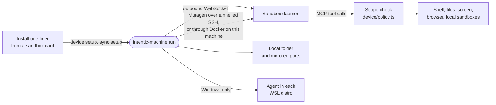

# machine

`intentic-machine`, the one agent on a user's own computer: it lets a paired sandbox work on the device under scopes enforced locally, and mirrors a sandbox's folder and ports onto it.


```mermaid
flowchart LR
    shim["Install one-liner<br/>from a sandbox card"] -->|"device setup, sync setup"| machine(["intentic-machine run"])
    machine -->|"outbound WebSocket"| daemon["Sandbox daemon"]
    daemon -->|"MCP tool calls"| policy["Scope check<br/>device/policy.ts"]
    policy --> local["Shell, files, screen,<br/>browser, local sandboxes"]
    machine -->|"Mutagen over tunnelled SSH,<br/>or through Docker on this machine"| daemon
    machine --> folder["Local folder<br/>and mirrored ports"]
    machine -->|"Windows only"| distros["Agent in each<br/>WSL distro"]
```

- One resident process per environment (`resident.ts`) serves both halves and re-reads its state every tick. A login
  entry from [local-agent](../local-agent) restarts it; inside a WSL distro the Windows side does.
- **device** (`src/device/`): `device setup` redeems a one-time pairing token, then the agent keeps a WebSocket
  dialled out to the sandbox and answers MCP tools on it: `run_command`, files, windows and clipboard, `browser_*`
  through [browser](../browser), `screenshot`, `device`, `ui_elements` and `ui_act` through
  [desktop-automation](../desktop-automation), and the intentic sandboxes on this machine through the `ic` CLI.
- What the agent has been shown of the screen is kept for the process's life
  ([`tools/view.ts`](src/device/tools/view.ts)): each screenshot is a frame with an id, shrunk to what a model reads
  whole, and a coordinate is read in the newest frame and mapped back to desktop pixels, so one naming an older frame
  is refused. An action's confirming screenshot re-captures the same part of the screen, and up to two identical ones
  in a row come back as a sentence instead of the image. Element refs from `ui_elements` hold until the next listing.
- Input has two rules no switch lifts and one a switch decides ([`tools/device.ts`](src/device/tools/device.ts)):
  keys that lock or leave the desktop (`super+l`, `ctrl+alt+Delete`, a console switch) are refused; text typed,
  pasted or set into a field that the command classifier reads as destructive needs "Run destructive commands",
  as running it would. The sandbox also judges that text with the owner's safety policy before it crosses
  (`hosts/host-command-guard.ts`, `typedInCall`).
- An Android phone attached to the machine over adb, by USB or wireless debugging, gets its own tools
  ([`tools/android.ts`](src/device/tools/android.ts), its parsers in `android-parse.ts`): `android_devices`,
  `android_screenshot`, `android_ui_elements`, `android_act`, `android_shell`, `android_install` and
  `android_logcat`. adb is found in `ANDROID_HOME`, `ANDROID_SDK_ROOT`, Android Studio's SDK, then `PATH`, afresh
  on every call; without it each tool answers how to install platform-tools. A call names a phone by `serial` and
  is refused when several are attached and none is named. Phone screenshots are frames like the desktop's, in a
  `FrameLog` per phone and shown as `phone-…`, so a desktop frame is never read as a phone one. Element refs
  (`e1`…) come from the uiautomator dump and hold until the next listing. The switches are the desktop's:
  `screen` to look, `control` to touch, `shell` for the shell, logcat and the device list, `shell` and `write` to
  install. Keys that lock the phone (POWER, SLEEP) are refused, and a command or typed text the classifiers read
  as destructive (the shared one, plus `pm uninstall`, `pm clear`, `rm -r`, `settings put`, `svc`, `reboot`, a
  wipe) needs "Run destructive commands". The sandbox judges `android_shell` as `adb shell <command>` and text
  typed with `android_act` like the desktop's, before either crosses.
- The sandbox tools are thin callers of `ic` ([`tools/sandboxes.ts`](src/device/tools/sandboxes.ts)): the listing is
  `ic sandbox list --json` passed through, and start, stop, restart, the swaps, `set-shape`, `forget-shape` and the
  logs are ic's own verbs, argv spelled by the contract (`icShapeArgs`, `icPowerArgs`). `diagnose_sandbox` is
  `ic sandbox doctor <slug> --json`, read-only and gated like the logs (`shell` or `sandboxes`), so an agent in another
  sandbox can find out why one on this device is unreachable; it skips the listing, which cannot answer while Docker is
  down, and refuses a slug ic would read as a flag. The shape reaches ic as the
  contract's own object (`--set memoryGib=12`), so no flag of ic's is spelled here; the old `reshape` op is carried
  out through the same verb. A rollback's `to` becomes `ic sandbox rollback <slug> --to <version>`. A sandbox an
  interrupted swap left parked is listed under its own slug and found like any other, so start, rollback and update
  reach it; a listing field a newer ic writes in a way this agent cannot read costs that field, not the whole
  listing. Nothing here runs docker or reads the shape saved for a sandbox's next restart; ic
  answers both. Before its first `ic` call the agent makes
  sure the installed `ic` is at least as new as itself, fetching its own release's into `~/.intentic/ic/bin` when it
  is not ([`tools/ic-binary.ts`](src/device/tools/ic-binary.ts)), since a new verb here arrives with a new verb there.
  A fetch that fails is logged with its reason and reported in the device's facts (`icOutOfDate`, beside `features`),
  so a stale `ic` explains why logs and saving a shape are missing; the next sandbox action tries again.
- **sync** (`src/sync/`): `sync setup` enrolls this machine and runs Mutagen against the sandbox: over ssh to its
  sshd, reached through a loopback port tunnelled over a WebSocket, or, for a project whose sandbox container runs on
  this machine's own Docker engine, through Docker itself (below). It keeps a folder two-way synced (a project
  copy-first, below), forwards every workspace port to the same localhost port (see [Mirrored ports](#mirrored-ports)),
  and fast-forwards local git clones from the sandbox.
- A **project pairing** (`sync setup --remote-dir /work/<name> --project`, what the desktop app asks for when it
  makes a sandbox for a folder the owner picked) syncs that folder with `/work/<name>` rather than `/work`, and nothing
  of the sandbox's is written into it: no state backup session, no git bridge, and an ignore list that keeps a
  project's own `.intentic/` and `refs/` ([`sync/config.ts`](src/sync/config.ts) holds a remote dir to those two
  shapes, and refuses `sync.json` whole otherwise). `setup` refuses a folder that is, holds or sits inside another
  sandbox's, in this environment or another of this PC's (see [What folder sync owns](#what-folder-sync-owns)), and a
  set-up-again that would change where a paired sandbox's folder syncs. It is **copy-first** unless
  its owner opted into two-way: see [Copy-first projects](#copy-first-projects).
- **Through Docker** ([`sync/endpoint.ts`](src/sync/endpoint.ts)): with `setup --transport auto`, the default, a
  project's sandbox is reached through this machine's own Docker engine when the container `ic` named after the
  pairing URL's slug is running there with that URL as its `SANDBOX_PUBLIC_URL`. Anything else stays on ssh: a hosted
  sandbox, one on another computer, a workspace pairing (its git bridge and state backup ride ssh).
  - The session is `docker://<container>/work/<name>` and the forwards are `docker://<container>:tcp:…`. The
    bring-back's listing and fetch and the residue probe run through `docker exec`, with the same programs ssh carries.
  - Setup therefore skips `known_hosts`, the ssh-config block, the tunnel listener and the ssh probes.
  - The pairing records `transport: "docker"` and its `container`. `sync.json` holds that name to a sandbox
    container's, and the container is checked to still be this sandbox before any session is made through it.
  - Enrollment, the ports read and the report still go to the sandbox's own address, so the tunnel is untouched.
  - Existing ssh pairings keep ssh until they are set up again.
  - (2026-10-05) The transport is no longer decided once: the container is asked after on every prepare and every
    minute (`checkContainers` in [`sync/gone-watch.ts`](src/sync/gone-watch.ts)). A stopped container, or an engine that
    does not answer, changes nothing. A container the engine no longer holds is looked up in ic: still listed (a swap
    moving it) changes nothing; in ic's trash pauses the folder's sync with that reason. When the sandbox still answers
    at its address, whether ic holds it nowhere or cannot say, it lives elsewhere now and the pairing moves onto ssh
    (paused instead without an enrollment to ride); in neither and silent, the sandbox is gone (below); otherwise its
    sync is paused until the container is back.

  (2026-10-01) Measured on Docker Desktop from Windows and from WSL: a session was up in 2–4 s, against up to 90 s
  through the tunnel. Bind-mounting the folder into the container was rejected: a land or an agent's `rm -rf` would
  write straight into the owner's folder, the daemon would move its `.git` onto `/history`, and on Windows and macOS
  every read would cross 9p or virtiofs, with no inotify for the owner's own edits.
- Only the resident agent creates Mutagen sessions: `setup` records the pairing and waits for the session to
  appear, since two creators racing left one name holding two identical sessions. The agent keeps one session per
  name, terminating any extras, and recreates a session whose rules drifted (its ignores, its folders, its sync mode,
  its symlink mode, how often it scans the sandbox). A two-way session replaced by another waits until no conflicts
  are left and has its derived residue swept first; every other replacement happens as soon as the sandbox answers
  (`settlesFirst` in [`sync/mutagen.ts`](src/sync/mutagen.ts) says why for each). Every session and forward is created
  with three Mutagen labels, `intentic-owner=<machineId>-<environment>`, `intentic-sandbox=<sanitized id>` and
  `intentic-kind=sync|state|forward`; see [What folder sync owns](#what-folder-sync-owns).
- **This computer's own sandbox takes folders** (see [Folders attached to this computer's sandbox](#folders-attached-to-this-computers-sandbox)):
  `sync setup --projects-host` enrolls it with no folder of its own, and each folder the owner opens attaches to it as
  `/work/<name>` (`sync attach`), copy-first, with the land of a conversation written back into it by itself
  (`deliverProject`).
- **What file sync costs this device is cycles, and the sandbox's side decides how many.** Mutagen's agent in the
  sandbox has no recursive watcher, and both sessions force it to poll (`--watch-mode-<side> force-poll`): every 2 s
  for the workspace, which is how late an agent's edit reaches the folder, and every 60 s for the state backup, which
  nobody waits on. Mutagen's own mode there (`portable`) would also rescan on every write to any of the 50 paths that
  changed last, which no interval bounds. Each scan that finds a change is a cycle here, and a cycle's cost follows
  the size of the tree rather than of the change: the daemon reads the sandbox's whole snapshot again and reconciles
  all of it. This device's side watches for real, but Mutagen's watcher wakes on every write under the folder, ignored
  paths included, so the backup landing in `.intentic` wakes the workspace session too. The report reads every session
  in one `sync list`.

  (2026-10-02) Measured on Windows with Mutagen 0.18.1, its daemon isolated and a container standing in for the
  sandbox (a 9k-file workspace, a 15k-entry state dir with three transcripts growing by 6 KB a second, an edit every
  3 s and a build a minute, three minutes a run). Before: the daemon spent 30% of a core and the sandbox's agent 22%.
  With only the transcripts growing, it was 25%, and 386 of the workspace session's cycles had been woken by the backup
  with no workspace change at all. Either half alone barely moved it: a 60 s interval left 22% (312 backup cycles,
  since `portable` rescans on writes), forced polling every 2 s left 20%. Both together: 2.6% and 2.5%, 6 backup
  cycles, and the workspace's own edits cost exactly what they did before (120 cycles, 1.9%). Idle, the sandbox's
  agent went from 5.5% to 1.6%. Moving the backup out of the folder was measured too and rejected: it removes only the
  woken cycles, and the copy belongs where the owner already looks. So were `--hash xxh128` and `--compression none`
  on top (5.3 s of the daemon's CPU against 5.2 s): no gain worth recreating every session for, or tying the agent to
  a Mutagen build with its SSPL-licensed extras.
- `setup` replaces what this agent's `known_hosts` holds for the pairing's alias (hashed entries included): with the
  host key the enrollment carries when it carries one (a sandbox reads its sshd's public key off its history volume and
  answers with it, `SyncEnrollmentAnswerSchema` in the contract), else with nothing, so `accept-new` records the key
  the sandbox presents now, as it does for an older sandbox. Outside an enrollment a changed key is still refused. A sandbox whose ports poll has failed for ten
  minutes has its forwards taken off localhost, and they come back with its first answer; after an hour its sessions
  are paused, an hour counted from `unreachableSince` in `sync.json` (2026-10-05: it was counted in memory, so an agent
  restarted more often than hourly never paused a dead sandbox's sessions). A sandbox that no longer exists is another
  matter: see [Sandboxes that are gone](#sandboxes-that-are-gone). `sync uninstall` stops and unregisters Mutagen's
  daemon only when it is this agent's own copy and no Mutagen the user installed is on PATH, since one daemon serves
  both.
- Symbolic links travel only where the device can create them ([`sync/symlinks.ts`](src/sync/symlinks.ts)). A
  Windows PC without Developer Mode refuses every link, and Mutagen would try again on every cycle, so its sessions
  use `--symlink-mode ignore`. Turning Developer Mode on brings them back at the agent's next start.
- **Which computer this is** ([`machine-id.ts`](src/machine-id.ts)): a `machineId` minted once at install and kept
  in `~/.intentic/machine/machine-id`, sent in the connect-time facts, the sync report and the sync enrollment. The
  Windows side hands its own to the agent it starts in each distro, so every OS install of one PC answers with one id;
  a sandbox joins enrollments, sync enrollments and device rows on it, never on a hostname.
- The features a device advertises (`set-shape`, `reshape-later`, `rollback-to`, `background-prepare`) are read off
  the `ic` under it, from that `ic`'s own help (`ic sandbox shape --set` for the first two, `ic sandbox rollback --to`
  for the third, `ic sandbox prepare --auto` for the fourth), rather than listed beside the code. The agent's own two,
  `loopback-catch` and `project-delivery`, are always advertised, since this build answers both. `background-prepare`
  is the `prepare-background` op the update card sends when it opens: the same unattended download as the timer's,
  run now. The device RPC inputs are strict, so an op or field this agent does not know is refused
  rather than dropped, and a `to` on anything but a rollback is refused. The one exception is the grant a sandbox
  pushes ([`device/grant.ts`](src/device/grant.ts)): a switch this agent does not know is left off and logged once per
  link, since refusing the grant dropped the link and the sandbox redialled it forever. A known switch with a value it
  has no meaning for is still refused. `reshape-later` and the old `reshape` op stay only for pages and daemons from
  before `set-shape` (v1.312.0 and older), and go in v1.314.0.
- Every path under the user's home goes through `homeDir()` from [local-agent](../local-agent), which follows a `HOME`
  set after startup; a test holds the sources to it.
- Scopes are enforced here and nowhere else: the sandbox only asks, and a refusal names the switch that is off.
  Files stay inside the configured roots, writes need their own switch, and every call is appended to
  `~/.intentic/machine/audit.jsonl`, set aside as `audit.jsonl.1` once it reaches 8 MB (2026-10-05: it grew without
  limit; the writer rolls it itself, and the [upkeep](#upkeep) does for an agent that wrote nothing lately). While an
  agent drives input on Windows, a notice shows on screen and
  `PAUSE_HOTKEY` pauses every link. The one door behind no switch is this agent's own Update and Restart
  (`runAgentFlow`, [`device/tools/agent.ts`](src/device/tools/agent.ts)): no agent tool reaches it, and the sandbox
  admits only a maintainer to it, so the owner's maintenance does not wait on the agents' "Run commands" (2026-09-29;
  it rode that switch before, and an owner had to widen what agents may do to update the agent).
- Every connection dials out; the only listeners are on loopback. One of them is short-lived: while a sandbox's
  sign-in is open, [`device/loopback-catch.ts`](src/device/loopback-catch.ts) listens on the
  `http://localhost:<port>/…` address the provider redirects to, the one a CLI running here would have held, and
  streams each landing back (`catchLoopback`, advertised as the `loopback-catch` feature). It checks nothing: the state
  and the PKCE verifier stay in the sandbox, which alone can tell the sign-in from anything else that hits the port. A
  taken port answers `busy`, and the sandbox leaves the paste to the person.
- On Windows the Windows side is the root of the PC (`src/environments/`): it holds one `wsl.exe` session per
  distro with an agent, and `upgrade` brings every environment to the same release. The root also updates itself
  on a timer and pre-downloads sandbox updates with `ic sandbox prepare --auto`, which the update card can also ask
  for at once (`prepare-background`) and follows while it runs (ic's `update-preparing.json`).
- The install shims only put a first binary down and run `setup`; `install.ts` decides the rest. `status --json`
  is what the desktop app's tray reads.

### Mirrored ports

Every workspace port a paired sandbox listens on is forwarded to the same port on this device's localhost
([`sync/mirror.ts`](src/sync/mirror.ts)). The watcher reads each sandbox's ports every five seconds. A port it does not
put on localhost is still reported, with its reason:

- `busy`: something on this machine holds the number. That is a process bound to it now, a container on this
  machine's Docker that publishes it, or a holder seen too recently (below).
- `held-by-sandbox`: another sandbox paired here already mirrors it.
- `ignored`: this device was told to leave the number alone, by `intentic-machine sync mirror ignore --sandbox <id>
  --port <n>` (without `--sandbox`, for every pairing). `unignore` hands it back, and it is mirrored once it is free.

Two rules cover what a bind probe cannot see, a holder that is down for a moment:

- **A port any container on this machine's Docker publishes is never mirrored**: a running container's, and a stopped
  one's whose restart policy (`always` or `unless-stopped`) brings it back by itself. A forward already on such a port
  is taken down. Docker is asked (`docker ps`, then `docker inspect`) at most every 30 seconds; when it cannot be asked,
  the next rule holds alone. A container's name appears in the agent's log, never in a report.
- **A port seen busy stays skipped until it has been free for 15 minutes**, which covers a Docker restart. Its `busy`
  row in `sync.json` is the memory, so an agent restarted meanwhile still holds the port off, and starts the 15 minutes
  over. A port held by another paired sandbox's forward is filed `held-by-sandbox` instead, and waits for nothing.

(2026-10-02) Both rules replaced trusting one instant's bind probe on 127.0.0.1, which handed the host's own Postgres
port to a sandbox during a Docker Desktop restart. The agent came back first and found 5440 free before Docker had
published it again; Docker's own publish then failed for good, and the host's API read the sandbox's empty database.

### Copy-first projects

A project's folder flows **one way**, this device to the sandbox, so nothing an agent does in `/work/<name>` (an
`rm -rf` included) reaches the owner's files. What an agent changed comes back only when the owner asks, through
`sync bring-back`, which keeps a restore point first. Two-way stays one switch away.

- **Direction** is the pairing's `direction` in `sync.json`: `"to-sandbox"` (Mutagen's `one-way-safe`, this device as
  alpha) or `"both"` (`two-way-safe`, as every workspace pairing). Absent, as on every project paired before it existed,
  means `"to-sandbox"`, and so does a value this build has no word for; it means nothing on a workspace pairing
  ([`sync/config.ts`](src/sync/config.ts) `projectDirection`). An older agent keeps the field through every write but a
  `setup` (which resets it, with the pairing's other switches), and keeps the copy-first session it finds, since it never
  compared sync modes. `sync direction` rewrites the field; the watcher sees the new mode on its next tick and recreates
  the session (`sessionMatchesSpec` compares the live session's `mode`).
- **Replacements** into copy-first happen at once, conflicts or not, with no flush and no residue sweep: a last flush
  of a two-way session would carry the sandbox's latest changes into the folder, and the new session never writes here.
  Out of copy-first too: a one-way session's conflicts are the agent's kept edits, which differ whoever holds them. This
  is how every existing project becomes copy-first on its first start of this build.

**What one-way-safe does**, measured with Mutagen 0.18.1 over ssh against an sshd whose `/work` was a scratch folder,
driving this agent's own session code and CLI (alpha is this device, beta the sandbox):

| The sandbox (an agent)… | Mutagen one-way-safe |
|---|---|
| edits a file this folder has | keeps the sandbox's version and reports it as a conflict; this folder is untouched |
| creates a file | keeps it in the sandbox, no conflict; nothing reaches this folder |
| deletes a file or a folder | puts it back from this folder on the next cycle |
| runs `rm -rf /work/<name>/*`, or removes `/work/<name>` | refills the sandbox's copy from this folder; this folder is untouched |

| This device… | Mutagen one-way-safe |
|---|---|
| edits, creates or deletes a file | carries it to the sandbox, except over a file the sandbox changed, which is kept |
| deletes a file the sandbox changed | the sandbox keeps its version, and the conflict clears |

Through Docker the transport changes and these rules do not. Re-measured on Docker Desktop, from Windows and from WSL:
an agent's edit and an agent's new file stayed in the sandbox, and the owner's later edit of the same file was
reported as a conflict, with the agent's copy kept.

A fresh session over two copies that already differ (what any replacement starts from) deletes nothing on either side.
One-way-safe copies what only this folder has into the sandbox and keeps every sandbox file that differs, as a conflict.
Two-way-safe also copies what only the sandbox has into this folder, and reports what differs on both as a conflict.
`mutagen sync list --template '{{json .}}'` prints the mode as a top-level `mode`, absent on a session created without
`--sync-mode`, which Mutagen runs two-way-safe.

**The commands**, all under `intentic-machine sync`, name the project by `--dir <its folder>` (links resolved, case
folded where the platform folds it). With `--json` each prints exactly one JSON object on stdout, and on failure
`{ "ok": false, "error": "<sentence>" }` with exit code 1. The desktop app parses these, so fields are only ever added.

| Command | Success output |
|---|---|
| `sync changes` | `{ "ok": true, "pairing": "<pairing key>", "direction": "to-sandbox"\|"both", "changes": [{ "path", "kind": "added"\|"modified"\|"deleted", "size"?, "conflict"?: true }], "truncated"?: true }` |
| `sync bring-back [--path <p>]... [--paths-file <file>]` | `{ "ok": true, "point": "<id>", "applied": [{ "path", "kind" }], "skipped": [{ "path", "reason" }] }` |
| `sync restore-points` | `{ "ok": true, "points": [{ "id", "createdAt", "entries": n }] }` |
| `sync restore --point <id>` | `{ "ok": true, "restored": n, "skipped": [{ "path", "reason" }] }` |
| `sync direction <to-sandbox\|both>` | `{ "ok": true, "direction": "…" }` |

- **`sync changes`** lists what the sandbox did, relative paths with `/`, sorted, the first 5,000 (`truncated` when
  there were more): `added` exists only in the sandbox's copy, `modified` on both with different content (`size` is the
  sandbox copy's), `deleted` was removed there. The sandbox is listed by ONE command over the pairing's ssh alias, a
  node program that walks `/work/<name>` and prints path, size and sha256 NUL-separated, so any name survives. This
  device is walked the same way, reading a file only where its size matches the sandbox's, through a hash cache keyed
  by path, size and times in `~/.intentic/machine/hashes/<pairing key>.json`. Both walks prune by the pairing's ignore list
  read as Mutagen reads it: a name, `*` within it, at any depth (or at the root with a leading `/`), taking a matched
  folder's contents along; any other spelling is refused rather than approximated. Mutagen's `.mutagen-temporary-*`
  scratch files are left out too, and so are links and anything else that is not a regular file, on either side.
- **Whose change it is, and never over a newer edit.** The same cache file records each path's content when both
  copies were last seen equal. A difference the sandbox did not move away from (an edit made here, still on its way) is
  not listed at all. A file only this device holds is offered as `deleted` only when that record shows the sandbox had
  exactly this copy. A `modified` file is written over here only when this device's copy is still what the two last
  agreed on, which only a session that was running and whose flush just finished a whole cycle can show. Mutagen's own
  record says so for the files it reports in conflict (ten at most, each with SHA-1 digests of what the two last agreed
  on and of this device's copy, the latter checked against the file here now); the listing record says so for the rest.
  Anything else is listed with `conflict: true` and skipped by bring-back with its reason, even when named by `--path`:
  both copies moved (a record gone stale while the sync was paused, say, with the owner's own older version in the
  sandbox), no record of the two ever agreeing on it, or a session that was paused, absent, or whose flush did not
  finish. Since one-way-safe puts an agent's deletions back, `deleted` shows up mainly while the session is paused, and
  a rename in the sandbox comes back as an addition (the old name is put back there). The record is written only by
  whoever holds the folder's lock, so a listing beside a running bring-back never undoes what that one recorded.
- **`sync bring-back`** runs with the session paused (after a flush) if it was running, and leaves one somebody paused
  as it is. It lists both sides and fetches the `added` and `modified` files in ONE ssh stream into a private staging
  folder, each checked against the listing's sha256 (a file that changed since is skipped with the reason). Then it
  writes the restore point, and only then touches the folder: each file renamed into place from a copy beside it, only
  where the folder still holds what the point kept of it. `deleted` files are removed with the folders they leave
  empty. `--path` takes a file or a folder, repeatable; `--paths-file` names a UTF-8 file holding a JSON array of such
  paths (a Windows command line holds 32,767 characters, fewer than a long selection), taken together with any
  `--path`. An unreadable file, one that is not such an array, or an empty one (which would otherwise mean every change)
  is refused before anything is listed. A new file gets the sandbox copy's executable bit. Nothing is written through a
  link: every folder on the way is checked.
- **Why the session pushes nothing stale back.** Paused, it runs no cycle between the listing, the fetch and the writes,
  and on resume it rescans both sides. What was written here is byte for byte the sandbox's, so both sides moved from
  their last agreement to the same content: Mutagen records that and transfers nothing. A sandbox file that changed
  again meanwhile is a sandbox modification one-way-safe keeps, as a conflict. The e2e run checked all of it: no
  conflicts after resume, the sandbox still holding the agent's content, and a later edit here carried over as usual.
- **Restore points** live in `~/.intentic/machine/restore/<pairing key>/<id>/`, the id being the creation time in ISO 8601
  basic format (`20260928T213000.123Z`, a folder name on every system). Each holds `manifest.json`, which is
  `{ id, createdAt, dir, entries: [{ path, kind, backedUp, applied, backup?, mode? }], landing? }` (`applied` is the
  sha256 bring-back left, null for a deletion; `landing` names the land a delivery wrote), and `files/<path>`, a copy of
  every file bring-back overwrote or deleted. A delivery keeps its points here in the same shape. Only
  what was actually written stays in the manifest. All of it is on the disk before the first write here: each copy is
  flushed as it is made, the manifest by a durable write, then every folder of the point up to `restore/<pairing>`, so a
  crash right after a bring-back never finds the folder rewritten and the copies empty. Files put in the folder are
  flushed before the rename that places them.
- **Retention**, after each bring-back or delivery and under its lock: a pairing keeps its newest 20 points that hold files, plus
  every such point younger than 30 days. A point that holds nothing (a bring-back that wrote nothing, or one cut off
  before its manifest) never counts toward the 20, is never listed, and goes at the next bring-back. Until then it is
  the `point` that bring-back answered with, so that answer always names a real point, as the desktop app expects.
- **`sync restore --point <id>`** puts each backed-up file back and removes each file bring-back added, where the
  folder still holds exactly what bring-back left (by sha256). Anything else is skipped and reported, one already put
  back included. Copy-first then carries the restored files to the sandbox, as it does any edit here, so the agent's
  versions they replace are gone from there too.
- One bring-back, restore or delivery runs per folder at a time (`restore/<pairing key>/.operation.pid`, a pid of this
  boot, checked alive). A pause an operation made and never lifted (the process killed in between) is recorded in
  `restore/<pairing key>/.paused`, and the next command about that folder resumes the session.

### Folders attached to this computer's sandbox

Each computer has one always-available local sandbox, and any number of folders attach to it, each as `/work/<name>`.
A folder used to get a project sandbox of its own (`sync setup --project`, above), which still works.

**The projects host.** `intentic-machine sync setup --url <sandboxUrl> --pair <token> --projects-host` (with
`--transport` and `--sandbox-id` as for any setup) enrolls the machine sandbox exactly as a setup does, and records a
folderless pairing: `{ sandboxUrl, sandboxId, mode: "sync", syncToken, projectsHost: true, transport?, container? }`.
It has no Mutagen session, no git bridge and no state backup. It holds the sandbox's sync token, and it is the one
pairing that mirrors the sandbox's ports to localhost. It reaches the sandbox through Docker when the sandbox's
container runs on this machine's engine, so its forwards ride `docker://` too. Refused:

- `--projects-host` with `--dir`, `--remote-dir` or `--project`.
- Turning a sandbox that syncs a folder into the projects host, and the other way round. Unpair first.
- An enrollment that comes back ports-only.

Enrolling again rotates the sandbox's one token per machine key, so the new token is written into every pairing of that
sandbox (`withPairing` in [`sync/config.ts`](src/sync/config.ts)).

**Attaching and detaching.** Both are local: no enrollment, no network. With `--json` each prints exactly one JSON
object, `{ "ok": false, "error": "<sentence>" }` and exit code 1 on failure, as the copy-first commands do.

| Command | Success output |
|---|---|
| `sync attach --sandbox-url <url> --dir <folder> --name <name>` | `{ "ok": true, "pairing": "<sandboxId>~<name>", "remoteDir": "/work/<name>", "folder": "<folder as given, absolute>" }` |
| `sync detach --dir <folder>` | `{ "ok": true, "pairing": "<key>", "folder": "<folder>" }` |

- `attach` finds the projects host whose URL has the same host as `--sandbox-url`. Without one it answers "this
  computer's sandbox is not set up for folders yet".
- It refuses:
  - a name `isProjectDirName` refuses (the sandbox's reserved names included);
  - a folder that is not there;
  - a whole disk, the home folder or one holding it, `/var/home` or a whole home in it, and the system's folders (on
    Windows, on whichever drive), as the desktop app does ([`folderRefusal`](src/sync/folders.ts)). (2026-10-06) A WSL
    distro's folder named from Windows (`\\wsl.localhost\<distro>\…`, `\\wsl$\…`) is held to the distro's rules: its
    `/home`, a whole home in it, `/root`, a mounted disk (`/mnt/c`) and its system's folders;
  - a folder that is, holds or sits inside any other pairing's, this environment's or (2026-10-05) another environment
    of this PC's ([`sync/siblings.ts`](src/sync/siblings.ts), as `setup` does);
  - a name already attached for another folder.
- It records `{ key: "<sandboxId>~<name>", sandboxId, sandboxUrl, syncToken (the host's), mode: "sync", localDir,
  remoteDir: "/work/<name>", project: true, direction: "to-sandbox", deliver: "auto", transport?, container? }`.
  Docker is preferred, as for the host. Attaching the same folder under the same name again keeps the direction its
  owner chose. `localDir` is the folder as given, made absolute, as `setup` records one; links are resolved only to
  compare folders (2026-10-05: the desktop app finds its folder in `status --json` by the path it passed, and on Fedora
  Atomic `/home` is itself a link to `/var/home`, so a link-resolved path would never be found).
- It returns once the pairing is recorded and the resident agent is running. The agent creates the session on its next
  pass, and `status --json` lists the folder with its `localDir`, `remoteDir`, `deliver` and `mutagenStatus`.
  `mutagenStatus` is absent until the session exists, then Mutagen's own words: `connecting-beta`, `scanning`,
  `reconciling`, `staging-beta`, `transitioning`, `saving` while the first copy runs, and `watching` once a whole cycle
  has finished. Read the first `watching` as "first copy done": later edits pass through the same words again.
- `detach` removes the pairing first, so the agent recreates nothing, then ends its session and drops its listing record.
  Its restore points stay. A folder with a sandbox of its own is refused, with the `sync uninstall` that unpairs it.
- `changes`, `bring-back`, `restore-points`, `restore` and `direction` work on an attached folder as on any project, by
  `--dir`.

**A pairing key.** Every pairing is filed under `pairingKey` = `key ?? sandboxId`. Every pairing made before folders could
attach has no `key`, so its key is its sandbox id and nothing of it moves: its session names, its restore points, its
listing record, its lock. The key names what is a folder's own: the `upsertPairing`/`removePairing`/`set*` writes, the
Mutagen session (`sessionName`), `restore/<key>/` with its lock and pause marker, and `hashes/<key>.json`. The sandbox
id still names what is the sandbox's: the enrollment and its token, the ssh alias and tunnel (one block per sandbox),
the container, the forwards, the swap pause, the report's `sandboxId`. `sync.json` is refused whole for:

- two pairings under one key;
- an attached key that is not `<sandboxId>~<name>` for its `/work/<name>`;
- a projects host with a folder, remote dir, project flag or key.

`--sandbox` (pause, resume, mirror, autoheal, uninstall) selects every pairing of the sandbox it names.

**One poll, one mirror, one report per sandbox** ([`sync/mirror.ts`](src/sync/mirror.ts)):

- The sandbox's own pairing polls its ports; with no host, the first folder attached to it does. The poll is also how the
  sandbox's liveness and a revoked enrollment are noticed. Every other folder follows that answer
  (`followSandbox`): paused after an hour of no answer, resumed on the first. A folder never mirrors a port, whatever
  `mirrorOff` says. It carries the sandbox's switch only so the report says the same of it.
- A revoked enrollment drops every pairing of the sandbox, since they share its token.
- The report goes to each sandbox once (`reportCarriers`), and `scopedReport` carries all of its pairings, host and
  folders, each with `remoteDir`, `projectsHost` and `deliver`: the daemon keeps one report per machine.
- **A folder's first copy waits for its report** (`readyToPrepare`). The daemon makes `/work/<name>` a repository of its
  own once a report names it. So a folder whose session does not exist yet gets one only after a report naming it was
  taken, tried again each pass otherwise. A daemon with no report route (404) is not waited for.

(2026-10-05) An attached folder's session is `intentic-<sandbox>--<name>-<8 hex of sha256(name)>`. A sanitized id never
holds `--`, so the name can be no sandbox's session nor its `-state` backup (a folder called `state` included). The hash
keeps `my.app` and `my_app` apart, which sanitize alike. Letting every folder poll was rejected: ten folders would cost
the daemon eleven polls every five seconds, and three rejected polls counted per sandbox would revoke after one tick.

**Delivering landed work** ([`sync/project-delivery.ts`](src/sync/project-delivery.ts)). When a conversation's work
lands in `/work/<name>`, the daemon calls `deliverProject` on the device link (`ProjectDeliverySchema` in the contract),
and this agent writes the change into the folder. It is a procedure of the link, not an MCP tool, so no agent can call
it, and it sits behind no switch of the grant: the folder's own `deliver: "auto"` is the permission. It is logged and
appended to the audit file like every call.

- **Which folder**: a project pairing whose `remoteDir` is the delivery's, of the sandbox on the other end of the link
  (by URL host), with `deliver: "auto"`. None is `NOT_FOUND`, one without delivery `FORBIDDEN`, each with a sentence.
  A delivery past `PROJECT_DELIVERY_MAX_BYTES` decoded (base and next together), not base64, a kind that does not carry
  what it says, or a path twice is refused whole as `BAD_REQUEST`.
- **How**: under the folder's lock, with its session flushed and held still, as a bring-back is. Each file, against
  what the folder holds now:
  - the folder already holds `next` (or nothing, for a deletion): `already`;
  - it holds `base` (nothing, for an addition): written as landed, or removed, `applied`;
  - the owner changed it too, and `base`, `next` and the folder's copy are all text (no NUL in the first 8000 bytes):
    merged by `git merge-file`, and `merged` with the content when that is clean. A clash is `edited`, and so is
    anything not text, a file the owner deleted, a deletion of a file the owner changed, and a file the owner made
    where the land adds one. No `git` on PATH is `missing-git`;
  - a link or a non-file on the way is `link`; a non-portable path, or one into any `.git` folder, is `outside`. On
    Windows a name Windows cannot hold (`<>:"|?*`, a trailing dot or space, a device name such as `NUL` or `COM1.txt`)
    is not portable either, and is refused before anything is made for it (2026-10-06: `notes:extra` used to leave an
    empty `.notes` behind and read as `edited`);
  - (2026-10-06) a case-only rename (`Readme.md` deleted, `README.md` added) on a disk that holds both spellings as one
    file (the two lstat to one file) is not a deletion: the addition is planned as a change of the old spelling's
    content, and the file takes the new spelling once it holds what landed. The old spelling answers as its new one
    did, `already` or the same conflict.
- **The restore point** is taken before the first write, with the bring-back's own primitives and shape, and cut to what
  was written, so `sync restore --point <id>` undoes a delivery unchanged. None when nothing is written. A file that
  moved between the plan and its write is the owner's, and is reported `edited` instead. A new file gets the landed
  executable bit; an existing one keeps its own mode.
- The answer is `{ point?, folder, applied, merged: [{ path, content }], already, conflicts: [{ path, reason }] }`. The
  sandbox already holds what landed, so a file written as landed has moved to the same bytes on both sides, which
  Mutagen records as agreement. A merged one differs until the daemon writes `content` there too.

(2026-10-05) The merge runs `git merge-file` in place on copies in the staging folder and reads the result back as bytes,
rather than with `-p`: stdout comes back decoded as UTF-8, which would rewrite a Latin-1 file's bytes.

### Sandboxes that are gone

(2026-10-05) A pairing used to be dropped only on three rejected polls in a row, an uninstall or a setup again. A sandbox
deleted elsewhere answered 502 forever, which is also what a restarting one answers, so its pairing, its paused sessions
and its forwards stayed for good: one PC held 13 pairings, 10 for gone sandboxes, logged a failed reconcile for each every
ten minutes and posted 5,760 unlogged reports a day to each.

Two witnesses can say a sandbox is gone ([`sync/gone.ts`](src/sync/gone.ts)); absence alone never does:

- **The edge.** Every answer from the sandbox's address that is not OK (the ports poll, a report, the announcement of a
  folder's first copy) has its `x-intentic-edge` header read. `unknown-sandbox`, the contract's final verdict
  (`edgeVerdictIsFinal`), means the platform has no such sandbox.
- **This machine's ic**, only for a sandbox kept here: one its pairing reaches through Docker, or one ic has listed here
  before (the slug is recorded as `icSlug` the first time `ic sandbox list --json` names it; a sandbox whose daemon
  answered on loopback is asked about). It is gone when ic answered its listing and its trash (`ic sandbox list`'s
  "removed, still recoverable" lines) and neither holds it, while the sandbox's own poll does not answer either. Asked
  every ten minutes, and only on a machine that keeps one of its pairings' sandboxes. An ic that does not answer (Docker
  Desktop not started yet) concludes nothing. (2026-10-06) A sandbox that still answers at its address lives on another
  computer now, whatever ic here says: marked gone on ic's word alone, its answer unmarked it at the hourly recheck and
  ic marked it again minutes later, for good.

What follows is the same for both ([`sync/gone-watch.ts`](src/sync/gone-watch.ts)):

- **Marked.** Every pairing of the sandbox gets `goneSince` (first heard), `goneCheckedAt` and `goneBy` (`edge` or
  `local`) in `sync.json`. Its sessions are paused with the watcher's own marker, `fileSyncPausedFor: "gone"`; a pause
  somebody else made is left alone. Its ports come off localhost, its tunnel listener closes, no report is posted to
  it, nothing is created for it, and its folders do nothing more. One line says so, with the day it will be retired.
- **Asked again** at most hourly (one ports poll), whatever the outcome. An answer clears all three fields, lifts the
  pause, and the next pass puts the ports back. A sandbox ic listed again (restored from its trash) is cleared at once
  when ic was the witness; the edge's word is withdrawn only by the sandbox answering.
- **Retired** once seven days (the trash window) have passed since it was first said to be gone, on a verdict asked
  within the last hour, so an agent that was off for a week asks once first. Retiring ([`sync/retire.ts`](src/sync/retire.ts))
  removes the pairings from `sync.json` first, then terminates their Mutagen sessions and forwards, rewrites the ssh
  config fragment without the sandbox's block, strips its alias from this agent's `known_hosts` under every port it
  was bound to, deletes each pairing's `hashes/<key>.json`, and removes the git bridge's `sandbox` remote,
  `refs/remotes/sandbox/*` and `refs/intentic/bridged/*` from each repo whose remote pointed at the sandbox. The local
  folder and every restore point under `restore/<key>/` stay, and the one log line says so.

**`intentic-machine sync forget <slug|sandboxId> [--json] [--here]`** retires a sandbox's pairings now, with the same
retirement. The name is matched exactly: the sandbox id (as written or sanitized), either slug its URL carries, the
slug ic listed it under, or its container's name. Naming nothing paired is not a failure (`Nothing paired in this
environment is called <name>.`), since the caller is a removal that already happened. On a Windows PC's Windows side it
also runs `sync forget <name> --here --json` in each supervised WSL distro, through `wsl.exe` as the distros' agents
are run. `ic sandbox remove` calls it, best effort. With `--json` it prints one object:
`{ "ok": true, "retired": [{ "sandboxId", "pairings": [<key>], "folders": [<dir>] }], "environments"?: [{ "environment": "wsl:<distro>", "ok", "retired"?, "error"? }] }`,
or `{ "ok": false, "error" }` with exit code 1.

**The device link** ([`device/connection.ts`](src/device/connection.ts)) has its own form of the same rule. A WebSocket
cannot read the edge's 502, so after six failed dials in a row each further attempt first asks the sandbox's address
with a plain `GET /health`. On `unknown-sandbox` the link stops dialling and is marked with `goneSince` on its own entry
in `device.json` (matched by address and token, so connecting the sandbox again replaces the mark with the link). It is
asked again every hour and dials at once when the sandbox answers; seven days on it is forgotten, as a revoked (1008)
link is.

### What folder sync owns

(2026-10-05) Several things folder sync makes are shared with somebody else: a Mutagen daemon with the owner's own
Mutagen, a sandbox's enrollments and the PC's loopback ports with the other environments of the same PC. Each now says
whose it is.

- **Mutagen sessions carry their owner.** Created with `--label intentic-owner=<machineId>-<environment>` (environment is
  `windows`, `macos`, `linux` or the WSL distro's name, [`sync/environment.ts`](src/sync/environment.ts)),
  `intentic-sandbox=<sanitized id>` and `intentic-kind=sync|state|forward`. Listings print each session as
  `<name>@<owner>@<identifier>`. A sweep acts on a session labelled with this owner, or on an unlabelled one under the
  `intentic-` prefix (every session made before labels); one labelled with another owner is never touched, and
  terminations go by identifier so a session of another owner under the same name never goes along. Mutagen cannot add
  a label to an existing session, so an unlabelled one is recreated only when that is safe (the sandbox answers, and a
  two-way session has settled, as for any replacement) and at most one per pass (`RelabelBudget`): a recreate over two
  copies that agree rescans and copies nothing. Forwards get labels when they are next created.
- **The orphan sweep is standing**: every minute, not only at the watcher's start, a setup and a revocation.
- **Mutagen is this agent's pinned copy** (0.18.1, downloaded into its own bin), with a Mutagen on PATH used only while
  that download cannot be had. A daemon of another version refuses every client ("client/daemon version mismatch"),
  and each failed listing used to read as "no sessions". Now a listing that fails is a failure everywhere (the report
  leaves session statuses out, nothing is created or swept on it, the pass skips that step), and a version mismatch
  restarts the daemon with this agent's copy, at most once every half hour. Sessions are kept on disk and come back.
- **Every child call is bounded**: listings and terminations 60 s, a create 5 minutes, a flush 60 s, ssh's config and
  key calls 30 s, and any child started without a bound of its own 10 minutes (`CHILD_TIMEOUT_MS`, sync/exec.ts). On
  top of that the watcher marks its progress at every step; one that has made none for 20 minutes is abandoned, says so
  in one line ("no progress for 20 minutes (it was at: ...); restarting it"), releases its tunnels and is replaced by a
  fresh loop. Its heartbeat going stale is what `status` reports meanwhile.
- **Keys and enrollments per environment.** A newly made key is commented `<hostname>-<environment>`, so the sandbox
  files a new enrollment under that name. An existing key keeps its comment (a sandbox older than this agent would read
  a changed comment on the same key as a second machine holding sync); the sandbox tells existing ones apart by machine
  and environment instead (`_sandbox/sandbox/src/peers/desktop-sync.ts`).
- **Tunnel ports per environment.** Under WSL's mirrored networking a distro's loopback is the Windows side's, so both
  sides pairing one sandbox derived one port twice. A distro now derives its ports in 20000-23999 from its name and the
  sandbox id; every native environment keeps 24000-27999 exactly as before, so nothing outside WSL moves.
- **One folder, one sync, across the PC.** `setup` and `attach` read the other environments' `sync.json` (from the
  Windows side each supervised distro's through `wsl.exe -d <distro> cat`; from a distro the Windows side's beside its
  agent) and compare after one spelling: `C:\code\app` and `/mnt/c/code/app` are `drive:c/code/app`, and
  `\\wsl.localhost\Ubuntu\home\ada\app` and Ubuntu's `/home/ada/app` are `wsl:ubuntu/home/ada/app`. An overlap is refused
  naming the side that syncs it; a side that could not be read is said in a note, and not checked.

### Upgrades that can be undone

- **A swap is never cut short by this agent.** `ic` runs in a process group of its own on POSIX, keeps its pipes, and
  is never killed when the link or request that asked for it goes away. The one run it ever stops is the keeper's
  `sandbox fix` past its deadline (below), which is not a swap. Every restart of the agent (the auto-upgrade
  tick, `upgrade`, `run`, the browser's Update and Restart) waits while any channel record in this environment's ic
  home (`INTENTIC_HOME`, else `~/.intentic`) says `swap_phase=cutover` with `swap_at` in the last 30 minutes, or while
  this process runs a flow that moves a container ([`device/sandbox-rounds/swap-records.ts`](src/device/sandbox-rounds/swap-records.ts)); the tick
  looks again in five minutes, a command waits and says so. A keeper's fix is not such a flow (see [The keeper](#the-keeper)).
- **The probation watch** ([`device/sandbox-rounds/probation-watch.ts`](src/device/sandbox-rounds/probation-watch.ts)) runs
  `ic sandbox watch <slug> --json` every minute for each sandbox whose record names a `swap_phase`, and
  `ic sandbox watch --json` over every sandbox half a minute after start (a reboot mid-swap) and every ten minutes.
  ic finishes or undoes an interrupted cutover and rolls a failing new version back; the agent logs what it did.
  The per-record watch runs in every environment, since only the environment that swapped holds the record, and so
  does the sweep: ic answers each environment only for the sandboxes it keeps (`HOST_PLATFORM` on the container,
  [`ic`'s side.rs](../../_sandbox/ic/src/sandbox/side.rs)).
- **Daily**, in every environment, for the sandboxes it keeps: `ic sandbox backup <slug> --auto --json` for each
  running sandbox, one at a time, twenty to forty minutes after start (a supervised distro half an hour later than the
  root, so the two sides of a PC never read one engine's disks at once) and then every day, then one
  `ic sandbox tidy --json`. Volumes nobody claims are never deleted outright: ic moves each unclaimed set into its
  trash, where a person can restore it for a week.

  (2026-10-05) These ran on the root only, because a WSL distro shares the Windows side's engine. Once ic began leaving
  each side's sandboxes to that side, a sandbox made from WSL had nobody backing it up, preparing its update or tidying
  after it, so each environment now runs them for its own. Both back off from a slug that keeps failing, as auto-prepare does, and each has its switch
  beside the update ones (`intentic-machine updates --backups off`, `--tidy off`).
- **File sync holds still while its sandbox is swapped here** ([`sync/swap-pause.ts`](src/sync/swap-pause.ts)). A
  pairing's local slug is the first label of its sandbox's public hostname (what ic names a sandbox with one) or the
  id in it (what ic names one from its connect token), so the mapping is exact. Its sessions are paused through the
  cutover and the first quarter hour of probation, and past that while the sandbox does not answer, then resumed; a
  pause somebody made is left alone. Only this environment's records count: a distro syncing a sandbox the Windows side
  swaps is not paused.
- **A self-update is kept undoable** ([`agent-trial.ts`](src/agent-trial.ts)). The replaced binary stays as
  `<bin>.previous` until the new agent has run for ten minutes and written its "healthy since" marker. Three starts of a
  release within ten minutes, none ended by a stop, restart or upgrade, put `.previous` back (at that start, or at the
  next upgrade pass) and record the release as `skippedAgent` in `machine.json`: neither the auto-upgrade nor an
  `upgrade` moves this environment onto it again until a newer one is published (`upgrade --force` does). A restart
  that throws during an upgrade puts the old binary back too.
- **What the agent leaves behind.** Under a systemd user unit the default `KillMode` ended the unit's whole cgroup on
  every `systemctl stop` and every agent exit, `ic` mid-swap included: the unit now says `KillMode=process`, and a
  unit an older build wrote is rewritten at the agent's next start, since a repair now replaces an entry that starts
  this same agent with other settings. What outlives the agent on purpose is `ic` (bounded by its own swap), Mutagen's
  daemon and the browser it opened; what must not, the agent ends itself: every `run_command` group still running
  when it stops, and on Linux the groups a crashed agent left, which the next agent ends at its start
  ([`tools/command-ledger.ts`](src/device/tools/command-ledger.ts)). What older generations of the agent left (the
  login entries, folders and PATH links of the two agents this one replaced on 2026-08-29) is the [upkeep](#upkeep)'s.
- `intentic-machine sandbox <verb> [slug]` passes `list`, `start`, `stop`, `restart`, `update`, `rollback [--to]`,
  `versions`, `logs`, `doctor`, `watch`, `backup`, `backups` and `fix [--code] [--auto] [--yes] [--accept] [--json]
  [--source]` straight to ic, in this terminal, with ic's exit code: a sandbox can be looked at and repaired from here
  when no browser reaches it, and `fix` asks here for the yes the keeper never gives.

### The keeper

When a sandbox on this machine stops answering (Docker Desktop not started after a reboot, a stopped container, a
daemon whose registration gave up, a full disk), the agent heals what is safe to heal by itself and reports the rest
([`device/sandbox-rounds/keeper.ts`](src/device/sandbox-rounds/keeper.ts)). ic does every fix; the keeper keeps the
clock.

- **When.** `ic sandbox fix --auto --json --source agent` over every sandbox half a minute after the agent starts (the
  logon case: Docker Desktop is off by default after a reboot) and every five minutes, and `ic sandbox fix <slug> …` as
  soon as the agent's link to a sandbox that runs on this machine has failed for a minute. A link's sandbox runs here
  when this environment's ic has a record of it or listed it (by its hostname's first label or the id in it, as sync's
  swap pause maps them), or when the agent has reached it over loopback.
- **What ic does by itself** under `--auto`: starts Docker Desktop and waits for it, starts a sandbox its owner did not
  stop on purpose, restarts one whose registration gave up, tidies when the disk is low. It posts its report to the
  platform itself; nothing comes back down to the device (there is no platform-to-device relay).
- **What the keeper never does**: apply a fix that needs a yes (each is logged with `intentic-machine sandbox fix
  <slug>`, which asks in a terminal, as the desktop app's buttons and the recovery panel's command do), run two fixes at
  once, run while the probation watch is running ic, fix a sandbox a swap is moving or one a flow of this agent holds,
  or start the sweep while any flow runs. Each run holds the sandboxes it acts on (this side's containers, and any
  other ic names in a progress line) so the other rounds leave them alone.

  (2026-10-05) A run used to hold every slug it might touch, records of removed sandboxes included, as a flow that
  MOVES a container, and auto-upgrade reads those as swaps: rog put its agent upgrade off seven times "while" eight
  sandboxes were "mid-swap", one with no container and two in the trash. A fix is now held as fixing, which no agent
  restart waits for. A fix starts or restarts a container at most; on POSIX `ic` outlives an agent restart, on Windows
  the restart ends the run and the next sweep starts it again. The one step of a fix a restart must not land in,
  finishing an interrupted cutover, is in ic's own cutover record, which every restart already waits for.
- **Bounded.** A run is stopped after eight minutes (starting Docker Desktop alone can take five), with its process
  group on POSIX and its process tree on Windows.
- **Waiting.** A sandbox whose run left something (needs-you, failed, no verdict) waits 3 minutes, then 6, 12, 24 and
  30 at most, and the wait ends when its link comes back. One ic found healthy or fixed while its link stays down is
  asked about again after five minutes, not every ten seconds. The sweep's own cadence stretches on the same ladder
  (never under five minutes) while a sweep leaves something. An ic that cannot fix (one from before `sandbox fix`,
  which clap refuses with no JSON, or no ic at all) is said once and asked again on the same ladder. A run that found
  no sandbox at all prints the machine's own report under `"slug": null` and exits 1: that is a fix that ran, not an ic
  that cannot fix (2026-10-06: read as one, it held every round back), and what it left on the machine is said once.

  (2026-10-05) A "fixed" no longer always clears the ladder: the first one after two or more failures within the hour
  keeps it (the next look waits that rung, never under five minutes, and the next failure goes a rung higher), so a
  sandbox that breaks again after each restart is restarted less and less often instead of every three minutes. A
  second "fixed" in a row, a "healthy", or an hour without a failure clears it. The ladder stays in memory: ic keeps the
  lasting ledger of its own repairs.
- **The log** (`~/.intentic/machine/machine.log`, like every round): what ic is doing as it does it, and each
  sandbox's verdict when it changes (a standing `healthy` or `needs-you` is said once per stretch; `fixed` always).
- **Where.** Every environment runs its own keeper, since `ic sandbox fix` knows only the sandboxes its own ic keeps
  records of; a WSL distro's shares the Windows side's Docker Desktop. Each keeper sweeps only while its environment
  keeps a sandbox of its own: one the listing names without `keptElsewhere`, or one its ic still has a record of that
  sits in ic's trash (read off ic's `intentic-trashed-<time>-<slug>` marker volumes). An environment that keeps none
  says so once and does not sweep, so it never starts Docker Desktop for the other side's sandboxes. A sandbox that ic
  stops marking `keptElsewhere` (adopted from a side whose keeper went silent) counts as this side's by the same rule.
- **Gone is gone.** (2026-10-05) A slug with no container and no trash entry is not fixed, whatever names it: a link
  that is down, a leftover record, a loopback address. rog ran `ic sandbox fix sandbox-2e8d89d75865` every few minutes
  for a sandbox removed long before. It is said once and left. Until Docker has answered a listing once, nothing can be
  told, so the records stand in for the listing, which is the logon case the keeper is for.
- **The switch** is this environment's `sandboxKeeper` in `machine.json` (absent means on), set by
  `intentic-machine sandbox keeper on|off` and read by `keeper status`. It is re-read every round.
- **It keeps the agent resident.** An agent with no link, no pairing and no distro to serve used to take its login
  entry away and exit, and then nothing started Docker Desktop after the next reboot. It now stays while the keeper is
  on and this machine hosts a sandbox other than a runner: the ones `ic sandbox list --json` names when Docker answers,
  except those another side keeps (`keptElsewhere`, 2026-10-05: a distro's agent stayed for the Windows side's
  sandboxes), else the ones ic keeps a record of (a removed sandbox's record lasts until `ic sandbox tidy` archives it,
  so the listing wins whenever it answers). The resident asks at start and then every five minutes, and only while it has
  nothing else to serve. `keeper off` lets it go; `intentic-machine uninstall` retires it whatever this machine hosts,
  while `device uninstall` and `sync uninstall` leave it running for the sandboxes here and say so (2026-09-30:
  retiring as before was rejected, since a machine whose last link was revoked kept its sandbox down after every
  reboot).

### Upkeep

What older releases left on a device, and the stores with no bound, are put right by a reconciler that ships with each
release ([`upkeep/`](src/upkeep)). Every environment's agent runs it a minute after it starts and every six hours, so a
machine converges whether or not it restarts. It replaced `legacy-autostart.ts`, whose one marker file retired five
login entries once and then stood in for every later cleanup too (2026-10-05).

- **The manifest** ([`upkeep/manifest.ts`](src/upkeep/manifest.ts)) is a list in code that grows with every release.
  Each entry says how to find one kind of thing and what is done with it: `retire`, `trash` (moved to
  `~/.intentic/machine/trash/<stamp>-<name>`, never deleted outright), `prune`, `rotate`, `repair` or `report`. An entry
  is an idempotent check, or done once behind a marker of its own (`~/.intentic/machine/upkeep/<id>`), so an entry a
  later release adds runs on machines that hold every older marker. Nothing is acted on in doubt: what cannot be read,
  or is in use, is skipped and reported with why.
- **What it covers now:**
  - the login entries of `intentic-host` and `intentic-sync`'s mirror, once (the old `legacy-autostart-retired` marker
    counts as done and is moved to the new name);
  - their folders `~/.intentic/host` and `~/.intentic/sync`, their `~/.local/bin` links where those point into them,
    and `sync.json.bak-loopback`, to the trash, unless a program from the folder is running (read from `/proc` on
    Linux, `ps` on macOS; on Windows a running binary makes the move fail, which is the same skip);
  - `intentic-link-watch` (its script and systemd timer and unit): disabled and trashed, since the link has its own
    silence watchdog (`peerLinkSilenceMs`);
  - this agent's own login entry, written again where it differs from what this build writes, a logon task's action
    and settings included ([local-agent](../local-agent)); an entry launching another install's command is left on
    Linux and macOS, as at start. Only the installed agent checks it, never a `doctor` run from a checkout;
  - `IntenticMutagenDaemon` on Windows: removed once no pairing needs Mutagen, written again (by sync's own
    `registerMutagenAutostart`) while one does and this agent's own Mutagen copy is the one in use;
  - `~/.intentic/machine/trash` entries older than 30 days, by the stamp in their name (a moved folder keeps its old
    times), deleted; a name with no stamp is left and reported;
  - `audit.jsonl` set aside at 8 MB;
  - the install command's half downloads in `bin/` (`*.part`, `*.part-<release>`) older than a day, never while an
    upgrade runs;
  - a second `ic` found first on PATH (a root install's `/usr/local/bin/ic`), reported with both versions, since only
    sudo could change it.
- **What it says.** One line in `machine.log` per pass, and `~/.intentic/machine/upkeep.json`:
  `{ at, version, found: { <kind>: n }, fixed: { <kind>: n }, skipped: [{ kind, what, why }] }` (`at` in epoch ms).
  The device's facts carry it to the sandboxes it is linked to as `upkeep` (`DeviceUpkeepSchema` in the contract's
  `schemas/hosts.ts`), with at most ten skipped lines, refreshed on every pull of the Devices view.
- **`intentic-machine doctor`** runs the same pass in a terminal and changes nothing; `--fix` does what the agent's pass
  would, under the same lock, and writes `upkeep.json`; `--json` prints one object, `upkeep.json`'s shape plus `fix`
  and `items: [{ id, kind, action, what, outcome: "fixed" | "would-fix" | "skipped", why? }]`. While another pass that
  fixes runs, it answers with that pass's pid.

### The hang watchdog

Every supervisor of this agent restarts it when it exits, and none can tell a hung agent from a busy one
([`watchdog.ts`](src/watchdog.ts), 2026-10-05). So the agent watches its own event loop from a Worker thread, which has
a loop of its own: the main loop pings it every five seconds, and after three minutes without a ping the Worker writes
`event loop stalled for N s; exiting so the supervisor restarts the agent` to the log (straight to fd 2, where every
supervisor sends it) and kills the process with SIGKILL. Checks of its own held apart by far more than their
interval (three of them and at least three seconds, at most half the limit) mean the whole process was paused, by a
sleep, a suspended VM or a clock stepped forward, and start the count again (2026-10-06: the first check after a
laptop's sleep found the last ping minutes old and killed a healthy agent). That is an unclean exit to every supervisor: systemd's
`Restart=on-failure` and launchd's `KeepAlive` restart it, on Windows TerminateProcess leaves exit code 1, which the
launcher passes to the logon task, and the Windows side restarts a distro's agent that stopped. The Worker is made from
source text, so the compiled binary needs no second file; both it and the SIGKILL were checked under
`bun build --compile`. Like any crash, a stall counts toward a new release's trial ([`agent-trial.ts`](src/agent-trial.ts)).

## Key files

- [src/commands.ts](src/commands.ts) — the CLI: `device`, `sync`, `sandbox`, `run`, `status`, `doctor`, `upgrade`, `updates`, `uninstall`.
- [src/resident.ts](src/resident.ts) — the resident process that holds links, pairings and WSL distros.
- [src/device/mcp.ts](src/device/mcp.ts) — every tool a sandbox can call on this device.
- [src/device/policy.ts](src/device/policy.ts) — scope checks and the file-root boundary.
- [src/sync/endpoint.ts](src/sync/endpoint.ts) — how a pairing reaches its sandbox: the tunnelled sshd (`tunnel.ts`), or Docker for a project on this machine.
- [src/sync/attach-commands.ts](src/sync/attach-commands.ts) — `sync attach` and `sync detach`, folders on this computer's own sandbox.
- [src/sync/project-delivery.ts](src/sync/project-delivery.ts) — landed work written into an attached folder (`deliverProject`).
- [src/sync/gone.ts](src/sync/gone.ts) — when a paired sandbox counts as gone; `gone-watch.ts` acts on it, `retire.ts` retires its pairings, `forget-command.ts` is `sync forget`.
- [src/environments/machine.ts](src/environments/machine.ts) — the Windows root and its WSL children.
- [src/upkeep/manifest.ts](src/upkeep/manifest.ts) — what the device upkeep finds and puts right; `reconcile.ts` runs it.
- [src/watchdog.ts](src/watchdog.ts) — the agent's own hang watchdog.

## Commands

```sh
pnpm --filter @intentic/machine test
pnpm turbo run build --filter=./_devices/machine
node _devices/machine/dist/cli.js status
node _devices/machine/dist/cli.js doctor        # what the upkeep would do here; --fix does it
```
