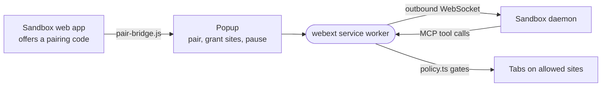

# webext

The Chrome extension that lets an intentic sandbox work in the user's own signed-in browser, on the sites they allow, over one outbound WebSocket.



- Runs in the user's Chromium browser as a Manifest V3 extension. Unlike [browser](../browser), which drives a
  separate profile, the agent here works inside the user's real sessions.
- Pairing: the sandbox page posts a code, `pair-bridge.js` (the only content script, on intentic.dev pages) hands it
  to the worker, and the person finishes it with a click in the popup, which redeems it at `/system/webext/enroll`.
  The token it gets back is the only secret the extension stores.
- `policy.ts` decides every call. Chrome's own permission for the site comes first, and only a click in the popup
  grants one, so the agent can only ask (`ask_access`). Then the switches on the sandbox's capability card, then the
  site's read-only or read-and-act mode. The sandbox's own origin is never a target, and the popup's pause stops everything.
- `connect_site` hands a site's session to the sandbox and `lend_site` borrows one back; both need the sessions
  switch and a confirmation in the page every time.
- Chrome kills an idle MV3 worker, so the worker holds no state: everything lives in `chrome.storage.local`, and an
  alarm redials a dropped link.
- `scripts/size-budget.mjs` fails a build whose bundles outgrow their ceilings; import zod by name and the contract
  through `@intentic/sandbox-contract/webext`. [PUBLISHING.md](PUBLISHING.md) covers the store release.

## Key files

- [src/background/main.ts](src/background/main.ts) — the service worker: keepalive alarm, pairing, popup messages.
- [src/background/policy.ts](src/background/policy.ts) — every allow or refuse decision, with its message.
- [src/background/mcp.ts](src/background/mcp.ts) — the tool surface the sandbox calls.
- [src/page/driver.ts](src/page/driver.ts) — what runs inside a tab: snapshot, click, fill, banner.
- [src/popup/popup.ts](src/popup/popup.ts) — the popup, where every permission is granted.
- [static/manifest.json](static/manifest.json) — permissions, the content script, the minimum Chrome.

## Commands

```sh
pnpm turbo run build --filter=./_devices/webext   # dist/, loadable unpacked
pnpm --filter @intentic/webext test
pnpm --filter @intentic/webext package             # dist.zip for the store
pnpm --filter @intentic/webext preview             # the popup in an ordinary tab
```
