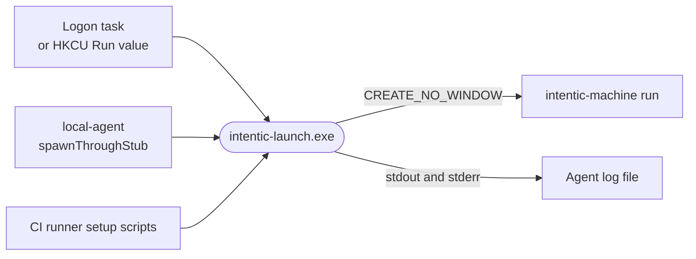

# win-launcher

A small Rust program, `intentic-launch.exe`, that starts an intentic agent on Windows with no console window and its output going to a log file.



- `powershell -WindowStyle Hidden` does not keep a window hidden on current Windows 11. With Windows Terminal as the
  default console host, the flag hides the console the PowerShell host owns, while the window on the desktop belongs
  to `WindowsTerminal.exe`, which never sees the flag. This program is built with `#![windows_subsystem = "windows"]`,
  so Windows gives it no console at all, and it starts its child with `CREATE_NO_WINDOW`, so the child gets none
  either. `build-win-launcher.sh` reads the PE header of every build and fails unless the subsystem is WINDOWS.
- Usage: `intentic-launch --log <file> [--wait] -- <program> [args...]`. It prints the child's pid and exits. With
  `--wait` it lives as long as the child and exits with the child's code, which is what lets a Task Scheduler task
  supervise the agent.
- It opens the log for appending and hands it to the child as stdout and stderr, rolling it to `<file>.1` at the
  same size as `LOG_ROTATE_BYTES` in [local-agent](../local-agent). A failed start is written into that log.
- Ships as the release asset `intentic-launch-windows-<arch>.exe`; [`intentic-machine`](../machine) keeps a copy
  beside its own binary, which is where `local-agent` looks for it. On any other OS it prints a note and exits
  non-zero. It uses only std, which keeps the download small.

## Key files

- [src/main.rs](src/main.rs) — argument parsing, the windowless spawn, log rotation and the tests.
- [Cargo.toml](Cargo.toml) — no dependencies, and a release profile tuned for size.
- [../../_tools/scripts/build/build-win-launcher.sh](../../_tools/scripts/build/build-win-launcher.sh) — cross-compiles, checks the PE subsystem and signs.

## Commands

```sh
cargo test --manifest-path _devices/win-launcher/Cargo.toml
bash _tools/scripts/build/build-win-launcher.sh windows-x64
```
