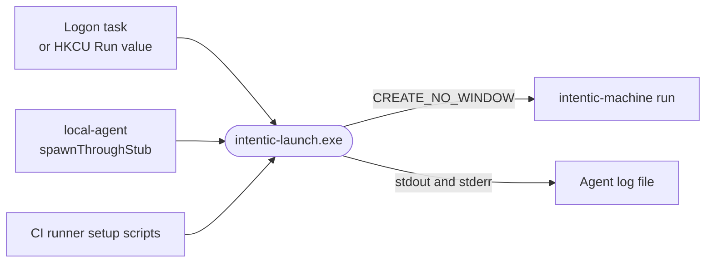

# win-launcher

A small Rust program, `intentic-launch.exe`, that starts an intentic agent on Windows with no console window and its output going to a log file.


```mermaid
flowchart LR
    task["Logon task<br/>or HKCU Run value"] --> launch(["intentic-launch.exe"])
    spawn["local-agent<br/>spawnThroughStub"] --> launch
    runner["CI runner setup scripts"] --> launch
    launch -->|"CREATE_NO_WINDOW"| agent["intentic-machine run"]
    launch -->|"stdout and stderr"| log["Agent log file"]
```

- `powershell -WindowStyle Hidden` does not keep a window hidden on current Windows 11. With Windows Terminal as the
  default console host, the flag hides the console the PowerShell host owns, while the window on the desktop belongs
  to `WindowsTerminal.exe`, which never sees the flag. This program is built with `#![windows_subsystem = "windows"]`,
  so Windows gives it no console at all, and it starts its child with `CREATE_NO_WINDOW`, so the child gets none
  either. `build-win-launcher.sh` reads the PE header of every build and fails unless the subsystem is WINDOWS.
- Usage: `intentic-launch --log <file> [--wait] -- <program> [args...]`. It prints the child's pid and exits. With
  `--wait` it lives as long as the child and exits with the child's code, which is what lets a Task Scheduler task
  supervise the agent. Only the child's own 0 is a success: a code that does not fit a byte (a crash's NTSTATUS) and a
  wait that failed exit non-zero, so a dead agent never reads as a finished one.
- With `--wait` the child also dies with the launcher (2026-10-05): it goes into a job object that is killed when the
  launcher's handle to it closes, which is when the launcher ends, however it ends. Before, a launcher ended from Task
  Scheduler left the agent running unsupervised, and the next watchdog start found its pidfile held and left again. The
  job allows silent breakaway, so what the agent starts to outlive itself (`ic` mid-swap, Mutagen's daemon, an upgrade)
  is never part of it. A job that cannot be made is noted in the log and the agent runs as before.
- It opens the log for appending and hands it to the child as stdout and stderr, rolling it to `<file>.1` at the
  same size as `LOG_ROTATE_BYTES` in [local-agent](../local-agent). A failed start is written into that log.
- Ships as the release asset `intentic-launch-windows-<arch>.exe`; [`intentic-machine`](../machine) keeps a copy
  beside its own binary, which is where `local-agent` looks for it. On any other OS it prints a note and exits
  non-zero. It uses only std (and three kernel32 calls declared by hand for the job), which keeps the download small.

## Key files

- [src/main.rs](src/main.rs) — argument parsing, the windowless spawn, log rotation, the `--wait` job and the tests.
- [Cargo.toml](Cargo.toml) — no dependencies, and a release profile tuned for size.
- [../../_tools/scripts/build/build-win-launcher.sh](../../_tools/scripts/build/build-win-launcher.sh) — cross-compiles, checks the PE subsystem and signs.

## Commands

```sh
cargo test --manifest-path _devices/win-launcher/Cargo.toml
bash _tools/scripts/build/build-win-launcher.sh windows-x64
```
