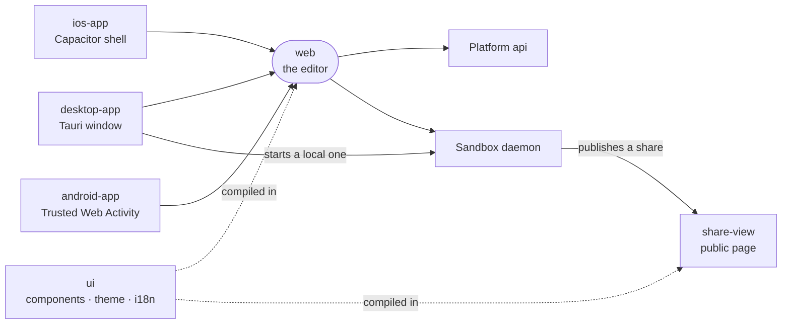

# The editor

The editor is the screen the user works in, with files, chat, terminals and agents, built as one web app that desktop, iOS and Android shells open.

| Package | Role |
| --- | --- |
| [web](web) | The editor: Vue app talking to the platform api and the sandbox daemon. |
| [ui](ui) | Shared Vue components, composables, theme and i18n for every editor surface. |
| [desktop-app](desktop-app) | Tauri app that runs a local sandbox and opens the editor. |
| [ios-app](ios-app) | Capacitor shell around the hosted editor, adding native push. |
| [android-app](android-app) | Bubblewrap Trusted Web Activity around the hosted editor. |
| [share-view](share-view) | Read-only page a shared conversation is published as. |
