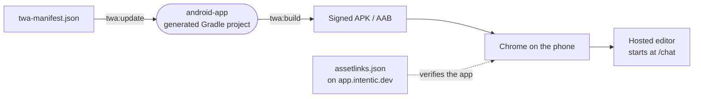

# android-app

The Android shell around the hosted editor: a Trusted Web Activity, generated by Bubblewrap from one manifest, that opens `app.intentic.dev` full-screen as the app `dev.intentic.app`.



- **No native code.** The app is Chrome showing the [web](../web) editor without browser chrome. Notifications are
  the editor's own web push, delegated to the app by `enableNotifications`.
- **Outside the pnpm workspace.** `pnpm-workspace.yaml` excludes this folder because Bubblewrap brings its own JDK
  and Android SDK. The scripts run a pinned Bubblewrap CLI through `npx` on the machine that builds the app.
- **Only the manifest is source.** Everything `.gitignore` lists is regenerated by `twa:update` or is the signing
  keystore `android.keystore`, a secret that never enters git.
- **Domain verification.** `assetlinks.template.json` becomes `https://app.intentic.dev/.well-known/assetlinks.json`
  once the Play app-signing SHA-256 replaces its placeholder. Without it Android cannot verify the app and draws a
  URL bar over the editor.
- **Gotcha.** `iconUrl` fetches `store-icon-512.png` from this path on GitHub's `HEAD`, so moving the icon breaks the
  next `twa:update`.

## Key files

- [twa-manifest.json](twa-manifest.json) — package id, host, start URL, colours and signing key alias.
- [assetlinks.template.json](assetlinks.template.json) — the Digital Asset Links statement the host must serve.
- [package.json](package.json) — the two Bubblewrap commands.

## Commands

```sh
cd _editor/android-app
npm run twa:update   # regenerate the Gradle project from twa-manifest.json
npm run twa:build    # build and sign with android.keystore
```
