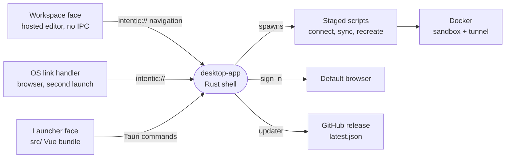

# desktop-app

The Tauri app for Windows and Linux that sets up and runs an intentic sandbox on the user's own computer and opens the hosted workspace in its window.



- **One window, two faces.** The workspace face loads the hosted [web](../web) editor from `https://app.intentic.dev`
  (or the `appUrl` setting, or `INTENTIC_APP_URL`) as remote content with no IPC. The launcher face is this
  package's `src/` bundle: local, and the only window granted Tauri commands (`src-tauri/capabilities/launcher.json`).
  A panel the editor floats out gets a frameless window of its own.
- **Native work is the public scripts.** Setup, sync, recreate and cleanup run the same `connect`, `sync`,
  `recreate` and `cleanup` scripts the copy-paste one-liners run. `stage-desktop-scripts.sh` copies them from
  `_site/site/public/scripts` at the current commit, so an uncommitted script edit does not reach `tauri dev` or a
  local installer.
- **Tray-resident.** The × hides the workspace. The tray reopens it, opens "This device", shows the machine agent
  and update state, and quits. Updates download in the background and install on quit or from the editor's banner;
  deb and rpm installs cannot replace themselves and link to the download page instead.
- **Sign-in runs in the default browser**, because Google refuses OAuth inside an embedded webview. The credential
  returns over `intentic://auth`.
- A launch opens the workspace, unless a setup is parked across a Windows restart or a machine that hosts a sandbox
  has no Docker engine listening. Then the launcher opens first (`opening` in `src-tauri/src/lib.rs`).

## The link surface

`intentic://` is the only channel from a page into the app. Navigations in the app's own windows are intercepted
in `windows.rs`. Links from anywhere else arrive through the OS scheme handler, which on Linux is the desktop entry
built from [src-tauri/main.desktop](src-tauri/main.desktop). [setup_link.rs](src-tauri/src/setup_link.rs) parses
every link and drops what an outside sender may not ask for. The editor builds them in
`_editor/web/src/app/environments/desktop.ts`.

| Link | Accepted from | Does |
| --- | --- | --- |
| `setup?code=…[&sandbox=…][&name=…][&syncDir=…]` | anywhere; outside asks first | The launcher runs that sandbox's setup here. `cfToken` and `platform` count only from the app. |
| `signin[?switch=1]` | anywhere | Opens platform sign-in in the default browser; `switch` asks for the account chooser. |
| `auth?handoff=…&state=…[&profile=…]` | anywhere | Completes a sign-in this app started and opens the workspace at `/desktop-auth/complete`. |
| `sync?url=…&pair=…[&name=…][&takeover=1][&mirror=1]` | app windows | Enrolls this device in desktop sync; the folder is picked in a system dialog. |
| `recreate?slug=…[&hash=…][&rollback=1]` | app windows | Moves the sandbox to the `:stable` base, a pinned overlay, or its previous image. |
| `update` | app windows | Installs the downloaded update and restarts. |
| `launcher` | app windows | Brings the launcher face back. |
| `window?do=…` | app windows | The editor's own title bar: `ready`, `minimize`, `maximize`, `close`, `drag`, `raise`, `fit`, `mode`. |

## Key files

- [src-tauri/src/lib.rs](src-tauri/src/lib.rs) — startup: plugins, the command list, the tray and what a launch opens onto.
- [src-tauri/src/setup_link.rs](src-tauri/src/setup_link.rs) — every `intentic://` link and which senders it is believed from.
- [src-tauri/src/commands.rs](src-tauri/src/commands.rs) — the Tauri commands the launcher calls, and the script each run starts.
- [src/App.vue](src/App.vue) — the launcher face: a handed-over setup, requirements, Docker, this device's sandboxes and sync.
- [src/desktop.ts](src/desktop.ts) — typed wrappers over the Rust commands and run events.
- [src-tauri/tauri.conf.json](src-tauri/tauri.conf.json) — bundle targets, updater endpoint and the deep-link scheme.

## Building

Linux builds need the WebKitGTK development packages (`libwebkit2gtk-4.1-dev`, `libgtk-3-dev`,
`libayatana-appindicator3-dev`, `librsvg2-dev`, `patchelf`), plus `xdg-utils` and `file` for the AppImage.
[build-desktop.sh](../../_tools/scripts/desktop/build-desktop.sh) installs the full list on Debian and builds the
release artifacts.

```sh
pnpm --filter @intentic/desktop-app tauri:dev        # launcher on :47146, workspace from INTENTIC_APP_URL
pnpm --filter @intentic/desktop-app check:rust       # rustfmt, clippy, cargo test
pnpm --filter @intentic/desktop-app stage:downloads  # local installers into _site/site/public/desktop/
```
