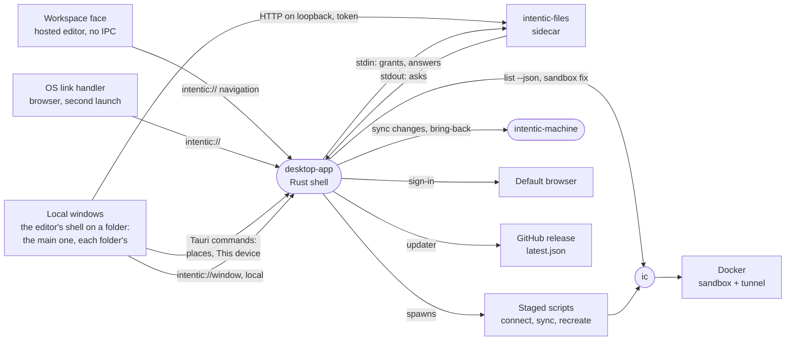

# desktop-app

The Tauri app for Windows and Linux that opens the editor on a folder of the user's own computer from the first launch, with no account, runs sandboxes on that computer from its This device view, and shows the hosted workspace in the same window once they sign in.


```mermaid
flowchart LR
    spa["Workspace face<br/>hosted editor, no IPC"] -->|"intentic:// navigation"| app(["desktop-app<br/>Rust shell"])
    os["OS link handler<br/>browser, second launch"] -->|"intentic://"| app
    local["Local windows<br/>the editor's shell on a folder:<br/>the main one, each folder's"] -->|"Tauri commands:<br/>places, This device"| app
    local -->|"intentic://window, local"| app
    local -->|"HTTP on loopback, token"| files["intentic-files<br/>sidecar"]
    app -->|"stdin: grants, answers"| files
    files -->|"stdout: asks"| app
    app -->|"spawns"| scripts["Staged scripts<br/>connect, sync, recreate"]
    app -->|"sync changes, bring-back"| machine(["intentic-machine"])
    app -->|"list --json, sandbox fix"| ic(["ic"])
    scripts --> ic
    ic --> docker["Docker<br/>sandbox + tunnel"]
    app -->|"sign-in"| browser["Default browser"]
    app -->|"updater"| release["GitHub release<br/>latest.json"]
```

- **One window, two faces.** The main local window (label `home`) and the workspace face swap in one frame
  (`swap_in`, `take_frame`): the one coming up takes the place, size and maximised state of the one going, so the
  reader sees one window changing what it shows. The workspace face loads the hosted [web](../web) editor from
  `https://app.intentic.dev` (or the `appUrl` setting, or `INTENTIC_APP_URL`) as remote content with no IPC. The main
  window is the local face: the same editor built into this package's bundle (`dist/files/`, `local/main.ts`), on a
  folder of this computer. A panel the editor floats out gets a frameless window of its own. This package's own `src/`
  bundle (`index.html`) now draws one thing, the close question (`CloseConfirm.vue`).
- **The main window.** The editor's shell with the sandbox shell's rail, holding what needs no sandbox and no
  account: at the top the place chip (the folder this window shows, and every other place, in the order the
  workspace's sandbox switcher lists them too: this computer first, with its recent folders and documents and the
  system's Open folder… and Open file… on one line, then the account's sandboxes, each opening the workspace on itself
  at `/?sandbox=<id>`, or the sign-in before an account, then This device), then Files (the folder's tree and
  documents, `/workspace`), then This device (`/device`), and at the foot the way to agents (a sign-in in the default
  browser until an account has been seen, then the workspace). The sandboxes are the ones the workspace last listed:
  its switcher hands them over on `intentic://roster` whenever its list changes, a sign-out empties it, and the app
  keeps it in `roster.json` (`local_sandboxes`), with no address, token or logo, so a row carries a name, where it
  runs and whether it is shared, and no count or state. Before the workspace has said, the row is the workspace itself. It opens on the folder it was last
  pointed at (`home-folder.json`), or on `~/intentic/local`, which a first launch creates: nothing is asked before the
  first screen. A folder picked on the place chip takes the window's place (`local_point`: a grant of its own, the old
  one revoked, the page reloaded onto the new face at `#/workspace`), after the page has asked about anything unsaved;
  a folder another window already shows raises that window instead. A document picked there opens where `local_open_path`
  puts it. The main window's ×, like the workspace's, is a question and a hide (`request_close`), so nothing it holds
  is lost and the tray brings it back as it was. The shell's routes ride the page's hash (`files/local#/device`),
  since the asset protocol answers `files/local` with the local page and an address below it with the bundle's other
  page.
- **This device.** A view this app adds to the local shell (`src/host.ts`, the web's
  `app/environments/localHost.ts`), where the launcher's card used to be: this computer's sandboxes with every verb the
  workspace's Devices tab has for them (start, stop, restart, update, rollback, resources, logs, remove), its machine
  agent and its Restart, the Docker engine they run in, and the app's own work here, which leads the page while it runs: a
  setup handed over from the workspace, with its requirements and its plan, and a sync enrollment. Its state is a store
  (`src/device/useDevice.ts`) rather than the page's, so a setup keeps running and reporting while the reader is on
  their files, and the rail's tile carries it (`src/device/badge.ts`: the running mark for a setup or a Docker start,
  a warning mark for one that stopped for the reader, a dot for an update). A computer that runs no sandbox is told what
  one is for and offered the way to one, and nothing about Docker. Only the main window takes the work the app parks
  for its face (a setup, a recreate, a sync, a sleeping engine); every local window draws the same view and runs its
  verbs. The machine is read when the page opens and every 30 seconds while it is on screen.
- **Native work is the public scripts.** Setup, sync and everything done to a sandbox run the same `connect`,
  `sync` and `recreate` scripts the copy-paste one-liners run. `stage-desktop-scripts.sh` copies them from
  `_site/site/public/scripts` at the current commit, so an uncommitted script edit does not reach `tauri dev` or a
  local installer.
- **What runs is `ic`'s to say.** This device's list is `ic sandbox list --json` from the installed `ic` (the shim's
  `--list` when that one is missing or older than this app, whose fetch brings it level). Start, stop and restart are
  `recreate --start|--stop|--restart`, and the Resources form's Apply and Save are `recreate --shape`, all `ic` verbs
  behind the shim's switch, so a Restart here applies a shape saved for the next restart exactly as a Restart from
  the web does. Remove is `recreate --remove`, `ic sandbox remove -y`: the sandbox goes into `ic`'s trash, and its
  `/work` and `/history` stay recoverable for a week (`ic sandbox restore`), as they do from every other door. The
  confirmation says so, in place of the kit's "cannot be undone". The app reads nothing off `docker inspect`; the
  short children it waits on (Docker probes, the listing, the agent's status) share `ic`'s time-limited capture
  crate, `_sandbox/ic/bounded`.
- **Fixing a sandbox the workspace cannot reach.** The workspace's recovery panel sends `intentic://fix?slug=…`; the
  app brings This device forward in the main window, and it runs `ic sandbox fix <slug> [--code <code>] --source app
  --json` with the installed `ic`, looked for where This device's listing looks, with no console window, one run at a
  time and never beside another run of the app's on this machine, stopped with everything it started after ten minutes
  (`src-tauri/src/fix.rs`). A second link while one runs brings that run forward. The card at the top of This device
  is built from `ic`'s `intentic-fix:` progress lines and its final report (`src/fixReport.ts`, `src/device/fix.ts`):
  what `ic` is doing now, every check with its state and, for one that warns or fails, the problem and the remedy,
  then the outcome and what the exit code leaves (3: a yes nobody could give in a terminal; 4: a restart or sign-out).
  Each check whose fix waits on consent becomes a button that runs the fix again with `--accept <that check>` and no
  code. An `ic` that ends without a report, one from before `sandbox fix`, is said to be unable to fix yet, with
  setting the sandbox up again as the way to update it, and nothing retries. While it runs, the rail's This device
  tile spins for a reader who went back to their files. `ic` posts every run to the platform itself; the app never
  talks to the platform about it.
- **Tray-resident.** The × of either face hides it into the tray, once the first × has asked whether that is what
  closing should do (`close-action.json`, "Keep Intentic in the tray" or "Quit Intentic"). The tray's "Open Intentic"
  opens the last face, "This computer" the main window, "Open workspace" appears once an account has been seen, then
  "Open a folder…" and "Open a file…" (each in a window of its own), the machine agent's row (This device), the update
  row and Quit. Updates download in the background and install on quit or from the editor's banner or This device;
  deb and rpm installs cannot replace themselves and link to the download page instead. A local window never draws the
  editor's update banner: This device says it instead.
- **Sign-in runs in the default browser**, because Google refuses OAuth inside an embedded webview. The credential
  returns over `intentic://auth`, which also records that this install has an account (`account-seen.json`) and opens
  the workspace at `/desktop-auth/complete`, in the main window's place.
- **The last face.** `last-face.json` (`home` or `workspace`) is the face the user was last seen choosing: every
  showing of the workspace writes `workspace`, and the main window shown on purpose (a launch into it, the tray's "This
  computer", the workspace's way back) writes `home`. An install without the file reads `workspace` if it ever showed the
  workspace (`workspace-seen.json`) and `home` otherwise. A launch opens This device for a setup parked across a Windows
  restart, then for a machine that hosts a sandbox and has no Docker engine listening (handing over to the workspace
  once the engine wakes, when the workspace is the last face), and otherwise the last face (`opening` in
  `src-tauri/src/lib.rs`). A bare second launch opens the last face too. `home_facts` hands the shell `accountSeen` (a
  sign-in, or the workspace ever shown), `lastFace`, `hostsSandboxes` and `homeFolder`.
- **Local windows.** The main window, and a folder or a document opened from the tray, the place chip, a
  double-click ("Open with Intentic" on documents, folders, the space inside one and a drive root) or a second launch
  in a window of its own (`files-<n>`, `src-tauri/src/local.rs`). Each is the same shell. A document inside the folder of
  a window already open is handed to that window instead (`intentic:open`), and a path already being opened is not
  opened twice. Its file reads are answered by the `intentic-files` sidecar ([local-files](../../_devices/local-files))
  instead of a sandbox. The app starts the sidecar (with the main window, or a few seconds after a launch with recents),
  grants each window one folder by a random token on the sidecar's stdin, and revokes it when the window closes
  (`src-tauri/src/sidecar.rs`). What else a local window may do is the commands its capability names
  (`capabilities/local.json`): the place chip's and This device's, granted by name (`build.rs`); its links are only its
  own title bar and `local`. The documents it draws can do none of it: the page's policy runs no script but the
  bundle's own (`vite.local.config.ts`), a frame a document opens is another origin, which holds no capability, and a
  link it carries is heard only as `window` or `local`. No sandbox, account or Docker is needed to open anything. What
  fails to open is said in a native dialog in the user's words (the place chip shows the same sentence under the row),
  and the original error goes to stderr.

  (2026-10-01) The sandboxes joined the place chip, where "Your workspace" alone stood for them: a reader on this
  computer took two presses and a face swap to reach the sandbox they meant, while the workspace's switcher reached
  this computer in one. The local window cannot list them itself (its page reaches only loopback and the app, and the
  app holds no session), so the workspace tells the app. Giving the local page a platform session and the platform
  in its policy was rejected: that page draws documents nobody vouched for.

  (2026-09-30) The launcher window is gone. It was a card of its own design between the reader and everything else:
  Home (open a folder or a file, recents, sign-in), This device (Docker, the agent, sandboxes), and a handed-over setup,
  none of it in the editor's shell, and a first launch without an account opened on it. The main window replaced it,
  so every window of the app is the editor's shell from the first launch, and This device became a view of that shell.
  The local windows were granted the commands to draw it. The alternative, keeping them capability-less and asking the
  app for This device by `intentic://` links answered with events, was rejected: a link is a navigation any document
  can make on a click, while a command needs script, which the page's policy lets only the bundle run.
- **The warm window.** After the first folder or document window of a run (never for the main window alone, which
  most runs never go past), the app keeps one hidden spare files window whose page
  has loaded the editor and waits for its face: the next open, once that page has finished loading, registers its
  grant under the spare's label, hands it the face (`window.__INTENTIC_LOCAL__`, then `intentic:face`), sizes, places
  and shows it, and builds the next spare. A spare still loading is left for the open after. The spare goes after
  five minutes with no local window open. `INTENTIC_WARM_WINDOW=0` turns it off. A window's face is kept in its own
  session storage for its reloads, which is also how a sidecar that had to restart on another port moves every window
  to it (each is reloaded onto its new `daemonUrl` and token).
- **Unsaved changes.** A local window's page says whether it holds unsaved changes (`window?do=dirty`); a page
  starting in the window clears what the one before it said, and says it again once it mounts. A close of a dirty
  window, whoever asks for it, is held: the window comes to the front and its page hears `intentic:close-requested`,
  then saves or answers `window?do=close&confirmed=1`. The question is handed over by an `eval` whose completion is
  the page's receipt, so a page that has died or hung is seen not to take it: three seconds later, or at a second
  close, the app asks in its place ("Discard unsaved changes?" / "Close anyway"). Quit, the ×'s "Quit" and a restart
  with dirty windows ask first in a native dialog ("Quit anyway" / "Cancel"), and an update refuses to install until
  they are saved or closed, asked again just before the installer runs and before the restart onto it (a restart
  held that way is what the update's offer means from then on), since the Windows installer ends the process where
  nothing can ask.
- **A folder's own sandbox, copy-first.** "Work on this with an agent" in a folder's window
  (`src-tauri/src/project.rs`) refuses a disk, a home folder (a Fedora Atomic home under `/var/home` included), a
  system folder and one inside or around a folder that already has a sandbox, says what copy-first means, then parks
  the folder and opens the workspace's `/setup?project=<name>`. The folder is copied into the sandbox's
  `/work/<name>` and kept up to date from here; agents change the copy, and nothing in the folder changes until the
  window's "Bring back changes", which keeps a restore point first. The setup page answers with
  `intentic://setup?…&project=<name>` for a sandbox on this machine, run with `SYNC_DIR`, `SYNC_REMOTE_DIR=/work/<name>`
  and `SYNC_PROJECT=1`, or with `intentic://sync?…&project=<name>&sandbox=<id>` for a hosted one, whose sync script
  runs here on the parked folder with the same three values (a folder is asked for in a system dialog when none is
  parked). Either way the folder is bound to the one this app parked (never to a path on a link), and
  `projects.json` remembers it so opening the folder again reaches the same sandbox. The window's project verbs
  (`changes`, `bring-back`, `restore`, `direction`) each run the machine agent, `intentic-machine sync <verb> --dir
  <folder> … --json`, and hand its JSON object back to the window as `intentic:project`. The paths a bring-back is
  limited to go in a JSON file (`--paths-file`, in the app's cache, removed after the run), never on the command
  line, which Windows caps at 32,767 characters. One bring-back, restore or direction change runs per folder at a
  time, and an update waits for it.
- **"Ask about this".** A local window can hand one of its files to the workspace: the app grants it to the sidecar
  read-only, for the workspace's origin alone and for fifteen minutes (a handoff grant, never a window), and opens
  the workspace at `/?handoff=<base64url of { url, token, name }>`, where `url` is the sidecar's
  `/workspace/raw?path=<name>`.
- **Deletes go to the Recycle Bin.** A delete in a local window reaches the sidecar, which asks the app (`ask`,
  `verb: trash`); the app moves the entry to the OS's Recycle Bin or Trash (the `trash` crate) when it lies strictly
  inside the folder of an open folder window, and answers.

## The link surface

`intentic://` is the only channel from the workspace's page into the app, and a local window's for its own title bar
and folder (its other verbs are Tauri commands, above). Navigations in the app's own windows are intercepted
in `windows.rs`. Links from anywhere else arrive through the OS scheme handler, which on Linux is the desktop entry
built from [src-tauri/main.desktop](src-tauri/main.desktop). [setup_link.rs](src-tauri/src/setup_link.rs) parses
every link and drops what an outside sender may not ask for. The editor builds them in
`_editor/web/src/app/environments/desktop.ts`.

| Link | Accepted from | Does |
| --- | --- | --- |
| `setup?code=…[&sandbox=…][&name=…][&syncDir=…]` | anywhere; outside asks first | This device, in the main window, runs that sandbox's setup here. `cfToken`, `platform` and `project` count only from the app. |
| `signin[?switch=1]` | anywhere | Opens platform sign-in in the default browser; `switch` asks for the account chooser. |
| `auth?handoff=…&state=…[&profile=…]` | anywhere | Completes a sign-in this app started and opens the workspace at `/desktop-auth/complete`. |
| `sync?url=…&pair=…[&name=…][&takeover=1][&mirror=1]` | app windows | Enrolls this device in desktop sync from This device; the folder is picked in a system dialog. |
| `sync?url=…&pair=…&project=<name>[&sandbox=<id>]` | app windows | A hosted sandbox's project: syncs the parked folder with `/work/<name>` and remembers it with that sandbox. |
| `recreate?slug=…[&hash=…][&rollback=1]` | app windows | Moves the sandbox to the `:stable` base, a pinned overlay, or its previous image, from This device. |
| `fix?slug=…[&code=…]` | app windows | Runs `ic sandbox fix` for that sandbox here and shows it on This device; `code` is the recovery panel's fix code, which `ic` claims so the panel follows the run. A slug or code that is not a plain token drops the link. |
| `update` | app windows | Installs the downloaded update and restarts. |
| `launcher[?to=files]` | app windows | Brings the main window back in the workspace's place: at This device (a setup's way back to its run, a sandbox's restart), or at its folder with `to=files` (the sandbox switcher's "This computer"). |
| `roster?list=<JSON>` | app windows | The account's sandboxes as the workspace's switcher lists them (`id`, `name`, `place`, `shared`), kept in `roster.json` for the place chip; `[]` after a sign-out. One row out of shape (an id that is not a plain token, a name empty, over 200 characters or holding a control character, a place that is not a lowercase word) drops the list. |
| `window?do=…` | app and local windows | The editor's own title bar: `ready`, `minimize`, `maximize`, `close[&confirmed=1]`, `dirty&value=0\|1`, `drag`, `raise`, `fit`, `mode`. |
| `local?do=…` | local windows only | `open-folder` and `open-file` in the system dialog, `reveal[&path=…]` an entry of the window's own folder, `sandbox`, `ask&path=…`, and the project's `changes`, `bring-back[&paths=<JSON array>]`, `restore&point=…`, `direction&value=to-sandbox\|both`. |

A local window is heard on those two links and nothing else: never a setup, a sync, a recreate, a fix or a sign-in,
since it draws documents nobody vouched for (`Source::Files` in `setup_link.rs`). Every value a local verb carries is
held to its shape before it reaches a folder or a command line: paths are root-relative with forward slashes, never
absolute, never `..`, never starting with `-`, and never holding a `:` (a drive, `C:/x` or `C:x`, or an alternate data
stream); a `paths` that is not a non-empty JSON array of such paths, a restore point that is not a plain token, or a
direction other than the two drops the link. A project verb is answered only for a folder window whose folder is in
`projects.json`. A `sync` link naming a `project` that is not a project folder's name, or naming one beside `mirror`,
is dropped whole: read without its project it would sync the folder with the sandbox's whole `/work`.

## What the app tells pages

Nothing is returned over a link. The app answers with DOM events it dispatches into the page by `eval`, one way:

| Event | Window | Detail |
| --- | --- | --- |
| `intentic-desktop-window` | workspace, floating, local | `{ maximized }`, for the page's own maximise button. |
| `intentic-desktop-update` | workspace | `{ version }` of a downloaded update. |
| `intentic-desktop-setup` | workspace | This device's setup progress (`SetupReport`). |
| `intentic:face` | a worn spare | none: `window.__INTENTIC_LOCAL__` has just been set. |
| `intentic:open` | local folder window | `{ path }` of a document inside its folder, root-relative. |
| `intentic:close-requested` | local window | none: a close is held for unsaved changes. |
| `intentic:project` | local folder window | `{ kind: "changes" \| "brought-back" \| "restored" \| "direction", result }`, `result` being the machine agent's own `{ ok, … }`; or `{ kind: "error", verb, error }` when the agent is missing, would not start, timed out or printed no JSON, or the folder has a run under way already. |
| `intentic:navigate` | main window | `{ path }`, a route of the local shell (`/device`): the screen the app raised the window for. |

A local window also hears the app's Tauri events, which This device listens on: `desktop://run` (a script run's
`started`, `line` and `exit`), `desktop://pending-setup`, `desktop://pending-recreate`, `desktop://pending-sync` and
`desktop://update`.

## The sidecar's control lines

The app writes JSON lines on `intentic-files`' stdin and reads its stdout (`_devices/local-files/src/control.ts`).
Each spawn is a generation: a start that does not hear `ready` within 20 seconds kills its child, only the current
generation's exit restarts it, with every grant handed back on the same port, and an event the app does not know is
passed over. When that port is taken the restart takes a fresh one, and first gives every window and handoff a new
token, since whatever holds the old port hears the old tokens from pages still calling it; the windows are then
reloaded onto their new address and token.

| Line | Direction | Meaning |
| --- | --- | --- |
| `{"op":"grant","token","id","path","kind"}` | in | Serve a folder or a file for one window. |
| `{"op":"grant",…,"id":"handoff-<n>","kind":"file","readOnly":true,"origins":[…],"expiresInMs":900000}` | in | A handoff: one file, read-only, for the workspace's origin. |
| `{"op":"revoke","token"}` | in | The window closed. |
| `{"op":"answer","id","ok"[,"error"]}` | in | The answer to an `ask`. |
| `{"op":"prefetch-office"}` | in | Fetch the office editor now: once per run, after the first local window opens (the main one at launch included), never with `INTENTIC_DISABLE_UPDATE_CHECK` set. |
| `{"event":"ready","port"}`, `granted`, `refused`, `revoked` | out | Where it listens, and what it made of each grant. |
| `{"event":"ask","id","verb":"trash","path"}` | out | Move this entry to the Recycle Bin or Trash. |
| `{"event":"office","state":"ready"\|"failed"[,"error"]}` | out | Where the office editor's download went; logged. |

## Key files

- [src-tauri/src/lib.rs](src-tauri/src/lib.rs) — startup: plugins, the command list, the tray and what a launch opens onto.
- [src-tauri/src/local.rs](src-tauri/src/local.rs) — the local windows: the main one and its folder, each window's grant, pointing a window at another folder, the warm window, handoffs, launch arguments; the `intentic-files` process itself, its generations and trash asks, is `sidecar.rs`.
- [src-tauri/src/setup_link.rs](src-tauri/src/setup_link.rs) — every `intentic://` link and which senders it is believed from.
- [src-tauri/src/commands.rs](src-tauri/src/commands.rs) — the Tauri commands This device calls, and the script each run starts.
- [src/host.ts](src/host.ts) — this app's half of the local shell: its places, the way to agents, and the This device view it adds to the rail.
- [src/device/useDevice.ts](src/device/useDevice.ts) — This device's store: the machine's sandboxes, agent and engine, and the setups, recreates and syncs the app runs here.

## Building

Linux builds need the WebKitGTK development packages (`libwebkit2gtk-4.1-dev`, `libgtk-3-dev`,
`libayatana-appindicator3-dev`, `librsvg2-dev`, `patchelf`), plus `xdg-utils` and `file` for the AppImage.
[build-desktop.sh](../../_tools/scripts/desktop/build-desktop.sh) installs the full list on Debian and builds the
release artifacts.

### Which Linux runs it

The Linux artifacts are linked on `_tools/ci-base`'s Debian 13 (glibc 2.41), and the binary imports `GLIBC_2.39`
symbols, so every Linux artifact needs glibc 2.39 or newer: Ubuntu 24.04, Debian 13, Fedora 40, RHEL, AlmaLinux and
Rocky Linux 10, openSUSE Tumbleweed and Leap 16.0, and anything newer. Ubuntu 22.04, Debian 12, RHEL 9 and Leap 15
are too old. The AppImage vendors WebKitGTK and GTK but never glibc, so the same floor applies to it.

`tauri.conf.json` declares the floor where package managers read it: the deb depends on `libc6 (>= 2.39)` and the
rpm requires `libc.so.6(GLIBC_2.39)(64bit)`, the capability glibc provides and rpmbuild itself would generate. The
rpm entry is a capability name rather than `glibc >= 2.39` because the bundler writes every rpm depends entry as a
bare name, and a name with a version in it matches no package. The deb's entry is the one source:
[glibc-floor.mjs](../../_tools/scripts/desktop/glibc-floor.mjs), run by `verify-desktop-bundle.sh` on every build,
reads it, fails when the rpm's entry disagrees, when a built package's metadata lacks the floor, or when any ELF in the
deb, rpm or AppImage (vendored libraries included) imports a newer `GLIBC_` version, and names the file and symbol.
Moving the floor means both entries, the download page (`_site/site/src/pages/download.astro`) and the quickstart's
desktop section. To check a local build, run `bash _tools/scripts/desktop/verify-desktop-bundle.sh <dist-bin dir>`.

The local face runs in a plain browser too, on the dev server alone: open
`http://127.0.0.1:47147/files/local?daemon=…&token=…&id=…&name=…&path=…[&home=1]` against a running `intentic-files`
granted that token. With no app behind the page, its commands are answered by a stand-in (`local/devDesktop.ts`,
Tauri's own IPC mock), for a machine picked by `?machine=fresh|host|setup`: a first launch, one hosting two sandboxes,
or one mid-setup.

```sh
pnpm --filter @intentic/desktop-app tauri:dev        # the close question's page on :47146, workspace from INTENTIC_APP_URL
pnpm --filter @intentic/desktop-app dev:local        # the local face on :47147, proxied under :47146's /files
pnpm --filter @intentic/desktop-app check:rust       # rustfmt, clippy, cargo test
pnpm --filter @intentic/desktop-app stage:downloads  # local installers into _site/site/public/desktop/
```
