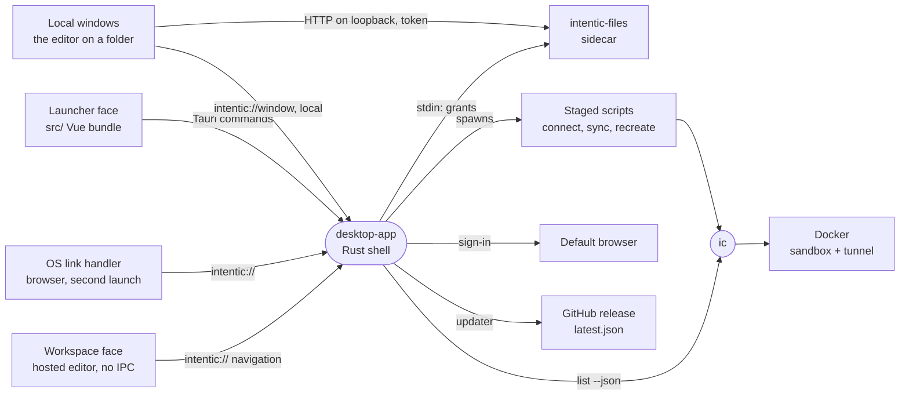

# desktop-app

The Tauri app for Windows and Linux that sets up and runs an intentic sandbox on the user's own computer, opens the hosted workspace in its window, and opens the user's own folders and documents in windows of their own.


```mermaid
flowchart LR
    spa["Workspace face<br/>hosted editor, no IPC"] -->|"intentic:// navigation"| app(["desktop-app<br/>Rust shell"])
    os["OS link handler<br/>browser, second launch"] -->|"intentic://"| app
    launcher["Launcher face<br/>src/ Vue bundle"] -->|"Tauri commands"| app
    local["Local windows<br/>the editor on a folder"] -->|"intentic://window, local"| app
    app -->|"stdin: grants"| files["intentic-files<br/>sidecar"]
    local -->|"HTTP on loopback, token"| files
    app -->|"spawns"| scripts["Staged scripts<br/>connect, sync, recreate"]
    app -->|"list --json"| ic(["ic"])
    scripts --> ic
    ic --> docker["Docker<br/>sandbox + tunnel"]
    app -->|"sign-in"| browser["Default browser"]
    app -->|"updater"| release["GitHub release<br/>latest.json"]
```

- **One window, two faces.** The workspace face loads the hosted [web](../web) editor from `https://app.intentic.dev`
  (or the `appUrl` setting, or `INTENTIC_APP_URL`) as remote content with no IPC. The launcher face is this
  package's `src/` bundle: local, and the only window granted Tauri commands (`src-tauri/capabilities/launcher.json`).
  A panel the editor floats out gets a frameless window of its own.
- **Native work is the public scripts.** Setup, sync and everything done to a sandbox run the same `connect`,
  `sync` and `recreate` scripts the copy-paste one-liners run. `stage-desktop-scripts.sh` copies them from
  `_site/site/public/scripts` at the current commit, so an uncommitted script edit does not reach `tauri dev` or a
  local installer.
- **What runs is `ic`'s to say.** The manager's list is `ic sandbox list --json` from the installed `ic` (the shim's
  `--list` when that one is missing or older than this app, whose fetch brings it level). Start, stop and restart are
  `recreate --start|--stop|--restart`, and the Resources form's Apply and Save are `recreate --shape`, all `ic` verbs
  behind the shim's switch, so a Restart here applies a shape saved for the next restart exactly as a Restart from
  the web does. Remove is `recreate --remove`, `ic sandbox remove -y`: the sandbox goes into `ic`'s trash, and its
  `/work` and `/history` stay recoverable for a week (`ic sandbox restore`), as they do from every other door. The
  confirmation says so, in place of the kit's "cannot be undone". The app reads nothing off `docker inspect`; the
  short children it waits on (Docker probes, the listing, the agent's status) share `ic`'s time-limited capture
  crate, `_sandbox/ic/bounded`.
- **Tray-resident.** The × hides the workspace. The tray reopens it, opens "This device", shows the machine agent
  and update state, and quits. Updates download in the background and install on quit or from the editor's banner;
  deb and rpm installs cannot replace themselves and link to the download page instead.
- **Sign-in runs in the default browser**, because Google refuses OAuth inside an embedded webview. The credential
  returns over `intentic://auth`.
- A launch opens the workspace, unless a setup is parked across a Windows restart, a machine that hosts a sandbox
  has no Docker engine listening, or this install has never shown the workspace. Then the launcher opens first
  (`opening` in `src-tauri/src/lib.rs`), where Home leads with opening a folder or a file of this computer.
- **Local windows.** A folder or a document opened from Home, the tray, a double-click ("Open with Intentic" on
  documents, folders and the space inside one), a drop on Home or a second launch gets a window of its own
  (`files-<n>`, `src-tauri/src/local.rs`). It shows the local face: the editor itself, built from
  `_editor/web` into `dist/files/` (`vite.local.config.ts`, entered through `local/main.ts`), with its file reads
  answered by the `intentic-files` sidecar ([local-files](../../_devices/local-files)) instead of a sandbox. The app
  starts the sidecar, grants each window one folder by a random token on the sidecar's stdin, and revokes it when
  the window closes. A local window holds no capability: every app command is a permission granted by name
  (`build.rs`), and its only links are its own title bar and `local`. No sandbox, account or Docker is involved.
- **A folder's own sandbox.** "Work on this with an agent" in a folder's window (`src-tauri/src/project.rs`) refuses
  a disk, a home folder, a system folder and one inside or around a folder that already has a sandbox, says what
  syncs and what stays, then parks the folder and opens the workspace's `/setup?project=<name>`. The code comes back
  as `intentic://setup?…&project=<name>`, bound here to the parked folder (never to a path on the link), and the
  setup runs with `SYNC_DIR` and `SYNC_REMOTE_DIR=/work/<name>`: the folder becomes a project inside the sandbox's
  `/work`, synced both ways, and `projects.json` remembers it so opening the folder again reaches the same sandbox.

## The link surface

`intentic://` is the only channel from a page into the app. Navigations in the app's own windows are intercepted
in `windows.rs`. Links from anywhere else arrive through the OS scheme handler, which on Linux is the desktop entry
built from [src-tauri/main.desktop](src-tauri/main.desktop). [setup_link.rs](src-tauri/src/setup_link.rs) parses
every link and drops what an outside sender may not ask for. The editor builds them in
`_editor/web/src/app/environments/desktop.ts`.

| Link | Accepted from | Does |
| --- | --- | --- |
| `setup?code=…[&sandbox=…][&name=…][&syncDir=…]` | anywhere; outside asks first | The launcher runs that sandbox's setup here. `cfToken` and `platform` count only from the app. |
| `signin[?switch=1]` | anywhere | Opens platform sign-in in the default browser; `switch` asks for the account chooser. |
| `auth?handoff=…&state=…[&profile=…]` | anywhere | Completes a sign-in this app started and opens the workspace at `/desktop-auth/complete`. |
| `sync?url=…&pair=…[&name=…][&takeover=1][&mirror=1]` | app windows | Enrolls this device in desktop sync; the folder is picked in a system dialog. |
| `recreate?slug=…[&hash=…][&rollback=1]` | app windows | Moves the sandbox to the `:stable` base, a pinned overlay, or its previous image. |
| `update` | app windows | Installs the downloaded update and restarts. |
| `launcher` | app windows | Brings the launcher face back. |
| `window?do=…` | app and local windows | The editor's own title bar: `ready`, `minimize`, `maximize`, `close`, `drag`, `raise`, `fit`, `mode`. |
| `local?do=…[&path=…]` | local windows only | `open-folder` and `open-file` in the system dialog, `reveal` an entry of the window's own folder. |

A local window is heard on those two links and nothing else: never a setup, a sync, a recreate or a sign-in, since it
draws documents nobody vouched for (`Source::Files` in `setup_link.rs`).

## Key files

- [src-tauri/src/lib.rs](src-tauri/src/lib.rs) — startup: plugins, the command list, the tray and what a launch opens onto.
- [src-tauri/src/setup_link.rs](src-tauri/src/setup_link.rs) — every `intentic://` link and which senders it is believed from.
- [src-tauri/src/commands.rs](src-tauri/src/commands.rs) — the Tauri commands the launcher calls, and the script each run starts.
- [src-tauri/src/local.rs](src-tauri/src/local.rs) — the local windows: the sidecar's lifetime, each window's grant, launch arguments.
- [src/App.vue](src/App.vue) — the launcher face: a handed-over setup, requirements, Docker, this device's sandboxes and sync.
- [src-tauri/tauri.conf.json](src-tauri/tauri.conf.json) — bundle targets, updater endpoint, the deep-link scheme and the Linux glibc floor.

## Building

Linux builds need the WebKitGTK development packages (`libwebkit2gtk-4.1-dev`, `libgtk-3-dev`,
`libayatana-appindicator3-dev`, `librsvg2-dev`, `patchelf`), plus `xdg-utils` and `file` for the AppImage.
[build-desktop.sh](../../_tools/scripts/desktop/build-desktop.sh) installs the full list on Debian and builds the
release artifacts.

### Which Linux runs it

The Linux artifacts are linked on `_tools/ci-base`'s Debian 13 (glibc 2.41), and the binary imports `GLIBC_2.39`
symbols, so every Linux artifact needs glibc 2.39 or newer: Ubuntu 24.04, Debian 13, Fedora 40, RHEL, AlmaLinux and
Rocky Linux 10, openSUSE Tumbleweed and Leap 16.0, and anything newer. Ubuntu 22.04, Debian 12, RHEL 9 and Leap 15
are too old. The AppImage vendors WebKitGTK and GTK but never glibc, so the same floor applies to it.

`tauri.conf.json` declares the floor where package managers read it: the deb depends on `libc6 (>= 2.39)` and the
rpm requires `libc.so.6(GLIBC_2.39)(64bit)`, the capability glibc provides and rpmbuild itself would generate. The
rpm entry is a capability name rather than `glibc >= 2.39` because the bundler writes every rpm depends entry as a
bare name, and a name with a version in it matches no package. The deb's entry is the one source:
[glibc-floor.mjs](../../_tools/scripts/desktop/glibc-floor.mjs), run by `verify-desktop-bundle.sh` on every build,
reads it, fails when the rpm's entry disagrees, when a built package's metadata lacks the floor, or when any ELF in the
deb, rpm or AppImage (vendored libraries included) imports a newer `GLIBC_` version, and names the file and symbol.
Moving the floor means both entries, the download page (`_site/site/src/pages/download.astro`) and the quickstart's
desktop section. To check a local build, run `bash _tools/scripts/desktop/verify-desktop-bundle.sh <dist-bin dir>`.

```sh
pnpm --filter @intentic/desktop-app tauri:dev        # launcher on :47146, workspace from INTENTIC_APP_URL
pnpm --filter @intentic/desktop-app dev:local        # the local face on :47147, proxied under the launcher's /files
pnpm --filter @intentic/desktop-app check:rust       # rustfmt, clippy, cargo test
pnpm --filter @intentic/desktop-app stage:downloads  # local installers into _site/site/public/desktop/
```
