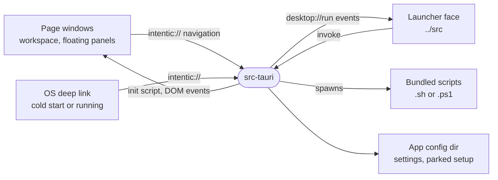

# src-tauri

The Rust crate behind the desktop app, owning its windows, tray, `intentic://` links, script runs and self-update.



- **Trust follows the window label.** Only `launcher` and `confirm-close` hold capabilities (`capabilities/`). The
  workspace and floating windows show remote content, get no IPC, and reach the app only by navigating to an
  `intentic://` link. `parse_link` believes a link fully only when its `Source` is one of the app's own windows.
- **The machine work is shell scripts.** `scripts.rs` runs the same `connect`, `sync`, `recreate` and `cleanup`
  scripts users can paste, resolved by basename from the bundle's `scripts/` resource directory, and streams each
  line to the launcher as a `desktop://run` event while writing a transcript. Docker is reached through its CLI,
  with no Docker library in the crate.
- **Talking back to pages.** The workspace learns it is inside the app from `window.__INTENTIC_DESKTOP__`, set by
  an initialization script, and hears about updates and setups through `intentic-desktop-update` and
  `intentic-desktop-setup` DOM events.
- **State on disk.** `state.rs` keeps `settings.json` (`appUrl`, `platformUrl`), the install id, the close choice,
  the colour mode and a setup parked across a Windows restart.
- **Staged scripts.** `staged-scripts/` is gitignored and filled by `pnpm stage:scripts`. `test:rust` and `lint:rust`
  run it first; a bare `cargo` call does not.

## Key files

- [src/lib.rs](src/lib.rs) — `run`: plugins, registered commands, the tray and the launch decision.
- [src/windows.rs](src/windows.rs) — both faces, floating panels, navigation interception and `handle_link`.
- [src/setup_link.rs](src/setup_link.rs) — `parse_link` and the argument types of every link.
- [src/scripts.rs](src/scripts.rs) — spawning and streaming script runs, and the Docker engine probe.
- [src/update.rs](src/update.rs) — update checks, the background download and install on quit.
- [capabilities/launcher.json](capabilities/launcher.json) — the one IPC grant, and why the workspace has none.

## Commands

```sh
pnpm --filter @intentic/desktop-app check:rust   # cargo fmt --check, clippy -D warnings, cargo test
pnpm --filter @intentic/desktop-app test:rust
```
