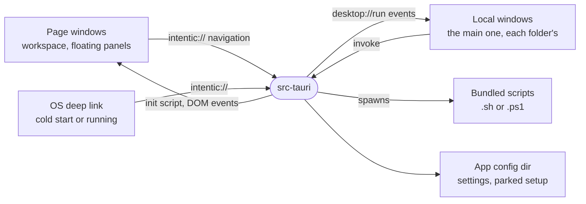

# src-tauri

The Rust crate behind the desktop app, owning its windows, tray, `intentic://` links, script runs and self-update.


```mermaid
flowchart LR
    pages["Page windows<br/>workspace, floating panels"] -->|"intentic:// navigation"| crate(["src-tauri"])
    os["OS deep link<br/>cold start or running"] -->|"intentic://"| crate
    local["Local windows<br/>the main one, each folder's"] -->|"invoke"| crate
    crate -->|"desktop://run events"| local
    crate -->|"spawns"| scripts["Bundled scripts<br/>.sh or .ps1"]
    crate -->|"init script, DOM events"| pages
    crate --> config["App config dir<br/>settings, parked setup"]
```

- **Trust follows the window label.** Only the local windows (`home` and `files-*`) and `confirm-close` hold
  capabilities (`capabilities/`): a local window the commands its shell and This device call, the close question its
  one answer. The workspace and floating windows show remote content, get no IPC, and reach the app only by navigating
  to an `intentic://` link. `parse_link` believes a link fully only when its `Source` is one of the app's own windows,
  and a local window's links only as its own title bar and folder.
- **The machine work is shell scripts.** `scripts.rs` runs the same `connect`, `sync` and `recreate`
  scripts users can paste, resolved by basename from the bundle's `scripts/` resource directory, and streams each
  line to This device (the local windows) as a `desktop://run` event while writing a transcript. Docker is reached
  through its CLI, with no Docker library in the crate. The one run of `ic` itself rather than a script is `fix.rs`'s
  `ic sandbox fix`, streamed the same way and stopped after ten minutes.
- **Talking back to pages.** The workspace learns it is inside the app from `window.__INTENTIC_DESKTOP__`, set by
  an initialization script, and hears about updates and setups through `intentic-desktop-update` and
  `intentic-desktop-setup` DOM events, and whether its window is on screen through `intentic-desktop-shown`
  (`shown.rs`), which WebView2's own `document.visibilityState` does not say for a window in the tray. A local window learns its folder from `window.__INTENTIC_LOCAL__` (local.rs)
  and hears `intentic:face`, `intentic:repoint`, `intentic:open`, `intentic:close-requested`, `intentic:project` and, in the main window,
  `intentic:navigate` (`../README.md` has what each carries).
- **The app's icon and the system's notifications.** `badge.rs` puts the workspace tab's mark on the tray icon, the
  Windows taskbar button's overlay (put back each time a face is shown, since Windows drops it with the button) and a
  Linux dock's count; `notice.rs` puts up, withdraws and clears the notifications the page asks for (WinRT toasts with
  protocol activation, or `org.freedesktop.Notifications` over `zbus`), on one thread of their own, and answers a
  press with the workspace at the notification's route. Both take the page's word for what to show
  (`intentic://badge`, `intentic://notice`) and decide nothing about it.
- **State on disk.** `state.rs` keeps `settings.json` (`appUrl`, `platformUrl`), the install id, the close choice,
  the colour mode, a setup parked across a Windows restart, the face last in use (`last-face.json`), the folder the
  main window opens on (`home-folder.json`, `~/intentic/local` until it is pointed elsewhere), whether an account was
  ever seen (`account-seen.json`), the recents and the folders that have a sandbox of their own (`projects.json`).
- **Local windows.** `local.rs` owns the windows on the user's own folders and documents, the main one among them, and
  pointing one at another folder; `sidecar.rs` owns the
  `intentic-files` process that serves them; `project.rs` is a folder becoming a sandbox's project and the machine
  agent's runs on it.
- **Staged scripts and binaries.** `staged-scripts/` is gitignored and filled by `pnpm stage:scripts`; `binaries/`
  holds the two programs the installer puts beside the app (`externalBin`), `intentic-files` (`pnpm stage:local`) and
  `intentic-ic`, the `ic` CLI under a name nothing on PATH answers to (`pnpm stage:ic`), per target triple. tauri-build refuses to build without them, so `test:rust` and
  `lint:rust` run all three first; a bare `cargo` call does not.

## Key files

- [src/lib.rs](src/lib.rs) — `run`: plugins, registered commands, the tray and the launch decision.
- [src/windows.rs](src/windows.rs) — both faces (the main local window and the workspace), floating panels, navigation interception and `handle_link`.
- [src/setup_link.rs](src/setup_link.rs) — `parse_link` and the argument types of every link.
- [src/scripts.rs](src/scripts.rs) — spawning and streaming script runs, and the Docker engine probe.
- [src/update.rs](src/update.rs) — update checks, the background download and install on quit.
- [capabilities/local.json](capabilities/local.json) — what a local window may call, why its documents cannot, and why the workspace gets nothing.

## Commands

```sh
pnpm --filter @intentic/desktop-app check:rust   # cargo fmt --check, clippy -D warnings, cargo test
pnpm --filter @intentic/desktop-app test:rust
```
