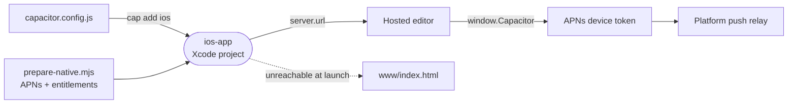

# ios-app

The iOS shell around the hosted editor: a Capacitor app, `dev.intentic.app`, whose webview loads `app.intentic.dev` and adds the native push registration iOS webviews lack.



- **Remote content.** `server.url` is `INTENTIC_APP_URL` or `https://app.intentic.dev`, so the app always runs the
  current [web](../web) editor. `www/` holds only the offline page.
- **Push.** WKWebView has no web push. The editor's `src/push/nativePush.ts` driver finds
  `@capacitor/push-notifications` on `window.Capacitor` (typed in `src/shell/window/capacitor.ts`), takes the APNs
  token and registers it with the platform's push relay (`_platform/api/src/push-relay`), because Apple accepts
  sends only from the app's vendor.
- **Generated project, then patched.** `cap add ios` writes `ios/`. `scripts/prepare-native.mjs` then adds the two
  APNs callbacks to `AppDelegate.swift` and wires `native/App.entitlements` into the App target only. It exits
  non-zero if the generated template lacks the anchors it edits at.
- **Outside the pnpm workspace.** Xcode and CocoaPods consume these dependencies, so the folder is installed on its
  own with `npm install` on the Mac that builds it.

## Key files

- [capacitor.config.js](capacitor.config.js) — app id, the hosted URL and the webview settings.
- [scripts/prepare-native.mjs](scripts/prepare-native.mjs) — push wiring for a freshly generated Xcode project.
- [native/App.entitlements](native/App.entitlements) — the production `aps-environment` entitlement.
- [www/index.html](www/index.html) — the offline fallback, the only page the app carries.

## Commands

```sh
cd _editor/ios-app && npm install
npm run cap:add:ios && node scripts/prepare-native.mjs   # once per generated project
npm run cap:sync && npm run cap:open                      # sync plugins, open in Xcode
```
