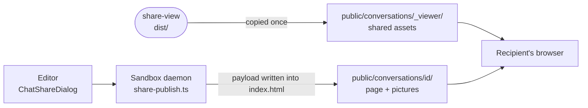

# share-view

The read-only page a shared conversation is published as, built from the editor's own chat components and served to anyone who has the link.



- **Same rendering as the editor.** Vite compiles the editor's markdown engine, figures and tool cards straight from
  [web](../web) and [ui](../ui) sources, without its router, daemon client or stores. `ShareApp.vue` adds only the
  bubbles, thinking folds and day markers.
- **No network, no state.** The daemon embeds the conversation as JSON in the page's
  `<script id="intentic-conversation">` block, and `payload.ts` parses it with the same schema. The page stores no
  preference, so the reader's OS picks the colour scheme and the browser picks the language.
- **Nothing to click through.** Tool cards reach only their own copied pictures (`shareSurface.ts`); file links,
  shells and delegations draw as plain records. The page is marked `noindex`.
- **Fixed base.** The build's `base` is `SHARE_VIEWER_BASE` from `@intentic/sandbox-contract/share-paths`, so every
  share loads one copy of the assets. The daemon resolves `dist/` through this package's `./page` export, so a share
  fails until the package is built.

## Key files

- [src/main.ts](src/main.ts) — boot: catalogs, language, mount, and only the UI pieces the page needs.
- [src/ShareApp.vue](src/ShareApp.vue) — the transcript as a record, from the app's own components.
- [src/payload.ts](src/payload.ts) — reads and validates the embedded conversation.
- [src/shareSurface.ts](src/shareSurface.ts) — what a tool card may reach from a published page.
- [vite.config.ts](vite.config.ts) — the fixed base and the source aliases into the editor.

## Commands

```sh
pnpm --filter @intentic/share-view build
pnpm --filter @intentic/share-view test
```
