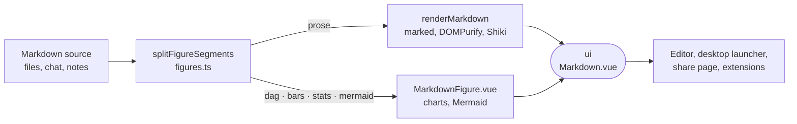

# ui

The design system every editor surface mounts, holding the Vue components, composables, icons, theme tokens, translations and the product's one markdown engine.



- **Where it runs.** In the browser, as TypeScript source with no build of its own. [web](../web), the launcher in
  [desktop-app](../desktop-app) and [share-view](../share-view) compile it in, and
  [extension-ui](../../_shared/extension-ui) hands extensions a curated slice. `installUi` is the one install call:
  vue-i18n, the PrimeVue preset with its CSS layer order (Tailwind utilities last), the global `Icon`, and the
  `v-tooltip`, `v-longpress`, `v-action` and `v-middleclick` directives.
- **Styling.** `src/styles/index.css` is the one stylesheet import. `theme.ts` points PrimeVue's `--p-*` tokens at
  the CSS variables behind the Tailwind utilities, so light and dark switch at runtime on `[data-mode="dark"]`.
  Class recipes live in `ui` (`src/lib/ui.ts`) and merge through `tailwind-merge`, so the caller's classes win.
- **Icons.** Every glyph is a native SVG drawing in `src/icons/`. The [patches](patches) route PrimeVue, Mermaid and
  Monaco icons to them, and a suite in web keeps third-party icon packages out of the lockfile.
- **Markdown.** `renderMarkdown` turns untrusted markdown into sanitized HTML with Shiki-coloured code blocks. Each
  surface adds its own pass through the `decorate` hook, such as the editor's file links. `src/markdown/` also holds
  the editing half (blocks, edits, undo history) every markdown-writing surface shares. The `./markdown` export
  holds no `.vue` files and no import-time DOM access, so node tests can load it.
- **Figures.** A fenced block in `dag`, `bars` or `stats` carries JSON, and a `mermaid` block carries Mermaid
  source. `MarkdownFigure.vue` draws each one with the kit's own charts and palette. A fence that does not parse
  renders as an ordinary code block.
- **Translations.** `@intentic/ui/i18n` is the only i18n import path. It registers the kit's own words and loads one
  chunk per language.
- **Tests and preview.** The kit's suites live in `_editor/web/src/design-system`. The editor's dev server shows
  every component variant at `/kit`.

## Layout

| Directory | Holds |
| --- | --- |
| `components/` | Components by role: primitives, layout, forms, rows, overlays, feedback, charts, markdown, brand, sandbox |
| `composables/` | Shared reactive state: theme, text size, device, drafts, list navigation |
| `markdown/` | The markdown engine: render, figures, frontmatter, code blocks, block editing, history |
| `styles/` | Tokens, colour scales, the PrimeVue skin; `opt-in/` for prose and the extension class surface |
| `icons/` | Native SVG glyph sets and file-type icons |
| `lib/` | Class recipes, formatting, paths, overlay placement, clipboard, press handling |
| `i18n/` | vue-i18n setup and the kit's own strings per language |

## Key files

- [src/index.ts](src/index.ts) — the barrel apps import components and composables from.
- [src/plugin.ts](src/plugin.ts) — `installUi`, called once from an app's `main.ts`.
- [src/markdown/render.ts](src/markdown/render.ts) — the sanitizing renderer, its parts form and the streaming variant.
- [src/markdown/figures.ts](src/markdown/figures.ts) — figure fence kinds, their JSON shapes and `splitFigureSegments`.
- [src/styles/index.css](src/styles/index.css) — the whole stylesheet, in import order.
- [src/lib/ui.ts](src/lib/ui.ts) — class-string recipes, including the ranked `<Button>` tiers.

## Commands

```sh
pnpm --filter @intentic/ui typecheck
pnpm --filter @intentic/web test   # runs the kit's suites
```
