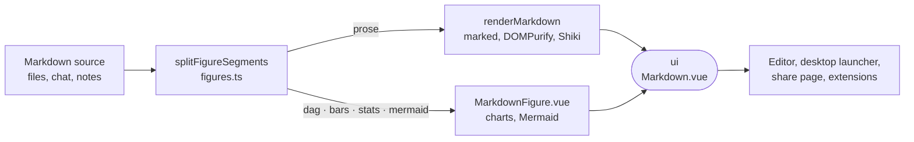

# ui

The design system every editor surface mounts, holding the Vue components, composables, icons, theme tokens, translations and the product's one markdown engine.


```mermaid
flowchart LR
    source["Markdown source<br/>files, chat, notes"] --> split["splitFigureSegments<br/>figures.ts"]
    split -->|"prose"| render["renderMarkdown<br/>marked, DOMPurify, Shiki"]
    split -->|"dag · bars · stats · mermaid"| figure["MarkdownFigure.vue<br/>charts, Mermaid"]
    render --> ui(["ui<br/>Markdown.vue"])
    figure --> ui
    ui --> surfaces["Editor, desktop launcher,<br/>share page, extensions"]
```

- **Where it runs.** In the browser, as TypeScript source with no build of its own. [web](../web), the launcher in
  [desktop-app](../desktop-app) and [share-view](../share-view) compile it in, and
  [extension-ui](../../_shared/extension-ui) hands extensions a curated slice. `installUi` is the one install call:
  vue-i18n, the PrimeVue preset with its CSS layer order (Tailwind utilities last), the global `Icon`, and the
  `v-tooltip`, `v-longpress`, `v-action` and `v-middleclick` directives.
- **Hover labels.** `v-tooltip` takes a string of a word or two, or a `Tip` (`src/lib/tooltip.ts`): a compact card
  of a short title, an optional status dot and key cap, label/figure rows and one short note. A sentence belongs in
  neither. The `tooltip-words` check holds every label it can resolve to that length, and `tipText` gives a card's
  words as one line for an accessible name.
- **Phones.** Components that hold a menu or a row of buttons pick their phone layout themselves, from `useDevice`,
  so callers don't have to. `ResponsiveOverlay` is an anchored panel on a desktop and a `BottomSheet` on a phone.
  `OverflowActions` is a row of icon buttons on a desktop and one ⋯ on a phone, opening an `ActionSheet` (the touch
  equivalent of `ContextMenu`). `FloatingAction` is a phone screen's one create button. When the title and the
  actions don't fit on one line, `PageHeader` and `Row` put the actions on a line of their own. They never cut the
  title short or let the actions run off the edge.
- **Styling.** `src/styles/index.css` is the one stylesheet import. `theme.ts` points PrimeVue's `--p-*` tokens at
  the CSS variables behind the Tailwind utilities, so light and dark switch at runtime on `[data-mode="dark"]`.
  Class recipes live in `ui` (`src/lib/ui.ts`) and merge through `tailwind-merge`, so the caller's classes win.
  `RowGroup equal-rows` aligns simple settings rows to the tallest row on desktop; leave it off groups with drawers
  or below-row content. On phones, rows grow with their own content. `ColorPicker size="sm"` fits a settings row.
- **Motion.** One module, `src/motion/` (`@intentic/ui/motion`), with its stylesheet `src/styles/motion.css`.
  Appearance's Animations row (`useMotion`: System, On or Off) writes `data-motion="reduced"` on `<html>` when
  motion is off, or when it is left at System and the OS asks for less. Under that attribute every duration token is
  0ms and every transition stops, so a component never checks reduced motion itself. Moves played from script ask
  `lessMotion()`: the tray fold and the column FLIP (`fold.ts`) and the row reveal (`reveal.ts`, `useRowReveal`),
  which plays a list's `[data-reveal]` rows in reading order when it shows. Looping glyphs take their pace from
  `loops.ts`. The CSS recipes are `ui-grow-x`, `ui-grow-y` and `ui-grow-wipe` (a figure growing from its
  baseline; `Meter`, `BarChart` and the hours meter opt in with `grow`) and `ui-enter` (the workspace arriving).
  Motion is for the few views where it shows something: the board and the chat's lanes, the usage charts, the
  sandbox's disk breakdown and the hours on Billing, the workspace.
- **Icons.** Every glyph is a native SVG drawing in `src/icons/`. The [patches](patches) route PrimeVue, Mermaid and
  Monaco icons to them, and a suite in web keeps third-party icon packages out of the lockfile.
  Attention and warnings use `exclamation-circle`; legacy `exclamation-triangle` and `exclamation` names resolve
  to that same drawing. Attention badges use the glyph itself as their circular plate. Use `check` for a completed
  action or selection, `check-circle` for a completed status, and `times` for closing or dismissing, not for errors.
- **Markdown.** `renderMarkdown` turns untrusted markdown into sanitized HTML with Shiki-coloured code blocks. Each
  surface adds its own pass through the `decorate` hook, such as the editor's file links. A page that calls
  `highlightInWorker()` (the editor does) colours code in a worker (`highlightWorker.ts`), one block at a time, with
  the page's own thread as the fallback. `src/markdown/` also holds
  the editing half (blocks, edits, undo history) every markdown-writing surface shares. The `./markdown` export
  holds no `.vue` files and no import-time DOM access, so node tests can load it.
- **Figures.** A fenced block in `dag`, `bars` or `stats` carries JSON, and a `mermaid` block carries Mermaid
  source. `MarkdownFigure.vue` draws each one with the kit's own charts and palette. A fence that does not parse
  renders as an ordinary code block.
- **Lazy chunks.** Every dynamic import in the editor goes through `loadChunk` (`@intentic/ui/chunk`). A chunk a
  redeploy removed reloads the page once onto where the reader is, and any chunk that loads re-arms that reload.
  `installChunkRecovery` catches the preload failures Vite reports for imports nobody wrapped.
- **Loading placeholders.** A view's loading placeholder is drawn exactly as that view last looked in this sandbox.
  `v-skeleton-source="name"` on the content takes its imprint once it has settled (`src/lib/skeletonImprint.ts`):
  the same elements and classes, each line of text a bar as wide as that line was, and each icon, picture, field and
  button a block of its measured size. No words are kept. `<SkeletonSnapshot of="name">` draws that imprint, and
  draws its slot (the hand-drawn skeleton, usually `SkeletonRows`) until one exists. Badges and painted marks with
  nothing in them (a status dot, a meter's fill) become neutral blocks, so a stale colour never reads as current. An
  SVG bigger than an icon (a graph's edges, a chart) keeps its space and draws nothing, and inline transforms are kept,
  since they are where a graph's nodes and a virtual list's rows sit. The imprint is taken again whenever the source
  resizes or its content changes, once it has been quiet for half a second. A source may be a `display: contents`
  wrapper, so a run of grid items is imprinted while a live item beside them stays live. The store
  (`src/lib/skeletonStore.ts`) is memory, read synchronously so the first frame already has the imprint, and is
  keyed by a scope the app supplies. The editor's scope is the active sandbox, and its persistence is IndexedDB
  (`_editor/web/src/lib/skeletonPersistence.ts`). _2026-10-04: fixed placeholder counts ("three rows") were
  replaced by imprints, because a list of twelve drawn as three jumps the page when it lands. A per-view count kept
  from the data was rejected: it gets the number of rows right but not their widths, wrapping or controls._
- **Workers.** `createWorkerCall` and `serveWorkerCall` (`@intentic/ui/worker-call`, re-exported to extensions as
  `@intentic/extension-ui/worker`) are the two halves of one call a dedicated worker answers, with the page as the
  fallback when no worker runs or one dies. A caller whose work is sometimes cheap checks that first and runs it
  inline, as `tableDiffClient.ts` in the editor does.
- **Translations.** `@intentic/ui/i18n` is the only i18n import path. It registers the kit's own words and loads one
  chunk per language. `staticCopy()` lists every loaded message that renders as written and `copyTemplates()` every one
  whose only syntax is placeholders, which is how session replay tells the app's wording from workspace text
  (`_editor/web/src/app/replayText.ts`).
- **Tests and preview.** The kit's suites live in `_editor/web/src/design-system`. The editor's dev server shows
  every component variant at `/kit`.
- **Assistant faces.** Every persona is the same clay companion, told apart by two things. Its body color comes
  from a hash of the persona's id, so a rename keeps it. The prop it holds comes from its name, because the prop is
  what says at a glance what the persona helps with. `personaAccessory` reads the name. A project persona still
  named after its repository codes. Otherwise the rightmost specialty word wins (English job titles end in their
  head noun: a UX Writer writes, a Code Reviewer reviews). A generic title (engineer, manager, lead) counts only
  when no specialty was named. Anything else, such as a person's name or a repository's, gets the terminal laptop.
  Past the project check, the id is read only when there is no label, since a renamed persona keeps its old id.
  `PersonaFace` does this for a persona. `AssistantFace` takes a `seed` (color and motion phase), an accessible
  `label`, a pixel `size`, an `accessory`, an optional `color` overriding the seed's, and `animated` (default
  true). Larger faces bob and breathe; toolbar faces stay still, and turning motion off stops them. Try names
  at `/kit#assistants`. (2026-09-30: the eight fixed illustrated characters this replaced tied color and prop
  together, so a persona's prop said nothing about its job.)

## Modular avatar artwork

The app draws the small WebP parts in `modular/web/`, cut from the PNG masters by
[export-web.py](src/components/brand/assistants/modular/export-web.py): each part is cropped, fitted into its
placement and stored at half the canvas, and `web/layout.json` records where it goes. Run it again after changing
a master or the manifest.

The transparent PNG masters live in `src/components/brand/assistants/modular/`: `layers/` holds the shared
body, crown and hands; `accessories/` holds the terminal laptop, palette, magnifier, scroll, book, compass,
sprout and shield. [generation.json](src/components/brand/assistants/modular/generation.json) records the
built-in image generator's prompts. The neutral body and hands accept any hex color; the manifest includes
a starting palette. Gold and accessory colors remain independent of that choice.

The manifest is the assembly specification. Coordinates use a 1024-square canvas. For each layer,
`sourceSize` describes the unchanged PNG, `sourceRect` selects its artwork and `placement` is the destination
rectangle, all in pixels (`x, y, width, height`). Preserve aspect ratio and center the selected rectangle in
the destination. Draw body, crown, accessory, then hands; accessory `hands` positions override the shared
pose when needed. Colorize only body and hands: first desaturate, then apply the manifest's per-channel
five-stop transfer table in sRGB, preserving alpha. This keeps highlights and dark facial features while
changing the clay color. Each hand samples one half of the same hands PNG.

The [interactive asset catalogue](src/components/brand/assistants/modular/preview.html) demonstrates the
composition without importing application code. Serve this directory over HTTP (the page fetches its
manifest); for example, from this package:

```sh
python3 -m http.server 47159 --bind 127.0.0.1 --directory src/components/brand/assistants/modular
# Open http://127.0.0.1:47159/preview.html
```

Use the color swatches or custom picker, switch accessories and backgrounds, and inspect the 22/36/64/96px
samples. Card-size props carry the specialty; the smallest toolbar faces primarily carry color and silhouette.
The [interactive preview](src/components/brand/assistants/modular/preview.html) shows every preset combination.

## Layout

| Directory | Holds |
| --- | --- |
| `components/` | Components by role: primitives, layout, forms, rows, overlays, feedback, charts, markdown, brand, sandbox |
| `composables/` | Shared reactive state: theme, text size, device, drafts, list navigation |
| `motion/` | Whether the interface moves, looping glyphs, folds, row reveals |
| `markdown/` | The markdown engine: render, figures, frontmatter, code blocks, block editing, history |
| `styles/` | Tokens, motion, colour scales, the PrimeVue skin; `opt-in/` for prose and the extension class surface |
| `icons/` | Native SVG glyph sets and file-type icons |
| `lib/` | Class recipes, formatting, paths, overlay placement, clipboard, press handling |
| `i18n/` | vue-i18n setup and the kit's own strings per language |

## Key files

- [src/index.ts](src/index.ts) — the barrel apps import components and composables from.
- [src/plugin.ts](src/plugin.ts) — `installUi`, called once from an app's `main.ts`.
- [src/markdown/render.ts](src/markdown/render.ts) — the sanitizing renderer, its parts form and the streaming variant.
- [src/markdown/figures.ts](src/markdown/figures.ts) — figure fence kinds, their JSON shapes and `splitFigureSegments`.
- [src/styles/index.css](src/styles/index.css) — the whole stylesheet, in import order.
- [src/lib/ui.ts](src/lib/ui.ts) — class-string recipes, including the ranked `<Button>` tiers.

## Commands

```sh
pnpm --filter @intentic/ui typecheck
pnpm --filter @intentic/web test   # runs the kit's suites
```
