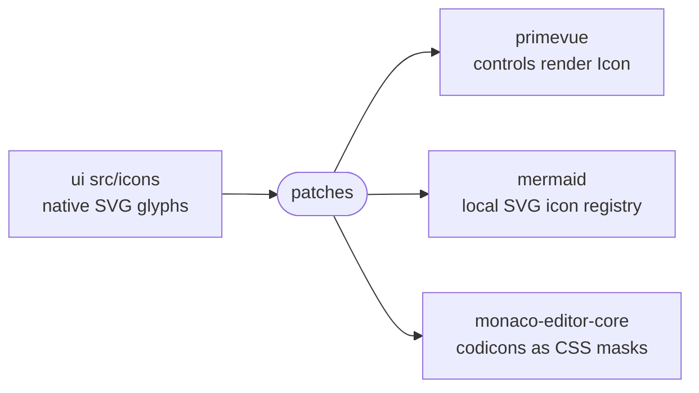

# patches

The pnpm patches that make PrimeVue, Mermaid and Monaco draw their icons from the design system's own SVG glyphs instead of bundled icon packages and fonts.

- **How they apply.** `patchedDependencies` in the root `pnpm-workspace.yaml` names each file, and pnpm applies it on
  install to that exact package version. A version bump needs the patch regenerated with `pnpm patch` and
  `pnpm patch-commit`.
- **primevue.** Every `@primevue/icons/*` import is rewritten to an added `intentic-icons.mjs`, which renders the
  globally registered `Icon` under the kit's glyph names. `installUi` must run before any PrimeVue control renders.
- **mermaid.** The patch swaps its `@iconify/utils` icon code for a local `rendering-util/svgIcons.mjs` registry.
  `mermaidRender.ts` registers the kit's glyphs as a pack, and icon markup still passes Mermaid's sanitizer.
- **monaco-editor-core.** The codicon font is dropped. Each codicon draws a CSS mask named by an
  `--intentic-icon-*` variable, which the editor fills from the kit's glyphs in
  `_editor/web/src/features/workspace/files/monacoIcons.ts`.
- **Guards.** The `overrides` in `pnpm-workspace.yaml` remove `@primevue/icons` and `@iconify/utils` from the
  install. Suites in `_editor/web` (`iconDependencies.integration.test.ts`, `nativeControlIcons.test.ts`,
  `diagramIcons.test.ts`, `monacoIcons.integration.test.ts`) fail when an icon package reaches the lockfile or a
  patched surface stops drawing native glyphs.
