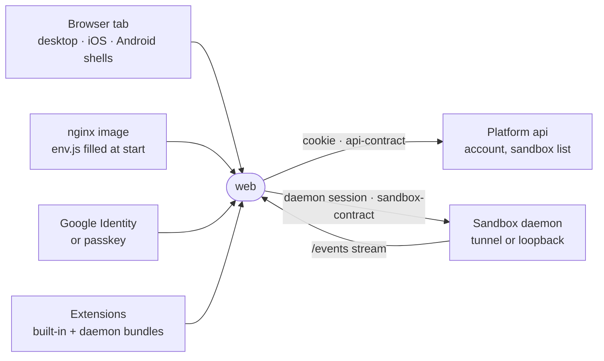

# web

The Vue app the user works in, with files, chat, terminals and agents, talking to the platform for the account and straight to the sandbox daemon for everything else.



- **Where it runs.** A static SPA served by the nginx image in `Dockerfile`. `entrypoint.sh` fills `API_URL` and
  `POSTHOG_KEY` into `assets/js/env.js` at container start, so one build serves any environment. The desktop app,
  the iOS shell and the Android shell all open this same app, and `_site/demo` builds it through `vite.shared.ts`.
- **Two backends, two credentials.** The platform api (`src/lib/useApi.ts`) rides the Better Auth cookie and
  answers sign-in, the sandbox list, invites and the hosted plan. Every workspace call goes directly to the daemon
  through `sandboxRpc`, with a daemon-minted session that a Google ID token or a passkey establishes
  (`sandboxSession.ts`). The platform is not in that path. The daemon is reached over its tunnel, or over a
  certified loopback name when it runs on this machine (`features/sandbox/secrets/endpoint.ts`).
- **Live state.** Server state lives in vue-query, mirrored per user to IndexedDB so a reload paints the last-known
  workspace. One `/events` stream per active sandbox (`useSandboxLiveness.ts`) invalidates what each frame makes
  stale (`systemEvents.ts`). Terminals and the browser view use WebSockets opened with a short-lived ticket
  (`wsTicket.ts`); a terminal's is spoken on a stream of the edge's WebTransport session where the sandbox row says the
  edge serves one (`features/terminal/channel/`).
- **Routes.** `/login` and `/setup` sit outside the shell. Everything else lives under `/` in
  `WorkspaceShell.vue`, guarded by `requireAuth` and `requireSetup`, which renders `ShellDesktop.vue` (rail, docked
  chat and terminal) or `ShellMobile.vue` (tab bar, full-screen views).
- **Extensions.** `src/extension-host/loader.ts` activates what the daemon lists. First-party extensions are compiled
  in (`builtins.ts`); the rest arrive from the daemon as single-file ESM bundles imported from a Blob URL.
  `hostModules.ts` and `public/ext-shims/` hand every bundle the app's own `vue`, vue-query and
  [extension-ui](../../_shared/extension-ui) instances.
- **Gotcha.** The dev server must stay on `https://localhost:47145`: CORS, Better Auth and the Google OAuth client
  trust that exact origin. It serves with the local certificate from
  [localhost-https](../../_tools/localhost-https).

## Words

One word per idea on screen and in code. The retired spellings are refused by
[`vocabulary.mjs`](../../_tools/constants/src/vocabulary.mjs).

| Word | Means |
| --- | --- |
| slot | An empty element a mounted surface publishes for a panel to teleport into (`shell/window/panelSlots.ts`) |
| docked | A panel living in the main window, as opposed to floating in a window of its own (`floating.ts`) |
| status bar | The board's foot: segments that each open one panel above the bar (`features/agents/status-bar/`) |
| quick bar | The parked chat's pill that grows into the composer (`ChatQuickBar.vue`); what it unfolds is its transcript |
| quick look | A card a hover raises: a home tile's preview, a bigger picture, an attached file's first lines |
| peek | A tab opened as a look, which closes when the reader moves on unless kept (`Conversation.peek`), and nothing else |

The status bar still stores its panel under `ui-board-dock-*` in local storage: renaming a stored key would close
every reader's open panel.

## Layout

| Directory | Holds |
| --- | --- |
| `app/` | Boot-time services: environment, i18n, analytics, diagnostics, self-heal |
| `router/` | Route table, auth and setup guards, prefetch |
| `shell/` | Workspace chrome: desktop rail, mobile tab bar, commands, windows, notifications |
| `features/` | One directory per screen: chat, workspace, terminal, agents, sandbox, setup, settings |
| `extension-host/` | Extension loading, the `IntenticApi` implementation, host module sharing |
| `core-views/` | Rail views that stay in-app and the view/viewer registries |
| `components/` | App-specific components not shared through [ui](../ui) |
| `lib/` | Query keys, persistence, storage, streams and small utilities |
| `push/` | Web push and native (iOS) push behind one driver |
| `skins/` | Whole-app looks; see [skins](src/skins/README.md) |
| `styles/` | Self-hosted font faces |
| `design-system/` | Suites for `@intentic/ui` components and composables, run in this app |
| `testing/` | Fakes for suites: daemon client, router, workers |

## Key files

- [src/main.ts](src/main.ts) — boot order: self-heal, appearance, i18n, then mount with router, vue-query and `@intentic/ui`.
- [src/router/index.ts](src/router/index.ts) — every route and the guards that gate the shell.
- [src/features/sandbox/client/sandboxRpc.ts](src/features/sandbox/client/sandboxRpc.ts) — the typed daemon client every contract call goes through.
- [src/lib/useApi.ts](src/lib/useApi.ts) — the typed platform api client.
- [src/extension-host/loader.ts](src/extension-host/loader.ts) — lists, gates and activates extensions.
- [src/shell/WorkspaceShell.vue](src/shell/WorkspaceShell.vue) — the persistent shell, split by form factor.

## Commands

```sh
pnpm --filter @intentic/web dev        # API_URL defaults to https://localhost:6480
pnpm --filter @intentic/web test
pnpm --filter @intentic/web typecheck
```
