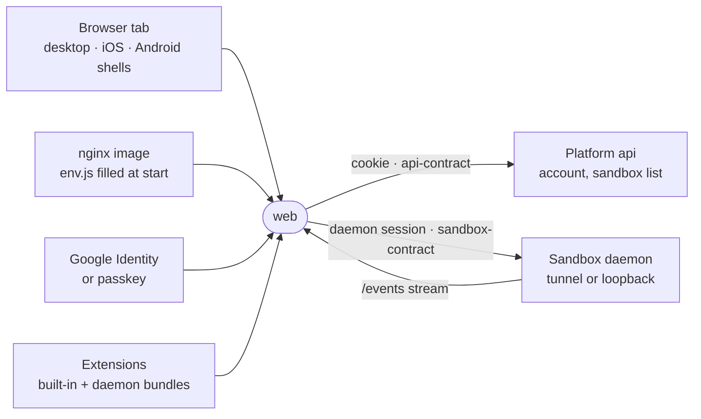

# web

The Vue app the user works in, with files, chat, terminals and agents, talking to the platform for the account and straight to the sandbox daemon for everything else.


```mermaid
flowchart LR
    shells["Browser tab<br/>desktop · iOS · Android shells"] --> web(["web"])
    nginx["nginx image<br/>env.js filled at start"] --> web
    web -->|"cookie · api-contract"| api["Platform api<br/>account, sandbox list"]
    google["Google Identity<br/>or passkey"] --> web
    web -->|"daemon session · sandbox-contract"| daemon["Sandbox daemon<br/>tunnel or loopback"]
    daemon -->|"/events stream"| web
    ext["Extensions<br/>built-in + daemon bundles"] --> web
```

- **Where it runs.** A static SPA served by the nginx image in `Dockerfile`. `entrypoint.sh` fills `API_URL` and
  `POSTHOG_KEY` into `assets/js/env.js` at container start, so one build serves any environment, and inlines that
  script into `index.html` so the first page load does not wait on a second, uncached request for it. The desktop app,
  the iOS shell and the Android shell all open this same app, and `_site/demo` builds it through `vite.shared.ts`.
- **Two backends, two credentials.** The platform api (`src/lib/useApi.ts`) rides the Better Auth cookie and
  answers sign-in, the sandbox list, invites and the hosted plan. Every workspace call goes directly to the daemon
  through `sandboxRpc`, with a daemon-minted session that a Google ID token or a passkey establishes
  (`sandboxSession.ts`). The platform is not in that path. The daemon is reached over its tunnel, or over a
  certified loopback name when it runs on this machine (`client/endpoint/endpoint.ts`).
- **When the platform is down or forgets.** Only the sandbox list needs the platform, so this device remembers it per
  account, names and addresses only (`features/sandbox/recovery`). The outage screen opens a remembered sandbox
  directly, the workspace running unchanged on that remembered list; a list that offers nothing to open while this
  device remembers sandboxes of the account's own goes to `/recover` rather than onboarding; and a sandbox's own
  address opens it through `/open?url=`. [recovery/README.md](src/features/sandbox/recovery/README.md) has the rules.
- **Personas.** `/sandbox/personas` shows square selectors with the selected persona's editor below. Settings and
  the popped-out chat share `components/PersonaTile.vue` for the face, label and selected appearance; each view owns
  its selection and actions. Settings wraps the shared tile in `PersonaSelector.vue` for renaming and removal directly
  on the selector. It saves a queued edit against its original persona when the selection changes.
- **Live state.** Server state lives in vue-query, mirrored per user to IndexedDB so a reload paints the last-known
  workspace. What the cache cannot paint yet is outlined as it last looked. Each loading placeholder is drawn from an
  imprint `@intentic/ui` took of its content, stored in IndexedDB as one record per sandbox and view
  (`lib/skeletonPersistence.ts`). The active sandbox's imprints are read before the first route mounts, and every
  other sandbox's at the first idle moment, so a switch draws them on its first frame. They survive a new build,
  which the query cache does not, and a sign-out clears both. One `/events` stream per active sandbox
  (`useSandboxLiveness.ts`) invalidates what each frame makes stale (`systemEvents.ts`). Push refreshes let an
  in-flight read finish and queue one catch-up when another frame arrives. Hello reannounces file, runtime, derived-text and repository changes with wildcard batches to recover
  frames missed while disconnected. Terminals, the browser view and the desktop view (`/desktop`, the sandbox's own
  screen, which a maintainer can take over) use WebSockets opened with a short-lived ticket (`wsTicket.ts`); a terminal's is spoken on a stream of the edge's WebTransport session where the sandbox row says the
  edge serves one (`features/terminal/channel/`). Each of them, and a connected account's browser window, rides one
  live socket (`client/session/liveSocket.ts`): minted, pinged, closed when silent, and redialled on one
  ladder that starts over when the sandbox answers again.
- **When the sandbox stops answering.** A failed `/events` stream starts a diagnosis (`features/sandbox/diagnosis/`):
  bounded probes of the sandbox's address (netd's own `/system/vitals`, which answers whatever state Node is in,
  plus an opaque reach check), the platform, a hosted machine's power state, this computer's loopback where no
  permission prompt is raised, and the report the machine it runs on posted (`hostReport`, written by
  `ic sandbox fix`). `diagnose.ts` names one cause from them. A sandbox with any sign of life is **busy**, never down:
  the tab does not say Offline, no card shows for 90 s, the watchdog stretches to 30 s, and a restart is offered only
  after five minutes, among "other options". Everything else gets one sentence and at most one thing to press
  (`presentation.ts`): the platform's restart or rollback for a machine we run, and for the owner's own machine one
  command, `/fix`, which runs `ic sandbox fix` there and reports its progress back to the panel through a fix code
  (or `intentic://fix` in the desktop app). The recovery panel (`gates/SandboxRecovery.vue`) shows when the diagnosis
  found a way back, never on a timer: inside the connecting gate on a screen with nothing to paint yet, and as a card
  in the notification lane everywhere else. Both read one answer to which screen that is (`gates/established.ts`).
  _2026-09-30: replaced a panel that appeared after two minutes of silence with three commands (restart, rollback,
  doctor) for the reader to choose between. It was shown to sandboxes that were only busy, and the choice was the
  reader's to get right._
- **Older sandboxes.** A view drawn from fields an older daemon does not send never rebuilds them from what it did
  send. It shows what was served as served, and `SandboxOutdatedNotice.vue` says the sandbox needs an update, what the
  view lacks until then, and how to update: the sandbox page's Update card, or `ic sandbox update <slug>` for a sandbox
  installed by hand. The persona rail and the chat's accounts read "older" off the routes the daemon advertises
  (`supportsRoute`, `accountsOutdated`): `agent.switchAccount` arrived in v1.313, the same release as the `lastActsAs`
  the rail groups chats by. Such a sandbox's account rows carry no verdict (`state`) and read as unknown, no held turn
  is offered another account, and the model picker, the continue card and the AI account section say it needs an
  update. The editor sends a session id only for a conversation the daemon has no record of (a past session opened
  from the history menu), and reads the account a failed turn ran on only off its error frame. Nothing else is guessed
  either: a card without `awaitingWake` is not waiting on a wake, a reading without `memoryRoom` warns of nothing, and a
  device row's card is its own `card`, never parsed out of its key.
- **A folder on this computer.** The desktop app's local face reaches a sidecar, not a daemon, whose hello says
  `surface: "folder"` and lists only what it serves (`useDaemonRoutes.ts`). The file tree offers no verb whose route is
  missing (`VERB_ROUTES` in `entryMenu.ts`) and none whose seam the window leaves out (`fileVerbSeams.ts`: a terminal,
  extract, download, a ZIP), so a folder window renames, moves, copies and deletes (to the OS trash, with no in-app
  undo) and offers "Ask an agent about this". Files dropped from the system's file manager land in the folder row or
  home tile they are dropped on, and anywhere else in the window in the folder itself (`useRootDrop.ts`, the
  workspace's own floor), as writes alone: the upload queue skips the unchanged-file diff, the archive and the install,
  which a folder does not serve. A document's own window takes no drop. A refused call says the feature is not there for a folder rather than
  asking for an update, and a recording plays from its bytes over `/workspace/raw` where no media ticket is minted.
  `local/` holds the window's own parts: its shell (`LocalShell.vue`, the sandbox shell's rail from
  `shell/rail/iconRail.css`, holding the place chip `LocalPlaceSwitcher.vue`, Files with the folder menu on the folder's
  name (`LocalFolderMenu.vue`: open a folder, and the folders opened lately), the views the app adds, and at
  the foot the sandbox shell's own account control `shell/AccountPanel.vue`, or the sign-in `LocalAccountTile.vue`
  before there is an account), Ctrl+P, Ctrl+Shift+F, Ctrl+W (by default: they follow the keymap's overrides for the workspace commands they stand
  for) and Alt+1–9 (`localKeys.ts`), the close guard for unsaved edits
  (`useUnsavedGuard.ts`), a project folder's Bring back section (`bring-back/LocalBringBack.vue`), and the way to a folder's own
  sandbox (`LocalProject.vue`): the window's dialog for "Work on this with an agent" (`LocalProjectDialog.vue`), and the
  card the sandbox's build stands on in the notification lane while the reader keeps working (`LocalProjectBuild.vue`),
  drawn as the agent's house going up with the setup's real phases (`AgentHouse.vue`, `agentHouse.ts`). The place chip names the
  window's folder and lists the account's sandboxes, the only other places the window goes, as the sandbox switcher
  lists "This computer" first in the app's workspace window, with the same digits for the same places in both: Alt+0
  this computer, Alt+1–9 the sandboxes. What only the desktop app can answer (the recent places, whether there is an
  account, who is signed in and the sandboxes as the workspace last told it, This device, and the account itself)
  comes from the host it installs before the editor runs (`app/environments/localHost.ts`); a page without one gets
  the link-only host. The account is `client/auth/useAccount.ts`: in the workspace the editor's own session, in a local
  window the one the workspace signed in with, which the app asks the platform about for the window. A local window's
  editor runs as a placeholder for its folder, so the account is kept apart from it: the account menu, Settings and
  the plan read `useAccount`, and a sign-out or a refused call ends the account and never the folder's session
  (`useAuth.ts` skips its teardown there). The workspace's switcher is what tells the app the account and those sandboxes
  (`announceDesktopRoster` in `app/environments/desktop.ts`), and a sign-out tells it there are none. A sandbox picked
  there reaches a workspace page already loaded without a reload: the app calls the opener the page registered
  (`installDesktopOpener`), and `openInPage` (`router/index.ts`) selects the sandbox the path names and routes there.
- **Routes.** `/login` and `/setup` sit outside the shell. Everything else lives under `/` in
  `WorkspaceShell.vue`, guarded by `requireAuth` and `requireSetup`, which renders `ShellDesktop.vue` (rail, side
  panel and terminal) or `ShellMobile.vue` (tab bar, full-screen views). A link naming a sandbox (`/?sandbox=<id>`, the
  desktop app's, for a synced folder or a sandbox picked on a local window's place chip) opens the shell on it if the
  account lists it, and otherwise says that sandbox is not on the account any more; the id leaves the address either
  way (`router/sandboxArrival.ts`). A desktop window on a local folder builds another table instead: `/` is
  `local/LocalShell.vue`, with `workspace/:path*` (the folder), one route per view the app adds (`device`) and
  `settings/:tab?`, the same Settings hub, open while there is an account. There it leaves out Notifications (a
  sandbox's), and Data hands deleting the account to the workspace, which knows every sandbox it must leave first. The
  routes are kept in the hash (`files/local#/device`), since the app serves that page at one address only.
- **On a phone.** `ShellMobile.vue` shows one screen at a time. The Sandbox and Settings hubs open on an index of
  their sections, grouped as the desktop rail groups them, and each section is a page with a way back to that
  index (`workbench/hub/hubDrill.ts`). The Menu tab uses the same grouped rows (`shell/MenuRow.vue`). A card's or row's
  own buttons fold behind one ⋯ that opens a sheet (`OverflowActions`). A screen's one create button floats over its
  corner (`FloatingAction`): New agent on the board, upload in the file tree. The review's Land button sits under the
  Changes tab instead of in the header. _2026-09-29: an index page, not a strip of section chips wrapping above
  every section. With extensions installed that strip was seventeen chips over every page of the sandbox hub._
- **The side panel.** The rail owns the main area; the side panel (`shell/side/`, its tabs and views registered in
  `workbench/side/`) is where the reader looks at another section's
  things without leaving the one they picked. A reference (a file a chat names, a server a turn left running, an
  extension's side view) opens in its home while that home is the main area, and beside it everywhere else, as a peek
  the next one replaces unless kept. "Open in …" moves it into its home. The chat whose home is the side is the
  panel's lower part, under the tabs. A popped-out chat has a panel of its own, right of the chat where its checklist
  and usage strip stand while it is empty; "Open in …" from there goes to the main window, and a popped-out terminal
  or preview hands its references to the main window's panel. A phone has no side panel: there every reference
  navigates as before. A file peek reads the copy it names (`VIEW_SCOPE`)
  without switching the Workspace's scope, and never edits, since the Workspace may hold the same path unsaved.
  _2026-09-29: peeks stack above the chat rather than sharing tabs with it. A tab would hide the chat that linked to
  the file, and typing to an agent while its preview updates needs both on screen. References from the side panel's
  own chat open beside, not in the main area as a side chat does in an IDE: that would let one click replace the
  section the rail picked._
- **The browser tab.** `shell/browser-tab/` (its chimes and preferences in `workbench/browser-tab/`) shows the fleet's
  news to a reader who is looking elsewhere. One mark at
  a time, the first that holds: `(2)` for what needs you (the Agents tile's own count), `Offline` when the sandbox is
  not answering (never while the diagnosis sees it alive and busy), `✓` for a turn someone started that finished while you were away (gone when you come back), and a dot
  on the icon while a turn runs. The icon carries every mark; the title carries all but the last. Two opt-in sounds
  (Settings → Notifications), one when something new needs you and one when a turn finishes, ring only while no
  window of the app has the focus, and from one tab at a time.
  _2026-09-29: work under way stays out of the title. A browser marks a background tab whose title changed (Chrome
  dots a pinned one), so a title that changed at every turn's start and end would flag the tab all day._

  Inside the desktop app, whose window has no tab and spends most of its life in the tray, the same mark goes on the
  app's icon (`desktopBadge.ts`: the tray, the Windows taskbar button, a Linux dock's count), drawn with the tab
  icon's own drawing, and the same news, for the same reader, becomes the system's notifications
  (`desktopSignal.ts`): one per agent that needs you and per turn someone started that finished, a burst of more than
  three as one, the system's sound for the first only and none when a chime rings for it, an ask answered elsewhere
  taken down, and all of them cleared the moment you are back. Both are on by default, with their switches in
  Settings → Notifications, and both are links the app puts up (`app/environments/desktopNotices.ts`), only to an
  app that says it takes them (`notices`). The app also says whether its window is on screen
  (`workbench/window/onScreen.ts`), which WebView2 does not for a window in the tray: without it the page reported its
  reader present all day, and the sandbox held back every push to their phone.
- **Extensions.** `src/extension-host/loader.ts` activates what the daemon lists. First-party extensions are compiled
  in (`builtins.ts`); the rest arrive from the daemon as single-file ESM bundles imported from a Blob URL.
  `hostModules.ts` and `public/ext-shims/` hand every bundle the app's own `vue`, vue-query and
  [extension-ui](../../_shared/extension-ui) instances.
- **Session replay and events.** `src/app/replayPrivacy.ts` decides what a PostHog recording may hold and
  `src/app/eventPrivacy.ts` does the same for every event, through `before_send`. `analytics.ts` hands both to
  `posthog.init`. In a replay every text node goes through `src/app/replayText.ts`, which keeps wording from an i18n
  catalog (`staticCopy` in `@intentic/ui/i18n`), punctuation, the product's name and a number standing alone, keeps the
  wording of a message with placeholders (`copyTemplates`) while judging each value by its placeholder's name ("3 files
  changed" whole, "Delete report.pdf?" as "Delete ***********?"), stars everything inside `pre` and `code`, and keeps
  the words of what a machine reported inside `[data-replay="diagnostic"]` with its paths, addresses, emails and
  identifiers starred (the setup page's failure list). Everything else turns into asterisks. The code editor, its diff,
  terminals, images and embedded pages are blocked, and canvas, console output, request bodies, network timing and web
  vitals attribution are switched off by name, since the PostHog project's own settings would otherwise decide. In an
  event every address becomes the router's route pattern (`routePatternOf` in `router/routePattern.ts`, for example
  `/workspace/:path*`), the text and attributes of a clicked element pass the same rules, and an exception's message is
  masked while its stack stays. Decided 2026-09-29 as default-deny because workspace names show all over the app (rail,
  tabs, board, search), not only in the editor and chat, so a list of content views would miss the next one. Widened
  2026-10-04 to sentences around values, numbers and setup diagnostics: replays of a failed onboarding showed a
  screen of asterisks, the error included, and a deny-list of content views was rejected again for the reason above.
  Rejected: a marker on each content view, and one on each piece of chrome. The privacy policy
  (`_site/site-content/src/legal.ts`) states what leaves the browser, so change both together.
- **Gotcha.** The dev server must stay on `https://localhost:47145`: CORS, Better Auth and the Google OAuth client
  trust that exact origin. It serves with the local certificate from
  [localhost-https](../../_tools/localhost-https).

## Words

One word per idea on screen and in code. The retired spellings are refused by
[`vocabulary.mjs`](../../_tools/constants/src/vocabulary.mjs).

| Word | Means |
| --- | --- |
| slot | An empty element a mounted surface publishes for a panel to teleport into (`workbench/window/panelSlots.ts`) |
| docked | A panel living in the main window, as opposed to floating in a window of its own (`floating.ts`) |
| status bar | The board's foot: the geek metrics' segment, which opens its panel above the bar (`features/agents/status-bar/`) |
| subagent | Any agent another agent started: in-process by its runtime's own Agent tool, or spawned by the sandbox as a conversation of its own. Drawn one way wherever it shows, on the card of the call that started it (`features/chat/tools/subagentCard.ts`) and in its parent card's tray; how it was started changes only what else it offers, such as its own conversation. Not "child agent" |
| tray | The rows hung under a board card, and under a card in the chat's list (`features/chat/tabs/chatTrays.ts`), for every subagent it started: the ones it spawned, which are conversations of their own, and the ones its runtime ran in-process, from the roster (`features/agents/fleet/subagentRoster.ts`). Open only under the card the reader is on, a card whose subagent is on screen, and every card while a filter is on, folding open and shut with what stands below sliding to make room, on the compositor (`features/agents/board/view/foldMotion.ts`); every other card counts its subagents on itself instead (`features/agents/board/cards/ChildCount.vue`) and keeps only a subagent asking the reader in sight. Open, asks and working ones in sight, stopped ones one row per thing they stopped on, settled ones folded behind a count (`features/agents/board/view/childFold.ts`). A row shows its subagent in the chat: a spawned one's own chat, an in-process one's transcript in its parent's column (`features/chat/panel/subagent/subagentView.ts`) |
| quick bar | The parked chat's pill that grows into the composer (`ChatQuickBar.vue`); what it unfolds is its transcript |
| send later | The composer's pick of when the next message goes: a time, or once another agent's work lands (`features/chat/composer/later/sendLater.ts`). Picked from the overflow, its pill or `@send:`; Send then books the message into the conversation's queue, where it keeps its own time: each group of booked messages is drawn as scheduled with its own Change and Send now (`features/chat/composer/later/bookings.ts`) |
| land when done | A conversation's own answer to whether its finished work lands by itself, the board menu's "Land automatically" reached from the composer (`features/chat/composer/composerLanding.ts`); a chat not on record yet carries it on its opening message |
| quick look | A card a hover raises: a home tile's preview, a bigger picture, an attached file's first lines |
| peek | A tab opened as a look, which closes when the reader moves on unless kept (`Conversation.peek`, the side panel's `peek`), and nothing else |
| side panel | The desktop shell's right-hand column: what the reader opened beside the section the rail put in the main area, one tab each, stacked over the chat when the chat's home is the side (`shell/side/`). Not the Workspace's second editor pane, which is its companion pane |
| side view | What one side panel tab shows for one input: the core's file and preview, or an extension's (`workbench/side/sideViews.ts`) |
| cover | One file name read in every folder (README.md, package.json): the explorer tree lists folders alone and marks those holding it, and the home shows the current folder's copy in place of its tiles (`features/workspace/home/homeCover.ts`); on screen, "Show README.md in every folder" |

The status bar still stores its panel under `ui-board-dock-*` in local storage: renaming a stored key would close
every reader's open panel.

## Layout

The directories are layered, lowest first, and a value import may only reach its own layer or a lower one
([editor-layers.mjs](../../_tools/checks/lib/editor-layers.mjs), checked by `editor-boundaries`): foundation (`lib/`,
`app/`, `skins/`, `styles/`, `design-system/`), the client (`client/`), `components/`, the workbench (`workbench/`),
`features/`, and composition (`shell/`, `core-views/`, `extension-host/`, `router/`, `local/`, `testing/`). Where a lower
layer needs something only a higher one knows (the built-in views, the account, the transcript mirror), the higher side
registers or hands it in at startup (`main.ts`).

| Directory | Holds |
| --- | --- |
| `lib/` | Query keys, persistence, storage, streams, the active sandbox id, file-reference grammar, route helpers (`lib/routes/`) and small utilities |
| `app/` | Boot-time services: environment, i18n, analytics, diagnostics, self-heal, the project and workspace scope |
| `skins/` | Whole-app looks; see [skins](src/skins/README.md) |
| `styles/` | Self-hosted font faces |
| `design-system/` | Suites for `@intentic/ui` components and composables, run in this app |
| `client/` | The editor's clients of what it talks to: the platform account (`auth/`), and the sandbox daemon's session, endpoint, typed RPC and queries (`session/`, `endpoint/`, `sandbox/`), and the device's remembered sandboxes (`directory/`) |
| `components/` | App-specific components not shared through [ui](../ui) that know no feature |
| `workbench/` | The services and registries features are written against, one unit per directory: window layout, commands and keybindings, notifications, presence, the hub, the side panel's tabs, the browser tab's chimes, web and native push, workspace events, and the view, viewer and document registries (`views/`) |
| `features/` | One directory per screen: chat, workspace, terminal, agents, sandbox, setup ([setup](src/features/setup/README.md)), settings |
| `shell/` | Workspace chrome that composes the features: desktop rail, mobile tab bar, the command palette and the commands that name features, the floating and popped-out panels, notification sources, the side panel |
| `core-views/` | Rail views that stay in-app, and the frames that host an extension's view |
| `extension-host/` | Extension loading, the `IntenticApi` implementation, host module sharing |
| `router/` | Route table, auth and setup guards, prefetch |
| `local/` | The desktop app's local window on a folder or document of this computer: its shell, place chip, Files, and the folder's own sandbox |
| `testing/` | Fakes for suites: daemon client, router, workers |

## Key files

- [src/main.ts](src/main.ts) — boot order: self-heal, appearance, i18n, then mount with router, vue-query and `@intentic/ui`.
- [src/router/index.ts](src/router/index.ts) — every route and the guards that gate the shell.
- [src/client/sandbox/sandboxRpc.ts](src/client/sandbox/sandboxRpc.ts) — the typed daemon client every contract call goes through.
- [src/lib/useApi.ts](src/lib/useApi.ts) — the typed platform api client.
- [src/extension-host/loader.ts](src/extension-host/loader.ts) — lists, gates and activates extensions.
- [src/shell/WorkspaceShell.vue](src/shell/WorkspaceShell.vue) — the persistent shell, split by form factor.

## Commands

```sh
pnpm --filter @intentic/web dev        # API_URL defaults to https://localhost:6480
pnpm --filter @intentic/web test
pnpm --filter @intentic/web typecheck
```
