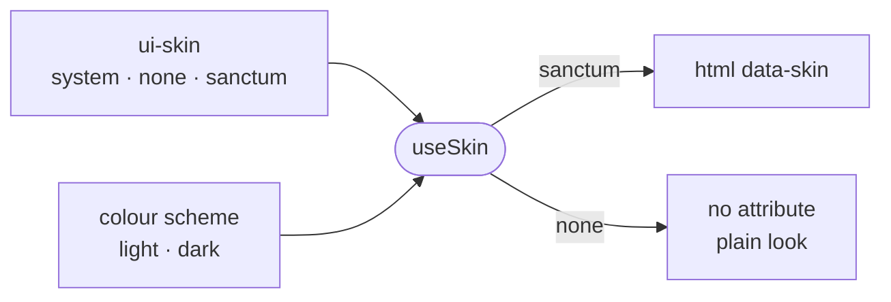

# skins

A skin is the editor's whole look, worn as one `data-skin` attribute on `<html>`, and this directory holds the skin's stylesheet and the preference that picks it.

- `sanctum.css` scopes every rule to `[data-skin="sanctum"]` and is imported by `src/styles.css`, so the skin
  `none` needs no stylesheet: it writes no attribute and the app shows its plain look.
- The setting is stored under `ui-skin` and holds `system`, `none` or `sanctum`. `system` is the default and
  follows the colour scheme: dark wears `sanctum`, light wears `none`, and an OS that flips at dusk carries the
  look with it.
- Sanctum is built on a near-black canvas and has no daylight dress. Pinning it with `setSkin("sanctum")` also
  sets the scheme to dark. Settings offers it as one of four looks on the theme row (`themeRow.ts`) rather than
  as its own control, since two controls could put a light scheme under a dark skin.
- `index.html` runs the same rule in its pre-paint script, so the attribute is in place before the bundle loads
  and there is no flash of the plain look. Anything that needs a fixed look, such as a profile link or the
  screenshot tooling, writes `ui-skin` and `ui-color-scheme` before boot.
- A new skin needs its name in `Skin` and `isSkin`, a stylesheet scoped to its attribute, a line in the
  pre-paint script, and a place on the theme row.

## Key files

- [useSkin.ts](useSkin.ts) — the preference, the rule that resolves `system`, and the dark pin.
- [sanctum.css](sanctum.css) — the one skin, as role tokens and surfaces under `[data-skin="sanctum"]`.
- [../features/settings/themeRow.ts](../features/settings/themeRow.ts) — how the four looks map onto scheme and skin.
